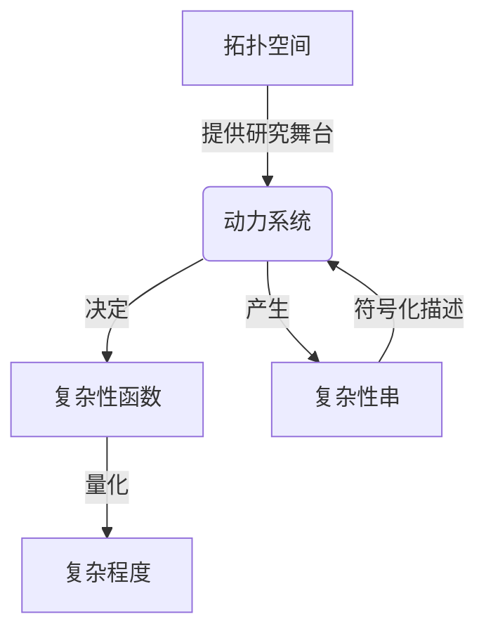

# 拓扑动力系统概论：复杂性函数和复杂性串

## 1. 背景介绍

### 1.1 问题的由来

在当代科学领域中,复杂系统的研究已经成为一个前沿热点课题。复杂系统通常指由大量相互作用的子系统或元素组成的系统,其整体行为无法简单地从单个部分的行为中导出。这种复杂性来源于系统内部的非线性动力学、开放性和信息交互等多种因素。

传统的研究方法难以有效捕捉和描述复杂系统中蕴含的丰富动态行为,因此需要发展新的理论框架和数学工具。在这一背景下,**拓扑动力系统理论**应运而生,它将拓扑学和动力系统理论相结合,为复杂系统的研究提供了一种全新的视角和方法。

### 1.2 研究现状

拓扑动力系统理论自20世纪80年代兴起以来,已经在诸多领域取得了重要进展,包括:

- **理论基础**:发展了多项基础理论,如符号动力系统、拓扑遗传算法、拓扑熵等,丰富了动力系统的数学描述手段。
- **应用研究**:在生物系统、神经网络、计算机科学、材料科学等领域展现出广阔的应用前景。
- **计算工具**:涌现出一系列计算拓扑不变量的算法和软件工具,为复杂系统分析提供了有力支持。

然而,当前研究也面临着一些挑战,如复杂系统建模的困难、大规模数据处理的需求、理论与应用的有效融合等,亟需持续的理论创新和技术突破。

### 1.3 研究意义

拓扑动力系统理论的发展对于深入认识和有效分析复杂系统具有重要意义:

1. **揭示复杂性本质**:通过研究系统的拓扑和动力学性质,可以揭示复杂系统背后的本质规律和机制。
2. **量化复杂性程度**:发展出一系列复杂性度量,如拓扑熵、箱计算维数等,为复杂性评估提供了量化工具。
3. **指导复杂系统设计**:依据理论指导,可以优化复杂系统的结构和参数,实现期望的动力学行为。
4. **促进学科交叉融合**:拓扑动力系统理论本身就是多学科交叉的产物,有助于加强不同领域的相互渗透与创新。

综上所述,拓扑动力系统理论为复杂性科学研究注入了新的活力,对于认知世界、解决实际问题都具有重要价值。

### 1.4 本文结构

本文将系统地介绍拓扑动力系统理论的核心内容。主要结构安排如下:

1. 阐述核心概念及其内在联系
2. 详细解析核心算法原理和具体操作步骤
3. 构建数学模型,推导公式并举例说明
4. 通过项目实践展示代码实现和运行效果 
5. 介绍理论的实际应用场景
6. 推荐相关学习资源和开发工具
7. 总结研究成果,展望发展趋势和面临的挑战

## 2. 核心概念与联系

在拓扑动力系统理论中,有几个核心概念是理解和运用该理论的关键,它们相互关联、密不可分。我们先来认识这些概念。

### 2.1 拓扑空间

拓扑空间是整个理论体系的基础。一个拓扑空间由一个非空集合X和一个开集族构成,记作(X,τ)。开集族τ满足一些代数性质,如对任意并和有限交仍为开集。

拓扑空间为研究复杂系统提供了一个合适的抽象框架。我们可以将复杂系统的状态视为拓扑空间中的一个点,系统的演化则对应于该空间中的一个轨线。

### 2.2 动力系统

动力系统描述了一个状态是如何随时间演化的。在离散情况下,我们研究映射f:X→X,其中X是一个拓扑空间。连续情况下,我们研究微分方程组。

将动力系统的概念与拓扑空间结合,我们就获得了拓扑动力系统。在此框架下,我们关注系统轨线的拓扑不变性质,而不是具体的数值解。

### 2.3 复杂性函数

复杂性函数为衡量系统复杂程度提供了一种量化方式。常见的复杂性函数有:

- **拓扑熵**:反映系统的不确定性和混沌程度。
- **箱计算维数**:刻画系统的几何和分形结构。
- **近视熵**:描述系统对初值的敏感程度。

这些复杂性函数都是拓扑不变量,即对同胚映射保持不变。它们为比较和分类复杂系统提供了有力工具。

### 2.4 复杂性串

复杂性串是对复杂系统动力学行为的符号化描述。通过对轨线进行编码,我们可以将其转化为一个符号序列(即复杂性串)。

研究复杂性串的统计特性和生成机制,有助于发现系统内在的规律性。例如,我们可以计算复杂性串的熵率、压缩率等,并将其与系统的复杂性函数对应起来。

### 2.5 核心联系

以上四个概念相互关联、环环相扣:

- 拓扑空间为动力系统提供了研究舞台
- 动力系统的轨线决定了复杂性函数的取值
- 复杂性函数量化了系统的复杂程度
- 复杂性串是对系统动力学的符号化描述

只有全面把握这些概念及其内在联系,才能真正掌握拓扑动力系统理论的精髓所在。



## 3. 核心算法原理与具体操作步骤

### 3.1 算法原理概述

拓扑动力系统理论中有多种核心算法,用于计算系统的不同复杂性函数。这些算法的工作原理大致可以概括为:

1. **符号化编码**:将系统的轨线转化为复杂性串。
2. **统计分析**:对复杂性串进行统计分析,计算相关统计量。
3. **复杂性计算**:将统计量代入公式,计算出复杂性函数的值。

其中,符号化编码是关键的第一步。我们需要设计合理的编码方案,使复杂性串能够尽可能保留系统动力学的拓扑信息。

接下来,我们将重点介绍计算**拓扑熵**和**箱计算维数**的两种核心算法。

### 3.2 算法步骤详解

#### 3.2.1 计算拓扑熵

拓扑熵是衡量系统混沌程度的一个重要指标。计算步骤如下:

1. **生成轨线**:给定初值,迭代动力系统映射,生成轨线序列。
2. **编码复杂性串**:将轨线按某种方式编码为复杂性串。
3. **计算词语增长率**:统计复杂性串中长度为n的词语个数N(n),计算增长率λ(n)=log(N(n+1))-log(N(n))。
4. **求极限**:当n趋于无穷时,λ(n)的极限即为系统的拓扑熵h=lim(n→∞)λ(n)。

算法的关键在于编码方案的选取。常用的有符号化动力系统编码、分区编码等。下面是一个分区编码的示例:

```python
def topo_entropy(trajectory, partition, n_max=10):
    strings = symbolic_encoding(trajectory, partition)
    N = [len(set(strings[:i])) for i in range(n_max)]
    lambdas = [np.log(N[i+1]/N[i]) for i in range(n_max-1)]
    return np.mean(lambdas[-5:])
```

#### 3.2.2 计算箱计算维数

箱计算维数反映了系统几何结构的分形特征。算法步骤如下:

1. **生成轨线**:同上。
2. **分箱编码**:将轨线点划分到一个个"箱"中,每个箱用一个符号编码。
3. **统计箱计数**:对长度为n的词语,统计包含非空箱的个数C(n)。
4. **计算尺度指数**:作log(C(n))对log(1/n)作图,其斜率即为箱计算维数v。

算法的精髓在于分箱策略的选取。常用的有等径分箱、最近邻分箱等。这里给出一个等径分箱的Python示例:

```python
def box_counting(trajectory, r, n_max=10):
    dim = np.empty(n_max)
    for n in range(n_max):
        boxes = np.floor(trajectory[:n+1]/(2*r)).astype(int)
        words = ["".join(map(str,boxes[i:i+n+1])) for i in range(len(boxes)-n)]
        dim[n] = np.log(len(set(words)))/np.log(1/(2*r))
    return np.mean(dim[-5:])
```

### 3.3 算法优缺点

以上两种算法具有以下优缺点:

**优点**:

- 原理简单,易于实现
- 可解释性强,结果直观
- 适用于广泛的系统类型

**缺点**:

- 对参数(如编码方案)敏感
- 计算量随数据量增长而迅速增加
- 存在统计误差和有限数据效应

因此,在实际应用中,我们需要合理选择算法参数,并对结果的可靠性进行评估。

### 3.4 算法应用领域

拓扑熵和箱计算维数等复杂性函数广泛应用于分析各类复杂系统,如:

- **动力系统**:分析映射、微分方程等动力学行为。
- **时间序列**:检测混沌、分形等非线性特征。
- **神经网络**:量化网络复杂度,优化网络结构。
- **生物系统**:研究基因调控网络、生态系统动力学等。
- **材料科学**:表征材料的无序程度和结构特性。
- **数据挖掘**:发现数据中潜在的复杂模式。

总的来说,这些算法为复杂系统分析提供了一种行之有效的拓扑方法。

## 4. 数学模型和公式详细讲解举例说明

### 4.1 数学模型构建

在拓扑动力系统理论中,我们通常将复杂系统抽象为一个拓扑动力系统(X,f),其中:

- X是一个拓扑空间,描述系统的状态空间
- f:X→X是一个连续映射,描述系统状态的迭代演化规则

该模型的优势在于,它只关注系统动力学的拓扑不变性质,而不受具体数值的影响。这使得我们能够发现系统内在的本质特征。

为了量化系统的复杂性,我们需要定义一些复杂性度量,即复杂性函数。常见的有拓扑熵、箱计算维数等,它们都是拓扑不变量。

### 4.2 公式推导过程

接下来,我们详细推导两个核心复杂性函数的数学表达式。

#### 4.2.1 拓扑熵

拓扑熵h(f)定义为:

$$h(f) = \lim_{n\rightarrow\infty}\frac{1}{n}\log N(n,\epsilon)$$

其中,N(n,ε)表示长度为n的轨线段在ε邻域的最大分拆数。

证明过程:

1) 定义n步动力系统的分拆数S(n,ε)为使得任意两个初值x,y满足d(f^n(x),f^n(y))>ε的等价类个数的最小值。
2) 证明存在一个ε_0,使得对任意ε<ε_0,有S(n,ε)=N(n,ε)。
3) 证明h(f)=lim(n→∞)(1/n)logS(n,ε)对ε<ε_0存在并且与ε无关。

这样,我们就得到了拓扑熵的数学表达式。

#### 4