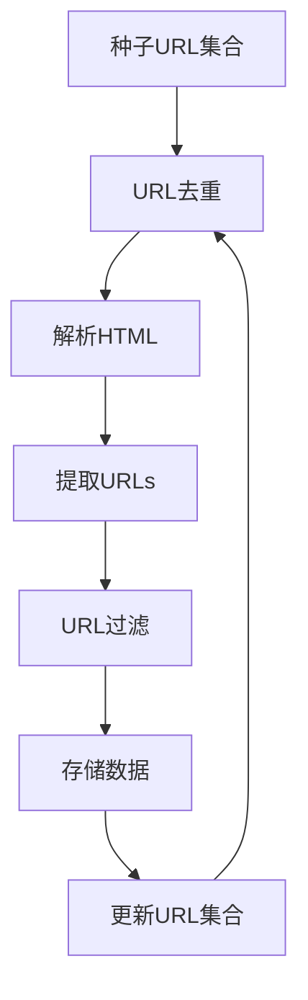
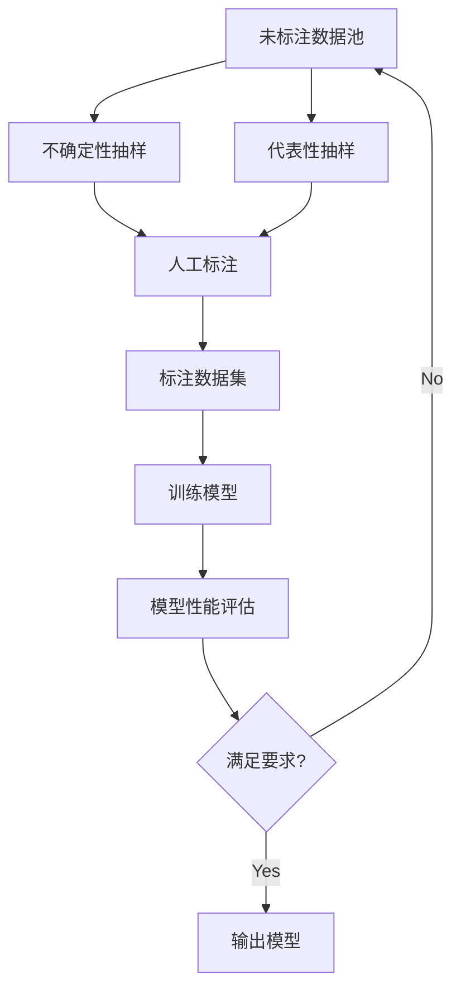
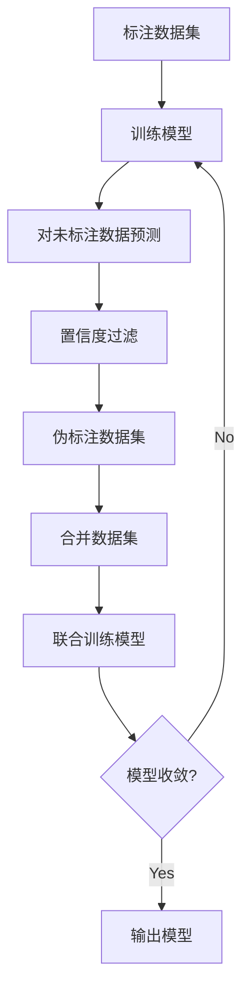

好的，我会按照您提供的要求和模板，撰写一篇高质量的技术博客文章。

# 数据采集与标注原理与代码实战案例讲解

## 1. 背景介绍

### 1.1 问题的由来

在当今的数据驱动时代，数据被视为新的"燃料"，推动着人工智能、机器学习和大数据分析等领域的快速发展。然而,高质量的数据资源是实现这些技术的关键前提。数据采集和标注是确保数据质量的重要环节,但同时也面临着诸多挑战。

传统的数据采集方式通常是人工的,这种方式不仅耗时耗力,而且容易出现偏差和错误。此外,对于一些特殊领域(如医疗影像、自然语言等),需要专业人员进行标注,这使得数据准备的成本和周期大大增加。

因此,如何高效、准确地采集和标注数据,成为了人工智能和大数据领域亟待解决的核心问题之一。

### 1.2 研究现状

为了解决数据采集和标注的挑战,研究人员提出了多种方法和工具,包括:

- **网络爬虫技术**: 利用自动化程序从互联网上采集结构化和非结构化数据。
- **众包标注平台**: 将标注任务外包给大量在线劳动力,利用人群的"智慧"完成数据标注。
- **主动学习技术**: 通过算法智能选择最有价值的数据进行人工标注,降低标注成本。
- **半监督学习**: 利用少量标注数据和大量未标注数据进行联合训练,扩充标注数据集。
- **迁移学习**: 将已有领域的标注数据应用到新领域,减少新领域的标注工作量。
- **数据增强技术**: 通过对现有数据进行变换(如旋转、缩放等)自动生成新的标注数据。

虽然这些技术取得了一定进展,但仍存在诸多不足,如质量难以保证、成本仍然较高、缺乏通用性等,因此需要进一步的研究和创新。

### 1.3 研究意义

高质量的数据资源对于人工智能、机器学习等领域的发展至关重要。通过研究高效、准确的数据采集和标注方法,可以为这些领域提供坚实的数据基础,促进技术的创新和应用。具体意义包括:

1. **降低数据准备成本**: 高效的数据采集和标注方法可以大幅降低人力和时间成本。
2. **提高数据质量**: 精准的标注方法有助于生成高质量、低噪声的训练数据,从而提高模型的性能和泛化能力。
3. **促进领域应用**: 在特殊领域(如医疗、法律等),可靠的数据是实现人工智能应用的前提,对于提高这些领域的效率和质量意义重大。
4. **推动技术创新**: 数据采集和标注方法的突破,可以为新兴技术(如元宇宙、自动驾驶等)提供坚实的数据支撑,助力技术发展。

总之,研究高效、准确的数据采集和标注方法,不仅可以降低成本、提高质量,更重要的是为人工智能和大数据等前沿技术的创新和应用奠定基础。

### 1.4 本文结构

本文将全面介绍数据采集和标注的原理和实践。首先阐述核心概念,包括数据采集、标注的定义、分类和挑战。然后深入探讨核心算法原理,如网络爬虫、主动学习、半监督学习等,并给出具体的操作步骤。接下来介绍相关的数学模型和公式,如页面排名算法、标注质量评估指标等。在此基础上,通过实战案例和代码实现,展示如何将这些原理和算法应用于实践。最后,讨论数据采集和标注在不同领域的应用场景,分享工具和学习资源,并总结未来的发展趋势和挑战。

## 2. 核心概念与联系

数据采集(Data Collection)和数据标注(Data Annotation)是构建高质量数据资源的两个关键环节。

**数据采集**是指从各种来源(如网站、社交媒体、物联网设备等)自动或手动获取原始数据的过程。常见的数据采集方式包括网络爬虫、API 调用、设备传感器等。

**数据标注**是指对采集到的原始数据进行加工和标记,使其可以被机器学习模型理解和利用。标注的形式因任务而异,如为图像数据标注物体类别和位置、为文本数据标注实体类型和关系等。

数据采集和标注虽然是两个独立的步骤,但它们密切相关、环环相扣:

1. **数据采集为标注提供原材料**: 高质量的原始数据是标注的前提,因此高效、全面的采集方法对标注质量至关重要。
2. **标注反馈影响采集策略**: 标注过程中发现的数据缺陷和偏差,可以指导优化采集策略,获取更加均衡和多样的数据。
3. **采集和标注的自动化程度相关**: 自动化采集技术(如网络爬虫)的发展,推动了自动化标注技术(如主动学习)的兴起,两者相辅相成。
4. **成本和质量权衡**: 在采集和标注过程中,都需要在成本(时间、人力、计算资源等)和质量之间进行权衡和优化。

因此,数据采集和标注虽然是两个独立的概念,但它们在实践中密不可分、相互影响。只有将两者有机结合,才能高效地构建高质量的数据资源。

## 3. 核心算法原理与具体操作步骤

### 3.1 算法原理概述

数据采集和标注涉及多种算法原理,包括:

1. **网络爬虫算法**: 用于自动化采集网络数据,包括网页链接抓取、网页内容解析、反爬虫策略绕过等。
2. **主动学习算法**: 通过算法智能选择最有价值的数据进行人工标注,降低标注成本。常用策略包括不确定性抽样、代表性抽样等。
3. **半监督学习算法**: 利用少量标注数据和大量未标注数据进行联合训练,扩充标注数据集。常用方法有自训练、协同训练等。
4. **迁移学习算法**: 将已有领域的标注数据应用到新领域,减少新领域的标注工作量。关键是找到两个领域之间的共享知识。
5. **数据增强算法**: 通过对现有数据进行变换(如旋转、缩放等)自动生成新的标注数据,扩充数据集。
6. **标注质量评估算法**: 通过算法评估标注数据的质量,如标注一致性、噪声水平等,为后续的数据处理提供依据。

这些算法原理为数据采集和标注提供了理论基础和技术支撑。下面将详细介绍其中的核心算法步骤。

### 3.2 算法步骤详解

#### 3.2.1 网络爬虫算法

网络爬虫是自动化采集网络数据的重要工具,其核心算法步骤如下:

1. **种子URL集合**: 从一组初始的URL开始爬取。
2. **URL去重**: 去除已经访问过的URL,避免重复爬取。
3. **解析HTML**: 下载网页的HTML源代码,准备提取所需数据。
4. **提取URLs**: 从HTML中提取新的URLs,用于后续爬取。
5. **URL过滤**: 根据设定的规则(如域名、关键词等)过滤出有效的URLs。
6. **存储数据**: 将所需数据(如网页正文、图片等)存储到本地或数据库。
7. **更新URL集合**: 将新提取的URLs加入种子集合,为下一轮爬取做准备。

在实际应用中,还需要处理各种反爬虫策略、设置爬取策略(如并发数、间隔时间等)、实现增量式爬取等,以提高爬虫的健壮性和效率。

#### 3.2.2 主动学习算法

主动学习算法通过智能选择样本,降低人工标注的工作量。其核心步骤如下:

1. **未标注数据池**: 初始化一个包含所有未标注数据的数据池。
2. **不确定性抽样**: 从未标注数据中,选择当前模型在其上预测最不确定的样本。
3. **代表性抽样**: 从未标注数据中,选择能够很好代表整个数据分布的样本。
4. **人工标注**: 由人工对选择出的样本进行标注。
5. **标注数据集**: 将新标注的样本加入到标注数据集中。
6. **训练模型**: 使用当前的标注数据集训练模型。
7. **模型性能评估**: 在保留的测试集上评估模型的性能指标。
8. **满足要求?**: 判断模型的性能是否满足预期要求。如果满足,输出模型;否则返回步骤2,重复主动学习的循环。

主动学习算法通过不断选择有价值的样本进行人工标注,在获取少量标注数据的情况下,就能训练出较高性能的模型,从而大幅降低标注成本。

#### 3.2.3 半监督学习算法

半监督学习算法利用大量未标注数据和少量标注数据进行联合训练,扩充标注数据集。其中一种常用的方法是自训练(Self-Training),步骤如下:

1. **标注数据集**: 初始的少量标注数据集。
2. **训练模型**: 使用标注数据集训练初始模型。
3. **对未标注数据预测**: 使用训练好的模型对大量未标注数据进行预测,获取预测标签。
4. **置信度过滤**: 根据模型预测的置信度,选取置信度最高的一部分预测结果。
5. **伪标注数据集**: 将置信度高的预测结果作为伪标注数据集。
6. **合并数据集**: 将伪标注数据集与原始标注数据集合并。
7. **联合训练模型**: 使用合并后的数据集重新训练模型。
8. **模型收敛?**: 判断模型在训练集和验证集上的性能是否收敛。如果收敛,输出模型;否则返回步骤3,重复自训练的循环。

通过自训练算法,可以利用大量未标注数据不断扩充标注数据集,提高模型的性能和泛化能力。除了自训练,还有其他半监督学习算法,如协同训练、图正则化等,原理类似但细节有所不同。

### 3.3 算法优缺点

上述三种核心算法各有优缺点:

**网络爬虫算法**:
- 优点:自动化程度高,可快速高效地采集大规模数据。
- 缺点:需要针对不同网站编写特定的解析规则,通用性较差;存在被反爬虫策略阻挡的风险。

**主动学习算法**:
- 优点:可以大幅降低标注成本,在有限的标注预算下获取高质量的标注数据。
- 缺点:需要反复训练模型,计算开销较大;存在查询策略偏差的风险,可能导致模型性能下降。

**半监督学习算法**:
- 优点:能够充分利用未标注数