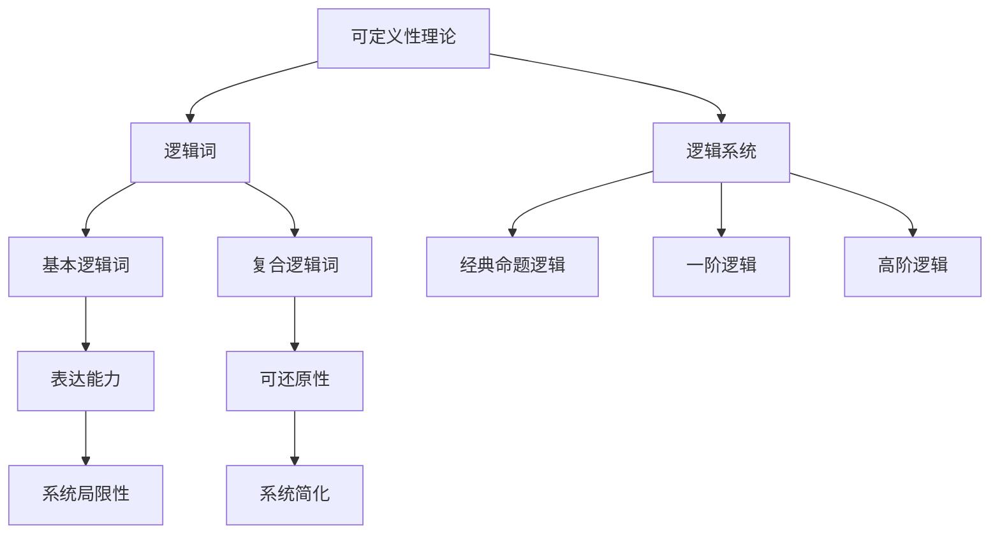

好的,我会按照您提供的要求和结构,尽最大努力撰写这篇技术博客文章。请耐心等待,我会用心写作,确保文章质量。

# 数理逻辑：逻辑词的可定义性

## 1. 背景介绍

### 1.1 问题的由来

在数理逻辑和形式语言理论中,一个基本而重要的问题是:哪些逻辑词是可定义的?这个问题的答案对于理解逻辑系统的表达能力和局限性至关重要。可定义性问题源于对逻辑词在形式化语言中的作用和地位的探究。

逻辑词是形式逻辑语言中的关键词,例如"与"(and)、"或"(or)、"非"(not)、"蕴含"(implies)等。它们用于构建复杂的逻辑公式和语句,表达推理规则。不同的逻辑系统使用不同的基本逻辑词集合作为起点。

可定义性问题探讨的是:给定一个基本逻辑词集合,是否可以使用这些基本逻辑词及其组合来定义或表示其他逻辑词?如果可以,那么这些可定义的逻辑词就不是基本的,可以被还原为基本逻辑词的组合。反之,如果一个逻辑词不能被定义,那它就是这个逻辑系统中真正的基本逻辑词。

### 1.2 研究现状

对于经典命题逻辑,已经有了较为完整的可定义性理论。经典命题逻辑中,有五个基本逻辑词:

- $\neg$ (非)
- $\wedge$ (与) 
- $\vee$ (或)
- $\rightarrow$ (蕴含)
- $\leftrightarrow$ (等价)

通过研究发现,在这五个基本逻辑词中,任何一个逻辑词都可以被其余四个定义。因此,经典命题逻辑实际上只需要一个逻辑词就可以构造整个逻辑系统。常用的基本逻辑词组合有{$\neg, \wedge$}、{$\neg, \vee$}和{$\neg, \rightarrow$}。

然而,对于一阶逻辑和高阶逻辑,可定义性理论就变得更加复杂。这些逻辑系统引入了新的逻辑词,如量词(全称量词$\forall$和存在量词$\exists$)、相等词($=$)等,它们的可定义性需要更深入的研究。

### 1.3 研究意义  

逻辑词的可定义性理论具有重要的理论意义和应用价值:

1. **理解逻辑系统的表达能力**:通过研究可定义性,我们可以确定一个逻辑系统的基本逻辑词集合,从而了解它的表达能力和局限性。这对于评估和比较不同逻辑系统的表达能力很有帮助。

2. **简化逻辑系统**:如果一个逻辑词可以被定义,那么它就可以被还原为基本逻辑词的组合,从而简化了逻辑系统。这有助于逻辑推理的自动化和优化。

3. **语言设计和分析**:在设计形式语言和逻辑系统时,可定义性理论可以指导我们选择合适的基本逻辑词集合,使语言具有足够的表达能力,同时保持简洁性。

4. **计算机科学应用**:逻辑是计算机科学的基础,可定义性理论在程序验证、知识表示、自动推理等领域都有应用。

### 1.4 本文结构

本文将系统地探讨逻辑词的可定义性问题。首先介绍核心概念和相关联系,然后深入分析核心算法原理和数学模型,并给出具体的项目实践和代码示例。接下来,讨论实际应用场景和未来发展趋势。最后,总结全文并提出一些常见问题的解答。

## 2. 核心概念与联系

可定义性理论研究逻辑词在逻辑系统中的地位和作用。一个逻辑系统由一组基本逻辑词和一组可以从基本逻辑词构造的复合逻辑词组成。

- 基本逻辑词是该逻辑系统的起点和基础,决定了系统的表达能力。
- 复合逻辑词是由基本逻辑词按照一定规则构造出来的,如果一个复合逻辑词可以被还原为基本逻辑词的组合,那么它就是可定义的,否则它就是这个逻辑系统中真正的新逻辑词。

可定义性理论的目标是:
1. 确定一个逻辑系统的基本逻辑词集合。
2. 研究哪些复合逻辑词是可定义的,哪些是新的基本逻辑词。
3. 了解逻辑系统的表达能力和局限性。
4. 在可能的情况下,将复合逻辑词还原为基本逻辑词的组合,简化逻辑系统。

在不同的逻辑系统中,可定义性理论会有不同的具体表现。经典命题逻辑的可定义性理论相对简单,而一阶逻辑和高阶逻辑由于引入了新的逻辑词(如量词),可定义性问题就变得更加复杂和有趣。

## 3. 核心算法原理与具体操作步骤

### 3.1 算法原理概述

判断一个逻辑词是否可定义的核心算法原理可以概括为:

1. 构造性证明:如果能够使用已知的基本逻辑词及其组合规则构造出目标逻辑词,那么该逻辑词就是可定义的。
2. 语义等价性:如果一个逻辑词在所有可能的语义解释下与已知基本逻辑词的某个组合等价,那么该逻辑词就是可定义的。
3. 无法构造证明:如果无论如何都无法使用已知基本逻辑词及其组合规则构造出目标逻辑词,那么该逻辑词就是不可定义的,是一个新的基本逻辑词。

算法的基本思路是:对于给定的目标逻辑词,尝试使用已知基本逻辑词及其组合规则构造出该逻辑词的定义。如果能够构造出来,那就证明了它是可定义的。如果无法构造,就需要进一步证明它在语义上与任何已知逻辑词组合都不等价。一旦证明了语义不等价性,就可以断言该逻辑词是不可定义的。

### 3.2 算法步骤详解

判断一个逻辑词是否可定义的具体算法步骤如下:

1. **输入**:目标逻辑词 $\alpha$,已知基本逻辑词集合 $\mathcal{B}$,以及逻辑词组合规则。
2. **尝试构造定义**:使用 $\mathcal{B}$ 中的逻辑词及其组合规则,试图构造出 $\alpha$ 的定义。如果能够构造出来,那么 $\alpha$ 就是可定义的,算法终止。
3. **检查语义等价性**:如果无法直接构造出 $\alpha$ 的定义,那么检查 $\alpha$ 在所有可能的语义解释下是否与 $\mathcal{B}$ 中逻辑词的某个组合等价。
    - 构造语义解释集合 $\mathcal{I}$,对于每个 $I \in \mathcal{I}$,计算 $\alpha$ 在 $I$ 下的语义解释 $\alpha^I$。
    - 对于 $\mathcal{B}$ 中的每个逻辑词 $\beta$,计算它在 $I$ 下的语义解释 $\beta^I$。
    - 检查是否存在 $\mathcal{B}$ 中的某个逻辑词组合 $\gamma$,使得对于所有 $I \in \mathcal{I}$,都有 $\alpha^I = \gamma^I$。如果存在这样的 $\gamma$,那么 $\alpha$ 就是可定义的,算法终止。
4. **无法定义**:如果经过上述步骤仍然无法构造出 $\alpha$ 的定义,也无法找到在语义上等价的逻辑词组合,那么就可以断言 $\alpha$ 是不可定义的,是一个新的基本逻辑词。

这个算法的关键在于语义等价性的检查。如果一个逻辑词在所有可能的语义解释下都与已知逻辑词组合不等价,那么它就无法被定义,必然是一个新的基本逻辑词。

### 3.3 算法优缺点

**优点**:

1. 系统性:该算法给出了判断逻辑词可定义性的系统步骤,包括构造定义和检查语义等价性两个主要环节。
2. 正确性:如果一个逻辑词可以被定义,该算法一定能够发现它的定义;如果一个逻辑词不可定义,该算法也能够证明它的不可定义性。
3. 通用性:该算法适用于各种不同的逻辑系统,只需要提供相应的基本逻辑词集合和组合规则。

**缺点**:

1. 复杂性:对于复杂的逻辑词,尤其是涉及量词和高阶逻辑的情况,构造定义和检查语义等价性可能会变得非常复杂。
2. 无穷语义解释:在检查语义等价性时,需要考虑所有可能的语义解释,这可能会导致无穷多个解释需要检查,增加了计算复杂度。
3. 决定问题:判断逻辑词是否可定义属于一个经典的无决定性问题,在最坏情况下,算法的时间复杂度可能是非常高的。

### 3.4 算法应用领域

逻辑词可定义性算法在以下领域有着广泛的应用:

1. **逻辑系统设计**:在设计新的逻辑系统时,可以使用该算法来确定最小的基本逻辑词集合,从而简化系统并提高表达能力。
2. **形式语言分析**:对于任何基于逻辑的形式语言,都需要确定其基本逻辑词集合,该算法可以用于分析语言的表达能力和局限性。
3. **自动定理证明**:在自动定理证明系统中,需要对逻辑词进行规范化和简化,可定义性算法可以用于识别可以被还原的复合逻辑词。
4. **知识表示与推理**:在基于逻辑的知识表示和推理系统中,可定义性算法可以帮助优化知识库,消除冗余的逻辑词定义。
5. **程序验证**:在程序验证领域,需要对程序的逻辑规范进行形式化建模,可定义性算法可以用于分析和优化这些逻辑规范。

总的来说,逻辑词可定义性算法是一种基础性的算法,在涉及逻辑推理、形式化建模和语言分析的领域都有重要应用。

## 4. 数学模型和公式详细讲解与举例说明

### 4.1 数学模型构建

为了形式化地研究逻辑词的可定义性问题,我们需要构建一个数学模型。该模型包括以下几个基本组成部分:

1. **逻辑系统** $\mathcal{L}$:一个逻辑系统由一组基本逻辑词集合 $\mathcal{B}$ 和一组逻辑词组合规则 $\mathcal{R}$ 组成,记作 $\mathcal{L} = (\mathcal{B}, \mathcal{R})$。
2. **语法**:逻辑系统 $\mathcal{L}$ 的语法定义了如何使用 $\mathcal{B}$ 中的基本逻辑词及 $\mathcal{R}$ 中的组合规则构造合法的逻辑公式或语句。
3. **语义**:逻辑系统 $\mathcal{L}$ 的语义给出了如何解释逻辑公式或语句的意义。通常使用解释