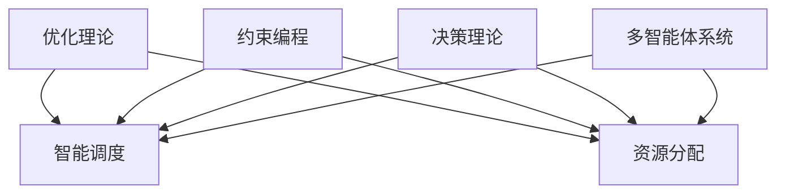
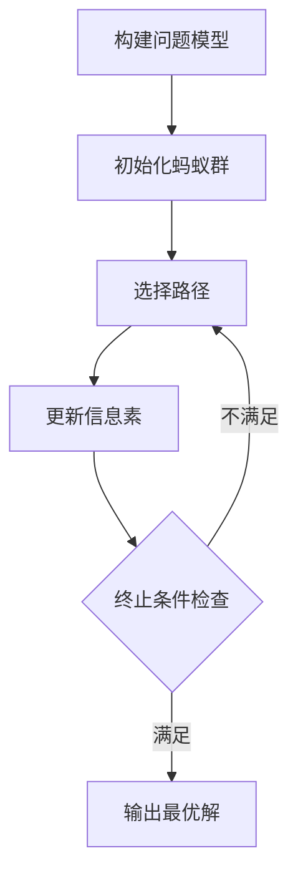

# 智能调度与资源分配：AI代理的工作流优化

## 1. 背景介绍

### 1.1 问题的由来

在当今快节奏的商业环境中，高效的资源分配和优化工作流程对于企业的成功至关重要。传统的手动调度和资源分配方法往往效率低下、容易出错,无法满足现代化企业日益增长的需求。因此,开发智能调度和资源分配系统以优化工作流程成为了一个迫切的需求。

随着人工智能(AI)技术的不断发展,AI代理系统展现出了巨大的潜力,可以帮助企业实现智能化调度和资源分配,从而提高效率、降低成本并提升竞争力。AI代理能够快速分析大量数据,识别模式和趋势,并基于这些信息做出优化决策。

### 1.2 研究现状

近年来,研究人员已经提出了多种智能调度和资源分配算法,如遗传算法、蚁群优化算法、模拟退火算法等。这些算法旨在解决不同类型的优化问题,如作业调度、车辆路由、资源分配等。然而,大多数现有算法都有一定的局限性,例如计算复杂度高、收敛速度慢或难以处理动态环境等。

此外,现有的AI代理系统通常专注于特定领域或任务,缺乏通用性和可扩展性。因此,开发一种通用的智能调度和资源分配框架,能够适应不同场景并提供高效、可靠的优化解决方案,成为了一个重要的研究课题。

### 1.3 研究意义

智能调度和资源分配系统的研究和开发具有重要的理论和实际意义:

- 理论意义:
  - 推动人工智能、运筹学、计算机科学等多个学科的交叉融合
  - 促进优化算法和模型的创新与发展
  - 为复杂系统的智能化决策提供新的思路和方法

- 实际意义:
  - 提高企业的运营效率,降低成本,提升竞争力
  - 优化资源利用,减少浪费,实现可持续发展
  - 应用于多个领域,如制造业、物流、能源等

### 1.4 本文结构

本文将全面探讨智能调度和资源分配的相关理论和实践。首先介绍核心概念和原理,然后详细阐述关键算法和数学模型。接着,通过实际项目案例和代码实现,展示如何将理论付诸实践。最后,分析实际应用场景,总结发展趋势和挑战,并提供相关资源推荐。

## 2. 核心概念与联系

智能调度和资源分配涉及多个核心概念,包括优化理论、约束编程、决策理论、多智能体系统等。这些概念相互关联,共同构建了一个完整的理论框架。

1. **优化理论**是智能调度和资源分配的基础,旨在寻找满足特定约束条件下的最优解。常用的优化技术包括线性规划、非线性规划、动态规划等。

2. **约束编程**提供了一种声明式的方式来描述问题约束和目标,并通过搜索和推理找到满足约束的解。它在资源分配和调度中发挥着重要作用。

3. **决策理论**研究如何在不确定性和风险下做出最佳决策。在动态环境中,智能调度和资源分配需要基于决策理论来应对变化并做出适当的调整。

4. **多智能体系统**涉及多个智能代理之间的协作、协调和竞争。在复杂的调度和资源分配问题中,通常需要多个智能代理协同工作以找到最优解。

这些核心概念相互关联、相辅相成,共同为智能调度和资源分配提供了理论基础和技术支持。研究人员需要综合运用这些概念,才能开发出高效、可靠的智能系统。

## 3. 核心算法原理与具体操作步骤

### 3.1 算法原理概述

智能调度和资源分配问题通常被建模为组合优化问题,旨在在满足一系列约束条件的前提下,寻找最优或近似最优解。常用的算法包括:

1. **启发式算法**:如遗传算法、蚁群优化算法、模拟退火算法等,通过模拟自然过程来寻找近似最优解。这些算法具有全局搜索能力,可以有效避免陷入局部最优。

2. **精确算法**:如整数规划、约束编程等,能够保证找到最优解,但计算复杂度较高,只适用于小规模问题。

3. **近似算法**:如贪心算法、局部搜索算法等,通过简化问题或放宽约束来加速求解过程,但无法保证找到最优解。

4. **混合算法**:结合多种算法的优点,如基于种群的启发式算法与精确算法相结合,以求在求解质量和效率之间取得平衡。

不同算法在求解效率、精确度、可扩展性等方面存在权衡,需要根据具体问题的特点和要求来选择合适的算法。

### 3.2 算法步骤详解

以蚁群优化算法为例,其在智能调度和资源分配中的具体步骤如下:

1. **构建问题模型**:将调度或资源分配问题建模为组合优化问题,定义决策变量、目标函数和约束条件。

2. **初始化蚂蚁群**:随机生成一定数量的蚂蚁(可行解),并计算它们的适应度(目标函数值)。

3. **选择路径**:每只蚂蚁根据信息素浓度和启发式信息,按一定概率选择下一步的路径(决策)。

4. **更新信息素**:当所有蚂蚁完成一次迭代后,根据它们的适应度更新信息素浓度,以引导后续搜索朝更优解的方向前进。

5. **终止条件检查**:检查是否满足终止条件(如最大迭代次数或目标函数收敛),若满足则输出当前最优解,否则返回步骤3继续迭代。

蚁群优化算法模拟了蚂蚁在寻找食物路径时释放和感知信息素的行为,通过正反馈机制逐步找到最优解。该算法具有分布式计算、正反馈引导、可并行等特点,适用于复杂的组合优化问题。

### 3.3 算法优缺点

蚁群优化算法具有以下优缺点:

**优点**:

- 具有全局优化能力,不易陷入局部最优
- 算法简单、易于实现和并行计算
- 适用于动态环境,能够自适应地调整搜索策略
- 可以处理高度约束和高维组合优化问题

**缺点**:

- 存在参数调优问题,参数设置对算法性能影响较大
- 收敛速度较慢,对大规模问题可能需要较长时间才能收敛
- 对于高维高约束的复杂问题,性能可能不如其他算法
- 缺乏理论指导,算法设计主要依赖经验和试错

总的来说,蚁群优化算法在智能调度和资源分配等组合优化问题中表现不错,但仍需要根据具体问题特点进行改进和优化。

### 3.4 算法应用领域

蚁群优化算法及其变种广泛应用于多个领域的智能调度和资源分配问题,包括但不限于:

1. **作业调度**:如工厂作业调度、计算机作业调度等,旨在最小化总完工时间或最大化资源利用率。

2. **车辆路由**:如车辆调度、无人机路径规划等,目标是最小化总行驶距离或时间。

3. **资源分配**:如云资源分配、无线网络资源分配等,旨在最大化资源利用效率。

4. **项目调度**:如软件开发项目调度、工程项目调度等,目标是缩短项目周期或最小化成本。

5. **人力资源调度**:如医院值班调度、航空公司机组调度等,需要满足各种约束条件。

6. **仓储调度**:如自动化立体仓库调度、订单拣选优化等,提高物流效率。

除此之外,蚁群优化算法还可应用于电力调度、网络流量工程等诸多领域。随着算法的不断改进和发展,其应用范围将进一步扩大。

## 4. 数学模型和公式详细讲解与举例说明

### 4.1 数学模型构建

在智能调度和资源分配问题中,通常需要构建数学模型来准确描述问题约束和优化目标。一个典型的整数规划模型包括:

- 决策变量: $x_{ij}$ 表示将任务 $i$ 分配给资源 $j$ 的决策,取值为 0 或 1
- 目标函数: $\min \sum_{i} \sum_{j} c_{ij} x_{ij}$,最小化总成本
- 约束条件:
  $$\sum_{j} x_{ij} = 1 \quad \forall i \quad \text{(每个任务只能分配给一个资源)}$$
  $$\sum_{i} d_{i} x_{ij} \leq C_{j} \quad \forall j \quad \text{(每个资源的总负载不超过其容量)}$$

其中 $c_{ij}$ 表示将任务 $i$ 分配给资源 $j$ 的成本, $d_i$ 表示任务 $i$ 的工作量, $C_j$ 表示资源 $j$ 的容量。

该模型旨在找到一种任务到资源的分配方式,使得总成本最小,同时满足每个任务只能分配给一个资源,以及每个资源的总负载不超过其容量的约束条件。

### 4.2 公式推导过程

在蚁群优化算法中,蚂蚁 $k$ 在时间 $t$ 选择从节点 $i$ 转移到节点 $j$ 的概率由以下公式给出:

$$P_{ij}^{k}(t) = \begin{cases}
\frac{[\tau_{ij}(t)]^{\alpha} \cdot [\eta_{ij}]^{\beta}}{\sum\limits_{l \in \mathcal{N}_{i}^{k}}[\tau_{il}(t)]^{\alpha} \cdot [\eta_{il}]^{\beta}}, &\text{if } j \in \mathcal{N}_{i}^{k}\\
0, &\text{otherwise}
\end{cases}$$

其中:

- $\tau_{ij}(t)$ 表示时间 $t$ 时,边 $(i, j)$ 上的信息素浓度
- $\eta_{ij}$ 表示边 $(i, j)$ 的启发式信息,通常取 $1/d_{ij}$,其中 $d_{ij}$ 是边的长度或代价
- $\alpha$ 和 $\beta$ 分别是信息素重要程度和启发式信息重要程度的参数
- $\mathcal{N}_{i}^{k}$ 表示蚂蚁 $k$ 当前所在节点 $i$ 的可行邻居节点集合

该公式表明,蚂蚁选择下一步的概率不仅取决于信息素浓度,还取决于启发式信息。通过调节 $\alpha$ 和 $\beta$ 的值,可以控制算法对信息素和启发式信息的相对重视程度。

在每次迭代结束后,需要根据蚂蚁的路径质量更新信息素浓度,以引导后续搜索朝更优解的方向前进。信息素更新规则如下:

$$\tau_{ij}(t+1) = (1 - \rho) \cdot \tau_{ij}(t) + \sum\limits_{k=1}^{m} \Delta\tau_{ij}^{k}(t)$$

其中:

- $\rho$ 是信息素挥发系数,用于避免过早收敛
- $m$ 是蚂蚁总数
- $\Delta\tau_{ij}^{k}(t)$ 表示蚂蚁 $k$