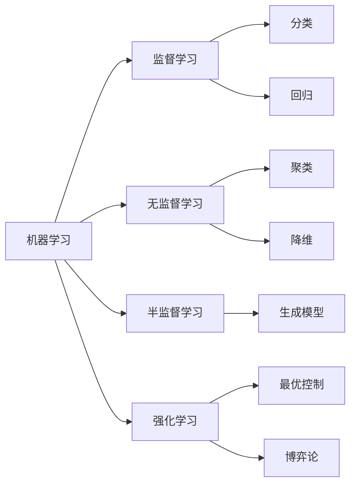

# 机器学习(Machine Learning) - 原理与代码实例讲解

作者：禅与计算机程序设计艺术 / Zen and the Art of Computer Programming

## 1. 背景介绍

### 1.1 问题的由来

在人工智能的发展历程中，机器学习一直扮演着至关重要的角色。机器学习旨在让计算机系统从数据中自主学习，无需显式编程就能完成特定任务。随着大数据时代的到来和计算能力的飞速提升，机器学习已经成为了人工智能领域的核心驱动力，在各行各业得到了广泛应用。

### 1.2 研究现状

目前，机器学习的研究主要集中在以下几个方面：

1. 算法优化：研究者们不断探索新的算法，改进现有算法的性能，提高学习效率和泛化能力。
2. 深度学习：作为机器学习的一个分支，深度学习利用多层神经网络实现了更强大的特征学习和抽象能力。
3. 迁移学习：如何将已有的知识迁移到新的任务中，减少重复学习的成本，是目前研究的热点之一。
4. 强化学习：通过智能体与环境的交互，学习最优策略，在游戏、机器人等领域取得了重大突破。
5. 可解释性：随着机器学习模型变得越来越复杂，如何让模型具备可解释性，增强人们对其决策过程的理解和信任，成为了亟待解决的问题。

### 1.3 研究意义

机器学习的研究具有重大意义：

1. 推动人工智能的发展：机器学习是实现人工智能的关键技术之一，其进步直接影响着人工智能的整体水平。
2. 解决现实问题：机器学习能够在图像识别、自然语言处理、推荐系统等领域提供有效的解决方案，为人们的生活和工作带来便利。
3. 促进跨学科融合：机器学习与统计学、优化理论、神经科学等学科紧密相关，推动了多学科的交叉融合和协同创新。
4. 引领技术变革：机器学习正在深刻改变着各行各业，催生出新的商业模式和应用场景，引领着新一轮的技术革命。

### 1.4 本文结构

本文将全面介绍机器学习的原理和代码实践。首先，我们将阐述机器学习的核心概念和各个分支之间的联系。然后，重点讲解几种常见的机器学习算法，包括它们的数学原理、优缺点和应用场景。接着，我们将通过代码实例来演示如何使用Python实现这些算法。最后，总结机器学习的发展趋势和面临的挑战，并提供一些学习资源和工具推荐。

## 2. 核心概念与联系

机器学习的核心概念包括：

- 数据集：机器学习算法的训练和测试都需要使用数据集。数据集通常由特征和标签两部分组成。
- 特征：描述数据属性的变量，可以是数值型、类别型等。
- 标签：数据对应的目标值，可以是类别或数值。
- 模型：机器学习算法通过学习数据集，建立起输入特征到输出标签的映射关系，这个映射关系就是模型。
- 训练：利用训练数据集，通过优化模型参数，使模型在该数据集上的预测性能达到最佳。
- 泛化：模型在未见过的数据上的表现能力。一个好的模型应该具备较强的泛化能力。
- 过拟合：模型在训练数据上表现很好，但在新数据上却表现糟糕，通常是由于模型过于复杂造成的。
- 欠拟合：模型在训练数据和新数据上都表现不佳，通常是由于模型过于简单造成的。

根据任务类型，机器学习可以分为以下几类：

- 监督学习：训练数据带有标签，模型学习特征到标签的映射。常见任务有分类和回归。
- 无监督学习：训练数据没有标签，模型通过发掘数据内在结构和关联来学习。常见任务有聚类和降维。
- 半监督学习：结合了监督学习和无监督学习，利用少量有标签数据和大量无标签数据来学习。
- 强化学习：通过智能体与环境的交互，学习最优策略，以获得最大累积奖励。

这些概念和分支之间并非完全独立，而是相互关联、相互促进的。例如，无监督学习可以作为监督学习的预处理步骤，帮助提取更有效的特征表示。同时，强化学习也可以利用监督学习和无监督学习的技术来加速策略学习的过程。

下图展示了机器学习的核心概念与分支之间的关系：



## 3. 核心算法原理 & 具体操作步骤

### 3.1 算法原理概述

机器学习涉及多种算法，每种算法都有其独特的原理和适用场景。以下是几种常见的机器学习算法：

1. 线性回归
2. 逻辑回归
3. 决策树
4. 支持向量机
5. K最近邻
6. 朴素贝叶斯
7. K均值聚类
8. 主成分分析
9. 神经网络

这些算法可以分为线性模型和非线性模型两大类。线性模型假设输入特征和输出标签之间存在线性关系，而非线性模型则可以刻画更复杂的非线性关系。此外，这些算法还可以根据任务类型分为分类算法、回归算法和聚类算法等。

### 3.2 算法步骤详解

以线性回归为例，其基本步骤如下：

1. 数据预处理：对数据进行清洗、转换、归一化等操作，使其适合模型训练。
2. 模型构建：假设输入特征和输出标签之间存在线性关系，建立线性回归模型 $y=w^Tx+b$。
3. 损失函数定义：引入均方误差作为损失函数，衡量模型预测值与真实值之间的差异。
4. 参数优化：通过最小化损失函数，利用梯度下降等优化算法，找到最优的模型参数 $w$ 和 $b$。
5. 模型评估：在测试集上评估模型的性能，计算均方误差、决定系数等指标。
6. 模型调优：通过调整超参数、特征工程等手段，进一步提升模型性能。
7. 模型预测：利用训练好的模型对新数据进行预测。

其他算法的步骤大同小异，主要区别在于模型构建和参数优化的具体方法。

### 3.3 算法优缺点

每种算法都有其优缺点，需要根据具体任务和数据特点来选择合适的算法。以决策树为例：

优点：
- 易于理解和解释
- 可以处理类别型和数值型特征
- 对缺失值不敏感
- 可以实现特征选择

缺点：
- 容易过拟合
- 对连续型变量的处理不够优雅
- 对数据扰动敏感
- 难以处理高维数据

### 3.4 算法应用领域

机器学习算法在各个领域都有广泛应用，例如：

- 计算机视觉：图像分类、目标检测、语义分割等
- 自然语言处理：文本分类、情感分析、机器翻译等
- 推荐系统：个性化推荐、协同过滤等
- 金融风控：信用评分、反欺诈等
- 智能医疗：疾病诊断、药物发现等

不同的应用场景对算法的要求也各不相同，需要综合考虑准确性、可解释性、实时性等因素。

## 4. 数学模型和公式 & 详细讲解 & 举例说明

### 4.1 数学模型构建

以逻辑回归为例，我们详细讲解其数学模型的构建过程。

逻辑回归是一种常用的二分类算法，其目标是估计输入特征与输出标签之间的条件概率分布 $P(y|x)$。假设这个条件概率服从 Sigmoid 函数形式：

$$
P(y=1|x) = \frac{1}{1+e^{-z}}
$$

其中，$z=w^Tx+b$，$w$ 和 $b$ 分别为模型的权重参数和偏置项。

对于给定的输入特征 $x$，模型的输出 $\hat{y}$ 表示为：

$$
\hat{y} = 
\begin{cases}
1, & P(y=1|x) \geq 0.5 \\
0, & P(y=1|x) < 0.5
\end{cases}
$$

### 4.2 公式推导过程

为了训练逻辑回归模型，我们需要最大化似然函数，即最小化负对数似然函数：

$$
\min_{w,b} -\sum_{i=1}^{N} [y_i \log(\hat{y}_i) + (1-y_i) \log(1-\hat{y}_i)]
$$

其中，$y_i$ 为第 $i$ 个样本的真实标签，$\hat{y}_i$ 为模型对第 $i$ 个样本的预测概率。

利用梯度下降法对损失函数进行优化，更新模型参数：

$$
w := w - \alpha \frac{\partial L}{\partial w}
$$

$$
b := b - \alpha \frac{\partial L}{\partial b}
$$

其中，$\alpha$ 为学习率，$\frac{\partial L}{\partial w}$ 和 $\frac{\partial L}{\partial b}$ 分别为损失函数对 $w$ 和 $b$ 的偏导数。

### 4.3 案例分析与讲解

我们以一个简单的二分类问题为例，说明如何应用逻辑回归模型。

假设我们有一个学生成绩数据集，包含三个特征：学习时间、课堂出勤率、作业完成度，以及对应的是否及格标签（及格为1，不及格为0）。我们的目标是根据这三个特征预测学生是否能够及格。

首先，对数据进行预处理，将特征归一化到 [0,1] 区间。然后，按照 7:3 的比例随机划分训练集和测试集。

接着，初始化模型参数 $w$ 和 $b$，设置学习率 $\alpha=0.01$，迭代次数 $num\_epochs=1000$。

在每个 epoch 中，遍历训练集中的所有样本，计算模型的预测概率和损失函数，并利用梯度下降法更新模型参数。

最后，在测试集上评估模型的性能，计算准确率、精确率、召回率等指标。

通过调整模型超参数、特征工程等手段，不断优化模型，直到达到满意的性能为止。

### 4.4 常见问题解答

1. 逻辑回归可以处理多分类问题吗？
   
   可以，常见的做法是将多分类问题转化为多个二分类问题，即"一对多"策略。也可以直接使用 Softmax 回归，将输出概率向量化。

2. 逻辑回归对数据规模和特征数量有什么要求？
   
   逻辑回归适用于中小规模数据集，特征数量不宜过多。当特征数远大于样本数时，容易出现过拟合。此时可以考虑引入正则化项，或者进行特征选择。

3. 如何解释逻辑回归模型的系数？
   
   逻辑回归的系数可以解释为特征对对数几率的影响。系数为正，表示该特征的增大会提高正例的对数几率；系数为负，则表示该特征的增大会降低正例的对数几率。

## 5. 项目实践：代码实例和详细解释说明

### 5.1 开发环境搭建

本项目使用 Python 语言，需要安装以下库：

- NumPy：数值计算库
- Pandas：数据处理库
- Matplotlib：数据可视化库
- Scikit-learn：机器学习算法库

可以使用 pip 命令安装这些库：

```bash
pip install numpy pandas matplotlib scikit-learn
```

### 5.2 源代码详细