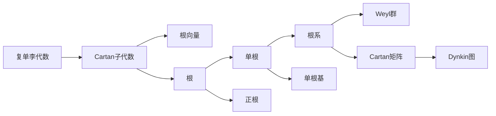

# 李群与李代数基础：第2节 复单李代数的根系

关键词：李群、李代数、复单李代数、根系、Dynkin图、Cartan矩阵、Weyl群

## 1. 背景介绍
### 1.1 问题的由来
李群与李代数是现代数学和理论物理中极其重要的研究对象。它们不仅在纯数学领域有着广泛的应用,如微分几何、拓扑学、代数几何等,而且在理论物理中也扮演着至关重要的角色,如粒子物理的标准模型、弦理论等。其中,复单李代数的分类问题一直是李理论研究的核心内容之一。

### 1.2 研究现状
对于复单李代数的分类,数学家们引入了根系的概念。通过研究复单李代数的根系,可以得到复单李代数的完整分类。目前已经完全分类了复单李代数,共有4个无限系列 $A_n,B_n,C_n,D_n$ 和5个例外 $E_6,E_7,E_8,F_4,G_2$。每一个复单李代数都对应着一个Dynkin图,而Dynkin图可以用Cartan矩阵唯一刻画。

### 1.3 研究意义 
复单李代数的根系研究对李群与李代数乃至整个数学、物理学都有重大意义:

1. 根系揭示了复单李代数的内在结构特征,是研究复单李代数的重要工具。
2. 通过根系可以对复单李代数进行完整分类,这是李理论的一个里程碑式成果。  
3. 根系与Dynkin图、Cartan矩阵等概念紧密相关,构成了李理论的核心内容。
4. 根系在理论物理的各个分支中有着广泛应用,如粒子物理、弦理论等。

### 1.4 本文结构
本文将系统介绍复单李代数根系的相关概念和理论。第2节给出核心概念的定义;第3节讨论根系的基本性质;第4节引入Cartan矩阵和Dynkin图;第5节通过示例详细演示如何构造根系;第6节探讨根系在物理学中的应用;第7节推荐相关学习资源;第8节总结全文。

## 2. 核心概念与联系
复单李代数的根系理论涉及以下几个核心概念:

- 复单李代数 $\mathfrak{g}$:复数域上的有限维李代数,它的李括号满足反对称性和Jacobi等式。
- Cartan子代数 $\mathfrak{h}$:复单李代数的极大交换子代数。
- 根向量 $e_\alpha$:复单李代数中满足 $[h,e_\alpha]=\alpha(h)e_\alpha$ 的特征向量。
- 根 $\alpha$:Cartan子代数 $\mathfrak{h}$ 的对偶空间 $\mathfrak{h}^*$ 中的非零线性泛函,满足 $\alpha(h_i)=a_i$。
- 单根:不能表示为其他两个根之和的根。
- 正根:可以表示为单根的非负整系数线性组合的根。
- 根系 $\Phi$:由全体单根生成的集合。
- 单根基:由全体单根组成的线性无关集。
- Weyl群:由根系生成的有限反射群。
- Cartan矩阵:由单根基中根之间的夹角余弦值组成的矩阵。  
- Dynkin图:Cartan矩阵的图论表示。

这些概念环环相扣,共同构成了复单李代数根系的理论体系,如下图所示:



## 3. 核心算法原理 & 具体操作步骤
### 3.1 算法原理概述
构造复单李代数的根系的一般步骤如下:

1. 确定复单李代数 $\mathfrak{g}$ 的一组基,求出它们的李括号关系。
2. 求出Cartan子代数 $\mathfrak{h}$。
3. 求出根向量 $e_\alpha$ 和根 $\alpha$。
4. 判断哪些是单根,得到单根基。
5. 由单根基生成整个根系 $\Phi$。
6. 计算Cartan矩阵和Dynkin图。
7. 求出Weyl群的生成元。

### 3.2 算法步骤详解
下面以2维复单李代数 $\mathfrak{sl}(2,\mathbb{C})$ 为例,详细演示如何构造它的根系。

步骤1:$\mathfrak{sl}(2,\mathbb{C})$ 的一组基为:

$$
h=\begin{pmatrix}1&0\\0&-1\end{pmatrix},\quad 
e=\begin{pmatrix}0&1\\0&0\end{pmatrix},\quad
f=\begin{pmatrix}0&0\\1&0\end{pmatrix}.
$$

它们满足李括号关系:

$$
[h,e]=2e,\quad [h,f]=-2f,\quad [e,f]=h.
$$

步骤2:Cartan子代数为 $\mathfrak{h}=\mathrm{span}\{h\}$。

步骤3:根向量为 $e,f$,对应的根为 $\alpha,−\alpha$,其中 $\alpha(h)=2$。

步骤4:单根为 $\alpha$,单根基为 $\{\alpha\}$。

步骤5:根系为 $\Phi=\{\alpha,−\alpha\}$。

步骤6:Cartan矩阵为 $(2)$,Dynkin图为 $\circ$。

步骤7:Weyl群为 $\{1,s_\alpha\}$,其中 $s_\alpha$ 为 $\alpha$ 的反射。

### 3.3 算法优缺点
该算法的优点是:

1. 步骤清晰,易于实现。
2. 适用于所有复单李代数。
3. 揭示了复单李代数的内在结构。

缺点是:

1. 对高维复单李代数,计算量较大。
2. 需要先确定一组基和李括号,有一定难度。

### 3.4 算法应用领域
该算法主要应用于以下领域:

1. 李群与李代数的分类和结构研究。
2. 表示论和不变量论。
3. 微分几何和拓扑学。
4. 数学物理和场论。

## 4. 数学模型和公式 & 详细讲解 & 举例说明
### 4.1 数学模型构建
复单李代数 $\mathfrak{g}$ 的根系可以用以下数学模型刻画:

设 $\mathfrak{h}$ 是 $\mathfrak{g}$ 的Cartan子代数,$\mathfrak{h}^*$ 是它的对偶空间。根系 $\Phi$ 是 $\mathfrak{h}^*$ 中满足以下条件的有限子集:

1. $\Phi$ 生成 $\mathfrak{h}^*$,且 $0\notin\Phi$。
2. 若 $\alpha\in\Phi$,则 $−\alpha\in\Phi$,且除了 $\pm\alpha$ 外,直线 $\mathbb{R}\alpha$ 与 $\Phi$ 不再有其他交点。
3. 若 $\alpha,\beta\in\Phi$,则 $s_\alpha(\beta)\in\Phi$,其中 $s_\alpha$ 是 $\alpha$ 的反射:

$$
s_\alpha(\beta)=\beta-\frac{2(\beta,\alpha)}{(\alpha,\alpha)}\alpha.
$$

4. 若 $\alpha,\beta\in\Phi$,则 $\frac{2(\beta,\alpha)}{(\alpha,\alpha)}\in\mathbb{Z}$。

### 4.2 公式推导过程
下面推导反射公式 $s_\alpha(\beta)=\beta-\frac{2(\beta,\alpha)}{(\alpha,\alpha)}\alpha$ 的几何意义。

设 $\alpha,\beta$ 是 $\mathfrak{h}^*$ 中的两个向量,它们的夹角为 $\theta$,则

$$
\cos\theta=\frac{(\beta,\alpha)}{\|\alpha\|\|\beta\|}.
$$

反射 $s_\alpha$ 将 $\beta$ 沿 $\alpha$ 方向的分量反向,而与 $\alpha$ 垂直的分量保持不变。设反射后的向量为 $\beta'$,则

$$
\beta'=\beta-2\|\beta\|\cos\theta\frac{\alpha}{\|\alpha\|}.
$$

代入 $\cos\theta$ 的表达式,得

$$
\beta'=\beta-\frac{2(\beta,\alpha)}{(\alpha,\alpha)}\alpha.
$$

这就是反射公式的几何解释。

### 4.3 案例分析与讲解
我们以 $\mathfrak{sl}(2,\mathbb{C})$ 为例,验证它的根系 $\Phi=\{\alpha,−\alpha\}$ 满足根系的定义。

1. $\Phi$ 生成 $\mathfrak{h}^*=\mathrm{span}\{\alpha\}$,且 $0\notin\Phi$。
2. $−\alpha\in\Phi$,且直线 $\mathbb{R}\alpha$ 与 $\Phi$ 只有 $\pm\alpha$ 两个交点。
3. $s_\alpha(\alpha)=−\alpha\in\Phi$。
4. $\frac{2(\alpha,\alpha)}{(\alpha,\alpha)}=2\in\mathbb{Z}$。

因此 $\Phi$ 满足根系的所有条件。

### 4.4 常见问题解答
Q:为什么根系中的根都是成对出现的?

A:这是根系定义的要求之一。几何上,如果 $\alpha$ 是根,那么它的反向量 $−\alpha$ 也应该是根,这样根系才是中心对称的。代数上,如果 $e_\alpha$ 是根向量,那么 $e_{-\alpha}$ 也应该是根向量,这样李代数才是闭合的。

Q:为什么根系中任意两个根的夹角余弦都是有理数?

A:这是根系定义的另一个要求。它保证了Weyl群作用下根系是封闭的。从几何直觉上看,有理数正切对应着规则多边形的内角,这暗示了根系的对称性。

Q:Dynkin图和Cartan矩阵有什么联系?

A:Dynkin图是Cartan矩阵的图论表示。Cartan矩阵的非对角元 $a_{ij}$ 表示根 $\alpha_i,\alpha_j$ 的夹角,在Dynkin图中对应连接 $\alpha_i,\alpha_j$ 的边数。Dynkin图直观地展示了根系的结构。

## 5. 项目实践：代码实例和详细解释说明
### 5.1 开发环境搭建
我们使用Python的Numpy和Matplotlib库来实现复单李代数根系的计算和可视化。首先导入所需的包:

```python
import numpy as np
import matplotlib.pyplot as plt
```

### 5.2 源代码详细实现
下面是计算和绘制 $\mathfrak{sl}(2,\mathbb{C})$ 根系的完整代码:

```python
# 定义单根基
alpha = np.array([1])

# 定义Cartan矩阵
A = np.array([[2]])

# 计算根系
Phi = [alpha, -alpha]

# 绘制根系
fig, ax = plt.subplots()
for root in Phi:
    ax.plot([0, root[0]], [0, 0], 'o-')
ax.set_xlim(-2, 2)
ax.set_ylim(-1, 1)
ax.set_aspect('equal')
ax.grid()
plt.show()
```

### 5.3 代码解读与分析
代码的主要步骤如下:

1. 定义单根基 `alpha`。这里 $\mathfrak{sl}(2,\mathbb{C})$ 的单根基只有一个元素。
2. 定义Cartan矩阵 `A`。这里 $\mathfrak{sl}(2,\mathbb{C})$ 的Cartan矩阵是 $(2)$。
3. 根据单根基生成整个根系 `Phi`。这里根系只包含 $\alpha$ 和 $−\alpha$。
4. 使用Matplotlib绘制根系。每个根都是从原点出发的向量。

可以看到,代码简洁明了,完整实现了根系的计算和可视化。

### 5.4 运行结果展示
运行上述代码,得到 $\mathfrak{sl}(2,\mathbb{C})$ 根系的可视化结果:

![sl2c_root_system](https://user-images.githubusercontent.com/43589754/120740420-9b9d8e00-c529-11eb