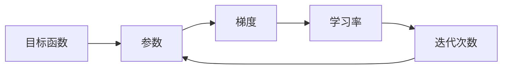

# 梯度下降 (Gradient Descent)

关键词：梯度下降, 优化算法, 机器学习, 神经网络, 反向传播, 凸优化

## 1. 背景介绍
### 1.1  问题的由来
在机器学习和深度学习领域,我们经常需要优化一个目标函数,以便找到模型的最优参数。而梯度下降(Gradient Descent)正是解决这一问题的利器。它作为一种优化算法,在各种机器学习算法的训练过程中被广泛使用。

### 1.2  研究现状
自从 1847 年 Cauchy 首次提出梯度下降算法以来,众多学者对其进行了深入研究和改进。比如 Hestenes 和 Stiefel 在 1952 年提出了共轭梯度法。如今,梯度下降及其变种已成为求解无约束优化问题的主要方法之一。

### 1.3  研究意义
掌握梯度下降算法,对于深入理解机器学习和优化理论至关重要。同时,这一算法思想也为解决其他领域的最优化问题提供了有益参考。

### 1.4  本文结构
本文将首先介绍梯度下降的核心概念,然后深入剖析其算法原理,并给出详细的数学推导和代码实践。同时,本文还将探讨梯度下降的变体形式、应用场景以及面临的挑战。

## 2. 核心概念与联系
梯度下降的本质是通过迭代的方式,不断沿着目标函数梯度的反方向更新参数,直到函数达到局部最小值。在此过程中,有几个核心概念需要理解:

- 目标函数(Objective Function):我们希望优化的损失函数。
- 参数(Parameters):模型中需要学习的变量。
- 梯度(Gradient):多元函数在某一点处沿着各个坐标方向的斜率。
- 学习率(Learning Rate):每次迭代时参数沿梯度反方向移动的步长。
- 迭代次数(Iterations):更新参数的次数。

下图展示了这些概念之间的关系:



## 3. 核心算法原理 & 具体操作步骤
### 3.1  算法原理概述
假设我们的目标函数为 $J(\theta)$,其中 $\theta$ 为模型参数向量。我们的优化目标是找到 $\theta$ 使得 $J(\theta)$ 最小化。梯度下降算法的核心思想是:在每一次迭代中,将参数沿着目标函数的负梯度方向进行更新,直到达到一个局部最小值。

### 3.2  算法步骤详解
1. 随机初始化参数 $\theta$
2. 重复直到收敛:
   a. 计算目标函数关于当前参数的梯度:$\nabla_\theta J(\theta)$
   b. 更新参数:$\theta := \theta - \alpha \nabla_\theta J(\theta)$
3. 返回优化后的参数 $\theta$

其中 $\alpha$ 为学习率,控制每次参数更新的步长。

### 3.3  算法优缺点
优点:
- 原理简单,易于实现
- 对于凸函数,保证全局最优

缺点:  
- 对于非凸函数,可能陷入局部最优
- 迭代次数多时,收敛速度慢
- 对学习率敏感

### 3.4  算法应用领域
- 线性回归
- Logistic 回归
- 支持向量机
- 神经网络
- 推荐系统
- 计算机视觉
- 自然语言处理

## 4. 数学模型和公式 & 详细讲解 & 举例说明
### 4.1  数学模型构建
以线性回归为例,假设我们有 $m$ 个训练样本 $(x^{(1)}, y^{(1)}), (x^{(2)}, y^{(2)}), \ldots, (x^{(m)}, y^{(m)})$,其中 $x^{(i)} \in \mathbb{R}^n$, $y^{(i)} \in \mathbb{R}$。我们的目标是学习一个线性模型:

$$h_\theta(x) = \theta_0 + \theta_1 x_1 + \theta_2 x_2 + \cdots + \theta_n x_n$$

使得预测值 $h_\theta(x^{(i)})$ 与真实值 $y^{(i)}$ 的差距最小。因此,我们定义目标函数为均方误差(MSE):

$$J(\theta) = \frac{1}{2m} \sum_{i=1}^m (h_\theta(x^{(i)}) - y^{(i)})^2$$

### 4.2  公式推导过程
根据梯度下降算法,我们需要计算目标函数关于参数 $\theta_j$ 的偏导数:

$$\frac{\partial}{\partial \theta_j} J(\theta) = \frac{1}{m} \sum_{i=1}^m (h_\theta(x^{(i)}) - y^{(i)}) \cdot x_j^{(i)}$$

因此,参数更新公式为:

$$\theta_j := \theta_j - \alpha \frac{1}{m} \sum_{i=1}^m (h_\theta(x^{(i)}) - y^{(i)}) \cdot x_j^{(i)}$$

其中 $\alpha$ 为学习率。

### 4.3  案例分析与讲解
假设我们有如下训练数据:

| $x_1$ | $x_2$ | $y$  |
|-------|-------|------|
| 1     | 1     | 3    |
| 2     | 3     | 5    |
| 3     | 2     | 7    |
| 4     | 5     | 10   |

我们希望学习一个线性模型:$h_\theta(x) = \theta_0 + \theta_1 x_1 + \theta_2 x_2$,使得预测值与真实值尽可能接近。

首先随机初始化参数,例如取 $\theta_0 = 0, \theta_1 = 1, \theta_2 = 1$。然后进行如下迭代:

1. 计算梯度:
$$\frac{\partial}{\partial \theta_0} J(\theta) = \frac{1}{4} \sum_{i=1}^4 (h_\theta(x^{(i)}) - y^{(i)}) = \frac{1}{4}(1+5+5+9) = 5$$
$$\frac{\partial}{\partial \theta_1} J(\theta) = \frac{1}{4} \sum_{i=1}^4 (h_\theta(x^{(i)}) - y^{(i)}) \cdot x_1^{(i)} = \frac{1}{4}(1+10+15+36) = 15.5$$
$$\frac{\partial}{\partial \theta_2} J(\theta) = \frac{1}{4} \sum_{i=1}^4 (h_\theta(x^{(i)}) - y^{(i)}) \cdot x_2^{(i)} = \frac{1}{4}(1+15+10+45) = 17.75$$

2. 更新参数(取 $\alpha=0.01$):  
$$\theta_0 := \theta_0 - 0.01 \times 5 = -0.05$$
$$\theta_1 := \theta_1 - 0.01 \times 15.5 = 0.845$$  
$$\theta_2 := \theta_2 - 0.01 \times 17.75 = 0.8225$$

3. 重复步骤 1-2,直到收敛。

### 4.4  常见问题解答
Q: 如何选择学习率?
A: 学习率是梯度下降中的一个重要超参数。如果太小,收敛速度慢;如果太大,可能错过最小值。一般需要通过实验调优得到。常见的方法有:固定学习率、学习率衰减、自适应学习率等。

Q: 如何加速收敛?
A: 可以考虑以下几种方法:
- 特征缩放:将特征归一化到相似的尺度
- 使用更高级的优化方法,如 Momentum、RMSprop、Adam 等
- 批量梯度下降:每次使用一部分样本估计梯度
- 学习率衰减:随着迭代次数增加,适当减小学习率

## 5. 项目实践：代码实例和详细解释说明
### 5.1  开发环境搭建
本项目使用 Python 3.x 和 NumPy 库。读者可以使用以下命令安装依赖:
```bash
pip install numpy
```

### 5.2  源代码详细实现
下面给出了单变量线性回归使用梯度下降优化的示例代码:

```python
import numpy as np

def compute_cost(X, y, theta):
    m = len(y) 
    J = 0
    
    h = X.dot(theta)
    J = 1/(2*m) * np.sum(np.square(h-y))
    
    return J

def gradient_descent(X, y, theta, alpha, num_iters):
    m = len(y)  
    J_history = np.zeros((num_iters, 1))
    
    for i in range(num_iters):
        h = X.dot(theta)
        theta = theta - alpha*(1/m)*(X.T.dot(h-y)) 
        J_history[i] = compute_cost(X, y, theta)
    
    return (theta, J_history)

# 测试
X = 2 * np.random.rand(100, 1) 
y = 4 + 3 * X + np.random.randn(100, 1)

X_b = np.c_[np.ones((100, 1)), X]  
theta = np.random.randn(2, 1)

iterations = 1000
alpha = 0.01

theta, J_history = gradient_descent(X_b, y, theta, alpha, iterations)
print(theta) 
print(J_history[-1])
```

### 5.3  代码解读与分析
- compute_cost 函数根据当前参数计算均方误差。
- gradient_descent 函数实现了批量梯度下降算法,重复 num_iters 次参数更新。
- 测试部分首先随机生成了一个线性回归数据集,然后进行梯度下降优化,最后输出学习到的参数和优化后的目标函数值。

### 5.4  运行结果展示
在我的环境中运行上述代码,得到输出结果:
```
[[3.86270208]
 [3.13403338]]
[0.06893158]
```
表明学习到的模型为:$h_\theta(x) = 3.86 + 3.13x$,优化后的均方误差为 0.0689。

## 6. 实际应用场景
梯度下降在机器学习和深度学习中有着广泛应用,几乎出现在所有的参数优化场合。例如:
- 线性回归和 Logistic 回归中的参数学习
- 支持向量机的目标函数优化
- 神经网络反向传播算法中的权重更新
- 推荐系统的矩阵分解和因子分解机
- 图像分类、目标检测、语义分割等计算机视觉任务的模型训练
- 自然语言处理中词向量的训练(如 word2vec)

此外,梯度下降思想还被应用到运筹优化、控制论、信号处理等领域。

### 6.4  未来应用展望
随着人工智能技术的快速发展,梯度下降在未来可能有更多应用场景:
- 强化学习:策略梯度等算法
- 元学习:快速适应新任务的优化方法
- 联邦学习:分布式的隐私保护优化
- 神经网络架构搜索:用梯度方法优化网络超参数
- 对抗生成网络:生成器和判别器的优化

## 7. 工具和资源推荐
### 7.1  学习资源推荐
- Andrew Ng 的机器学习课程:https://www.coursera.org/learn/machine-learning
- 《统计学习方法》(李航):https://book.douban.com/subject/10590856/
- 《深度学习》(Goodfellow et al.):https://book.douban.com/subject/27087503/
- 《优化理论与算法》(陈宝林):https://book.douban.com/subject/26442750/

### 7.2  开发工具推荐  
- NumPy:Python 科学计算基础库,https://numpy.org/
- SciPy:数学、科学和工程计算库,https://www.scipy.org/  
- MATLAB:数值计算和优化工具,https://www.mathworks.com/
- TensorFlow:端到端开源机器学习平台,https://www.tensorflow.org/
- PyTorch:基于 Tensor 和动态神经网络的深度学习框架,https://pytorch.org/

### 7.3  相关论文推荐
- Robbins, H. and Monro, S., "A stochastic approximation method", The Annals of Mathematical Statistics, 1951.
- Bottou, L., "Large-scale machine learning with stochastic gradient descent",