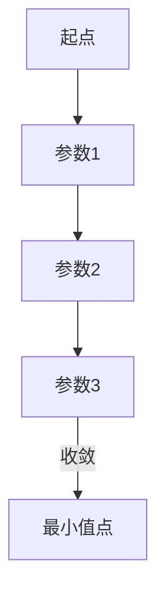

# 梯度下降(Gradient Descent) - 原理与代码实例讲解

关键词：梯度下降、优化算法、机器学习、深度学习、数学建模、Python实现

## 1. 背景介绍
### 1.1 问题的由来
在机器学习和深度学习领域,我们经常需要最小化一个目标函数(如损失函数)来寻找最优模型参数。梯度下降(Gradient Descent)作为一种简单有效的优化算法,在求解这类问题时被广泛应用。它通过迭代地调整参数,沿着目标函数梯度的反方向更新,最终收敛到一个局部最小值点。

### 1.2 研究现状
梯度下降算法由于其简单易实现、对问题适用性广等优点,一直是优化领域的研究热点。针对不同场景,学者们提出了多种改进版本,如随机梯度下降(SGD)、小批量梯度下降(Mini-batch GD)、动量法(Momentum)、自适应学习率算法(AdaGrad、RMSProp、Adam)等,进一步提升了算法的效率与性能。同时,梯度下降思想也被拓展应用到如深度学习、强化学习等前沿领域。

### 1.3 研究意义
深入理解梯度下降算法的原理和实现,对于掌握机器学习和优化理论具有重要意义。通过学习梯度下降,我们可以建立优化问题的数学模型,设计和改进相关算法,并将其应用到实际项目中去。此外,梯度下降也是理解其他高级优化算法(如牛顿法、拟牛顿法等)的基础。

### 1.4 本文结构
本文将从以下几方面对梯度下降算法展开详细讨论:

1. 介绍梯度下降的基本概念与数学原理
2. 推导相关的优化公式和迭代过程
3. 总结算法的优缺点、变种改进与应用领域
4. 给出基于Python的代码实例与讲解
5. 探讨梯度下降的实际应用场景、面临的挑战与未来发展趋势

## 2. 核心概念与联系

在讨论梯度下降算法之前,我们首先要了解几个核心概念:

- 目标函数(Objective function):需要被优化的函数,常见的如均方误差损失函数。
- 参数(Parameters):目标函数中的变量,通过调整参数来优化函数。
- 梯度(Gradient):多元函数在某点处的梯度是函数值变化最快的方向。
- 学习率(Learning rate):每次迭代时参数沿梯度反方向前进的步长。
- 迭代(Iteration):算法的一次参数更新过程。

梯度下降的基本思路是:先选取一组初始参数值,然后迭代地沿着目标函数的负梯度方向更新参数,直到函数值收敛到一个稳定的最小值。

下图展示了梯度下降在优化过程中参数的更新轨迹:



## 3. 核心算法原理 & 具体操作步骤
### 3.1 算法原理概述
假设我们的目标函数为$J(θ)$,其中$θ$是一个$n$维参数向量。梯度下降算法的目标是找到$θ$的值,使得$J(θ)$最小化。

算法从一个初始点$θ^{(0)}$开始,然后进行如下迭代更新:

$$θ^{(t+1)} = θ^{(t)} - α∇J(θ^{(t)})$$

其中$α$是学习率(步长),$∇J(θ^{(t)})$是$J(θ)$在$θ^{(t)}$处的梯度。这个更新过程会不断重复,直到达到某个停止条件(如迭代次数、梯度范数阈值等)。

### 3.2 算法步骤详解
梯度下降算法可分为以下5个关键步骤:

1. 初始化参数$θ$为$θ^{(0)}$
2. 计算当前位置的梯度$g^{(t)}=∇J(θ^{(t)})$
3. 根据梯度和学习率更新参数:$θ^{(t+1)} = θ^{(t)} - αg^{(t)}$
4. 判断是否满足停止条件,若不满足则回到步骤2
5. 输出最终的参数值$θ^{(t+1)}$作为最优解

### 3.3 算法优缺点
梯度下降算法的主要优点有:

- 原理简单,易于实现
- 对于凸函数,能够保证全局收敛
- 计算资源占用小,适合大规模问题

但它也存在一些局限性:

- 对非凸函数,可能收敛到局部最优点
- 迭代次数多时,收敛速度可能较慢
- 对学习率和初值的选择较为敏感

### 3.4 算法应用领域
梯度下降算法在机器学习和优化领域有着广泛应用,典型的场景包括:

- 线性回归与逻辑回归模型的参数估计
- 支持向量机(SVM)的训练优化
- 神经网络与深度学习模型的训练
- 矩阵分解与协同过滤算法中的损失函数优化
- 图像处理与计算机视觉中的模型优化
- 自然语言处理与推荐系统领域的相关任务

## 4. 数学模型和公式 & 详细讲解 & 举例说明
### 4.1 数学模型构建
我们以一个简单的线性回归问题为例,来推导梯度下降的数学模型。

假设有$m$个训练样本$(x^{(i)},y^{(i)}),i=1,2,...,m$,其中$x^{(i)}$是$n$维特征向量,$y^{(i)}$是标量。我们的目标是学习一个线性模型:

$$h_θ(x) = θ_0 + θ_1x_1 + θ_2x_2 + ... + θ_nx_n$$

使得预测值$h_θ(x^{(i)})$与真实值$y^{(i)}$的差距最小。

我们定义损失函数为均方误差(MSE):

$$J(θ) = \frac{1}{2m}\sum_{i=1}^m(h_θ(x^{(i)})-y^{(i)})^2$$

优化目标是找到参数$θ=(θ_0,θ_1,...,θ_n)^T$,最小化损失函数$J(θ)$。

### 4.2 公式推导过程
根据梯度下降算法,参数$θ$的更新公式为:

$$θ_j := θ_j - α\frac{∂J(θ)}{∂θ_j}, j=0,1,...,n$$

我们来推导$\frac{∂J(θ)}{∂θ_j}$的计算公式。

首先将$J(θ)$展开:

$$\begin{aligned}
J(θ) &= \frac{1}{2m}\sum_{i=1}^m(h_θ(x^{(i)})-y^{(i)})^2 \\
&= \frac{1}{2m}\sum_{i=1}^m(θ^Tx^{(i)}-y^{(i)})^2
\end{aligned}$$

对$θ_j$求偏导:

$$\begin{aligned}
\frac{∂J(θ)}{∂θ_j} &= \frac{1}{m}\sum_{i=1}^m(θ^Tx^{(i)}-y^{(i)})x_j^{(i)} \\
&= \frac{1}{m}\sum_{i=1}^m(h_θ(x^{(i)})-y^{(i)})x_j^{(i)}
\end{aligned}$$

将偏导数代入更新公式,得到梯度下降的迭代过程:

$$θ_j := θ_j - \frac{α}{m}\sum_{i=1}^m(h_θ(x^{(i)})-y^{(i)})x_j^{(i)}, j=0,1,...,n$$

### 4.3 案例分析与讲解
下面我们用一个具体的数值例子来演示梯度下降算法的计算过程。

假设有3个训练样本:

$$(x^{(1)},y^{(1)})=(1,4),(x^{(2)},y^{(2)})=(2,7),(x^{(3)},y^{(3)})=(3,10)$$

我们要学习一个简单的线性模型:$h_θ(x)=θ_0+θ_1x$。

初始化参数为$θ=(0,0)^T$,学习率$α=0.01$。根据更新公式:

$$\begin{aligned}
θ_0 &:= θ_0 - \frac{α}{3}\sum_{i=1}^3(h_θ(x^{(i)})-y^{(i)}) \\
θ_1 &:= θ_1 - \frac{α}{3}\sum_{i=1}^3(h_θ(x^{(i)})-y^{(i)})x^{(i)}
\end{aligned}$$

经过一次迭代后,得到:

$$\begin{aligned}
θ_0 &= 0 - \frac{0.01}{3}[(-4)+(-7)+(-10)] = 0.07 \\
θ_1 &= 0 - \frac{0.01}{3}[(-4)×1+(-7)×2+(-10)×3] = 0.12
\end{aligned}$$

重复迭代上述过程,最终在若干次迭代后,参数$θ$会收敛到最优解。

### 4.4 常见问题解答
**Q:** 梯度下降对学习率的选择有什么要求?

**A:** 学习率$α$的选择很关键,太小会导致收敛速度慢,太大可能会造成震荡甚至发散。一般需要通过实验和经验来调试,常见的选择如0.1、0.01、0.001等。此外,学习率也可以随着迭代次数动态调整,如衰减策略。

**Q:** 如何判断梯度下降是否收敛?

**A:** 可以设置一些停止条件,如:

- 达到最大迭代次数
- 损失函数值的变化小于某个阈值
- 参数的变化范数小于某个阈值
- 梯度的范数小于某个阈值

实践中可根据具体问题选择合适的收敛判据。

**Q:** 梯度下降的改进版本有哪些?

**A:** 针对梯度下降的缺陷,研究者提出了许多改进算法,如:

- 随机梯度下降(SGD):每次迭代随机选择一个样本来更新参数
- 小批量梯度下降(Mini-batch GD):每次选择一个小批量的样本更新
- 动量法(Momentum):引入动量项,加速收敛并减少震荡
- AdaGrad:自适应调整每个参数的学习率
- RMSProp:结合动量法和AdaGrad的优点
- Adam:自适应估计一阶和二阶矩(动量),平衡了快速收敛和参数调节的需求

实际应用中可根据任务特点和资源限制,灵活选用不同的优化器。

## 5. 项目实践：代码实例和详细解释说明
### 5.1 开发环境搭建
我们使用Python 3和Numpy库来实现梯度下降算法,并用Matplotlib进行可视化。建议的开发环境配置:

- Python 3.7+
- Numpy 1.18+
- Matplotlib 3.2+

可以通过Anaconda或pip来安装所需库:

```bash
conda create -n gd python=3.7 
conda activate gd
conda install numpy matplotlib
```

### 5.2 源代码详细实现
下面是用Python实现的梯度下降算法代码,我们以线性回归为例:

```python
import numpy as np
import matplotlib.pyplot as plt

def gradient_descent(X, y, theta, alpha, num_iters):
    """梯度下降算法
    
    参数:
        X: 输入特征矩阵, shape=(m,n) 
        y: 输出标签向量, shape=(m,)
        theta: 参数向量, shape=(n,)
        alpha: 学习率
        num_iters: 迭代次数
        
    返回:
        theta: 学习后的参数向量
        J_history: 每次迭代的损失函数值列表
    """
    m = len(y)
    J_history = []
    
    for i in range(num_iters):
        h = X.dot(theta)
        errors = h - y
        gradient = X.T.dot(errors) / m
        theta -= alpha * gradient
        J_history.append(compute_cost(X, y, theta))
    
    return theta, J_history

def compute_cost(X, y, theta):
    """计算损失函数(MSE)