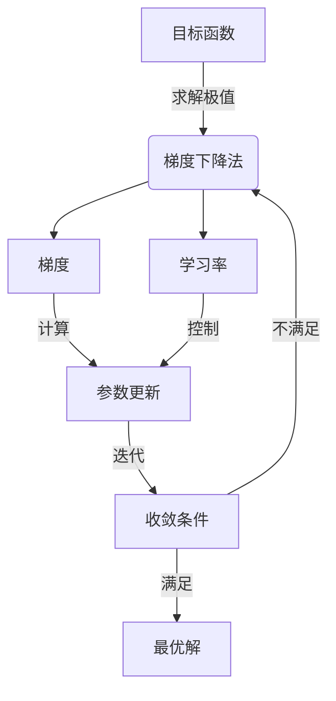

好的,我会按照您提供的要求和结构模板,尽力撰写一篇高质量的技术博客文章。这里是正文部分:

# 梯度下降法原理与代码实战案例讲解

## 1. 背景介绍

### 1.1 问题的由来

在机器学习和数据挖掘领域,很多问题都可以归结为一个优化问题,即在给定的约束条件下,寻找一个最优解,使目标函数达到极小值或极大值。比如在线性回归、逻辑回归等监督学习算法中,我们需要找到一个最优的模型参数组合,使得预测值与真实值之间的差异最小。在无监督学习中,如聚类分析、主成分分析等,也需要优化某个目标函数。因此,高效的优化算法对于机器学习和数据挖掘任务来说至关重要。

梯度下降是一种常用的优化算法,它通过不断地沿着目标函数梯度下降的方向更新参数,最终达到函数的极小值。由于其简单高效、易于理解和实现,梯度下降法被广泛应用于各种机器学习算法中。

### 1.2 研究现状  

梯度下降法最早可以追溯到17世纪,当时被用于求解最速下降曲线的问题。19世纪,梯度下降法被推广到多元函数的优化。20世纪50年代,随着计算机的发展,梯度下降法在数值计算中得到广泛应用。进入21世纪以来,梯度下降法成为机器学习和深度学习领域中最常用的优化算法之一。

目前,梯度下降法主要有三种变种:批量梯度下降(Batch Gradient Descent)、随机梯度下降(Stochastic Gradient Descent)和小批量梯度下降(Mini-Batch Gradient Descent)。不同的变种在计算效率、收敛速度和内存占用上各有特点。

此外,为了提高梯度下降法的性能,研究人员也提出了许多改进方法,如动量梯度下降、RMSProp、Adagrad、Adadelta、Adam等自适应学习率优化算法。这些改进算法主要针对学习率的设置、梯度的更新方式等方面进行了优化,以期获得更快的收敛速度和更好的优化性能。

### 1.3 研究意义

梯度下降法作为一种简单高效的优化算法,在机器学习和深度学习等领域有着广泛的应用。掌握梯度下降法的原理和实现方式,对于理解和应用诸如线性回归、逻辑回归、神经网络等算法模型至关重要。

此外,研究梯度下降法及其改进算法,不仅可以提高机器学习模型的训练效率和性能,更能深入理解优化算法的本质,为设计新的优化算法奠定基础。

### 1.4 本文结构  

本文将全面介绍梯度下降法的原理、数学模型以及在实际项目中的应用。

首先阐述梯度下降法的核心概念,包括目标函数、梯度、学习率等,并分析它们之间的关系。

其次详细讲解梯度下降法的具体算法步骤,包括基本原理、不同变种及其优缺点分析。

再次推导梯度下降法的数学模型,并结合实例对公式进行解释说明。

接着通过代码实战案例,展示如何使用Python等编程语言实现梯度下降法,并对关键代码模块进行解读和分析。

最后总结梯度下降法在实际应用中的场景,介绍相关的学习资源和开发工具,并对未来的发展趋势和挑战进行展望。

## 2. 核心概念与联系

梯度下降法的核心思想是通过不断迭代,朝着能够最小化目标函数值的方向更新参数,最终收敛到函数的极小值点,从而得到最优解。

其中涉及到以下几个关键概念:

1. **目标函数(Objective Function)**: 需要优化的函数,通常是我们想要最小化或最大化的损失函数或代价函数。

2. **梯度(Gradient)**: 目标函数在当前点处的导数,指示目标函数值最小的方向。梯度的计算对于确定参数更新的方向至关重要。

3. **学习率(Learning Rate)**: 控制每次参数更新的步长,太大可能导致发散,太小则收敛速度变慢。合理设置学习率对算法的收敛性能有重要影响。

4. **参数更新(Parameter Update)**: 根据当前梯度值和学习率,沿着梯度下降的方向更新参数,使目标函数值不断减小。

5. **收敛条件(Convergence Condition)**: 设置算法终止的条件,如目标函数值小于阈值、梯度值接近0或迭代次数达到上限等。

这些概念之间密切相关,相互影响,共同决定了梯度下降法的性能表现。合理设置目标函数、计算精确的梯度、选择合适的学习率策略以及设置适当的收敛条件,是保证梯度下降法高效收敛的关键。

## 3. 核心算法原理与具体操作步骤

### 3.1 算法原理概述

梯度下降法的基本原理是沿着目标函数的负梯度方向，以一定的步长不断更新参数，使目标函数的值不断减小，最终收敛到极小值点。

具体来说，假设我们有一个待优化的目标函数 $J(\theta)$，其中 $\theta$ 是参数向量。算法的目标是找到一组最优参数 $\theta^*$，使得目标函数达到最小值：

$$
\theta^* = \arg\min_\theta J(\theta)
$$

在每一次迭代中，我们计算目标函数在当前参数点 $\theta_t$ 处的梯度 $\nabla J(\theta_t)$，然后沿着负梯度方向更新参数：

$$
\theta_{t+1} = \theta_t - \eta \nabla J(\theta_t)
$$

其中 $\eta$ 是学习率或步长，控制每次更新的幅度。较大的学习率可以加快收敛速度，但也可能导致发散；较小的学习率则收敛慢，但更容易收敛到局部最优解。

重复上述过程，直到满足某个停止条件，如梯度接近于0或迭代次数达到上限等。最终得到的参数 $\theta^*$ 即为目标函数的(局部)极小值点。

### 3.2 算法步骤详解

梯度下降算法的具体步骤如下：

1. **初始化参数**：首先随机初始化参数向量 $\theta_0$。

2. **计算目标函数值**：在当前参数 $\theta_t$ 处计算目标函数值 $J(\theta_t)$。

3. **计算梯度**：计算目标函数在当前参数 $\theta_t$ 处的梯度 $\nabla J(\theta_t)$。

4. **更新参数**：沿着负梯度方向，根据学习率 $\eta$ 更新参数：
   $$\theta_{t+1} = \theta_t - \eta \nabla J(\theta_t)$$

5. **检查收敛条件**：判断是否满足停止条件，如梯度接近0、目标函数值小于阈值或迭代次数达到上限等。如果满足则终止迭代，否则回到步骤2，继续迭代。

6. **输出结果**：当算法收敛时，输出最终的参数 $\theta^*$ 作为目标函数的(局部)极小值点。

需要注意的是，梯度下降法容易陷入局部最优解。此外，对于高维复杂的目标函数，梯度计算可能非常耗时。因此在实际应用中，通常会采用一些变种算法，如随机梯度下降、小批量梯度下降等，以提高计算效率和收敛性能。

### 3.3 算法优缺点

**优点**：

1. **简单高效**：梯度下降法的原理简单直观，算法实现也相对简单，计算效率较高。

2. **无需计算高阶导数**：只需计算一阶梯度，避免了高阶导数的复杂计算。

3. **可处理大规模数据**：通过随机梯度下降等变种，可以有效处理大规模数据集。

4. **可解释性强**：优化路径符合人类的直觉，便于理解和分析。

**缺点**：

1. **可能陷入局部最优**：容易收敛到局部极小值点，无法找到全局最优解。

2. **收敛速度慢**：在接近极小值点时，收敛速度会变得非常缓慢。

3. **需手动设置学习率**：学习率的选择对收敛性能影响很大，需要一定经验进行调参。

4. **对初始值敏感**：不同的初始参数值可能导致收敛到不同的局部最优解。

5. **梯度计算复杂**：对于高维复杂的目标函数，梯度计算可能非常耗时。

6. **无法处理约束优化**：标准梯度下降法无法直接处理带有约束条件的优化问题。

### 3.4 算法应用领域

梯度下降法及其变种广泛应用于机器学习、深度学习、信号处理、计算机视觉等领域，用于训练各种模型和优化目标函数。主要应用场景包括：

1. **线性回归**：使用梯度下降法求解线性回归模型的最小二乘参数估计。

2. **逻辑回归**：通过梯度下降法最小化逻辑回归模型的对数似然损失函数。

3. **神经网络训练**：反向传播算法中使用梯度下降法优化神经网络的权重和偏置参数。

4. **支持向量机**：利用梯度下降法求解支持向量机的对偶型优化问题。

5. **主成分分析**：使用梯度下降法估计主成分方向和投影。

6. **聚类分析**：通过梯度下降法最小化聚类目标函数，如K-Means的平方和误差。

7. **推荐系统**：在协同过滤等推荐算法中使用梯度下降法优化评分预测模型。

8. **信号处理**：用于自适应滤波器、波束形成等信号处理任务的参数优化。

9. **计算机视觉**：在图像分类、目标检测等视觉任务中优化深度神经网络模型。

10. **自然语言处理**：训练词向量模型、序列模型等自然语言处理模型。

总的来说，梯度下降法是一种通用的优化算法，只要涉及需要优化目标函数的问题，都可以尝试使用梯度下降法及其变种算法进行求解。

## 4. 数学模型和公式详细讲解与举例说明

### 4.1 数学模型构建

在构建梯度下降法的数学模型之前，我们首先需要定义一个待优化的目标函数 $J(\theta)$，其中 $\theta$ 是模型的参数向量。目标函数可以是机器学习中的损失函数、代价函数或者其他需要优化的函数。

对于监督学习问题，我们通常使用平方误差代价函数或交叉熵损失函数等。以线性回归为例，平方误差代价函数可以表示为：

$$J(\theta) = \frac{1}{2m}\sum_{i=1}^m(h_\theta(x^{(i)}) - y^{(i)})^2$$

其中 $m$ 是训练样本数量，$x^{(i)}$ 是第 $i$ 个训练样本的特征向量，$y^{(i)}$ 是对应的标签值，$h_\theta(x)$ 是线性回归模型的预测函数。

对于无监督学习问题，如聚类分析，我们可以定义目标函数为样本到其所属簇中心的距离之和。以 K-Means 聚类为例，目标函数可以写为：

$$J(\theta) = \sum_{i=1}^m\sum_{k=1}^Kr_{ik}\left\lVert x^{(i)} - \mu_k\right\rVert^2$$

其中 $m$ 是样本数量，$K$ 是簇的