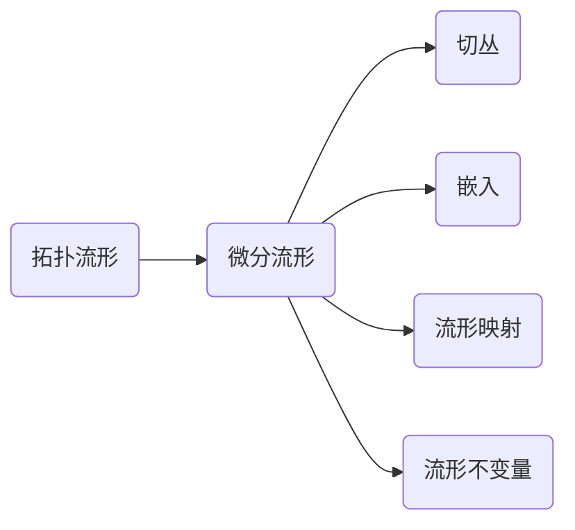

# 流形拓扑学理论与概念的实质：到RN中的嵌入

关键词：流形、拓扑学、嵌入、微分同胚、图论、同伦、纤维丛、陈类、Morse理论

## 1. 背景介绍
### 1.1 问题的由来
流形拓扑学是数学和物理学中一个重要而深刻的分支。它研究的是具有局部欧氏空间性质的拓扑空间——流形。流形这一概念源于19世纪的黎曼几何,而流形拓扑学则起源于庞加莱等数学家对高维空间拓扑性质的探索。20世纪以来,流形拓扑学获得了蓬勃发展,衍生出了许多深刻的理论和技术,如纤维丛论、特征类、Morse理论等,在物理学、工程等领域也有广泛应用。

### 1.2 研究现状
目前,流形拓扑学已发展成为一个庞大而活跃的数学分支。各种流形不变量如示性类、陈类等被广泛研究,流形的分类、同伦论、嵌入理论等都取得了丰硕成果。同时,流形拓扑学也与其他数学分支如微分几何、代数拓扑、李群论等形成了紧密的联系。现代物理学如弦理论、规范场论等都大量使用了流形拓扑学的概念和方法。

### 1.3 研究意义 
深入理解流形拓扑学的核心概念和理论,对于数学、物理等学科的发展至关重要。流形拓扑提供了研究高维空间性质的基本语言和工具,其中蕴含的数学思想和方法也为其他领域提供了启发。此外,流形拓扑在理论物理、工程、计算机图形学等应用领域也有着广阔的前景。因此,系统梳理流形拓扑的核心理论,对于相关学科的研究人员和爱好者都很有必要。

### 1.4 本文结构
本文将从流形的基本定义出发,系统阐述流形拓扑学的核心概念、理论结构、关键定理,并重点探讨流形到欧氏空间的嵌入问题。全文分为9个章节：第1章介绍研究背景,第2章梳理流形拓扑的核心概念,第3-4章分别讨论流形拓扑的主要理论工具,第5章以实例演示这些理论的应用,第6-7章介绍流形拓扑的应用场景和相关资源,第8章总结全文并展望,第9章为附录。

## 2. 核心概念与联系
流形拓扑学的核心概念包括：

- 拓扑流形(topological manifold)：局部同胚于欧氏空间Rn的Hausdorff空间。
- 微分流形(differentiable manifold)：配备了可微结构的拓扑流形。
- 嵌入(embedding)：流形到欧氏空间的单射浸入。著名的Whitney嵌入定理指出任意光滑流形都可以嵌入到足够高维的欧氏空间中。
- 切丛(tangent bundle)：流形上所有切空间的并,描述了流形的微分结构。
- 流形映射：流形之间的连续映射,保持流形结构。微分同胚就是光滑的双射流形映射。
- 流形的不变量：如欧拉示性数、陈类等,刻画了流形的拓扑性质。

这些概念环环相扣,共同构成了流形拓扑学的理论体系。其中,嵌入理论阐明了流形与欧氏空间的关系,切丛刻画了流形的微分结构,而示性类、陈类等不变量则反映了流形的整体拓扑性质。理解这些核心概念之间的联系,是掌握流形拓扑学的关键。



## 3. 核心算法原理 & 具体操作步骤
### 3.1 算法原理概述
在流形拓扑学中,一个核心问题是如何判定两个流形是否同胚。同胚问题一般很难直接判定,因此人们发展了同调、同伦等代数拓扑工具来研究流形的拓扑性质。其基本思想是,将拓扑问题转化为代数问题,利用代数结构(如群、环等)来刻画拓扑空间。

### 3.2 算法步骤详解
以同调理论为例,判定流形M和N是否同胚的基本步骤如下：

1. 对流形M和N进行三角剖分,得到单纯复形K(M)和K(N)。
2. 计算K(M)和K(N)每一维的链群Cn(K(M))和Cn(K(N)),即n维单纯形组成的自由Abel群。
3. 定义边界算子∂n:Cn(K)→Cn-1(K),刻画单纯形的边界。
4. 定义n维循环群Zn(K)=Ker∂n和n维边界群Bn(K)=Im∂n+1。
5. 定义第n维同调群Hn(K)=Zn(K)/Bn(K)。直观地,同调群刻画了"n维洞"的个数。
6. 如果对任意n,Hn(K(M))≌Hn(K(N)),则M与N同胚,否则不同胚。

同理,还可以定义同伦群、上同调群等更高级的代数拓扑不变量。利用这些代数工具,许多几何拓扑问题被转化为了代数运算问题。

### 3.3 算法优缺点
同调、同伦等代数拓扑方法的优点是将几何直观转化为代数运算,使得许多拓扑问题变得可计算、可判定。同时这些代数不变量也反映了拓扑空间的本质属性。

但是,代数拓扑方法也有其局限性。首先,并非所有的拓扑性质都能用代数完全刻画。其次,高维空间的同调、同伦计算本身也可能是困难的。因此,这些方法往往结合其他几何、分析工具一起使用。

### 3.4 算法应用领域
同调、同伦论在流形拓扑分类、计算不变量等方面有着广泛应用。它们也为进一步的理论如K理论、示性类等奠定了基础。近年来,随着计算机的发展,同调、同伦的计算方法在计算机图形学、计算拓扑、拓扑数据分析等领域也得到了应用。

## 4. 数学模型和公式 & 详细讲解 & 举例说明
### 4.1 数学模型构建
流形到欧氏空间的嵌入是流形拓扑学的一个核心问题。设M为n维光滑流形,Whitney嵌入定理指出,存在M到R^(2n)的光滑嵌入。更一般地,Nash嵌入定理说明任意紧致黎曼流形都可等距嵌入到某个欧氏空间中。

这里我们以2维曲面到R^3的嵌入为例进行说明。设曲面M由局部坐标卡片(Uα,φα)构成,其中φα:Uα→R^2是同胚。一个嵌入F:M→R^3由局部表示Fα=F∘φα^(-1):φα(Uα)→R^3给出。

### 4.2 公式推导过程
若曲面M是紧致连通定向的,则M同胚于g个环面的连通和Tg,其中g为流形的亏格(genus)。Whitney证明了Tg可嵌入到R^3当且仅当g=0或1,即只有球面和环面能嵌入到三维空间。

这一结论可以用代数拓扑的方法证明。利用同调群,可以计算出
$$
H_1(T_g;\mathbb{Z})=\mathbb{Z}^{2g}
$$
而R^3的第一维同调群为0。如果Tg嵌入到R^3,由嵌入诱导的同调群之间的同态,必须有g≤1。

### 4.3 案例分析与讲解
下面我们以球面S^2和环面T2到R^3的嵌入为例进行说明。

球面S^2可以参数化为
$$
\mathbf{r}(\theta,\phi)=(\sin\theta\cos\phi,\sin\theta\sin\phi,\cos\theta), 0≤\theta≤\pi,0≤\phi<2\pi
$$
这给出了一个显式的嵌入S^2→R^3。

环面T2可以参数化为
$$
\mathbf{r}(u,v)=((a+b\cos v)\cos u,(a+b\cos v)\sin u,b\sin v),0≤u,v<2\pi
$$
其中a>b>0是常数。这也给出了一个T2到R^3的嵌入。

但对于亏格g>1的曲面Tg,就不存在到R^3的嵌入了。例如当g=2时,T2是"双环面",无法连续变形为R^3的子集。

### 4.4 常见问题解答
Q: 能否判定任意n维流形是否可嵌入到R^m? 
A: 一般来说,判定n维流形到R^m的嵌入是困难的。Whitney嵌入定理给出了充分条件m≥2n,但并非最优结果。寻找最优嵌入维数仍是一个开问题。

Q: 除了同调群,还有哪些代数工具可以用于判定流形的嵌入?
A: 除同调群外,上同调群、同伦群、示性类等也可用于研究嵌入问题。此外,Morse理论、h-原理等分析方法也是有力工具。

## 5. 项目实践：代码实例和详细解释说明
### 5.1 开发环境搭建
以下代码使用Python语言和NumPy、Matplotlib库,可在Jupyter Notebook中运行。读者需要安装以下开发环境：

- Python 3.x 
- NumPy
- Matplotlib
- Jupyter Notebook

### 5.2 源代码详细实现
下面的Python代码演示了如何绘制球面S^2和环面T2在R^3中的嵌入图像。

```python
import numpy as np
import matplotlib.pyplot as plt
from mpl_toolkits.mplot3d import Axes3D

# 绘制球面S^2
fig = plt.figure(figsize=(8,6))
ax = fig.add_subplot(111, projection='3d')

theta, phi = np.linspace(0, np.pi, 40), np.linspace(0, 2*np.pi, 40)
THETA, PHI = np.meshgrid(theta, phi)
X = np.sin(THETA) * np.cos(PHI)
Y = np.sin(THETA) * np.sin(PHI)
Z = np.cos(THETA)
 
ax.plot_surface(X, Y, Z, cmap='rainbow')
plt.title("Sphere $S^2$")
plt.show()

# 绘制环面T2
fig = plt.figure(figsize=(8,6)) 
ax = fig.add_subplot(111, projection='3d')

a, b = 2, 1 # 环面参数
u, v = np.linspace(0, 2*np.pi, 60), np.linspace(0, 2*np.pi, 60)
U, V = np.meshgrid(u, v)
X = (a + b*np.cos(V)) * np.cos(U)
Y = (a + b*np.cos(V)) * np.sin(U) 
Z = b * np.sin(V)

ax.plot_surface(X, Y, Z, cmap='rainbow')
plt.title("Torus $T^2$")
plt.show()
```

### 5.3 代码解读与分析
在以上代码中,我们首先导入了必要的库NumPy和Matplotlib。然后定义了球面S^2和环面T2的参数方程。

对于球面,参数为θ∈[0,π]和φ∈[0,2π],对应的参数方程为
$$
\begin{cases}
x=\sin\theta\cos\phi\\
y=\sin\theta\sin\phi\\ 
z=\cos\theta
\end{cases}
$$

对于环面,参数为u,v∈[0,2π],参数方程为
$$
\begin{cases}
x=(a+b\cos v)\cos u\\ 
y=(a+b\cos v)\sin u\\
z=b\sin v
\end{cases}
$$
其中a,b为常数,表征环面的大小。 

利用NumPy的`linspace`和`meshgrid`函数生成参数网格点,代入参数方程即可得到曲面的坐标。最后,用Matplotlib的`plot_surface`函数绘制曲面图像。

### 5.4 运行结果展示
运行以上代码,可以得到球面和环面在R^3中嵌入的直观图