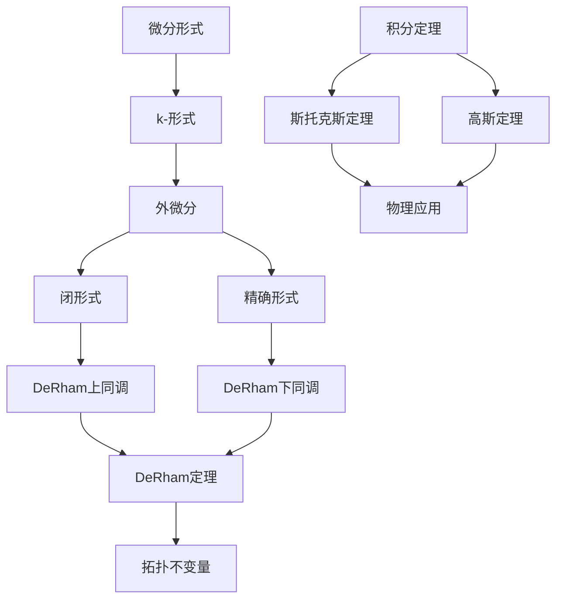

# 流形拓扑学：Rn中的微分形式

## 1. 背景介绍

### 1.1 问题的由来

在数学和物理学中,微分形式是一种广泛使用的数学工具,它可以描述许多自然现象和几何结构。微分形式的概念源于对向量场和标量场的研究,并在流形拓扑学、微分几何学、理论物理学等领域发挥着重要作用。

在欧几里得空间Rn中研究微分形式,是理解更高维流形上微分形式的基础。Rn中的微分形式不仅具有内在的几何意义,而且与向量场、外微分和斯托克斯定理等概念密切相关,是探索更深层数学结构的关键。

### 1.2 研究现状  

微分形式在数学和物理学中有着广泛的应用,例如:

- 电磁学中,电场和磁场可以用1-形式和2-形式表示。
- 流体力学中,流速场和涡量场分别对应1-形式和2-形式。  
- 热学中,热流密度场对应1-形式。
- 广义相对论中,Einstein方程组可以用微分形式紧凑地表达。

目前,微分形式的研究主要集中在以下几个方面:

1. 微分形式的代数运算及其性质。
2. 外微分算子及其性质,如闭形式、精确形式等。
3. 积分定理,如斯托克斯定理、潘珥纳引理等。
4. 流形上的微分形式及其在几何和物理中的应用。

### 1.3 研究意义

研究Rn中的微分形式,不仅可以帮助我们理解更一般的流形上的微分形式,而且对于掌握数学物理方程的几何表述、理解电磁场和流体力学等自然现象的本质都有重要意义。此外,微分形式理论为研究拓扑、几何和物理等领域奠定了坚实的数学基础。

### 1.4 本文结构

本文将从Rn中的微分形式出发,系统地介绍微分形式的基本概念、运算性质、外微分及其性质、积分定理,并结合具体例子对核心内容进行讲解。最后,我们将探讨微分形式在物理和几何中的应用,以及未来的发展方向和挑战。

## 2. 核心概念与联系

微分形式理论是一个庞大而精致的数学体系,其中包含了许多相互关联的核心概念。我们将从Rn中的情况出发,逐步建立这些概念,并揭示它们之间的内在联系。

上图展示了微分形式理论中的核心概念及其联系。我们将在接下来的章节中逐一介绍这些概念,并探讨它们在数学和物理中的应用。

## 3. 核心算法原理 & 具体操作步骤

### 3.1 算法原理概述

微分形式理论中的核心算法是外微分算子。外微分算子 $d$ 是一个从 $k$-形式到 $(k+1)$-形式的线性算子,它描述了微分形式在流形上的局部变化率。外微分算子具有以下重要性质:

1. $d^2 = 0$,即外微分的外微分为零。
2. 外微分保持线性性和可微性。

利用外微分算子,我们可以定义闭形式和精确形式等重要概念,并建立DeRham上同调和DeRham下同调等同调理论。这为研究流形的拓扑不变量奠定了基础。

### 3.2 算法步骤详解

在 $\mathbb{R}^n$ 中,对于一个 $k$-形式 $\omega$,其外微分 $d\omega$ 可以按照以下步骤计算:

1. 将 $\omega$ 表示为 $\sum_{i_1<\cdots<i_k}f_{i_1\cdots i_k}dx^{i_1}\wedge\cdots\wedge dx^{i_k}$ 的形式。
2. 对每一个系数 $f_{i_1\cdots i_k}$ 分别取全微分:
   $$
   df_{i_1\cdots i_k}=\sum_{j=1}^n\frac{\partial f_{i_1\cdots i_k}}{\partial x^j}dx^j
   $$
3. 将全微分 $df_{i_1\cdots i_k}$ 与 $dx^{i_1}\wedge\cdots\wedge dx^{i_k}$ 做外积,得到 $(k+1)$-形式的项。
4. 对所有这些项求和,即得到 $d\omega$:
   $$
   d\omega=\sum_{i_1<\cdots<i_k}\sum_{j=1}^n\frac{\partial f_{i_1\cdots i_k}}{\partial x^j}dx^j\wedge dx^{i_1}\wedge\cdots\wedge dx^{i_k}
   $$

通过迭代应用外微分算子,我们可以判断一个微分形式是否为闭形式或精确形式,并计算其DeRham上同调和DeRham下同调等同调不变量。

### 3.3 算法优缺点

外微分算子的优点在于:

1. 定义简单,计算方便。
2. 具有良好的代数性质,如 $d^2=0$。
3. 为研究流形的拓扑不变量提供了有力工具。

缺点是:

1. 计算过程可能会变得繁琐,尤其是在高维情况下。
2. 需要对微分形式和外代数有一定的数学基础。

### 3.4 算法应用领域

外微分算子及其相关概念在数学和物理学中有着广泛的应用:

- 拓扑学:用于计算流形的同调群、DeRham上同调和DeRham下同调等拓扑不变量。
- 微分几何学:研究流形上的微分形式及其性质,如闭形式、协形式等。
- 理论物理学:电磁学、广义相对论、规范场论等都可以用微分形式紧凑地表述。
- 数值分析:有限元方法、流体动力学等计算数值方法中使用微分形式。
- 代数几何:研究代数多样体上的微分形式及其性质。

## 4. 数学模型和公式 & 详细讲解 & 举例说明

### 4.1 数学模型构建

在 $\mathbb{R}^n$ 中,我们可以构建如下数学模型来描述微分形式:

对于 $\mathbb{R}^n$ 上的 $k$-形式 $\omega$,我们有:

$$
\omega=\sum_{i_1<\cdots<i_k}f_{i_1\cdots i_k}dx^{i_1}\wedge\cdots\wedge dx^{i_k}
$$

其中,系数 $f_{i_1\cdots i_k}$ 是 $\mathbb{R}^n$ 上的可微函数,称为 $\omega$ 的分量函数。$dx^{i_1}\wedge\cdots\wedge dx^{i_k}$ 是 $k$ 个基本1-形式的外积,称为 $\omega$ 的基本 $k$-矢量。

我们定义 $k$-形式空间 $\Omega^k(\mathbb{R}^n)$ 为所有 $k$-形式的集合,并赋予它向量空间的结构。在 $\Omega^k(\mathbb{R}^n)$ 上,我们可以定义加法和数乘,以及外微分算子 $d:\Omega^k(\mathbb{R}^n)\to\Omega^{k+1}(\mathbb{R}^n)$。

### 4.2 公式推导过程

我们来推导外微分算子 $d$ 在 $\mathbb{R}^n$ 上的具体表达式。

设 $\omega=\sum_{i_1<\cdots<i_k}f_{i_1\cdots i_k}dx^{i_1}\wedge\cdots\wedge dx^{i_k}\in\Omega^k(\mathbb{R}^n)$,我们希望找到一个 $(k+1)$-形式 $d\omega\in\Omega^{k+1}(\mathbb{R}^n)$,使得 $d\omega$ 描述了 $\omega$ 沿任意方向的局部变化率。

由于 $d\omega$ 应该是一个 $(k+1)$-形式,我们可以设它的一般形式为:

$$
d\omega=\sum_{i_1<\cdots<i_{k+1}}g_{i_1\cdots i_{k+1}}dx^{i_1}\wedge\cdots\wedge dx^{i_{k+1}}
$$

其中,系数 $g_{i_1\cdots i_{k+1}}$ 待确定。

为了找到 $g_{i_1\cdots i_{k+1}}$ 的表达式,我们利用外微分算子 $d$ 应当满足的性质:线性性和可微性。

由线性性,我们有:

$$
d\left(\sum_{i_1<\cdots<i_k}f_{i_1\cdots i_k}dx^{i_1}\wedge\cdots\wedge dx^{i_k}\right)=\sum_{i_1<\cdots<i_k}d\left(f_{i_1\cdots i_k}dx^{i_1}\wedge\cdots\wedge dx^{i_k}\right)
$$

由可微性,我们有:

$$
d\left(f_{i_1\cdots i_k}dx^{i_1}\wedge\cdots\wedge dx^{i_k}\right)=df_{i_1\cdots i_k}\wedge dx^{i_1}\wedge\cdots\wedge dx^{i_k}
$$

其中,

$$
df_{i_1\cdots i_k}=\sum_{j=1}^n\frac{\partial f_{i_1\cdots i_k}}{\partial x^j}dx^j
$$

将上式代入,我们得到:

$$
\begin{aligned}
d\omega&=\sum_{i_1<\cdots<i_k}\left(\sum_{j=1}^n\frac{\partial f_{i_1\cdots i_k}}{\partial x^j}dx^j\right)\wedge dx^{i_1}\wedge\cdots\wedge dx^{i_k}\\
&=\sum_{i_1<\cdots<i_k}\sum_{j=1}^n\frac{\partial f_{i_1\cdots i_k}}{\partial x^j}dx^j\wedge dx^{i_1}\wedge\cdots\wedge dx^{i_k}
\end{aligned}
$$

比较系数,我们可以得到:

$$
g_{i_1\cdots i_{k+1}}=\begin{cases}
\frac{\partial f_{i_2\cdots i_{k+1}}}{\partial x^{i_1}} & \text{if }i_1<i_2<\cdots<i_{k+1}\\
0 & \text{otherwise}
\end{cases}
$$

这就是外微分算子 $d$ 在 $\mathbb{R}^n$ 上的显式表达式。

### 4.3 案例分析与讲解

现在,我们来看一个具体的例子,计算 $\mathbb{R}^3$ 中的一个2-形式的外微分。

设 $\omega=f(x,y,z)dx\wedge dy\in\Omega^2(\mathbb{R}^3)$,我们要计算 $d\omega\in\Omega^3(\mathbb{R}^3)$。

根据前面的公式,我们有:

$$
\begin{aligned}
d\omega&=\frac{\partial f}{\partial x}dx\wedge dy\wedge dz+\frac{\partial f}{\partial y}dy\wedge dz\wedge dx+\frac{\partial f}{\partial z}dz\wedge dx\wedge dy\\
&=\left(\frac{\partial f}{\partial x}dx+\frac{\partial f}{\partial y}dy+\frac{\partial f}{\partial z}dz\right)\wedge dx\wedge dy
\end{aligned}
$$

我们可以看到,2-形式 $\omega$ 的外微分 $d\omega$ 是一个3-形式,它描述了 $\omega$ 沿任意方向的局部变化率。

特别地,如果 $f(x,y,z)=xy$,那么:

$$
\begin{aligned}
d\omega&=(ydx+xdy)\wedge dx\wedge dy\\
&=ydx\wedge dx\wedge dy+xdy\wedge dx\wedge dy\\
&=dx\wedge dy\wedge dz
\end{aligned}
$$

这个例子说明,即使 $\omega$ 本身不是闭形式(因为 $d\omega\neq0$),它的外微分 $d\omega$ 也可能是一个闭形式。

### 4.4 常见问题解答

1. **外