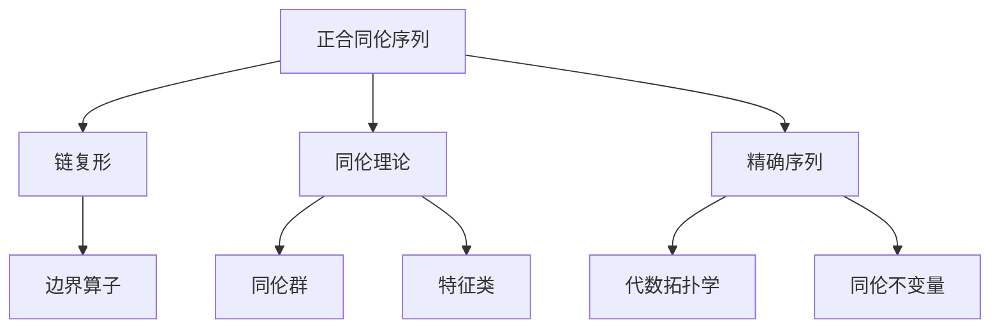

# 流形拓扑学：正合同伦序列

## 1. 背景介绍

### 1.1 问题的由来

拓扑学是研究空间几何性质的一门数学分支,其中流形拓扑学是拓扑学的一个重要分支。流形是一种在局部看起来像欧几里得空间的拓扑空间,而正合同伦序列则是流形拓扑学中的一个核心概念。

正合同伦序列描述了两个拓扑空间之间的同伦关系,是研究流形结构和性质的重要工具。它广泛应用于代数拓扑学、微分几何学、代数几何学等数学领域,也在物理学、计算机科学等领域有重要应用。

### 1.2 研究现状

正合同伦序列的研究可以追溯到20世纪初,当时数学家们开始系统地研究拓扑不变量和同伦理论。20世纪40年代,著名数学家Eilenberg和Steenrod提出了正合同伦序列的概念,并发展了相关理论。

近年来,正合同伦序列理论在数学和其他学科中得到了广泛的应用和发展。例如,在代数拓扑学中,正合同伦序列被用于计算同伦群和其他不变量;在微分几何学中,它们被用于研究流形的几何结构;在代数几何学中,正合同伦序列被用于研究代数多样体的性质。

### 1.3 研究意义

正合同伦序列理论对于深入理解流形的拓扑结构和性质至关重要。它提供了一种有效的工具来研究流形的同伦不变量,如同伦群、特征类等,这些不变量对于描述流形的拓扑性质非常有用。

此外,正合同伦序列理论在其他数学领域和应用领域也有重要意义。例如,在代数几何学中,它被用于研究代数多样体的性质;在物理学中,它被用于研究量子场论和弦理论中的拓扑不变量;在计算机科学中,它被用于研究计算拓扑学和几何建模等问题。

### 1.4 本文结构

本文将全面介绍正合同伦序列的理论基础、核心概念和应用。文章结构如下:

1. 背景介绍
2. 核心概念与联系
3. 核心算法原理与具体操作步骤
4. 数学模型和公式详细讲解与举例说明
5. 项目实践:代码实例和详细解释说明
6. 实际应用场景
7. 工具和资源推荐
8. 总结:未来发展趋势与挑战
9. 附录:常见问题与解答

## 2. 核心概念与联系

正合同伦序列是流形拓扑学的核心概念,与链复形、同伦理论、精确序列等概念密切相关。

- **链复形(Chain Complex)**: 正合同伦序列是建立在链复形的基础之上的。链复形是一系列由边界算子连接的模的序列,用于计算拓扑不变量。

- **同伦理论(Homotopy Theory)**: 正合同伦序列描述了两个拓扑空间之间的同伦关系,是同伦理论的重要工具。同伦理论研究拓扑空间之间的同伦等价关系,包括同伦群和特征类等概念。

- **精确序列(Exact Sequence)**: 正合同伦序列是一种特殊的精确序列,即每一项的像等于下一项的核。精确序列在代数拓扑学中有重要应用,可用于计算同伦不变量。

正合同伦序列将这些核心概念联系起来,为研究流形的拓扑结构和性质提供了强有力的工具。

## 3. 核心算法原理与具体操作步骤

### 3.1 算法原理概述

正合同伦序列的核心思想是通过构造一个精确序列来描述两个拓扑空间之间的同伦关系。这个精确序列由一系列模和连接它们的同伦映射组成,每一项的像恰好等于下一项的核。

精确序列的形式如下:

$$
\cdots \xrightarrow{f_{n-1}} A_n \xrightarrow{f_n} A_{n+1} \xrightarrow{f_{n+1}} \cdots
$$

其中,每个$A_n$是一个模,$f_n$是一个同伦映射,满足$\operatorname{im}(f_n) = \operatorname{ker}(f_{n+1})$,即每一项的像等于下一项的核。

通过研究这个精确序列,我们可以获得关于两个拓扑空间之间同伦关系的重要信息,如同伦群、特征类等同伦不变量。

### 3.2 算法步骤详解

构造正合同伦序列的一般步骤如下:

1. **选择合适的链复形**:根据研究对象(如流形、代数多样体等),选择合适的链复形作为出发点。常用的链复形包括奇异链复形、de Rham链复形等。

2. **构造映射**:在选定的链复形上,构造一系列同伦映射$f_n$,使得$\operatorname{im}(f_n) \subseteq \operatorname{ker}(f_{n+1})$。这些映射可以是由拓扑空间的某些结构(如切丛、位相等)诱导出来的。

3. **验证精确性**:对于每一项,验证$\operatorname{im}(f_n) = \operatorname{ker}(f_{n+1})$是否成立。如果成立,则构成了一个精确序列。

4. **计算同伦不变量**:利用构造出的精确序列,计算感兴趣的同伦不变量,如同伦群、特征类等。通常可以使用同伦理论中的一些定理和技巧,如蛇列等式、五元组等。

5. **分析结果**:分析计算得到的同伦不变量,从而获得关于研究对象拓扑结构和性质的重要信息。

需要注意的是,构造正合同伦序列并非一蹴而就,通常需要对研究对象有深入的理解,并熟练掌握同伦理论和代数拓扑学的相关知识。

### 3.3 算法优缺点

**优点**:

- 正合同伦序列提供了一种有效的工具来研究拓扑空间的同伦关系和不变量。
- 它将代数和拓扑学有机地结合在一起,为计算和分析同伦不变量提供了代数化的方法。
- 正合同伦序列理论具有很强的普适性,可应用于不同的数学领域和应用领域。

**缺点**:

- 构造正合同伦序列通常需要对研究对象有深入的理解,并掌握相关的数学背景知识,存在一定的理论和技术难度。
- 在一些特殊情况下,构造正合同伦序列可能会遇到困难或无法直接应用。
- 正合同伦序列提供的信息有时可能过于抽象,需要进一步解释和分析才能获得具体的几何或拓扑意义。

### 3.4 算法应用领域

正合同伦序列理论在数学和其他学科领域有广泛的应用:

- **代数拓扑学**: 正合同伦序列被广泛用于计算同伦群、特征类等重要的拓扑不变量。
- **微分几何学**: 正合同伦序列可用于研究流形的几何结构,如切丛、曲率等。
- **代数几何学**: 正合同伦序列被用于研究代数多样体的性质,如同伦群、交叉理论等。
- **物理学**: 在量子场论和弦理论中,正合同伦序列被用于研究拓扑不变量和量子场的性质。
- **计算机科学**: 正合同伦序列在计算拓扑学、几何建模、计算机图形学等领域有应用。

总的来说,正合同伦序列理论为研究拓扑空间的结构和性质提供了一种强有力的工具,在数学和其他学科领域都有重要应用和影响。

## 4. 数学模型和公式详细讲解与举例说明

### 4.1 数学模型构建

在构建正合同伦序列的数学模型时,我们通常从一个链复形出发。链复形是一系列由边界算子连接的模的序列,形式如下:

$$
\cdots \xrightarrow{\partial_{n+1}} C_n \xrightarrow{\partial_n} C_{n-1} \xrightarrow{\partial_{n-1}} \cdots
$$

其中,$C_n$是$n$维链模,即由$n$维奇异单体(或其他类型的单体)生成的模;$\partial_n$是$n$维边界算子,满足$\partial_{n-1} \circ \partial_n = 0$。

我们希望构造一个正合同伦序列,形式如下:

$$
\cdots \xrightarrow{f_{n-1}} A_n \xrightarrow{f_n} A_{n+1} \xrightarrow{f_{n+1}} \cdots
$$

其中,每个$A_n$是一个模,$f_n$是一个同伦映射,满足$\operatorname{im}(f_n) = \operatorname{ker}(f_{n+1})$,即每一项的像恰好等于下一项的核。

为了构造这个正合同伦序列,我们需要在给定的链复形上定义合适的模$A_n$和同伦映射$f_n$。常见的做法是:

1. 取$A_n = C_n$或$A_n = H_n(C_*)$,其中$H_n(C_*)$是$n$维同伦模。
2. 定义$f_n$为包含映射(inclusion map)或边界映射(boundary map)。

通过选择合适的模和映射,并验证精确性条件$\operatorname{im}(f_n) = \operatorname{ker}(f_{n+1})$,我们就可以构造出所需的正合同伦序列。

### 4.2 公式推导过程

接下来,我们将推导出一个著名的正合同伦序列——Mayer-Vietoris序列。这个序列描述了一个拓扑空间如何由两个开覆盖的交集和并集确定。

设$X$是一个拓扑空间,$U$和$V$是$X$的两个开覆盖,即$X = U \cup V$。我们定义:

- $C_n(X)$:$X$的$n$维奇异链复形
- $C_n(U)$:$U$的$n$维奇异链复形
- $C_n(V)$:$V$的$n$维奇异链复形
- $C_n(U \cap V)$:$U \cap V$的$n$维奇异链复形

我们可以构造出以下短精确序列:

$$
0 \rightarrow C_n(X) \xrightarrow{i_*} C_n(U) \oplus C_n(V) \xrightarrow{j^*} C_n(U \cap V) \rightarrow 0
$$

其中,$i_*$是由包含映射$i:X \rightarrow U \cup V$诱导的链映射,$j^*$是由包含映射$j:U \cap V \rightarrow U,V$诱导的链映射。

通过一些代数运算和同伦理论的技巧,我们可以从这个短精确序列推导出Mayer-Vietoris序列:

$$
\cdots \xrightarrow{\partial} H_{n+1}(X) \xrightarrow{i_*} H_{n+1}(U) \oplus H_{n+1}(V) \xrightarrow{j^*} H_n(U \cap V) \xrightarrow{\partial} H_n(X) \xrightarrow{i_*} \cdots
$$

其中,$H_n(-)$表示$n$维同伦模,$i_*$和$j^*$是由包含映射诱导的同伦映射,$\partial$是连接同伦映射。

这个序列提供了一种计算$X$的同伦群的方法,只需知道$U$、$V$和$U \cap V$的同伦群。它在代数拓扑学中有重要应用,也体现了正合同伦序列在研究拓扑空间结构方面的强大能力。

### 4.3 案例分析与讲解

为了更好地理解正合同伦序列的概念和应用,我们来分析一个具体的案例:计算实射线$\mathbb{R}$的同伦群。