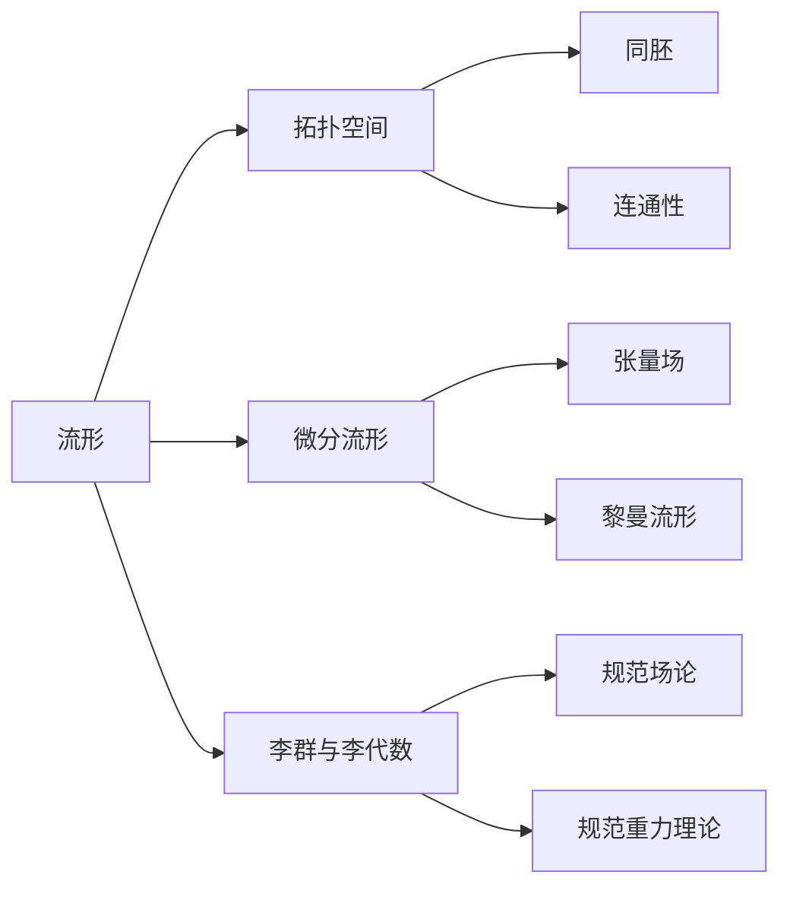
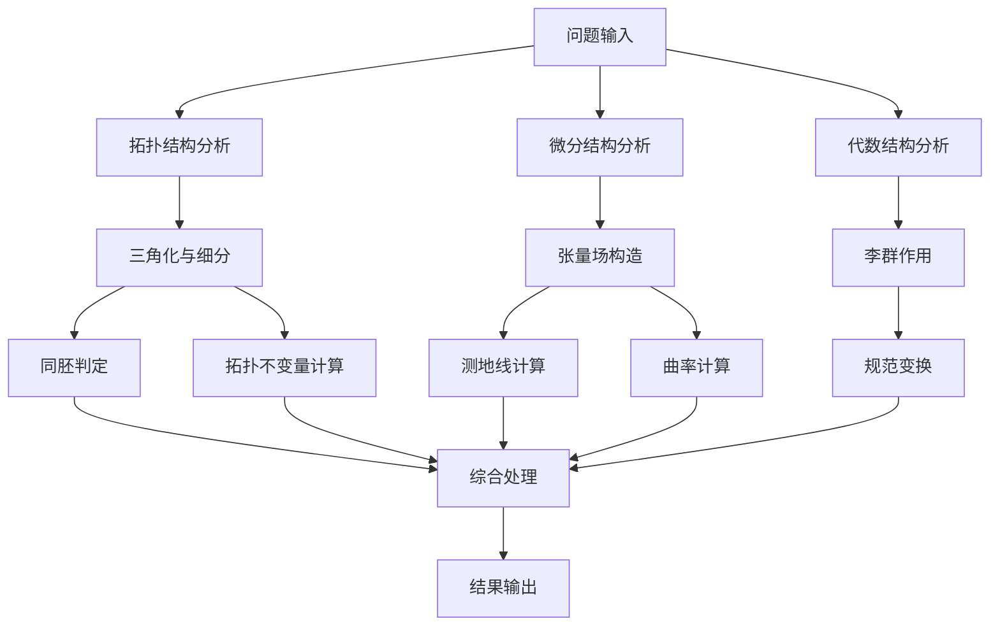

# 流形拓扑学：物理背景的流形

## 1. 背景介绍

### 1.1 问题的由来

在当代物理学研究中,流形的概念扮演着至关重要的角色。流形拓扑学作为研究流形几何性质的一个分支,为描述和理解自然界中的各种物理现象提供了强有力的数学工具。从狭义相对论中的时空连续体,到广义相对论中的曲率流形,再到量子场论和弦论中的高维流形,流形的概念无处不在。

流形的数学理论源远流长,可以追溯到19世纪黎曼对于曲面理论的开创性工作。随着数学家们对于更高维度和更一般情况的探索,流形理论逐渐成型并不断发展。然而,直到20世纪初,物理学家们才意识到流形在描述自然界中的物理定律和现象方面的强大潜力。

### 1.2 研究现状

目前,流形拓扑学在物理学的多个前沿领域都有着广泛的应用。例如:

- 广义相对论:时空连续体被描述为一个四维流形,其上的度规张量场描述了时空的曲率性质。
- 量子场论:在研究基本粒子和相互作用时,常常需要引入高维流形的概念。
- 弦论:弦论中的基本物质结构是在高维流形上振动的一维"弦"。
- 拓扑量子计算:利用拓扑学原理设计容错量子计算机。

随着理论物理学的不断深入,流形拓扑学的研究也在不断推进。物理学家和数学家的紧密合作,推动了这一交叉学科的蓬勃发展。

### 1.3 研究意义

流形拓扑学在物理学中的重要意义主要体现在以下几个方面:

1. 提供统一的数学语言,描述自然界中的各种物理现象。
2. 揭示物理定律背后更深层次的几何本质。
3. 发现新的物理理论,预言新的物理现象。
4. 解决复杂物理问题,发展有效的近似计算方法。

总的来说,流形拓扑学为探索自然界的奥秘提供了强有力的数学工具,是当代理论物理学不可或缺的重要组成部分。

### 1.4 本文结构

本文将从流形的基本概念出发,系统地介绍流形拓扑学在物理学中的应用。主要内容包括:

- 核心概念和基本原理
- 流形在广义相对论、量子场论、弦论等领域的具体应用
- 相关的数学模型和公式推导
- 项目实践:代码实例和详细解释
- 实际应用场景和未来发展趋势
- 工具和学习资源推荐

希望通过本文,读者能够全面深入地理解流形拓扑学的内涵,领略其在物理学中的重要地位和广阔前景。

## 2. 核心概念与联系

流形(Manifold)是当代数学和物理学中的一个核心概念。从最一般的意义上讲,流形是一种拓扑空间,在局部上类似于欧几里得空间,但在全局上可能具有更复杂的拓扑结构。

作为一种拓扑空间,流形具有诸如连通性、同胚等基本性质。同时,流形也可以赋予额外的微分结构,从而成为微分流形。在微分流形上,我们可以定义张量场、曲率等概念,这为研究物理定律奠定了基础。

与流形概念密切相关的,还有李群(Lie Group)和李代数(Lie Algebra)的理论。李群描述了流形上的对称性,而李代数则提供了研究李群的重要代数工具。这些概念在规范场论和规范重力理论中扮演着关键角色。

通过对流形及其相关概念的深入研究,我们能够揭示自然界中各种物理现象的本质,并发展出行之有效的数学模型和计算方法。

## 3. 核心算法原理 & 具体操作步骤

### 3.1 算法原理概述

在研究流形拓扑学时,常常需要处理各种算法问题,例如:

- 判断两个流形是否同胚
- 计算流形的拓扑不变量
- 求解微分方程以获得测地线
- 计算流形上的曲率标量
- ...

这些问题虽然具体内容不同,但都可以归结为对流形进行一系列拓扑和微分几何运算的过程。因此,掌握流形上的基本算法,是流形拓扑学研究的重中之重。

流形算法的一个核心思想是,将抽象的流形概念"三视图"化,即将其分解为拓扑结构、微分结构和额外的代数结构。对于每一种结构,我们都发展出相应的算法模块。最后,将这些模块有机结合,即可解决复杂的综合性问题。

### 3.2 算法步骤详解

以下是一个典型的流形算法执行流程:

1. **输入**:首先输入待处理的流形对象,可以是显式的流形表示,也可以是其他等价的数学对象(如代数或微分方程)。

2. **拓扑结构分析**:对流形的拓扑结构进行分析,主要包括三角化与细分、同胚判定、拓扑不变量计算等操作。

3. **微分结构分析**:对流形的微分结构进行分析,主要包括构造张量场、计算测地线、计算曲率等操作。

4. **代数结构分析**:对流形上的代数结构(如李群、李代数)进行分析,主要包括李群作用、规范变换等操作。

5. **综合处理**:将上述各个模块的计算结果进行综合,解决原问题。

6. **输出**:将最终结果输出。

需要说明的是,上述流程只是一个一般性描述,具体问题的算法实现可能会有所差异,也可能需要一些特殊的数值计算或符号计算技术。

### 3.3 算法优缺点

流形算法的主要优点包括:

- 数学理论基础扎实,能够准确描述复杂的物理现象。
- 模块化设计,可以针对不同的子问题单独优化算法。
- 具有一定的通用性,可以推广到其他相关问题。

但同时,流形算法也存在一些缺陷和局限性:

- 计算复杂度通常较高,对计算资源要求较大。
- 对于特殊情况,一般性算法可能效率不高,需要特殊优化。
- 涉及大量抽象数学概念,对使用者的数学素养要求较高。

因此,在实际应用中,我们需要权衡算法的精度和效率,并根据具体问题选择合适的算法策略。

### 3.4 算法应用领域

流形算法在物理学的多个领域都有着重要应用,包括但不限于:

- **广义相对论**:计算时空曲率、求解爱因斯坦场方程等。
- **量子场论**:研究规范场在流形上的定义和相互作用。
- **弦论**:求解高维流形上的弦振动方程。
- **拓扑量子计算**:构造拓扑量子计算机的基本算子。
- **数值相对论**:发展高精度的数值相对论算法。
- **计算拓扑学**:研究流形拓扑不变量的有效计算方法。

除了物理学领域,流形算法在数学、计算机科学、工程等其他学科也有广泛应用。可以说,流形算法是一个交叉学科,对推动科学技术的发展具有重要意义。

## 4. 数学模型和公式 & 详细讲解 & 举例说明

### 4.1 数学模型构建

在研究物理学中的流形问题时,我们通常需要构建恰当的数学模型。一个典型的流形数学模型包括以下几个要素:

- 流形$M$及其拓扑结构
- 流形上的微分结构,包括张量场、度规张量场等
- 流形上的代数结构,如李群、李代数等
- 定义在流形上的物理量,如质量、电荷、能量等
- 描述物理定律的方程,如爱因斯坦场方程、杨-米尔斯方程等

我们可以用一个形式化的四元组$(M, \mathcal{F}, \mathcal{G}, L)$来表示这样一个数学模型,其中:

- $M$是基础流形
- $\mathcal{F}$是定义在$M$上的场(如度规张量场、规范场等)
- $\mathcal{G}$是$M$上的代数结构(如李群、李代数等)
- $L$是定义在$(M, \mathcal{F}, \mathcal{G})$上的拉格朗日量(或其他物理定律)

通过研究这个数学模型的解析性质和对应的物理意义,我们就可以揭示自然界的本质规律。

### 4.2 公式推导过程

在上述数学模型的框架下,我们可以推导出描述物理定律的关键公式。以广义相对论为例,爱因斯坦场方程的推导过程如下:

1) 在四维流形$M$上定义度规张量场$g_{\mu\nu}$,描述时空的几何结构。

2) 定义曲率张量$R_{\mu\nu\rho\sigma}$,它是$g_{\mu\nu}$的二阶协变导数,描述时空的曲率性质。

3) 由$R_{\mu\nu\rho\sigma}$按特定的张量算子计算得到曲率标量$R$。

4) 定义爱因斯坦张量$G_{\mu\nu} = R_{\mu\nu} - \frac{1}{2}g_{\mu\nu}R$,它描述了时空的曲率分布。

5) 引入质量-能量张量$T_{\mu\nu}$,描述物质和能量的分布。

6) 由等价原理,可以推出爱因斯坦场方程:
   $$G_{\mu\nu} = \frac{8\pi G}{c^4}T_{\mu\nu}$$
   这个张量方程描述了时空曲率和物质-能量分布之间的关系。

7) 将特定的$T_{\mu\nu}$代入方程,可以求解具体的度规张量场$g_{\mu\nu}$,从而获得时空的几何结构。

这个推导过程体现了流形理论在广义相对论中的核心作用。通过分析流形的几何性质,我们可以揭示出时空曲率和物质-能量的内在联系。

### 4.3 案例分析与讲解

为了更好地理解流形在物理学中的应用,我们来分析一个具体的案例:施瓦西子星的时空结构。

施瓦西子星是一种极端致密的天体,是中子星的一个特例。它的质量约为太阳质量的1-3倍,但半径仅有10千米左右,密度高达$10^{17}kg/m^3$。在如此极端的环境下,时空的曲率会变得非常大,无法用牛顿力学来描述。我们必须借助广义相对论的流形理论。

首先,我们将施瓦西子星的时空建模为一个四维流形$M$,并在其上定义一个球对称的度规张量场$g_{\mu\nu}$。根据爱因斯坦场方程,我们可以推导出这个度规张量场必须满足的微分方程组:

$$R_{\mu\nu} - \frac{1}{2}g_{\mu\nu}R = \frac{8\pi G}{c^4}T_{\mu\nu}$$

其中,张量$T_{\mu\nu}$描述了施瓦西