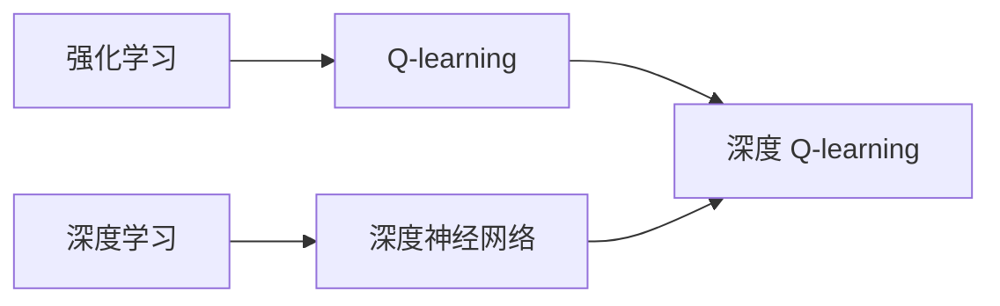
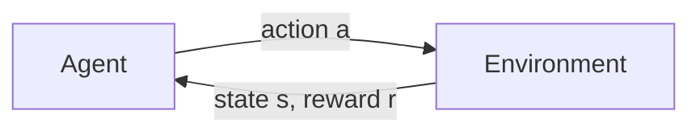

# 深度 Q-learning：在机器人技术中的应用

关键词：深度强化学习、Q-learning、机器人控制、状态-动作值函数、深度神经网络、策略迭代、经验回放

## 1. 背景介绍
### 1.1  问题的由来
随着人工智能技术的飞速发展,机器人正在逐步走进我们的生活。从工业生产到家庭服务,机器人在各个领域发挥着越来越重要的作用。然而,传统的机器人控制方法往往需要大量的人工调试和专家知识,难以适应复杂多变的环境。如何让机器人具备自主学习和适应能力,成为了机器人领域亟待解决的问题。

### 1.2  研究现状
近年来,强化学习作为一种从环境中自主学习的方法,在机器人控制领域受到了广泛关注。其中,Q-learning 作为一种经典的强化学习算法,以其简单有效而备受青睐。然而,传统的 Q-learning 算法在面对高维、连续的状态空间时,往往难以收敛。为了克服这一困难,研究者们提出了深度 Q-learning 的思想,即将深度神经网络与 Q-learning 相结合,利用深度神经网络强大的函数拟合能力,来逼近最优的 Q 值函数。

### 1.3  研究意义
深度 Q-learning 的提出,为机器人自主学习控制策略提供了新的思路。通过深度 Q-learning,机器人可以从自身与环境的交互中不断学习和优化控制策略,从而具备更强的自主性和适应性。这不仅可以大大减轻机器人开发和部署的工作量,还能让机器人在面对未知环境时表现出更加智能的行为。深度 Q-learning 在机器人技术中的应用,有望推动机器人技术的进一步发展,为未来智能机器人的实现奠定基础。

### 1.4  本文结构
本文将围绕深度 Q-learning 在机器人技术中的应用展开讨论。首先,我们将介绍深度 Q-learning 的核心概念和基本原理。然后,我们将详细阐述深度 Q-learning 算法的具体步骤和实现细节。接下来,我们将通过数学模型和公式推导,深入分析深度 Q-learning 的理论基础。在此基础上,我们将给出深度 Q-learning 在机器人控制中的代码实例,并对其进行详细解释。此外,我们还将讨论深度 Q-learning 在机器人技术中的实际应用场景,并推荐相关的工具和学习资源。最后,我们将总结深度 Q-learning 的研究现状,展望其未来发展趋势和面临的挑战。

## 2. 核心概念与联系

在讨论深度 Q-learning 之前,我们首先需要了解几个核心概念：

- 强化学习：一种让智能体通过与环境的交互来学习最优行为策略的机器学习范式。
- Q-learning：一种常用的无模型、异策略、离线更新的强化学习算法,旨在学习最优的状态-动作值函数(Q 函数)。
- 深度学习：一种基于多层神经网络的机器学习方法,善于学习高维、非线性的函数映射。
- 深度神经网络：由多个隐藏层组成的人工神经网络,具有强大的特征提取和函数拟合能力。

深度 Q-learning 正是将深度学习与 Q-learning 相结合的产物。传统的 Q-learning 使用查找表(Q-table)来存储每个状态-动作对的 Q 值,当状态空间和动作空间较大时,这种方法将变得不可行。深度 Q-learning 使用深度神经网络来逼近 Q 函数,将状态作为网络的输入,输出各个动作的 Q 值。通过优化深度神经网络的参数,使其输出的 Q 值尽可能接近最优 Q 函数,从而实现对 Q 函数的近似表示。

下图展示了深度 Q-learning 的核心概念和内在联系：

## 3. 核心算法原理 & 具体操作步骤
### 3.1  算法原理概述
深度 Q-learning 的核心思想是使用深度神经网络来逼近最优的状态-动作值函数(Q 函数)。给定状态 $s$ 和动作 $a$,Q 函数 $Q(s,a)$ 表示在状态 $s$ 下采取动作 $a$ 的长期累积回报的期望值。如果我们能够准确地估计 Q 函数,那么在每个状态下选择具有最大 Q 值的动作,就可以获得最优的控制策略。

深度 Q-learning 使用深度神经网络 $Q(s,a;\theta)$ 来近似表示 Q 函数,其中 $\theta$ 为网络的参数。通过最小化以下损失函数来优化网络参数：

$$
L(\theta)=\mathbb{E}_{(s,a,r,s')\sim D}\left[\left(r+\gamma\max_{a'}Q(s',a';\theta^-)-Q(s,a;\theta)\right)^2\right]
$$

其中,$D$ 为经验回放缓冲区,存储了智能体与环境交互过程中收集的转移样本 $(s,a,r,s')$。$\theta^-$ 为目标网络的参数,用于计算 Q 函数的目标值,每隔一定步数从当前网络复制得到。$\gamma$ 为折扣因子,控制未来回报的重要程度。

通过不断从经验回放缓冲区中采样转移样本,计算损失函数并执行梯度下降,深度 Q-learning 算法可以逐步优化 Q 网络的参数,使其输出的 Q 值不断逼近最优 Q 函数。

### 3.2  算法步骤详解
深度 Q-learning 算法的具体步骤如下：

1. 初始化 Q 网络 $Q(s,a;\theta)$ 和目标网络 $Q(s,a;\theta^-)$,初始化经验回放缓冲区 $D$。

2. 对每个 episode 循环：
   - 初始化环境状态 $s$
   - 对每个时间步 $t$ 循环：
     - 根据 $\epsilon$-greedy 策略选择动作 $a$,即以 $\epsilon$ 的概率随机选择动作,否则选择 $\arg\max_aQ(s,a;\theta)$
     - 执行动作 $a$,观察奖励 $r$ 和下一状态 $s'$
     - 将转移样本 $(s,a,r,s')$ 存储到经验回放缓冲区 $D$ 中
     - 从 $D$ 中随机采样一批转移样本 $(s_i,a_i,r_i,s'_i)$
     - 计算 Q 函数的目标值：$y_i=r_i+\gamma\max_{a'}Q(s'_i,a';\theta^-)$
     - 计算损失函数：$L(\theta)=\frac{1}{N}\sum_i\left(y_i-Q(s_i,a_i;\theta)\right)^2$
     - 通过梯度下降算法更新 Q 网络的参数 $\theta$
     - 每隔一定步数,将当前网络参数 $\theta$ 复制给目标网络参数 $\theta^-$
     - $s\leftarrow s'$
   - 结束内循环
- 结束外循环

### 3.3  算法优缺点
深度 Q-learning 算法的主要优点包括：

- 通过深度神经网络逼近 Q 函数,可以处理高维、连续的状态空间。
- 采用经验回放和目标网络等技巧,提高了算法的稳定性和样本利用效率。
- 无需预先建立环境模型,通过与环境的交互自主学习最优策略。
- 相比传统 Q-learning,具有更强的泛化能力和鲁棒性。

但深度 Q-learning 算法也存在一些局限性：

- 深度神经网络的训练需要大量的样本数据和计算资源。
- 算法对超参数(如学习率、网络结构等)比较敏感,调参需要一定的经验和技巧。
- 难以处理部分可观察(PO)和非平稳环境,需要额外的算法设计。
- 在探索和利用之间难以权衡,容易陷入局部最优。

### 3.4  算法应用领域
深度 Q-learning 算法在机器人控制领域有广泛的应用,主要包括：

- 机器人运动规划与控制：如机械臂运动、移动机器人导航等。
- 机器人操作与抓取：如物体抓取、装配操作等。
- 机器人感知与决策：如视觉导航、语音交互等。
- 多智能体协作与竞争：如机器人足球、无人车编队等。

此外,深度 Q-learning 还可以应用于其他领域,如游戏智能、推荐系统、自然语言处理等。

## 4. 数学模型和公式 & 详细讲解 & 举例说明
### 4.1  数学模型构建
为了更好地理解深度 Q-learning 算法,我们需要建立相应的数学模型。考虑一个标准的强化学习设定,即马尔可夫决策过程(MDP)。一个 MDP 由以下元素组成：

- 状态空间 $\mathcal{S}$：所有可能的状态的集合。
- 动作空间 $\mathcal{A}$：所有可能的动作的集合。
- 转移概率 $\mathcal{P}(s'|s,a)$：在状态 $s$ 下采取动作 $a$ 后转移到状态 $s'$ 的概率。
- 奖励函数 $\mathcal{R}(s,a)$：在状态 $s$ 下采取动作 $a$ 后获得的即时奖励。
- 折扣因子 $\gamma\in[0,1]$：控制未来奖励的重要程度,折扣因子越大,越重视长期回报。

在 MDP 中,智能体与环境交互的过程可以用以下图示表示：

智能体的目标是寻找一个最优策略 $\pi^*$,使得在该策略下的累积回报最大化：

$$
\pi^*=\arg\max_{\pi}\mathbb{E}_{\pi}\left[\sum_{t=0}^{\infty}\gamma^tr_t\right]
$$

其中,$r_t$ 为在时间步 $t$ 获得的奖励。为了求解最优策略,我们引入状态值函数 $V^{\pi}(s)$ 和状态-动作值函数 $Q^{\pi}(s,a)$：

$$
V^{\pi}(s)=\mathbb{E}_{\pi}\left[\sum_{t=0}^{\infty}\gamma^tr_t|s_0=s\right]
$$

$$
Q^{\pi}(s,a)=\mathbb{E}_{\pi}\left[\sum_{t=0}^{\infty}\gamma^tr_t|s_0=s,a_0=a\right]
$$

$V^{\pi}(s)$ 表示在状态 $s$ 下遵循策略 $\pi$ 的期望累积回报,$Q^{\pi}(s,a)$ 表示在状态 $s$ 下采取动作 $a$ 然后遵循策略 $\pi$ 的期望累积回报。最优状态值函数 $V^*(s)$ 和最优状态-动作值函数 $Q^*(s,a)$ 分别定义为：

$$
V^*(s)=\max_{\pi}V^{\pi}(s)
$$

$$
Q^*(s,a)=\max_{\pi}Q^{\pi}(s,a)
$$

如果我们能够准确估计最优状态-动作值函数 $Q^*(s,a)$,则最优策略可以通过在每个状态下选择具有最大 Q 值的动作来获得：

$$
\pi^*(s)=\arg\max_{a\in\mathcal{A}}Q^*(s,a)
$$

因此,Q-learning 算法的目标就是通过不断与环境交互,逐步逼近最优状态-动作值函数 $Q^*(s,a)$。

### 4.2  公式推导过程
Q-learning 算法基于 Bellman 最优方程,即最优状态-动作值函数 $Q^*(s,a)$ 满足以下等式：

$$
Q^*(s,a)=\mathcal{R}(s,a)+\gamma\sum_{s'\in\mathcal{S}}\mathcal{P}(s'|s,a)\max_{a'\in\mathcal{