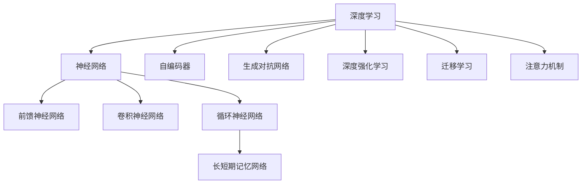
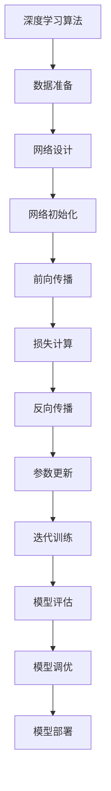

# 深度学习 原理与代码实例讲解

## 1. 背景介绍

### 1.1 问题的由来

在过去几十年中，人工智能领域取得了长足的进步,尤其是深度学习技术的兴起,极大地推动了人工智能的发展。深度学习是机器学习的一个新的研究热点领域,它通过对数据建模,使计算机拥有了模仿人类大脑学习知识的能力。

传统的机器学习算法往往依赖于手工设计的特征,而深度学习则可以直接从原始数据中自动学习特征表示,从而获得更加精确和有效的模型。这种端到端的学习方式使得深度学习在计算机视觉、自然语言处理、语音识别等领域取得了突破性的进展。

### 1.2 研究现状

深度学习的核心思想是通过构建深层次的神经网络模型,从大量数据中自动学习特征表示,并对复杂问题进行建模和预测。常见的深度学习模型包括卷积神经网络(CNN)、循环神经网络(RNN)、长短期记忆网络(LSTM)等。

近年来,随着算力的提升、大数据的积累以及新型网络结构的不断涌现,深度学习在各个领域取得了卓越的成就。例如,在计算机视觉领域,深度学习模型可以实现高精度的图像分类、目标检测和语义分割等任务;在自然语言处理领域,深度学习模型可以进行机器翻译、文本生成、情感分析等;在语音识别领域,深度学习模型也展现出了优异的性能。

### 1.3 研究意义

深度学习的发展不仅推动了人工智能技术的进步,也对各行各业产生了深远的影响。它为我们提供了一种全新的数据分析和决策支持方式,有助于提高生产效率、优化资源配置、改善用户体验等。

同时,深度学习也面临着一些挑战,如模型的可解释性、隐私保护、算力需求等,这些问题都需要研究者们继续努力。因此,深入理解深度学习的原理、算法和实现方式,对于推动人工智能技术的发展至关重要。

### 1.4 本文结构

本文将全面介绍深度学习的核心概念、算法原理、数学模型、代码实现以及实际应用场景。文章结构如下:

1. 背景介绍
2. 核心概念与联系
3. 核心算法原理与具体操作步骤
4. 数学模型和公式详细讲解与举例说明
5. 项目实践:代码实例和详细解释说明
6. 实际应用场景
7. 工具和资源推荐
8. 总结:未来发展趋势与挑战
9. 附录:常见问题与解答

## 2. 核心概念与联系

深度学习是一种基于人工神经网络的机器学习算法,它的核心思想是通过构建深层次的网络结构,从大量数据中自动学习特征表示,从而对复杂问题进行建模和预测。下面是一些深度学习的核心概念:

1. **神经网络(Neural Network)**:深度学习模型的基础架构,由多层神经元组成,每层神经元通过权重相连,对输入数据进行非线性变换。
2. **前馈神经网络(Feedforward Neural Network)**:信息只从输入层单向传播到输出层的网络结构。
3. **卷积神经网络(Convolutional Neural Network, CNN)**:在图像、视频等领域表现出色,通过卷积操作自动提取局部特征。
4. **循环神经网络(Recurrent Neural Network, RNN)**:适用于处理序列数据,通过内部状态捕获序列之间的依赖关系。
5. **长短期记忆网络(Long Short-Term Memory, LSTM)**:一种特殊的RNN,通过门控机制解决了长期依赖问题。
6. **自编码器(Autoencoder)**:无监督学习模型,通过重建输入数据来学习有效的特征表示。
7. **生成对抗网络(Generative Adversarial Network, GAN)**:由生成器和判别器组成,用于生成逼真的数据样本。
8. **深度强化学习(Deep Reinforcement Learning)**:结合深度学习和强化学习,用于解决序列决策问题。
9. **迁移学习(Transfer Learning)**:通过迁移已学习的知识,加快新任务的训练过程。
10. **注意力机制(Attention Mechanism)**:赋予模型选择性关注输入数据的不同部分的能力。

这些概念相互关联、相辅相成,共同构建了深度学习的理论基础和应用框架。掌握这些概念有助于更好地理解和应用深度学习技术。

## 3. 核心算法原理与具体操作步骤

### 3.1 算法原理概述

深度学习算法的核心思想是通过构建深层次的神经网络模型,从大量数据中自动学习特征表示,从而对复杂问题进行建模和预测。这种端到端的学习方式使得深度学习模型可以直接从原始数据(如图像、文本、语音等)中提取有效的特征,而无需手工设计特征。

深度学习算法的工作原理可以概括为以下几个步骤:

1. **网络初始化**:根据任务需求选择合适的网络结构(如CNN、RNN等),并对网络参数(权重和偏置)进行随机初始化。
2. **前向传播**:将输入数据传递到网络的第一层,然后逐层计算每个神经元的加权输入和激活值,直到得到输出层的预测结果。
3. **损失计算**:将网络输出与真实标签进行比较,计算损失函数的值,衡量预测的准确性。
4. **反向传播**:利用链式法则,计算损失函数相对于每个权重的梯度,反向传播到各层神经元。
5. **参数更新**:根据梯度下降法则,更新网络中的权重和偏置参数,使损失函数值最小化。
6. **迭代训练**:重复执行前向传播、损失计算、反向传播和参数更新的过程,直到模型收敛或达到指定的迭代次数。

通过上述过程,深度学习模型可以自动从数据中学习特征表示,并逐步优化网络参数,从而获得更加精确和有效的预测模型。

### 3.2 算法步骤详解

下面将详细介绍深度学习算法的具体操作步骤:

1. **数据准备**:收集和预处理训练数据,将其转换为模型可以接受的格式(如图像像素矩阵、文本向量等)。
2. **网络设计**:根据任务需求选择合适的网络结构,如CNN用于图像处理、RNN用于序列数据处理等。
3. **网络初始化**:对网络中的权重和偏置参数进行随机初始化,通常使用小的随机值。
4. **前向传播**:
   - 输入层:将输入数据传递到网络的第一层。
   - 隐藏层:对每个神经元计算加权输入,通过激活函数(如ReLU、Sigmoid等)得到激活值,作为下一层的输入。
   - 输出层:根据输出神经元的激活值,得到模型的预测结果。
5. **损失计算**:选择合适的损失函数(如交叉熵损失、均方误差等),将模型输出与真实标签进行比较,计算损失函数的值。
6. **反向传播**:
   - 计算输出层神经元的误差梯度。
   - 利用链式法则,计算隐藏层神经元的误差梯度。
   - 继续反向传播,计算每个权重的梯度。
7. **参数更新**:采用优化算法(如梯度下降、Adam等),根据计算得到的梯度,更新网络中的权重和偏置参数。
8. **迭代训练**:重复执行前向传播、损失计算、反向传播和参数更新的过程,直到模型收敛或达到指定的迭代次数。
9. **模型评估**:在测试数据集上评估模型的性能,计算相关指标(如准确率、F1分数等)。
10. **模型调优**:根据评估结果,调整超参数(如学习率、正则化系数等)或网络结构,以提高模型性能。
11. **模型部署**:将训练好的模型部署到实际应用场景中,用于进行预测或决策。

通过上述步骤,深度学习模型可以逐步优化网络参数,从而获得更加精确和有效的预测模型。在实际应用中,还需要根据具体任务和数据特点,选择合适的网络结构、损失函数、优化算法等,以获得最佳的模型性能。

### 3.3 算法优缺点

深度学习算法具有以下优点:

1. **自动特征提取**:无需手工设计特征,可以直接从原始数据中自动学习有效的特征表示。
2. **端到端学习**:通过构建深层次的网络结构,实现端到端的学习过程,避免了传统机器学习中的多个处理步骤。
3. **泛化能力强**:深度学习模型可以从大量数据中学习复杂的映射关系,具有强大的泛化能力。
4. **可解释性**:通过可视化技术和注意力机制,可以在一定程度上解释深度学习模型的决策过程。

同时,深度学习算法也存在一些缺点:

1. **数据饥渴**:深度学习模型通常需要大量的训练数据,否则容易出现过拟合问题。
2. **黑箱操作**:深度学习模型的内部机制较为复杂,难以完全解释其决策过程。
3. **计算资源需求高**:训练深度神经网络需要大量的计算资源,如GPU加速等。
4. **对抗样本敏感**:深度学习模型容易受到对抗样本的攻击,导致错误的预测结果。
5. **可解释性不足**:虽然有一些可解释性方法,但对于复杂的深度模型,可解释性仍然是一个挑战。

因此,在实际应用中,需要根据具体任务和数据特点,权衡深度学习算法的优缺点,选择合适的模型和技术方案。

### 3.4 算法应用领域

深度学习算法由于其强大的建模和预测能力,在多个领域取得了卓越的成就,主要应用领域包括:

1. **计算机视觉**:图像分类、目标检测、语义分割、图像生成等。
2. **自然语言处理**:机器翻译、文本生成、情感分析、问答系统等。
3. **语音识别**:自动语音识别、语音合成、说话人识别等。
4. **推荐系统**:个性化推荐、内容推荐、协同过滤等。
5. **金融领域**:股票预测、欺诈检测、风险管理等。
6. **医疗健康**:医学图像分析、疾病诊断、药物发现等。
7. **自动驾驶**:环境感知、路径规划、决策控制等。
8. **游戏人工智能**:游戏AI代理、策略优化等。

随着深度学习技术的不断发展和应用领域的扩展,它正在推动着人工智能的进步,为各行各业带来了革命性的变革。

## 4. 数学模型和公式详细讲解与举例说明

### 4.1 数学模型构建

深度学习算法的数学模型基于人工神经网络,其核心思想是通过构建多层神经元网络,对输入数据进行非线性变换,从而学习有效