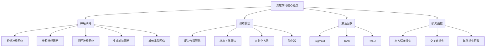

# 深度学习原理与代码实例讲解

## 1. 背景介绍

### 1.1 问题的由来

在过去几十年中,人工智能(AI)领域取得了长足的进步,其中深度学习(Deep Learning)是最具革命性的突破之一。深度学习是机器学习的一个新的研究热点领域,它通过对数据建模的方式来模拟人类大脑分析学习的过程,在计算机视觉、自然语言处理、推荐系统等诸多领域展现出卓越的性能。

传统的机器学习算法需要人工设计特征,这种方式存在一些缺陷:

1. 特征工程耗时耗力,需要专家经验
2. 手工设计的特征往往过于简单,无法很好地表达原始数据的本质信息
3. 对于不同的任务,需要重复设计特征,缺乏通用性

相比之下,深度学习可以直接从原始数据(如图像、文本等)中自动学习特征表示,摆脱了手工设计特征的限制。这种端到端(End-to-End)的学习方式大大简化了特征工程的工作,有望在更多领域展现出优异的性能。

### 1.2 研究现状

早期的深度学习可以追溯到20世纪80年代提出的神经网络,但由于理论和算力的限制,很长一段时间里并没有取得实质性突破。直到2006年以来,受到大规模标注数据、强大的并行计算硬件、新的训练技术等多方面因素的驱动,深度学习才开始蓬勃发展。

2012年,深度学习在ImageNet大规模图像识别竞赛中取得了巨大成功,将识别错误率大幅降低,从此引发了学术界和工业界对深度学习的广泛关注。近年来,深度学习在语音识别、自然语言处理、机器翻译、推荐系统等多个领域均取得了突破性进展。

目前,深度学习已成为人工智能领域最活跃、最具影响力的研究方向之一,吸引了众多科技公司和研究机构的投入。谷歌、微软、Facebook、亚马逊等科技巨头均成立了专门的深度学习研究团队,并广泛将其应用于各种产品和服务中。

### 1.3 研究意义

深度学习作为人工智能的核心技术之一,对于推动智能系统的发展具有重要意义:

1. **泛化能力强** 深度学习可直接从原始数据中自动学习特征表示,无需复杂的特征工程,具有很强的泛化能力。

2. **端到端学习** 深度学习实现了"端到端"的学习模式,将特征提取和模式识别有机融合,简化了传统分步处理的流程。

3. **处理非结构化数据** 深度学习擅长处理图像、语音、自然语言等非结构化数据,这些数据在现实世界中无处不在。

4. **可解释性** 一些新兴的深度学习模型在一定程度上提高了模型的可解释性,有助于人类理解模型内在机理。

5. **多领域应用** 深度学习具有跨领域的通用性,可广泛应用于计算机视觉、自然语言处理、推荐系统、医疗健康等诸多领域。

通过深入研究深度学习的理论基础和实践应用,我们可以促进人工智能技术的发展,为解决更多现实问题贡献力量。

### 1.4 本文结构  

本文将全面介绍深度学习的核心概念、算法原理、数学模型、项目实践等内容,内容安排如下:

- 第2章介绍深度学习的核心概念,如神经网络、前馈网络、卷积神经网络等。
- 第3章重点讲解深度学习的核心算法原理和具体操作步骤。
- 第4章详细阐述深度学习的数学模型和公式推导过程,并结合案例进行讲解。
- 第5章提供深度学习的代码实例,并对代码进行全面解释说明。
- 第6章介绍深度学习在实际应用中的场景。
- 第7章推荐深度学习的学习资源、开发工具和相关论文。
- 第8章总结深度学习的研究成果,展望未来发展趋势和面临的挑战。
- 第9章列举深度学习中常见的问题并给出解答。

## 2. 核心概念与联系

深度学习的核心概念包括以下几个方面:

1. **神经网络**:深度学习的基础模型是人工神经网络,包括前馈神经网络、卷积神经网络、循环神经网络、生成对抗网络等多种类型。

2. **训练算法**:训练神经网络的关键算法有反向传播算法、梯度下降算法、正则化方法和优化器等。

3. **激活函数**:神经网络中的激活函数赋予了网络非线性映射能力,常用的有Sigmoid、Tanh、ReLU等。

4. **损失函数**:用于衡量预测值与真实值之间的差异,如均方误差损失、交叉熵损失等。

这些概念相互关联、环环相扣,构成了深度学习的理论和实践基础。下面将对它们进行详细阐述。

## 3. 核心算法原理与具体操作步骤

### 3.1 算法原理概述

深度学习的核心算法主要包括**前馈计算**和**反向传播**两个过程。

1. **前馈计算**

前馈计算的过程是将输入数据经过神经网络层层传递,得到最终的输出结果。具体来说,对于每一层,会先计算加权输入,然后通过激活函数进行非线性变换,将结果传递到下一层。最后一层的输出即为神经网络的预测值。

2. **反向传播**

反向传播的目的是计算每个权重对最终损失函数的梯度,从而更新权重,使损失函数值不断减小。反向传播使用链式法则,从输出层开始,沿着神经网络的反方向,逐层计算每个权重对损失函数的梯度,并根据梯度下降法则更新权重。

通过不断重复前馈计算和反向传播的过程,神经网络可以学习到最优的权重参数,从而拟合训练数据,并对新的输入数据做出准确的预测。

### 3.2 算法步骤详解

下面我们详细介绍深度学习算法的具体步骤:

1. **网络初始化**

   - 根据需求设计合适的网络结构(输入层、隐藏层、输出层)
   - 初始化每层的权重和偏置,一般使用小的随机值

2. **前馈计算**

   对于每个样本:
   - 计算输入层到隐藏层的加权输入
   - 对加权输入应用激活函数(如ReLU)
   - 重复上两步,直到计算出输出层的值

3. **计算损失**

   - 使用损失函数(如均方误差损失或交叉熵损失)计算输出值与真实值之间的差异

4. **反向传播**

   - 计算输出层权重对损失的梯度
   - 根据链式法则,逐层反向计算每层权重对损失的梯度

5. **权重更新**

   - 使用优化算法(如梯度下降)根据梯度更新每层的权重

6. **重复训练**

   - 重复2-5步骤,直到损失函数收敛或达到设定的最大迭代次数

在实际操作中,通常还需要引入一些技巧,如正则化、批量梯度下降、学习率衰减等,以提高模型的泛化性能。

### 3.3 算法优缺点

**优点**:

1. 端到端学习,无需人工设计特征
2. 自动提取多层次抽象特征,泛化能力强
3. 处理非结构化数据(图像、语音等)表现出色
4. 可并行计算,利用GPU等加速训练
5. 具有一定的可解释性

**缺点**:

1. 需要大量标注数据进行训练
2. 训练时间开销大,调参困难
3. 存在梯度消失/爆炸问题
4. 黑盒模型,对异常输入缺乏鲁棒性
5. 对一些任务的性能仍有待提高

总的来说,深度学习展现出了强大的功能,但也存在一些需要进一步改进的不足。研究者们正在不断探索新的模型和算法来克服这些缺陷。

### 3.4 算法应用领域

深度学习由于其强大的特征学习能力,已经在诸多领域取得了卓越的应用成果:

1. **计算机视觉**
    - 图像分类、目标检测、语义分割
    - 人脸识别、行为分析、视频理解
    - 医疗图像分析、无人驾驶等

2. **自然语言处理**  
    - 机器翻译、文本生成、情感分析
    - 问答系统、文本摘要、语音识别
    - 信息检索、关系提取等

3. **推荐系统**
    - 个性化推荐、评分预测
    - 社交网络分析、广告投放等

4. **语音识别**
    - 语音转文本、语音合成
    - 语音助手、语音交互等

5. **生成模型**
    - 图像/音乐/文本生成
    - 深度伪造、样本增强等

6. **强化学习**
    - 机器人控制、游戏AI
    - 决策优化、智能调度等

未来,深度学习还可能在更多领域展现其强大的能力,为人类社会的发展贡献重要力量。

## 4. 数学模型和公式详细讲解举例说明

### 4.1 数学模型构建

深度学习的数学模型主要是基于人工神经网络,由多层神经元组成。每个神经元对应一个激活函数,接收来自上一层的加权输入,并计算输出传递到下一层。

我们用 $f$ 表示神经网络的映射函数,将输入 $\boldsymbol{x}$ 映射到输出 $\boldsymbol{y}$:

$$\boldsymbol{y} = f(\boldsymbol{x}; \boldsymbol{\theta})$$

其中 $\boldsymbol{\theta}$ 表示网络的所有可训练参数(权重和偏置)。

对于单层神经网络,其映射函数可表示为:

$$\boldsymbol{y} = \phi(\boldsymbol{W}^T\boldsymbol{x} + \boldsymbol{b})$$

其中:
- $\boldsymbol{x}$ 是输入向量
- $\boldsymbol{W}$ 是权重矩阵
- $\boldsymbol{b}$ 是偏置向量
- $\phi$ 是激活函数(如Sigmoid、ReLU等)

对于多层神经网络,映射函数可以表示为:

$$\boldsymbol{y} = f^{(N)}(\boldsymbol{x}; \boldsymbol{\theta}^{(N)}, \cdots, \boldsymbol{\theta}^{(1)})$$

其中:
- $N$ 是网络的层数
- $\boldsymbol{\theta}^{(i)}$ 是第 $i$ 层的参数
- $f^{(i)}$ 表示第 $i$ 层的映射函数

深度学习的目标是通过训练数据,学习模型参数 $\boldsymbol{\theta}$,使得神经网络在新的输入数据上能够产生准确的预测输出。

### 4.2 公式推导过程

我们以单层神经网络为例,推导反向传播算法的公式。

假设有 $m$ 个训练样本 $\{\boldsymbol{x}^{(1)}, \boldsymbol{x}^{(2)}, \cdots, \boldsymbol{x}^{(m)}\