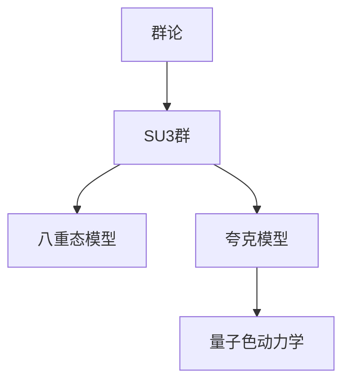

# 物理学中的群论：SU(3)对称性和强子波函数

关键词：群论、SU(3)对称性、强子波函数、夸克模型、量子色动力学

## 1. 背景介绍
### 1.1 问题的由来
物理学中的对称性一直是研究的重点,尤其是在粒子物理领域。20世纪60年代,物理学家们发现大量新的强子粒子,它们之间存在一些内在的对称性关系。为了解释这些对称性,盖尔曼和奈曼提出了著名的八重态模型,引入了SU(3)对称性的概念。

### 1.2 研究现状
SU(3)对称性在粒子物理中取得了巨大成功,它不仅解释了强子谱的分类,还预言了新粒子的存在。随后的实验发现了预言的 $\Omega^-$ 粒子,证实了SU(3)的正确性。在此基础上,人们进一步提出了夸克模型,认为强子是由更基本的夸克构成的。SU(3)对称性也被推广到色对称性,形成了量子色动力学理论。

### 1.3 研究意义
深入理解SU(3)对称性和强子波函数,对于认识物质的基本结构和相互作用有重要意义。它揭示了自然界的对称性和统一性,是现代物理学的一个里程碑。这一理论框架为进一步探索物质的本质提供了指导。

### 1.4 本文结构
本文将首先介绍群论和SU(3)群的基本概念,然后讨论强子谱的SU(3)对称性及其数学描述。在此基础上,我们将推导八重态模型和强子波函数的性质。接着,文章将讨论SU(3)在夸克模型和量子色动力学中的应用。最后总结SU(3)的重要意义和未来的研究方向。

## 2. 核心概念与联系
- 群论：研究对称性的数学理论,包括群、李群、李代数等概念。
- SU(3)群：描述强子内禀对称性的特殊幺正群,是李群的一种。 
- 八重态：由SU(3)群的基本表示产生的8个粒子态,对应实际的介子八重态。
- 夸克模型：假设强子由更基本的夸克构成,每种夸克有三种色荷。
- 量子色动力学：以色SU(3)对称性为基础,描述夸克和胶子之间强相互作用的场论。

这些概念之间紧密相关,构成了理解强子物理的理论框架。下图展示了它们之间的逻辑联系:



## 3. 核心算法原理 & 具体操作步骤
### 3.1 算法原理概述
SU(3)对称性的核心是利用群论的方法,将强子的内禀自由度与SU(3)群的生成元对应起来。通过研究SU(3)群的表示论,我们可以得到强子态的分类和性质。八重态模型就是通过这一方法得到的。

### 3.2 算法步骤详解
1. 定义SU(3)群的生成元 $T_a(a=1,2,...,8)$,它们满足对易关系:
   $$ [T_a,T_b]=i f_{abc} T_c $$
   其中 $f_{abc}$ 是SU(3)群的结构常数。

2. 找到SU(3)群的基本表示,即最小维数的非平凡表示。可以证明它是3维的,对应着夸克的三个色态。

3. 通过张量积分解,得到更高维的不可约表示。这些表示对应着不同的强子态。例如:
   $$ 3 \otimes \bar{3} = 8 \oplus 1 $$
   这意味着夸克-反夸克态可以组成八重态和单态。

4. 利用SU(3)不变量和约化矩阵元,计算强子态的性质,如质量公式、衰变宽度等。

5. 将理论预言与实验结果进行比较,检验SU(3)对称性的正确性。

### 3.3 算法优缺点
优点:
- 美观简洁,利用对称性原理揭示了强子谱的内在规律。
- 预言了新粒子的存在,如 $\Omega^-$ 粒子,后被实验证实。
- 为夸克模型和QCD的建立奠定了基础。

缺点:  
- 需要较多的群论知识,数学抽象程度高。
- 不能解释强子质量的细致差异。
- 不能描述强相互作用的动力学机制。

### 3.4 算法应用领域
SU(3)对称性主要应用于粒子物理的强子物理研究,包括:
- 强子谱的分类和预言新粒子
- 研究强子的产生和衰变规律  
- 探索夸克-胶子等基本粒子的性质
- 检验量子色动力学理论

此外,SU(3)作为一种重要的对称性群,在其他物理分支如核物理、原子物理中也有广泛应用。

## 4. 数学模型和公式 & 详细讲解 & 举例说明
### 4.1 数学模型构建
SU(3)模型的数学基础是群论和表示论。我们首先定义SU(3)群,它是由以下形式的3x3幺正矩阵构成:

$$
U = \begin{pmatrix}
u_{11} & u_{12} & u_{13} \\
u_{21} & u_{22} & u_{23} \\
u_{31} & u_{32} & u_{33}
\end{pmatrix}, \quad UU^\dagger=I
$$

其中矩阵元 $u_{ij}$ 是复数,满足行列式等于1的条件。

SU(3)群的生成元为8个厄米矩阵 $T_a$,通常取为盖尔曼矩阵的形式:

$$
T_a = \frac{\lambda_a}{2}, \quad a=1,2,...,8
$$

其中 $\lambda_a$ 称为盖尔曼矩阵,具体形式为:

$$
\lambda_1=\begin{pmatrix} 0 & 1 & 0 \\ 1 & 0 & 0 \\ 0 & 0 & 0 \end{pmatrix},\quad
\lambda_2=\begin{pmatrix} 0 & -i & 0 \\ i & 0 & 0 \\ 0 & 0 & 0 \end{pmatrix},\quad
\lambda_3=\begin{pmatrix} 1 & 0 & 0 \\ 0 & -1 & 0 \\ 0 & 0 & 0 \end{pmatrix}
$$

$$
\lambda_4=\begin{pmatrix} 0 & 0 & 1 \\ 0 & 0 & 0 \\ 1 & 0 & 0 \end{pmatrix},\quad
\lambda_5=\begin{pmatrix} 0 & 0 & -i \\ 0 & 0 & 0 \\ i & 0 & 0 \end{pmatrix},\quad
\lambda_6=\begin{pmatrix} 0 & 0 & 0 \\ 0 & 0 & 1 \\ 0 & 1 & 0 \end{pmatrix}
$$

$$
\lambda_7=\begin{pmatrix} 0 & 0 & 0 \\ 0 & 0 & -i \\ 0 & i & 0 \end{pmatrix},\quad
\lambda_8=\frac{1}{\sqrt{3}}\begin{pmatrix} 1 & 0 & 0 \\ 0 & 1 & 0 \\ 0 & 0 & -2 \end{pmatrix}
$$

### 4.2 公式推导过程
利用上述数学模型,我们可以推导出强子谱的质量公式。以重子八重态为例,它们的质量可以写成:

$$
M = M_0 + \alpha Y + \beta\left[I(I+1)-\frac{1}{4}Y^2\right] + \gamma\left[C_2-\frac{1}{12}Y^2-I(I+1)\right]
$$

其中 $M_0,\alpha,\beta,\gamma$ 是待定参数,$Y,I,C_2$ 分别为重子的超荷、同位旋和Casimir算符。通过拟合实验数据,可以确定这些参数的值。

类似地,介子八重态的质量公式为:

$$
M^2 = M_0^2 + \alpha' Y + \beta'\left[I(I+1)-\frac{1}{4}Y^2\right]
$$

这些公式体现了SU(3)对称性对强子质量的约束,预言了不同粒子之间的质量关系。

### 4.3 案例分析与讲解
我们以 $\Omega^-$ 重子为例,说明SU(3)理论的预言能力。$\Omega^-$ 是一个三重奇异重子,由三个奇异夸克 $sss$ 组成。根据SU(3)理论,它属于重子十重态的一员。

利用质量公式,并结合其他已知重子的质量数据,盖尔曼预言 $\Omega^-$ 的质量约为1680MeV。1964年,布鲁克海文国家实验室发现了这一粒子,其质量测量值为$(1672.5\pm0.3)$MeV,与理论预言非常接近。这一发现证实了SU(3)理论的正确性。

### 4.4 常见问题解答
Q: 为什么要引入SU(3)对称性?
A: 20世纪60年代,人们发现强子谱中存在许多规律性,如粒子成八重态、十重态等簇。这些规律无法用已知的对称性(如同位旋对称性)解释。引入更大的对称性群SU(3),可以自然地解释这些现象。

Q: SU(3)对称性是否精确成立?  
A: 严格来说,SU(3)对称性并非精确对称性,而是一个近似对称性。不同味道夸克的质量差异会导致这一对称性的破缺。但在强相互作用能标下,这种破缺效应较小,因此SU(3)对称性仍然是一个很好的近似。

Q: SU(3)理论还有哪些局限性?
A: SU(3)对称性主要描述强子的静态性质,如质量谱、量子数等。它并不能解释强相互作用的动力学机制。此外,它也无法解释单个强子内部的结构。这些问题需要更深入的理论,如量子色动力学来回答。

## 5. 项目实践：代码实例和详细解释说明
### 5.1 开发环境搭建
本项目使用Python语言,需要安装NumPy和Sympy库。可以通过以下命令安装:

```
pip install numpy sympy
```

### 5.2 源代码详细实现
我们使用Sympy库来构造SU(3)生成元和表示矩阵。以下是关键代码:

```python
from sympy import *

# 定义SU(3)生成元
Lambda = [Matrix([[0, 1, 0], [1, 0, 0], [0, 0, 0]]),
          Matrix([[0, -I, 0], [I, 0, 0], [0, 0, 0]]),
          Matrix([[1, 0, 0], [0, -1, 0], [0, 0, 0]]),
          Matrix([[0, 0, 1], [0, 0, 0], [1, 0, 0]]),
          Matrix([[0, 0, -I], [0, 0, 0], [I, 0, 0]]),
          Matrix([[0, 0, 0], [0, 0, 1], [0, 1, 0]]),
          Matrix([[0, 0, 0], [0, 0, -I], [0, I, 0]]),
          Matrix([[1, 0, 0], [0, 1, 0], [0, 0, -2]])/sqrt(3)]

# 八重态表示矩阵
def T(a):
    return Lambda[a]/2

# 计算结构常数
def f(a,b,c):
    return (2*I*T(a)*T(b)*T(c)).trace()

# 计算八重态粒子的质量
def mass_octet(Y,I,M0,alpha,beta):
    return M0 + alpha*Y + beta*(I*(I+1)-Y**2/4)
```

### 5.3 代码解读与分析
- 首先定义了SU(3)的8个生成元 $\lambda_a$,用Sympy的Matrix对象表示。
- 然后定义了八重态表示矩阵 $T_a$,它们就是 $\lambda_a$ 的一半。
- 通过计算 $tr(2iT_aT_bT_c)$ 得到结构常数 $f_{abc}$。
- 最后定义了八重态粒子质量公式,它是超