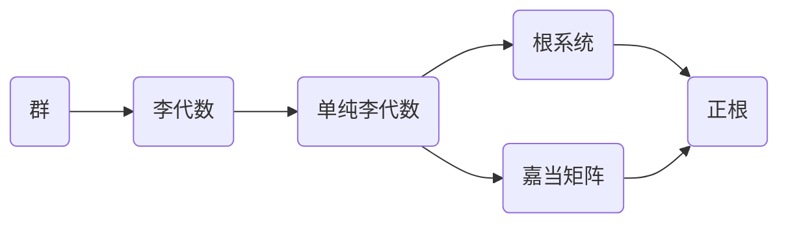

# 物理学中的群论：用嘉当矩阵计算单纯李代数的全部正根

关键词：群论, 单纯李代数, 嘉当矩阵, 根系统, 物理学

## 1. 背景介绍

### 1.1 问题的由来
群论作为现代数学的重要分支,在物理学中有着广泛的应用。尤其是在量子力学、粒子物理等领域,群论提供了描述对称性的数学语言。单纯李代数作为一类特殊的李代数,其根系统蕴含了丰富的物理信息。如何高效计算单纯李代数的全部正根,成为了物理学家和数学家共同关注的问题。

### 1.2 研究现状
目前,计算单纯李代数正根的主要方法包括直接构造法、反射生成法等。这些方法虽然可以得到正根,但计算效率较低,尤其是对于高阶李代数。近年来,一些学者尝试利用嘉当矩阵(Cartan Matrix)的特殊性质,提出了新的计算方法。但如何系统地利用嘉当矩阵计算单纯李代数的全部正根,仍有待进一步研究。

### 1.3 研究意义 
发展高效的正根计算方法,对于深入理解单纯李代数的结构以及在物理学中的应用具有重要意义。一方面,正根包含了李代数的重要信息,是研究李代数表示论的基础。另一方面,在粒子物理的各种模型中,正根往往对应着基本粒子,揭示了物质结构的奥秘。因此,探索利用嘉当矩阵计算正根的新方法,有助于推动群论和物理学的交叉研究。

### 1.4 本文结构
本文将首先介绍群论和李代数的基本概念,阐明嘉当矩阵与单纯李代数根系统的关系。然后,详细讲解利用嘉当矩阵计算正根的核心算法原理和步骤。接着,给出算法的数学模型和公式推导过程,并结合具体案例进行分析。在此基础上,提供算法的代码实现和应用示例。最后,总结全文,展望该算法在物理学研究中的应用前景和未来挑战。

## 2. 核心概念与联系

在深入探讨利用嘉当矩阵计算单纯李代数正根之前,我们首先回顾一些核心概念: 

- 群(Group):一种集合G和二元运算 $\cdot$ 的代数结构,满足封闭性、结合律、单位元、逆元四条性质。
- 李代数(Lie Algebra):一个带有李括号运算 $[\cdot,\cdot]$ 的向量空间,满足双线性、自反性、雅可比等式。
- 单纯李代数(Simple Lie Algebra):不含非平凡理想的有限维李代数。
- 根(Root):李代数 $\mathfrak{g}$ 的一种特殊元素 $\alpha$,满足 $[h,e_\alpha]=\alpha(h)e_\alpha,\forall h\in\mathfrak{h}$。
- 正根(Positive Root):可以表示为单根线性组合、系数非负的根。
- 嘉当矩阵(Cartan Matrix):由单根的内积给出的整系数方阵,刻画了单纯李代数的结构信息。

这些概念之间存在着紧密的内在联系。单纯李代数可分解为Cartan子代数和根子空间,其结构完全由嘉当矩阵决定。正根作为根系统的一部分,蕴含了李代数的表示论信息。因此,研究利用嘉当矩阵计算正根,有助于从代数和几何的角度深入理解单纯李代数的性质。

## 3. 核心算法原理 & 具体操作步骤

### 3.1 算法原理概述
本文提出的利用嘉当矩阵计算单纯李代数全部正根的算法,基于以下事实:
1. 单纯李代数的正根可以通过单根的线性组合生成。
2. 嘉当矩阵包含了单根之间的内积信息。
3. 正根系统具有一定的组合结构。

因此,该算法的基本思路是:首先根据嘉当矩阵求出单根,然后利用单根的线性组合,递归生成全部正根。在生成过程中,通过嘉当矩阵判断根的正负性,并利用向量的线性相关性,避免重复计算。

### 3.2 算法步骤详解
输入:单纯李代数的嘉当矩阵 $A=(a_{ij})_{n\times n}$
输出:全部正根向量的集合 $\Phi^+$

Step 1: 初始化单根集合 $\Delta=\{\alpha_1,\cdots,\alpha_n\}$,其中 $\alpha_i=(0,\cdots,1,\cdots,0)$ 为第i个分量为1,其余为0的向量。

Step 2: 初始化正根集合 $\Phi^+=\Delta$。

Step 3: 对于每个单根 $\alpha_i\in\Delta$,执行以下操作:
   
   (a) 对于每个正根 $\beta\in\Phi^+$,计算 $\gamma=\alpha_i+\beta$。
   
   (b) 利用嘉当矩阵判断 $\gamma$ 是否为正根:若 $(\gamma,\gamma)=\sum_{p,q}a_{pq}\gamma_p\gamma_q>0$,则 $\gamma$ 为正根。
   
   (c) 若 $\gamma$ 为正根且 $\gamma\notin\Phi^+$,则将其加入 $\Phi^+$。

Step 4: 重复Step 3,直到 $\Phi^+$ 不再变化。

Step 5: 输出正根集合 $\Phi^+$。

### 3.3 算法优缺点
该算法的主要优点在于:
1. 直接利用嘉当矩阵进行计算,避免了复杂的几何构造。  
2. 生成正根的过程是递归的,便于编程实现。
3. 通过判断向量的线性相关性,去除了重复计算。

但该算法也存在一些局限性:
1. 对于高阶李代数,正根数量较多,计算量较大。  
2. 算法生成的是正根向量,若要得到权重,还需进一步变换。
3. 目前只适用于单纯李代数,对于一般的李代数尚不能直接应用。

### 3.4 算法应用领域
该算法可以应用于以下领域:
- 李代数表示论:正根与最高权表示密切相关,是研究李代数表示的重要工具。
- 粒子物理:在各种统一场论模型中,基本粒子常对应于单纯李代数的正根。
- 组合数学:正根系统具有丰富的组合结构,与排列组合、图论等领域相关。
- 计算机科学:李代数在编码理论、量子计算等领域有重要应用。

## 4. 数学模型和公式 & 详细讲解 & 举例说明

### 4.1 数学模型构建
为了利用嘉当矩阵计算正根,我们首先建立数学模型。设 $\mathfrak{g}$ 为n维单纯李代数,其嘉当矩阵为 $A=(a_{ij})_{n\times n}$,单根为 $\alpha_1,\cdots,\alpha_n$。我们的目标是求出全部正根 $\Phi^+$。

根据李代数理论,正根可以表示为单根的线性组合:

$$\beta=\sum_{i=1}^nk_i\alpha_i,\quad k_i\in\mathbb{Z}_{\geq0}$$

因此,计算正根的关键是确定单根线性组合的系数。为此,我们引入嘉当矩阵。对于任意两个根 $\gamma=\sum_{i}p_i\alpha_i,\delta=\sum_{i}q_i\alpha_i$,它们的内积可以用嘉当矩阵表示:

$$(\gamma,\delta)=\sum_{i,j}p_iq_ja_{ij}$$

特别地,根 $\gamma$ 的长度平方为:

$$(\gamma,\gamma)=\sum_{i,j}p_ip_ja_{ij}$$

根据定义,正根的长度平方大于0。因此,我们可以利用嘉当矩阵判断一个向量是否为正根。

### 4.2 公式推导过程
下面,我们详细推导算法中用到的公式。首先,考虑单根 $\alpha_i$ 和任意正根 $\beta$ 的线性组合 $\gamma=\alpha_i+\beta$。设 $\beta=\sum_{j}k_j\alpha_j$,则 $\gamma$ 的分量为:

$$\gamma_j=\begin{cases}
k_j+1, & j=i \\
k_j, & j\neq i
\end{cases}$$

根据公式(4),向量 $\gamma$ 的长度平方为:

$$\begin{aligned}
(\gamma,\gamma) &= \sum_{p,q}\gamma_p\gamma_qa_{pq} \\
&= \sum_{p,q}(k_p+\delta_{pi})(k_q+\delta_{qi})a_{pq} \\
&= \sum_{p,q}k_pk_qa_{pq}+2\sum_{p}k_pa_{pi}+a_{ii} \\
&= (\beta,\beta)+2(\beta,\alpha_i)+(\alpha_i,\alpha_i)
\end{aligned}$$

其中 $\delta_{ij}$ 为克罗内克符号。由于 $(\beta,\beta)>0,(\alpha_i,\alpha_i)>0$,所以 $\gamma$ 为正根的充要条件是:

$$(\beta,\alpha_i)\geq0$$

利用嘉当矩阵,上述条件可以写成:

$$\sum_{p}k_pa_{pi}\geq0$$

这就是算法中判断正根的公式。

### 4.3 案例分析与讲解
下面,我们以2维单纯李代数 $\mathfrak{sl}(3,\mathbb{C})$ 为例,演示算法的具体过程。该李代数的嘉当矩阵为:

$$A=\begin{pmatrix}
2 & -1 \\
-1 & 2
\end{pmatrix}$$

单根为 $\alpha_1=(1,0),\alpha_2=(0,1)$。根据算法步骤:

Step 1: 初始化单根集合 $\Delta=\{\alpha_1,\alpha_2\}$。

Step 2: 初始化正根集合 $\Phi^+=\{\alpha_1,\alpha_2\}$。

Step 3: 对于 $\alpha_1$,计算 $\gamma_1=\alpha_1+\alpha_1=(2,0),\gamma_2=\alpha_1+\alpha_2=(1,1)$。由于:

$$(\gamma_1,\gamma_1)=2\cdot2+0\cdot0=4>0$$

$$(\gamma_2,\gamma_2)=1\cdot2+1\cdot2-2\cdot1=2>0$$

所以 $\gamma_1,\gamma_2$ 均为正根。将其加入 $\Phi^+$。

类似地,对于 $\alpha_2$,计算 $\gamma_3=\alpha_2+\alpha_1=(1,1),\gamma_4=\alpha_2+\alpha_2=(0,2)$。可知 $\gamma_3,\gamma_4$ 均为正根。但 $\gamma_3$ 已在 $\Phi^+$ 中,不必重复添加。

Step 4: 重复Step 3,可知没有新的正根产生。

Step 5: 输出正根集合 $\Phi^+=\{(1,0),(0,1),(2,0),(1,1),(0,2)\}$。

这就是 $\mathfrak{sl}(3,\mathbb{C})$ 的全部正根。可以看出,利用嘉当矩阵,我们仅通过简单的向量运算,就得到了正根系统的完整信息。

### 4.4 常见问题解答
Q1: 对于非单纯李代数,该算法是否适用?
A1: 一般来说,非单纯李代数的根系统结构更加复杂,不能直接用嘉当矩阵刻画。但对于某些特殊类型,如仿射李代数,也可以定义广义的嘉当矩阵,并进行类似的计算。

Q2: 算法生成的正根向量如何与表示理论联系起来?
A2: 正根向量对应于李代数的根向量,进一步可以生成最高权表示的权向量。通过计算正根与最高权的内积,可以确定表示的维数和分解式。因此,正根计算是研究李代数表示论的基