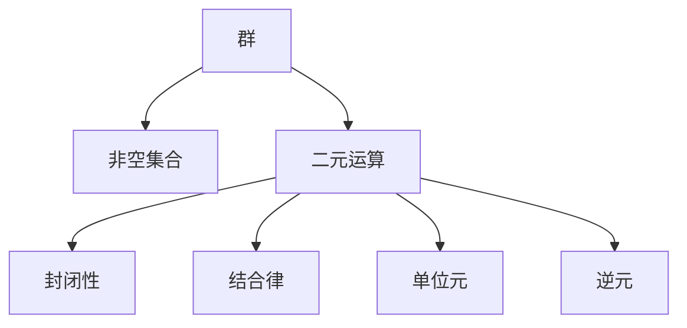
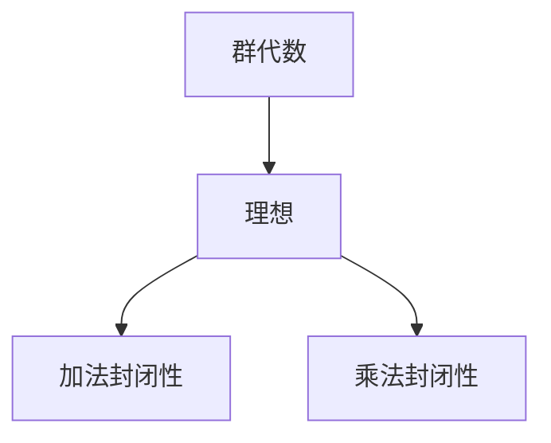
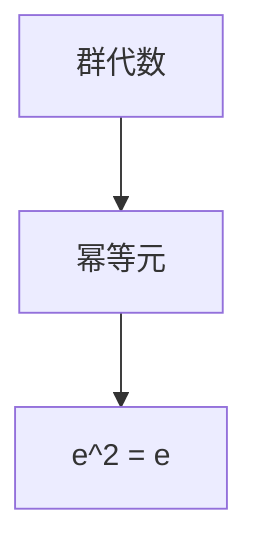

# 物理学中的群论：群代数的理想和幂等元

## 1. 背景介绍

### 1.1 问题的由来

物理学作为研究自然界规律的基础科学,一直以来都与数学理论密切相关。在现代物理学的发展过程中,群论作为一种强有力的数学工具,已经被广泛应用于各个领域。群论不仅为物理学家提供了一种描述对称性和不变量的语言,同时也为解决许多复杂问题提供了新的思路和方法。

在量子力学、相对论、粒子物理学等领域,群论扮演着至关重要的角色。例如,在研究基本粒子的内禀对称性时,我们需要借助群论来描述它们的内部结构和相互作用。同时,在相对论中,洛伦兹变换群描述了时空的对称性,为我们理解时空结构提供了新的视角。

然而,尽管群论在物理学中的应用已经取得了巨大的成就,但仍然存在一些挑战和未解决的问题。其中之一就是如何更好地理解群代数的理想和幂等元,以及它们在物理学中的意义和应用。

### 1.2 研究现状

群代数是群论的一个重要分支,它研究群的代数结构,特别是群的理想和幂等元。理想是群代数中的一个关键概念,它描述了群中某些元素的代数闭合性。而幂等元则是指在群中满足特殊条件的元素,它们在群的表示理论和量子计算等领域具有重要应用。

目前,群代数的理想和幂等元在数学领域已经有了深入的研究,但在物理学领域的应用还相对有限。一些物理学家已经开始探索将群代数的理论应用于量子力学、粒子物理学和凝聚态物理学等领域,但仍然存在一些理论和实践上的挑战。

### 1.3 研究意义

深入理解群代数的理想和幂等元对于物理学的发展具有重要意义。首先,它有助于我们更好地描述和研究物理系统的对称性和不变量,从而揭示自然界的基本规律。其次,群代数的理论可以为解决一些复杂的物理问题提供新的思路和方法,例如在量子计算和量子信息领域的应用。

此外,群代数的理想和幂等元在物理学中的应用也可能带来一些意想不到的发现和突破。正如历史上许多重大科学发现一样,它们往往源于不同领域知识的交叉融合。因此,将群代数的理论与物理学相结合,有望开辟新的研究方向,推动物理学的进一步发展。

### 1.4 本文结构

本文将系统地介绍群代数的理想和幂等元在物理学中的应用。我们将首先回顾群论和群代数的基本概念,然后深入探讨理想和幂等元的数学理论。接下来,我们将重点阐述它们在量子力学、相对论和粒子物理学等领域的应用,并给出具体的例子和案例分析。

此外,我们还将介绍一些实际的项目实践,包括代码实现和详细解释。最后,我们将总结群代数在物理学中的未来发展趋势和挑战,并提供相关的学习资源和工具推荐。

## 2. 核心概念与联系

在深入探讨群代数的理想和幂等元之前,我们首先需要回顾一些基本概念。

群(Group)是一种代数结构,由一个非空集合及其上定义的二元运算组成。群必须满足四个基本运算律:封闭性、结合律、存在单位元和存在逆元。群论研究群的性质、结构和表示,在数学和物理学中有着广泛的应用。

群代数(Group Algebra)是群论的一个重要分支,它将群的代数结构与线性代数相结合。在群代数中,我们将群的元素看作是一个向量空间的基,并定义了一种代数运算,使得这个向量空间成为一个代数。

群代数中的两个关键概念是理想(Ideal)和幂等元(Idempotent)。

理想是群代数中的一个子代数,它满足以下两个条件:

1. 对于理想中的任意两个元素,它们的和仍然属于该理想。
2. 对于理想中的任意元素和群代数中的任意元素,它们的乘积仍然属于该理想。

理想在群代数中扮演着重要的角色,它描述了群中某些元素的代数闭合性,并且与群的表示理论密切相关。

幂等元是指满足以下条件的元素:

$$
e^2 = e
$$

其中 $e$ 是群代数中的一个元素。幂等元在量子计算和量子信息领域有着重要应用,它们可以用于构建量子态和量子门电路。

理想和幂等元在群代数中扮演着重要的角色,它们不仅具有丰富的数学理论,同时也与物理学中的许多问题密切相关。在接下来的章节中,我们将深入探讨它们在物理学中的应用。

## 3. 核心算法原理 & 具体操作步骤

### 3.1 算法原理概述

在探讨群代数的理想和幂等元在物理学中的应用之前,我们需要先了解它们的核心算法原理和具体操作步骤。

理想的核心算法原理基于群代数的代数结构,它描述了群中某些元素的代数闭合性。具体来说,对于一个群代数 $A$ 中的子集 $I$,如果它满足以下两个条件,那么我们就称 $I$ 是 $A$ 的一个理想:

1. 对于 $I$ 中的任意两个元素 $x$ 和 $y$,它们的和 $x + y$ 仍然属于 $I$。
2. 对于 $I$ 中的任意元素 $x$ 和 $A$ 中的任意元素 $a$,它们的乘积 $ax$ 和 $xa$ 仍然属于 $I$。

判断一个子集是否为理想的算法步骤如下:

1. 给定一个群代数 $A$ 和它的一个子集 $I$。
2. 检查 $I$ 是否对加法封闭,即对于 $I$ 中的任意两个元素 $x$ 和 $y$,它们的和 $x + y$ 是否仍然属于 $I$。
3. 检查 $I$ 是否对乘法封闭,即对于 $I$ 中的任意元素 $x$ 和 $A$ 中的任意元素 $a$,它们的乘积 $ax$ 和 $xa$ 是否仍然属于 $I$。
4. 如果上述两个条件均满足,则 $I$ 是 $A$ 的一个理想;否则,它不是理想。

幂等元的核心算法原理则基于元素的特殊性质,即满足 $e^2 = e$ 的元素被称为幂等元。判断一个元素是否为幂等元的算法步骤如下:

1. 给定一个群代数 $A$ 和它的一个元素 $e$。
2. 计算 $e^2$,即 $e$ 与自身相乘的结果。
3. 检查 $e^2$ 是否等于 $e$。
4. 如果相等,则 $e$ 是一个幂等元;否则,它不是幂等元。

### 3.2 算法步骤详解

接下来,我们将详细解释上述算法的每一个步骤,以加深对它们的理解。

#### 3.2.1 理想算法步骤详解

1. **给定一个群代数 $A$ 和它的一个子集 $I$**

   群代数 $A$ 是一个代数结构,它由一个群 $G$ 及其上定义的线性组合构成。子集 $I$ 是 $A$ 中的一个子集,我们需要判断它是否为 $A$ 的一个理想。

2. **检查 $I$ 是否对加法封闭**

   对于 $I$ 中的任意两个元素 $x$ 和 $y$,我们需要检查它们的和 $x + y$ 是否仍然属于 $I$。如果存在某些 $x$ 和 $y$,使得 $x + y$ 不属于 $I$,那么 $I$ 就不是对加法封闭的,因此也不是 $A$ 的一个理想。

3. **检查 $I$ 是否对乘法封闭**

   对于 $I$ 中的任意元素 $x$ 和 $A$ 中的任意元素 $a$,我们需要检查它们的乘积 $ax$ 和 $xa$ 是否仍然属于 $I$。如果存在某些 $x$ 和 $a$,使得 $ax$ 或 $xa$ 不属于 $I$,那么 $I$ 就不是对乘法封闭的,因此也不是 $A$ 的一个理想。

4. **判断是否为理想**

   如果 $I$ 同时满足对加法和乘法的封闭性,那么它就是 $A$ 的一个理想;否则,它不是理想。

#### 3.2.2 幂等元算法步骤详解

1. **给定一个群代数 $A$ 和它的一个元素 $e$**

   群代数 $A$ 是一个代数结构,我们需要判断它的一个元素 $e$ 是否为幂等元。

2. **计算 $e^2$**

   我们需要计算 $e$ 与自身相乘的结果 $e^2$。在群代数中,元素的乘法遵循线性组合的运算规则。

3. **检查 $e^2$ 是否等于 $e$**

   如果 $e^2$ 等于 $e$,那么 $e$ 就满足幂等元的定义 $e^2 = e$;否则,它不是幂等元。

4. **判断是否为幂等元**

   根据上一步的结果,如果 $e^2 = e$,那么 $e$ 就是一个幂等元;否则,它不是幂等元。

通过上述步骤,我们可以判断一个子集是否为理想,以及一个元素是否为幂等元。这些算法步骤为我们研究群代数的理想和幂等元在物理学中的应用奠定了基础。

### 3.3 算法优缺点

#### 3.3.1 理想算法的优缺点

**优点:**

1. **简单直观:** 理想算法的原理和步骤非常直观,易于理解和实现。
2. **广泛应用:** 理想是群代数中的一个基本概念,理解和判断理想对于进一步研究群代数及其在物理学中的应用至关重要。
3. **高效性能:** 对于有限群代数,理想算法的时间复杂度为 $O(n^2)$,其中 $n$ 是群代数的维数,具有较好的性能。

**缺点:**

1. **有限性:** 理想算法仅适用于有限群代数,对于无限维的群代数,它可能无法直接应用。
2. **计算复杂度:** 尽管对于有限群代数具有较好的性能,但当群代数的维数增加时,计算复杂度仍然会快速增长。
3. **理论局限性:** 理想算法只能判断一个子集是否为理想,但无法深入探究理想的其他性质和结构。

#### 3.3.2 幂等元算法的优缺点

**优点:**

1. **简单高效:** 幂等元算法的原理和步骤非常简单,只需要计算一个元素的平方并与自身比较,时间复杂度为 $O(1)$,具有极高的效率。
2. **广泛应用:** 幂等元在量子计算和量子信息领域有着重要应用,因此判断一个元素是否为幂等元具有实际意义。
3. **无限性:** 与理想算法不同,幂等元算法可以应用于无限维的群代数。

**缺点:**

1. **单一功能:** 幂等元算法只能判断一个元素是否为幂等元,无法进一步探究幂等元的其他性质和应用。