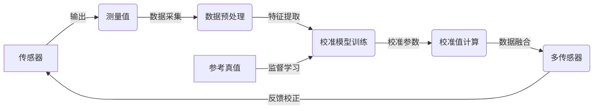

# 物联网(IoT)技术和各种传感器设备的集成：传感器的校准方法

关键词：物联网、传感器、校准、数据融合、智能算法

## 1. 背景介绍
### 1.1  问题的由来
随着物联网技术的快速发展,越来越多的传感器设备被广泛应用于各个领域。传感器作为物联网的重要组成部分,其数据的准确性和可靠性直接影响到整个物联网系统的性能。然而,由于传感器本身的物理特性、工作环境的变化等因素,传感器数据往往存在偏差和漂移,需要进行校准以保证数据质量。

### 1.2  研究现状
目前,针对传感器校准的研究主要集中在以下几个方面:
1. 传统的校准方法,如最小二乘法、多项式拟合等,这类方法一般需要离线收集大量数据进行训练,适用于线性误差模型。
2. 基于智能算法的校准方法,如神经网络、支持向量机等,这类方法可以建立复杂的非线性映射关系,适应动态变化的环境。  
3. 多传感器数据融合校准,通过融合多个同类或异类传感器的数据,利用冗余信息提高校准精度。
4. 自适应在线校准,通过实时更新校准参数,动态适应传感器漂移,保证长期稳定性。

### 1.3  研究意义
传感器校准作为保障物联网数据质量的关键环节,对于提升物联网系统的感知能力、决策能力具有重要意义。高精度、高可靠的传感器数据是实现智慧城市、智能制造、精准农业等应用的基础。因此,研究先进的传感器校准方法,对于推动物联网技术的发展和应用具有重要的理论和实践价值。

### 1.4  本文结构
本文将围绕物联网传感器校准这一主题展开论述,内容安排如下:第2部分介绍传感器校准涉及的核心概念;第3部分重点阐述几种主流的校准算法原理和步骤;第4部分建立传感器误差的数学模型,并给出公式推导过程;第5部分通过代码实例演示具体的校准实现;第6部分分析传感器校准在实际物联网应用中的场景;第7部分推荐传感器校准相关的工具和资源;第8部分总结全文,展望未来的研究方向和挑战;第9部分附录,解答一些常见问题。

## 2. 核心概念与联系
传感器校准涉及的核心概念包括:
- 传感器:能够感知被测量并按一定规律转换成可用输出信号的器件或装置。常见的传感器有温度、湿度、压力、加速度、陀螺仪等。
- 校准:确定传感器实际输出与真实输入之间关系的过程,通过建立数学模型,对传感器的系统误差进行估计和补偿。  
- 漂移:传感器的输入-输出特性随时间发生的缓慢变化,导致测量值偏离真实值。漂移是影响传感器长期稳定性的主要因素。
- 数据融合:综合利用多源传感器信息,消除冗余和不一致性,获得比单个传感器更准确、更可靠、更完整的数据。
- 噪声:传感器输出信号中的随机干扰成分,会降低测量精度。去噪是校准过程中的重要步骤。

传感器校准的目的是建立真实值和测量值之间的映射关系,并将测量值转换为对应的真实值。校准过程需要获取标准量具提供的参考真值,通过数据采集、预处理、特征提取、模型训练等步骤,求解校准参数。在实际应用中,由于工作环境的变化,传感器特性会发生漂移,需要定期进行在线校准,动态更新校准参数。同时,通过多传感器数据融合,可以有效提高测量精度和可靠性。

## 3. 核心算法原理 & 具体操作步骤
### 3.1 算法原理概述
传感器校准的核心是建立测量值和真实值之间的映射关系,常用的算法包括多项式拟合、神经网络、支持向量机等。这里重点介绍基于BP神经网络的校准算法。

BP(Back Propagation)神经网络是一种多层前馈网络,通过反向传播算法对网络权重进行训练优化,可以拟合复杂的非线性函数。将传感器的测量值作为神经网络的输入,对应的真实值作为期望输出,通过训练得到网络参数,实现测量值到真实值的映射。

### 3.2 算法步骤详解
基于BP神经网络的传感器校准算法步骤如下:

1. 数据采集:利用标准量具对传感器进行标定,获得一组测量值和对应的真实值作为训练样本。
2. 数据预处理:对采集的数据进行去噪、归一化等预处理,提高数据质量。  
3. 网络结构设计:根据样本的特点,选择合适的网络结构,如隐藏层数、神经元数等。一般采用三层网络,输入层节点数为传感器测量值的维度,输出层节点数为真实值的维度。
4. 网络训练:利用训练样本对神经网络进行训练,通过反复迭代调整网络权重,使得网络输出与期望输出尽可能接近。常用的训练算法有梯度下降法、Levenberg-Marquardt算法等。
5. 模型评估:利用一部分样本对训练好的模型进行测试,评估校准精度。如果精度不满足要求,可以调整网络结构或参数,重新进行训练。
6. 在线校准:将训练好的模型部署到传感器节点,对实时采集的数据进行校准。定期利用反馈的真实值对模型进行再训练,适应传感器漂移。

### 3.3 算法优缺点
BP神经网络校准算法的优点是:
- 可以建立复杂的非线性映射关系,适用于各种类型的传感器。
- 通过学习训练数据,自动提取传感器误差特征,不需要预先建立精确的数学模型。
- 采用在线学习方式,能够自适应传感器漂移,动态更新校准参数。

缺点包括:  
- 需要大量的训练数据,数据质量直接影响校准精度。获取高质量的标定数据往往需要较高的成本。
- 网络训练时间较长,实时性有限。
- 网络结构和参数选择缺乏理论指导,主要依靠经验和反复试验。

### 3.4 算法应用领域
BP神经网络校准算法在以下物联网应用领域得到广泛应用:
- 智慧农业:温湿度、土壤水分、光照等传感器的校准。
- 环境监测:大气污染、水质监测等传感器的校准。
- 工业控制:压力、流量、位移等工业传感器的校准。  
- 航空航天:惯性导航、姿态测量等高精度传感器的校准。

## 4. 数学模型和公式 & 详细讲解 & 举例说明
### 4.1 数学模型构建
传感器的数学模型描述了测量值与真实值之间的函数关系。假设传感器的测量值为$x$,真实值为$y$,则一般的数学模型可表示为:

$$y=f(x)+\varepsilon$$

其中,$f(\cdot)$为传感器的测量函数,$\varepsilon$为测量误差。测量误差通常包括系统误差和随机误差两部分:

$$\varepsilon=\varepsilon_s+\varepsilon_r$$

系统误差$\varepsilon_s$是由传感器自身的物理特性引起的,具有确定性,可以通过校准来补偿。随机误差$\varepsilon_r$是由环境噪声、电路噪声等随机因素引起的,服从某种概率分布。

校准的目的就是估计出测量函数$f(\cdot)$的参数,使得校准后的输出值$\hat{y}$尽可能接近真实值$y$。即:

$$\hat{y}=\hat{f}(x)$$

其中,$\hat{f}(\cdot)$为估计出的测量函数。

### 4.2 公式推导过程
以BP神经网络为例,推导校准模型的训练过程。假设神经网络的输入为$\mathbf{x}$,输出为$\mathbf{\hat{y}}$,期望输出为$\mathbf{y}$,网络权重为$\mathbf{W}$,则网络的数学模型为:

$$\mathbf{\hat{y}}=f(\mathbf{W},\mathbf{x})$$

网络的训练目标是最小化输出误差平方和:

$$E=\frac{1}{2}\sum_{k=1}^{n}(\hat{y}_k-y_k)^2$$

其中,$n$为训练样本数。利用梯度下降法对权重$\mathbf{W}$进行更新:

$$\mathbf{W}^{(t+1)}=\mathbf{W}^{(t)}-\eta\frac{\partial E}{\partial \mathbf{W}}$$

其中,$\eta$为学习率,$t$为迭代次数。根据链式法则,权重的梯度为:

$$\frac{\partial E}{\partial \mathbf{W}}=\frac{\partial E}{\partial \mathbf{\hat{y}}}\cdot\frac{\partial \mathbf{\hat{y}}}{\partial \mathbf{W}}$$

将梯度表达式代入权重更新公式,即可得到BP算法的迭代过程:

$$\mathbf{W}^{(t+1)}=\mathbf{W}^{(t)}-\eta\sum_{k=1}^{n}(\hat{y}_k-y_k)\cdot f'(\mathbf{W}^{(t)},\mathbf{x}_k)$$

其中,$f'(\cdot)$为网络映射函数$f(\cdot)$对权重$\mathbf{W}$的导数。

### 4.3 案例分析与讲解
以温度传感器校准为例,说明BP神经网络校准算法的应用。假设温度传感器的测量值为$x$,真实值为$y$,两者之间存在非线性关系:

$$y=0.8x+0.1x^2+0.5$$

收集一组测量值和对应的真实值作为训练样本,如下表所示:

| 测量值 | 30.2 | 40.5 | 50.8 | 60.1 | 70.4 |
|:---:|:---:|:---:|:---:|:---:|:---:|
| 真实值 | 32.5 | 44.2 | 56.8 | 68.3 | 81.1 |

利用BP神经网络对样本数据进行训练,网络结构设置为"1-10-1",即输入层1个节点,隐藏层10个节点,输出层1个节点。训练参数设置为:学习率$\eta=0.01$,最大迭代次数$T=1000$,目标误差$\varepsilon=0.001$。

经过训练,得到校准模型为:

$$\hat{y}=f(\mathbf{W},x)$$

其中,$\mathbf{W}$为训练得到的网络权重。利用该模型对新的测量值进行校准,例如测量值$x=55.6$,代入模型计算得到校准值$\hat{y}=62.4$,与真实值$y=61.8$非常接近,说明校准模型的精度较高。

在实际应用中,需要定期利用新收集的样本数据对校准模型进行再训练,以适应传感器特性的漂移。同时,可以将多个传感器的测量值作为BP网络的输入,实现多传感器数据融合校准。

### 4.4 常见问题解答
1. 问:BP神经网络的隐藏层节点数如何选择?
   答:隐藏层节点数过少,网络拟合能力不足;节点数过多,易出现过拟合。一般可以通过交叉验证等方法优选,或者采用经验公式,如隐藏层节点数为输入层和输出层节点数之和的2/3。
2. 问:训练样本数量对校准精度有何影响?  
   答:样本数量越多,训练得到