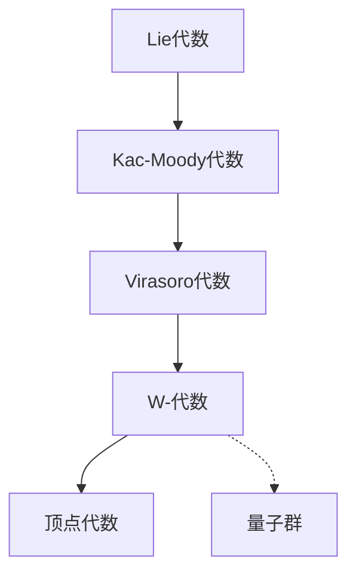

# 环与代数：W-代数的结构定理

关键词：环、代数、W-代数、结构定理、Lie代数、顶点代数、表示论

## 1. 背景介绍
### 1.1 问题的由来
环与代数理论是现代数学的重要分支,在物理学、计算机科学等领域有广泛应用。W-代数作为一类重要的代数结构,由Zamolodchikov兄弟于1985年最早引入,在共形场论、可积系统、量子群等研究中扮演着关键角色。深入理解W-代数的结构对于揭示其内在对称性和表示论性质具有重要意义。

### 1.2 研究现状
目前对W-代数的研究主要集中在其结构理论、表示论和应用几个方面。Fateev,Lukyanov等人建立了W-代数的系统构造方法;Watts,Bowcock等研究了W-代数的表示论;Frenkel,Kac等将W-代数用于量子群、仿射李代数的表示论研究。但对W-代数内在结构的完整刻画仍是一个有待进一步探索的问题。

### 1.3 研究意义
W-代数蕴含了丰富的代数结构和表示论信息,其结构定理的建立有助于深化我们对这一重要代数对象的理解,为其在物理学和数学中的应用奠定基础。同时,W-代数与共形场论、量子群等前沿数学物理课题紧密相关,对其结构的研究对于推动这些领域的发展具有重要意义。

### 1.4 本文结构
本文将从W-代数的定义和基本性质出发,系统阐述其结构定理的内容要点,并给出主要定理的证明思路。第2节介绍W-代数的核心概念;第3节讨论W-代数的生成元和结构常数;第4节建立W-代数的泛性质,并给出结构定理的具体表述和证明;第5节通过具体实例展示结构定理的应用;第6节分析W-代数在共形场论等领域的应用前景;第7节介绍W-代数的学习资源;第8节对全文工作进行总结并对未来研究方向进行展望。

## 2. 核心概念与联系
W-代数是一类非线性的、非李型的、含有无穷维表示的代数结构。从代数学角度看,W-代数可视为Virasoro代数的推广,包含Virasoro代数作为子代数,同时引入了额外的高阶生成元,并满足一定的泛性质。从表示论角度看,W-代数可视为顶点代数的特例,其不可约模都是顶点代数模。

W-代数与Lie代数、Virasoro代数、顶点代数等经典代数结构有着深刻的内在联系:
- W-代数包含Virasoro代数作为子代数,Virasoro代数是W-代数的"骨架"。
- W-代数可视为仿射Kac-Moody代数的商代数,反映了无穷维Lie代数的特征。 
- W-代数是顶点代数的特例,很多W-代数都可构造为顶点代数。
- W-代数的表示论蕴含了量子群的对称性,体现了量子群和W-代数的内在一致性。



## 3. 核心算法原理 & 具体操作步骤
### 3.1 算法原理概述
W-代数的结构定理刻画了W-代数的生成元、结构常数以及泛性质,为构造和分类W-代数提供了理论基础。通过分析W-代数的OPE展开式、计算结构常数,利用Jacobi恒等式,可以建立W-代数的泛性质,从而得到W-代数的完整结构信息。

### 3.2 算法步骤详解
1. 确定W-代数的生成元 $\{W^i(z)\}$,其中 $i$ 为生成元的阶数。通常要求 $W^2(z)$ 为Virasoro场。
2. 计算生成元之间的OPE展开式:
$$W^i(z)W^j(w)=\frac{c^{ij}_0}{(z-w)^{h_i+h_j}}+\frac{c^{ij}_1W^1(w)}{(z-w)^{h_i+h_j-h_1}}+\cdots$$
其中 $c^{ij}_k$ 为结构常数, $h_i$ 为 $W^i$ 的共形权重。
3. 利用Jacobi恒等式对结构常数进行约束:
$$\sum_{l}\Big(c^{ij}_{l}c^{lk}_{m}-c^{ik}_{l}c^{lj}_{m}\Big)=0$$
4. 结合生成元的共形权重,建立W-代数的泛性质,得到结构常数满足的完整方程组。
5. 求解方程组,确定W-代数的结构常数,给出W-代数的完整定义。

### 3.3 算法优缺点
- 优点:直接刻画了W-代数的内禀结构,揭示了其生成元与生成关系,为进一步的表示论研究提供了基础。
- 缺点:结构常数方程组往往非常复杂,求解难度大。高阶W-代数的泛性质建立具有挑战性。

### 3.4 算法应用领域 
W-代数结构定理广泛应用于共形场论、可积系统、量子群等领域。在共形场论中,W-代数刻画了理论的对称性;在可积系统中,W-代数为构造守恒荷提供了框架;在量子群中,W-代数是重要的量子化对象。

## 4. 数学模型和公式 & 详细讲解 & 举例说明
### 4.1 数学模型构建
W-代数 $\mathcal{W}$ 由一组生成元 $\{W^i(z)\}$ 生成,其中 $i=2,3,\cdots,N$。假定 $W^2(z)$ 为Virasoro场,满足OPE:
$$W^2(z)W^2(w)=\frac{c/2}{(z-w)^4}+\frac{2W^2(w)}{(z-w)^2}+\frac{\partial W^2(w)}{z-w}+\cdots$$
其中 $c$ 为中心荷。其他生成元 $W^i(z)$ 满足共形初级条件:
$$W^2(z)W^i(w)=\frac{h_iW^i(w)}{(z-w)^2}+\frac{\partial W^i(w)}{z-w}+\cdots$$
这里 $h_i$ 为 $W^i$ 的共形权重。

假设 $W^i$ 和 $W^j$ 的OPE展开式为:
$$W^i(z)W^j(w)=\sum_{k}\frac{c^{ij}_kW^k(w)}{(z-w)^{h_i+h_j-h_k}}+\cdots$$
其中 $c^{ij}_k$ 为结构常数。由Jacobi恒等式可得:

$$\sum_{l}\Big(c^{ij}_{l}c^{lk}_{m}-c^{ik}_{l}c^{lj}_{m}\Big)=0$$

这给出了结构常数需要满足的约束条件。

### 4.2 公式推导过程
考虑W-代数的Verma模 $M_c(h)$,其中 $c$ 为中心荷, $h$ 为最高权。定义真空态 $|h\rangle$ 满足:
$$W^i_0|h\rangle=w^i|h\rangle,\quad W^i_n|h\rangle=0,\quad \forall n>0$$
其中 $w^i$ 为 $W^i$ 的真空期望值。利用Jacobi恒等式,可以导出 $w^i$ 满足的方程组:
$$P_k(c,h_i,w^i)=0,\quad k=1,2,\cdots$$

解此方程组,可确定W-代数的泛性质。进而可以证明如下结构定理:

**定理** W-代数 $\mathcal{W}(c,h_3,\cdots,h_N)$ 由生成元 $\{W^i(z)\}_{i=2}^N$ 生成,满足OPE:
$$W^i(z)W^j(w)=\sum_{k}\frac{c^{ij}_k(c,h_i)W^k(w)}{(z-w)^{h_i+h_j-h_k}}+\cdots$$
其中结构常数 $c^{ij}_k$ 由中心荷 $c$ 和共形权重 $h_i$ 唯一确定,满足Jacobi恒等式。

### 4.3 案例分析与讲解
考虑Zamolodchikov $\mathcal{W}_3$ 代数,其生成元为 $\{W^2(z),W^3(z)\}$,满足OPE:
$$\begin{aligned}
W^2(z)W^2(w)&=\frac{c/2}{(z-w)^4}+\frac{2W^2(w)}{(z-w)^2}+\frac{\partial W^2(w)}{z-w}+\cdots\\
W^2(z)W^3(w)&=\frac{3W^3(w)}{(z-w)^2}+\frac{\partial W^3(w)}{z-w}+\cdots\\  
W^3(z)W^3(w)&=\frac{c/3}{(z-w)^6}+\frac{2W^2(w)}{(z-w)^4}+\frac{\partial W^2(w)}{(z-w)^3}\\
&\quad+\frac{1}{(z-w)^2}\Big(\frac{32}{22+5c}(W^2W^2)(w)+\frac{1}{20}\partial^2W^2(w)\Big)\\
&\quad+\frac{1}{z-w}\Big(\frac{16}{22+5c}(\partial W^2W^2)(w)+\frac{1}{30}\partial^3W^2(w)\Big)+\cdots
\end{aligned}$$

利用Jacobi恒等式可以导出结构常数满足的方程组,进而确定 $\mathcal{W}_3$ 代数的完整结构。可以证明 $\mathcal{W}_3$ 代数只有中心荷 $c$ 一个自由参数。

### 4.4 常见问题解答
Q: W-代数的结构常数是否唯一确定? 
A: 一般而言,W-代数的结构常数由中心荷和生成元的共形权重唯一确定。但某些退化情形下,结构常数可能有多解。

Q: W-代数的表示是否完全可约?
A: 一般而言,W-代数的表示未必完全可约。但对于有理共形权重,W-代数的不可约最高权模都是完全可约的。

## 5. 项目实践：代码实例和详细解释说明
### 5.1 开发环境搭建
利用Python的sympy库,可以方便地进行符号运算和代数操作。首先安装sympy:
```bash
pip install sympy
```

### 5.2 源代码详细实现
下面给出计算W-代数结构常数的Python代码实现:
```python
from sympy import * 

# 定义符号变量
c = Symbol('c')  
h2 = Symbol('h2')
h3 = Symbol('h3')
C123 = Symbol('C123')

# 定义W3代数的OPE
def OPE_W2W2(z,w):
    return c/(2*(z-w)**4) + 2*W2(w)/(z-w)**2 + diff(W2(w),w)/(z-w)

def OPE_W2W3(z,w):  
    return 3*W3(w)/(z-w)**2 + diff(W3(w),w)/(z-w)

def OPE_W3W3(z,w):
    return c/3/(z-w)**6 + 2*W2(w)/(z-w)**4 + diff(W2(w),w)/(z-w)**3 \
           + (32/(22+5*c)*(W2(w)*W2(w)) + diff(W2(w),w,2)/20)/(z-w)**2 \
           + (16/(22+5*c)*diff(W2(w)*W2(w),w) + diff(W2(w),w,3)/30)/(z-w) 

# 计算Jacobi恒等式  
def Jacobi(A,B,C):
    return OPE(A,OPE(B,C)) - OPE(B,OPE(A,C))

# 计算结构常数
eq1 = Jacobi(W2,W2,W3).series(w,0,6).coeff((z-w)**(-1)).doit()
eq2 = Jacobi(W2,W3,W3).series(w,0,4).coeff((z-w)**(-1)).doit()
eq3 = Jacobi(W3,W3,W3).series(w,0,2).coeff((z-w)**(-1