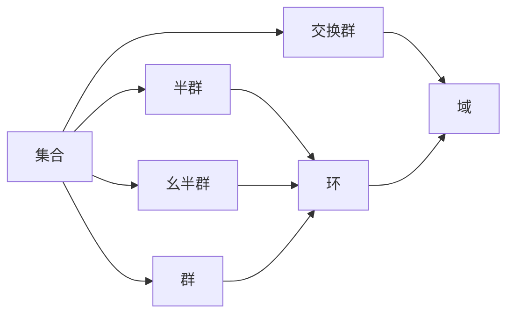

# 环与代数：结合代数的表示

## 1. 背景介绍
### 1.1 问题的由来
在现代代数学中,环和域是两个重要的代数结构。它们都是集合与二元运算的组合,但具有不同的性质。环是一个代数系统,它由一个集合以及两个满足特定公理的二元运算(通常称为"加法"和"乘法")组成。域是一种特殊的环,其中非零元素对于乘法构成一个交换群。环和域在代数学、数论、几何学等数学分支中有着广泛的应用。

### 1.2 研究现状 
目前,环与域的研究已经取得了丰硕的成果。人们构建了多种不同类型的环,如多项式环、矩阵环、商环等,并研究了它们的性质。域的研究更加深入,涉及到域扩张、Galois理论、代数几何等前沿领域。但是,如何用计算机来表示和处理环与域,仍然是一个值得探索的课题。

### 1.3 研究意义
将环与域的代数结构用计算机语言来表示,可以让我们更加深入地理解它们的内在性质,并能够借助计算机的力量去解决一些复杂的代数问题。同时,这也为将代数理论应用到信息科学、密码学等领域提供了新的思路。

### 1.4 本文结构
本文将从环和域的基本概念出发,探讨如何用程序设计语言来实现环和域的代数结构。全文分为以下几个部分：第2部分介绍环与域的核心概念;第3部分讨论表示环与域的核心算法原理;第4部分给出环和域的数学模型和公式;第5部分提供环和域的代码实例;第6部分分析环和域的实际应用场景;第7部分推荐相关工具和资源;第8部分对环和域的研究做一个总结,并展望未来;第9部分是附录,列出了一些常见问题与解答。

## 2. 核心概念与联系
在环和域的代数系统中,最核心的概念是集合(Set)、二元运算(Binary Operation)、封闭性(Closure)、结合律(Associativity)、单位元(Identity)、逆元素(Inverse)、交换律(Commutativity)、分配律(Distributivity)等。

环(Ring)就是一个集合R,配备两个二元运算"+"(加法)和"·"(乘法),满足以下公理:
1. (R,+)是一个交换群,即:
   - 封闭性:∀a,b∈R,a+b∈R
   - 结合律:∀a,b,c∈R,(a+b)+c=a+(b+c) 
   - 单位元:∃0∈R,∀a∈R,a+0=0+a=a
   - 逆元素:∀a∈R,∃(-a)∈R,a+(-a)=(-a)+a=0
   - 交换律:∀a,b∈R,a+b=b+a
2. (R,·)是一个半群,即:
   - 封闭性:∀a,b∈R,a·b∈R
   - 结合律:∀a,b,c∈R,(a·b)·c=a·(b·c)
3. 乘法对加法满足分配律:
   - 左分配律:∀a,b,c∈R,a·(b+c)=a·b+a·c
   - 右分配律:∀a,b,c∈R,(a+b)·c=a·c+b·c

域(Field)是一种特殊的环,除了满足环的公理外,还需满足:
1. 交换律:∀a,b∈R,a·b=b·a
2. 除了0以外,每个元素都有乘法逆元:∀a∈R\\{0},∃a^(-1)∈R,a·a^(-1)=a^(-1)·a=1

环和域的关系如下图所示:

## 3. 核心算法原理 & 具体操作步骤
### 3.1 算法原理概述
要在计算机中表示环和域,需要将它们的代数性质转化为相应的算法。一般来说,表示环的算法需要实现加法和乘法两个运算,并保证它们满足环的公理。表示域的算法还需要额外实现乘法逆元的运算。

### 3.2 算法步骤详解
以下是表示环的加法和乘法运算的基本算法步骤:

1. 加法运算:
   - 输入:环R中的两个元素a,b
   - 输出:a+b的结果
   - 步骤:
     1. 检查a,b是否属于R
     2. 根据R中元素的具体表示形式,执行相应的加法运算
     3. 检查结果是否仍属于R,若是则返回结果,否则报错

2. 乘法运算:
   - 输入:环R中的两个元素a,b
   - 输出:a·b的结果  
   - 步骤:
     1. 检查a,b是否属于R
     2. 根据R中元素的具体表示形式,执行相应的乘法运算
     3. 检查结果是否仍属于R,若是则返回结果,否则报错

对于域的算法,还需要实现求乘法逆元的操作:

3. 乘法逆元运算:
   - 输入:域F中的非零元素a
   - 输出:a的乘法逆元a^(-1)
   - 步骤:
     1. 检查a是否属于F且不为0
     2. 根据F的具体类型,执行求乘法逆元的算法(如扩展欧几里得算法)
     3. 检查结果是否满足a·a^(-1)=a^(-1)·a=1,若是则返回a^(-1),否则报错
     
### 3.3 算法优缺点
上述算法的优点是思路清晰,容易实现。但缺点是没有考虑环和域中元素的具体表示形式,实际应用时可能需要根据具体情况设计更高效的算法。比如,若环上元素都是多项式,则加法和乘法可以用多项式算法来实现。

### 3.4 算法应用领域
表示环和域的算法在密码学、编码理论、计算机代数等领域有重要应用。如RSA加密算法就是基于模多项式环和有限域的性质构建的。

## 4. 数学模型和公式 & 详细讲解 & 举例说明
### 4.1 数学模型构建
环和域可以用集合和二元运算来建模。设R是一个环,+和·分别是R上的加法和乘法运算,则可以将R表示为一个三元组:
$R=(R,+,·)$

其中R是一个集合,+:R×R→R和·:R×R→R是两个映射,分别表示加法和乘法运算。

如果R是一个域,还需满足乘法的交换律和乘法逆元的存在性。可以用一个四元组来表示域:
$F=(F,+,·,^{-1})$

其中F是一个集合,+:F×F→F和·:F×F→F分别是加法和乘法运算,^(-1):F\\{0}→F表示取乘法逆元的运算。

### 4.2 公式推导过程
根据环的定义,可以推导出以下重要公式:

1. 加法交换律:$∀a,b∈R,a+b=b+a$
   
   证明:由环的定义,(R,+)是一个交换群,因此满足交换律。

2. 加法结合律:$∀a,b,c∈R,(a+b)+c=a+(b+c)$

   证明:由环的定义,(R,+)是一个群,因此满足结合律。

3. 加法单位元的存在性:$∃0∈R,∀a∈R,a+0=0+a=a$

   证明:由环的定义,(R,+)是一个群,因此存在单位元。

4. 加法逆元的存在性:$∀a∈R,∃(-a)∈R,a+(-a)=(-a)+a=0$

   证明:由环的定义,(R,+)是一个群,因此每个元素都有逆元。

5. 乘法结合律:$∀a,b,c∈R,(a·b)·c=a·(b·c)$

   证明:由环的定义,(R,·)是一个半群,因此满足结合律。

6. 乘法对加法的分配律:
   - 左分配律:$∀a,b,c∈R,a·(b+c)=a·b+a·c$
   - 右分配律:$∀a,b,c∈R,(a+b)·c=a·c+b·c$

   证明:由环的定义,乘法对加法满足分配律。

对于域,除了满足环的所有性质外,还可以推导出以下重要公式:

7. 乘法交换律:$∀a,b∈F,a·b=b·a$

   证明:由域的定义,乘法满足交换律。

8. 非零元素的乘法逆元存在性:$∀a∈F\\{0},∃a^{-1}∈F,a·a^{-1}=a^{-1}·a=1$

   证明:由域的定义,每个非零元素都有乘法逆元。

### 4.3 案例分析与讲解

下面以复数域C为例,说明如何用环和域的概念来分析具体的代数系统。

复数域C是一个域,其中元素形如a+bi,其中a,b是实数,i是虚数单位,满足i^2=-1。C上的加法和乘法运算定义如下:

- 加法:(a+bi)+(c+di)=(a+c)+(b+d)i
- 乘法:(a+bi)·(c+di)=(ac-bd)+(ad+bc)i

可以验证,C满足域的所有性质:

1. (C,+)是一个交换群:
   - 封闭性:∀a+bi,c+di∈C,(a+bi)+(c+di)=(a+c)+(b+d)i∈C
   - 结合律:∀a+bi,c+di,e+fi∈C,((a+bi)+(c+di))+(e+fi)=(a+bi)+((c+di)+(e+fi))
   - 单位元:0+0i∈C,∀a+bi∈C,(a+bi)+(0+0i)=(0+0i)+(a+bi)=a+bi
   - 逆元:∀a+bi∈C,(-a)+(-b)i∈C,(a+bi)+((-a)+(-b)i)=((-a)+(-b)i)+(a+bi)=0+0i
   - 交换律:∀a+bi,c+di∈C,(a+bi)+(c+di)=(c+di)+(a+bi)
   
2. (C,·)是一个交换群:
   - 封闭性:∀a+bi,c+di∈C,(a+bi)·(c+di)=(ac-bd)+(ad+bc)i∈C
   - 结合律:∀a+bi,c+di,e+fi∈C,((a+bi)·(c+di))·(e+fi)=(a+bi)·((c+di)·(e+fi))
   - 单位元:1+0i∈C,∀a+bi∈C,(a+bi)·(1+0i)=(1+0i)·(a+bi)=a+bi
   - 逆元:∀a+bi∈C\\{0+0i},(a-bi)/(a^2+b^2) ∈C,(a+bi)·(a-bi)/(a^2+b^2)=(a-bi)/(a^2+b^2)·(a+bi)=1+0i
   - 交换律:∀a+bi,c+di∈C,(a+bi)·(c+di)=(c+di)·(a+bi)

3. 乘法对加法的分配律:
   - ∀a+bi,c+di,e+fi∈C,(a+bi)·((c+di)+(e+fi))=(a+bi)·(c+di)+(a+bi)·(e+fi)
   - ∀a+bi,c+di,e+fi∈C,((a+bi)+(c+di))·(e+fi)=(a+bi)·(e+fi)+(c+di)·(e+fi)

综上所述,复数域C满足域的所有性质,是一个典型的域。

### 4.4 常见问题解答

Q:环和域有什么区别?
A:域是一种特殊的环,域上的乘法满足交换律,且每个非零元素都有乘法逆元。因此,域比环多了两条性质。

Q:是否所有的环都是域?
A:不是。整数环Z就不是一个域,因为Z上的乘法不满足交换律(如3·4≠4·3),且大部分元素没有乘法逆元(如2在Z上没有乘法逆元