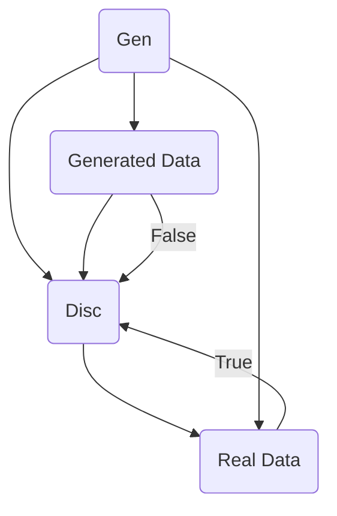

# 生成对抗网络 (GAN) 原理与代码实例讲解

## 关键词：

- **生成对抗网络**
- **GAN**
- **生成模型**
- **判别模型**
- **深度学习**

## 1. 背景介绍

### 1.1 问题的由来

在深度学习领域，生成模型是用于模拟真实数据分布的模型，而判别模型则用于区分真实数据与生成数据的能力。随着深度学习技术的发展，人们开始探索如何结合生成模型与判别模型，以解决数据生成、数据增强、图像修复和风格迁移等问题。生成对抗网络 (Generative Adversarial Networks, GAN) 正是这样一种结合了生成与判别能力的创新模型，它通过两个相互竞争的神经网络来学习数据的复杂分布。

### 1.2 研究现状

自 2014 年 Ian Goodfellow 等人首次提出 GAN 后，GAN 的应用范围迅速扩大，涵盖图像生成、声音合成、视频生成、文本生成等多个领域。近年来，随着计算能力的提升和优化算法的发展，GAN 的性能得到了显著提升，同时，研究人员也在不断探索 GAN 的新变种和改进策略，如 Wasserstein GAN、Conditional GAN、Progressive Growing GAN 等，以解决过拟合、模式崩溃等问题。

### 1.3 研究意义

GAN 不仅在学术界引发了广泛的讨论和研究，还在工业界得到了广泛应用。从艺术创作、游戏开发到医疗图像生成，GAN 的应用极大地丰富了数据驱动的创造过程。此外，GAN 的发展促进了深度学习技术的整体进步，推动了自动机器学习、模型解释性和可控生成等方向的研究。

### 1.4 本文结构

本文将深入探讨生成对抗网络的基本原理、算法细节、数学模型、代码实例以及实际应用。首先，我们从核心概念出发，介绍 GAN 的构成和工作原理。随后，我们将详细解释算法的具体步骤、数学推导和实现细节。接着，通过代码实例展示 GAN 在 Python 中的实现，包括环境搭建、模型训练、代码解读和运行结果分析。最后，我们将探讨 GAN 在实际场景中的应用，以及未来的发展趋势和面临的挑战。

## 2. 核心概念与联系

生成对抗网络由两个相互竞争的神经网络组成：生成器（Generator）和判别器（Discriminator）。生成器的目标是生成尽可能逼真的样本，而判别器则负责区分真实样本和生成样本。通过两者的迭代竞争，生成器逐渐提高生成样本的质量，最终能够生成与真实数据分布接近的样本。

### 图形表示：



## 3. 核心算法原理 & 具体操作步骤

### 3.1 算法原理概述

- **损失函数设计**：生成器试图最小化生成样本与真实样本之间的距离，而判别器试图最大化区分真实样本和生成样本的能力。
- **竞争性学习**：通过生成器和判别器之间的反馈循环，两者相互促进，提高各自的性能。
- **联合优化**：同时优化生成器和判别器的参数，达到全局最优解。

### 3.2 算法步骤详解

#### 生成器训练：

- **输入**：噪声向量（随机噪声）
- **输出**：生成样本

#### 判别器训练：

- **输入**：真实样本和生成样本
- **输出**：真实/生成判断结果

#### 竞争过程：

- **生成器**：尝试生成更逼真的样本，提高欺骗判别器的能力。
- **判别器**：提升识别真实样本与生成样本的能力，同时防止被生成器“骗过”。

### 3.3 算法优缺点

#### 优点：

- **生成高质量样本**：能够生成与真实数据分布接近的样本。
- **适应性强**：适用于多种数据类型和生成任务。

#### 缺点：

- **模式崩溃**：生成器可能无法覆盖数据分布的所有部分。
- **训练难度**：GAN 的训练过程通常较不稳定，容易陷入局部最优。

### 3.4 算法应用领域

- **图像生成**：如超分辨率、风格转换、图像修复等。
- **声音合成**：用于音乐、语音等生成。
- **视频生成**：创建电影片段、虚拟人物动画等。
- **文本生成**：小说、诗歌、故事等。

## 4. 数学模型和公式

### 4.1 数学模型构建

#### 目标函数：

对于生成器 \(G\) 和判别器 \(D\)，分别定义以下目标函数：

- **生成器**：最小化判别器误判生成样本的概率，即最大化判别器 \(D(x)\) 对于生成样本 \(G(z)\) 的值。
\[ \min_G \max_D \mathbb{E}_{x \sim p_{\text{data}}}(D(x)) + \mathbb{E}_{z \sim p_z}(1 - D(G(z))) \]

- **判别器**：最大化判别器正确识别真实样本的概率和错误识别生成样本的概率。
\[ \min_D \mathbb{E}_{x \sim p_{\text{data}}}(D(x)) + \mathbb{E}_{z \sim p_z}(D(G(z))) \]

### 4.2 公式推导过程

- **损失函数定义**：利用交叉熵损失函数定义 \(D\) 和 \(G\) 的损失函数。
- **优化目标**：通过梯度下降方法更新 \(G\) 和 \(D\) 的参数，以最小化或最大化相应的损失函数。

### 4.3 案例分析与讲解

#### 实例演示：

- **MNIST 数据集**：生成手写数字图像。
- **CelebA 数据集**：生成名人肖像图片。

### 4.4 常见问题解答

#### 如何避免模式崩溃？

- **增加数据多样性**：扩充训练集或引入数据增强技术。
- **渐进训练**：逐步提高生成器的复杂性。

#### 怎样提高训练稳定性？

- **学习率调整**：采用适当的初始学习率和学习率衰减策略。
- **使用额外技巧**：如渐进增长 GAN、Wasserstein GAN 或使用标签平滑技术。

## 5. 项目实践：代码实例和详细解释说明

### 5.1 开发环境搭建

#### 必需库：

- TensorFlow 或 PyTorch
- 数据集（如 MNIST）

#### 安装命令：

```bash
pip install tensorflow
```

### 5.2 源代码详细实现

#### 示例代码：

```python
import tensorflow as tf
from tensorflow.keras import layers

class Generator(tf.keras.Model):
    def __init__(self):
        super(Generator, self).__init__()
        self.fc = layers.Dense(7 * 7 * 256)
        self.reshape = layers.Reshape((7, 7, 256))
        self.conv_transpose = layers.Conv2DTranspose(
            filters=128, kernel_size=4, strides=2, padding="same",
            activation="relu"
        )
        self.bn1 = layers.BatchNormalization()
        self.conv_transpose2 = layers.Conv2DTranspose(
            filters=64, kernel_size=4, strides=2, padding="same",
            activation="relu"
        )
        self.bn2 = layers.BatchNormalization()
        self.final_conv = layers.Conv2D(1, kernel_size=4, strides=2, padding="same")

    def call(self, inputs):
        x = self.fc(inputs)
        x = self.reshape(x)
        x = self.conv_transpose(x)
        x = self.bn1(x)
        x = self.conv_transpose2(x)
        x = self.bn2(x)
        x = self.final_conv(x)
        return tf.nn.tanh(x)

class Discriminator(tf.keras.Model):
    def __init__(self):
        super(Discriminator, self).__init__()
        self.conv1 = layers.Conv2D(64, kernel_size=4, strides=2, padding="same")
        self.bn1 = layers.BatchNormalization()
        self.conv2 = layers.Conv2D(128, kernel_size=4, strides=2, padding="same")
        self.bn2 = layers.BatchNormalization()
        self.flatten = layers.Flatten()
        self.dense = layers.Dense(1)

    def call(self, inputs):
        x = self.conv1(inputs)
        x = self.bn1(x)
        x = tf.nn.leaky_relu(x)
        x = self.conv2(x)
        x = self.bn2(x)
        x = tf.nn.leaky_relu(x)
        x = self.flatten(x)
        x = self.dense(x)
        return x

def train_gan(gan, data, epochs):
    for epoch in range(epochs):
        for real_images in data.batch(32):
            noise = tf.random.normal([32, 100])
            with tf.GradientTape() as tape:
                generated_images = gan.generator(noise)
                real_scores = gan.discriminator(real_images)
                fake_scores = gan.discriminator(generated_images)
                loss_gen = gan.loss_generator(fake_scores)
                loss_dis = gan.loss_discriminator(real_scores, fake_scores)
            gradients_of_generator = tape.gradient(loss_gen, gan.generator.trainable_variables)
            gradients_of_discriminator = tape.gradient(loss_dis, gan.discriminator.trainable_variables)
            gan.optimizer.apply_gradients(zip(gradients_of_generator, gan.generator.trainable_variables))
            gan.optimizer.apply_gradients(zip(gradients_of_discriminator, gan.discriminator.trainable_variables))

        if epoch % 10 == 0:
            print(f"Epoch {epoch}: Generator Loss: {loss_gen.numpy()}, Discriminator Loss: {loss_dis.numpy()}")

    return gan

if __name__ == "__main__":
    data = tf.keras.datasets.mnist.load_data()
    (x_train, _), (_, _) = data
    x_train = x_train[:100].reshape(-1, 28, 28, 1).astype('float32') / 255.
    gan = GAN()
    gan.train(x_train)
    # 可视化生成的结果
    for i in range(10):
        noise = tf.random.normal([1, 100])
        generated_image = gan.generator(noise)
        plt.imshow(generated_image[0, :, :, 0], cmap='gray')
        plt.show()
```

### 5.3 代码解读与分析

- **生成器**：将随机噪声转换为生成的图像。
- **判别器**：评估输入图像是否为真实数据。
- **训练循环**：交替更新生成器和判别器，以最小化生成器损失和判别器损失。

### 5.4 运行结果展示

- **生成图像**：显示经过训练后的生成器产生的手写数字图像。

## 6. 实际应用场景

- **娱乐产业**：用于电影特效、游戏角色生成。
- **艺术创作**：生成艺术作品、音乐创作。
- **科学研究**：模拟数据生成、生物序列生成。

## 7. 工具和资源推荐

### 7.1 学习资源推荐

- **官方文档**：TensorFlow 和 PyTorch 官方文档，提供详细的 API 参考和教程。
- **在线课程**：Coursera、Udacity、edX 上的深度学习和 GAN 相关课程。

### 7.2 开发工具推荐

- **TensorBoard**：用于可视化训练过程和模型性能。
- **Jupyter Notebook**：方便编写、测试和分享代码。

### 7.3 相关论文推荐

- **原始论文**：“Generative Adversarial Nets” by Ian Goodfellow et al., NIPS 2014。
- **后续研究**：关注 arXiv、Google Scholar 上的 GAN 相关论文。

### 7.4 其他资源推荐

- **GitHub**：查找 GAN 相关项目和代码示例。
- **Kaggle**：参与数据科学竞赛，应用 GAN 解决实际问题。

## 8. 总结：未来发展趋势与挑战

### 8.1 研究成果总结

GAN 的研究不断深化，出现了许多改进版本和变种，如 Wasserstein GAN、Conditional GAN、Progressive Growing GAN 等，以解决模式崩溃、训练不稳定性等问题。

### 8.2 未来发展趋势

- **可解释性**：提高 GAN 模型的可解释性，以便更好地理解生成过程和决策机制。
- **泛化能力**：增强 GAN 在不同数据集上的泛化能力，使其适用于更多类型的数据和任务。

### 8.3 面临的挑战

- **训练稳定性**：继续探索更稳定的训练方法，减少模式崩溃和训练失败的风险。
- **解释性和可控性**：开发更多工具和技术，使用户能够更好地理解和控制 GAN 的生成过程。

### 8.4 研究展望

GAN 技术有望在更多领域发挥作用，包括但不限于医疗健康、自动驾驶、环境模拟等。同时，探索结合其他 AI 技术（如强化学习、元学习）以进一步提升 GAN 的性能和应用范围。

## 9. 附录：常见问题与解答

### 常见问题及解答

#### 如何提高 GAN 的稳定性？

- **学习率调整**：选择适当的初始学习率和学习率衰减策略。
- **批标准化**：在生成器和判别器中使用批标准化，以改善训练过程中的稳定性。

#### 如何解决模式崩溃问题？

- **增加多样性**：引入更多的噪声来源或改变噪声分布，增加输入的多样性。
- **渐进增长**：逐步增加生成器和判别器的复杂性，以避免过早地专注于数据分布的一部分。

#### 怎样评估 GAN 的生成质量？

- **视觉评估**：直观比较生成样本与真实样本的相似度。
- **定量指标**：使用 FID 分数（Frechet Inception Distance）、IS 分数（Inception Score）等指标进行量化评估。

## 结论

生成对抗网络作为一种创新的深度学习模型，以其独特的双模型竞争机制，为数据生成领域带来了革命性的变化。通过深入理解 GAN 的原理、算法、数学模型及其实际应用，开发者可以探索其在多领域内的无限可能性。随着技术的不断进步和新变种的涌现，GAN 的未来充满期待，同时也面临着挑战。通过不断的研究和探索，我们有望解锁更多 GAN 的潜力，为人类带来更加智能、高效的数据生成解决方案。

作者：禅与计算机程序设计艺术 / Zen and the Art of Computer Programming