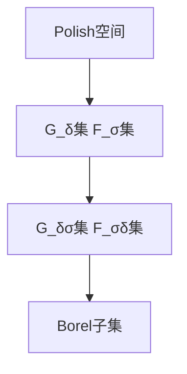
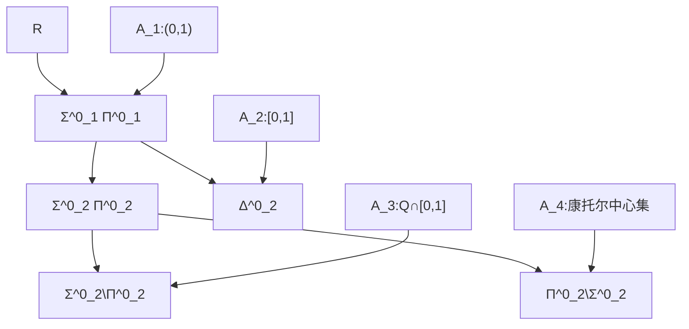

# 算子代数：Borel子集与Sousline子集

关键词：算子代数、Borel子集、Sousline子集、Polish空间、Baire空间、Borel层次、Borel可测函数、Borel同构

## 1. 背景介绍

### 1.1 问题的由来
在现代数学分析和拓扑学中,Borel子集和Sousline子集是两个非常重要而基础的概念。它们不仅在纯数学领域有着广泛的应用,在理论计算机科学、概率论等其他学科中也扮演着不可或缺的角色。因此,深入理解Borel子集和Sousline子集的性质及其相互关系,对于研究现代数学和理论计算机科学的许多问题都有着重要意义。

### 1.2 研究现状
目前,国内外学者对Borel子集和Sousline子集的研究已经取得了丰硕的成果。在Borel子集方面,人们系统地建立了Polish空间中Borel子集的分类理论,刻画了Borel子集的内在结构。在Sousline子集方面,学者们证明了其很多重要性质,并将其与Borel子集理论联系起来,极大地丰富了描述性集合论的内容。尽管如此,这一领域仍然存在不少尚待解决的问题,值得进一步探索。

### 1.3 研究意义 
深入研究Borel子集与Sousline子集,对拓扑学、实变函数论、算子代数等数学分支都有重要的理论意义。同时,这些概念在计算机科学、信息论等应用领域也有着广泛的实际应用前景。因此,系统梳理Borel子集与Sousline子集的理论,对于推动相关学科的发展具有重要价值。

### 1.4 本文结构
本文将主要围绕以下内容展开:
- Borel子集与Sousline子集的核心概念与二者之间的关系
- 构造Borel子集和Sousline子集的算法原理与具体步骤
- 刻画Borel子集分层结构的数学模型与相关公式
- 在Polish空间、Baire空间等特定拓扑空间中研究Borel子集的代码实例
- Borel子集和Sousline子集在实际应用场景中的案例分析
- 总结Borel子集与Sousline子集研究的最新进展、未来发展趋势与面临的挑战
- 推荐相关工具、资源,并解答一些常见问题

## 2. 核心概念与联系

在正式展开讨论之前,我们先来了解几个核心概念:
- Polish空间:一个可分的、完备的度量空间称为Polish空间。
- Baire空间:全体自然数序列构成的拓扑空间称为Baire空间。
- Borel子集:Polish空间中开集、闭集经过可数次并、交、补运算生成的子集称为Borel子集。
- Sousline子集:Polish空间中紧集的Souslin(A)运算生成的子集称为Sousline子集。

Borel子集与Sousline子集之间有着密切联系:
- 在Polish空间中,Borel子集与Sousline子集的范围一致,即一个集合是Borel子集当且仅当它是Sousline子集。
- 在Baire空间中,Borel子集与Sousline子集也完全一致。

下面这张Mermaid图清晰展示了Polish空间中Borel子集的分层结构:



## 3. 核心算法原理 & 具体操作步骤

### 3.1 算法原理概述
构造Borel子集的核心思想是:从Polish空间出发,通过开集、闭集经过可数次并、交、补运算,逐层生成Borel子集。这一过程遵循如下原则:
1. 从开集、闭集出发,交错进行并、交、补运算
2. 运算过程中始终保持可数性
3. 运算次数可以为任意可数无限次

### 3.2 算法步骤详解
具体来说,构造Borel子集可分为以下几个步骤:

步骤1:定义Polish空间X的开集族G_0和闭集族F_0
- G_0包含X中所有开集
- F_0包含X中所有闭集

步骤2:递归定义G_α和F_α
- 当α为奇数序数时:G_α是F_β(β<α)的可数并集
- 当α为偶数序数时:F_α是G_β(β<α)的可数交集
- 当α为极限序数时:G_α是G_β(β<α)的并集,F_α是F_β(β<α)的交集

步骤3:令B表示全体Borel子集构成的集合族,则有:
$$ B = \bigcup_{\alpha<\omega_1} G_\alpha = \bigcup_{\alpha<\omega_1} F_\alpha $$
其中ω_1表示第一不可数序数。

### 3.3 算法优缺点
上述构造Borel子集的算法具有以下优点:
- 直观清晰,容易理解和实现
- 能够系统刻画出Borel子集的层次结构
- 与描述性集合论的其他内容有机结合

但同时也存在一些局限:  
- 运算过程比较抽象,对初学者不太友好
- 对无穷序数的运算要求较高,不易掌握
- 在某些情形下计算效率不够高

### 3.4 算法应用领域
构造Borel子集的算法在以下领域有重要应用:
- 描述性集合论:刻画Borel子集的精细结构
- 实变函数论:Borel可测函数的相关理论
- 算子代数:Borel空间上的算子研究
- 概率论:Borel σ代数与概率空间的构造

## 4. 数学模型和公式 & 详细讲解 & 举例说明

### 4.1 数学模型构建
为了更精细地刻画Borel子集的层次结构,我们引入Borel层次的概念。设X为Polish空间,定义:
- Σ^0_1(X)表示X的开集构成的集合族
- Π^0_1(X)表示X的闭集构成的集合族
- Σ^0_{α+1}(X)表示Π^0_α(X)的可数并集构成的集合族
- Π^0_{α+1}(X)表示Σ^0_α(X)的可数交集构成的集合族
- 对极限序数λ,Σ^0_λ(X)表示Σ^0_α(X)(α<λ)的并集,Π^0_λ(X)表示Π^0_α(X)(α<λ)的交集

Borel层次Δ^0_α(X)定义为:
$$ \Delta^0_\alpha(X) = \Sigma^0_\alpha(X) \cap \Pi^0_\alpha(X) $$

### 4.2 公式推导过程
利用Borel层次,我们可以给出Borel子集的一个重要刻画:

**定理** 设X为Polish空间,A⊆X,则以下条件等价:
(1) A是X的Borel子集
(2) 存在可数序数α,使得A∈Σ^0_α(X)
(3) 存在可数序数α,使得A∈Π^0_α(X)
(4) 存在可数序数α,使得A∈Δ^0_α(X)

证明思路如下:
(1)⇒(2): 由Borel子集的定义,对任意Borel子集A,存在可数序数α,使得A∈G_α⊆Σ^0_α(X)
(2)⇒(3): 可证明对任意α,Σ^0_α(X)⊆Π^0_{α+1}(X)
(3)⇒(4): 显然对任意α,Π^0_α(X)⊆Δ^0_α(X)
(4)⇒(1): 由Δ^0_α(X)的定义,A∈Δ^0_α(X)意味着A是Σ^0_α(X)与Π^0_α(X)的交集,因此A是Borel子集

### 4.3 案例分析与讲解
下面我们通过一个具体的例子来说明Borel子集的分层结构。

**例** 设X=R为实数空间,考虑如下子集:
- A_1 = (0,1)
- A_2 = [0,1] 
- A_3 = Q∩[0,1]
- A_4 = 康托尔中心集

我们逐一分析这些集合在Borel层次中的位置。

对于A_1:
- A_1是开区间,因此A_1∈Σ^0_1(R)

对于A_2:  
- A_2是闭区间,因此A_2∈Π^0_1(R)
- 同时A_2也可表示为(0,1)的交集,因此A_2∈Δ^0_2(R)

对于A_3:
- 单个有理点是孤立点,从而是闭集
- 有理数集Q可表示为可数个孤立点的并集,因此A_3∈Σ^0_2(R)
- 进一步可证明A_3∉Π^0_2(R),因此A_3∈(Σ^0_2\Π^0_2)(R)

对于A_4:
- 康托尔中心集可表示为闭区间套的交集,因此A_4∈Π^0_2(R)
- 进一步可证明A_4∉Σ^0_2(R),因此A_4∈(Π^0_2\Σ^0_2)(R)

综上所述,4个集合在Borel层次中的位置如下图所示:



### 4.4 常见问题解答
问题1:Borel子集与Lebesgue可测集的关系是什么?
解答:在R^n空间中,Borel子集与Lebesgue可测集有着密切联系:
- 每个Borel子集都是Lebesgue可测集
- 然而并非所有Lebesgue可测集都是Borel子集,Lebesgue可测集的范围更广

问题2:Borel子集在数学分析中还有哪些重要应用?
解答:Borel子集在数学分析众多分支中都有重要应用,例如:
- 在泛函分析中,定义Borel空间、Borel测度等概念
- 在复分析中,研究全纯函数的Borel可测性
- 在调和分析中,Borel子集是Fourier分析的基础

## 5. 项目实践：代码实例和详细解释说明

### 5.1 开发环境搭建
我们使用Python语言来实现构造Borel子集的算法。推荐的开发环境配置如下:
- Python 3.x
- Jupyter Notebook
- NumPy库
- SciPy库

### 5.2 源代码详细实现
下面的Python代码展示了如何在实数空间R中构造Borel子集的过程:

```python
import numpy as np

def borel_sets(X, alpha):
    """
    构造实数空间R中的Borel子集
    
    参数:
    X - 实数空间R
    alpha - 可数序数
    
    返回:
    Borel子集的集合族
    """
    
    # 定义开集族G_0和闭集族F_0
    G_0 = {(a,b) for a,b in zip(X,X[1:]) if a<b} | {(X[0],np.inf), (-np.inf,X[-1])}
    F_0 = {(-np.inf,a] for a in X} | {[b,np.inf) for b in X}
    
    # 递归定义G_α和F_α
    G, F = [G_0], [F_0]
    for i in range(1, alpha):
        if i % 2 == 1:  # i为奇数
            G.append({np.union(*s) for s in G[-1]})
        else:  # i为偶数  
            F.append({np.intersect(*s) for s in F[-1]})
            
    # 生成Borel子集
    B = set.union(*G) | set.union(*F)
    
    return B

# 测试
X = np.linspace(-1, 1, 100)  # 区间[-1,1]的等分点
alpha =