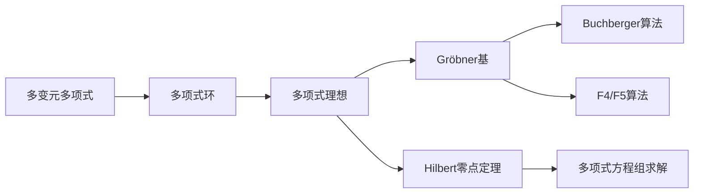

# 线性代数导引：多变元多项式

关键词：线性代数、多变元多项式、Gröbner基、Buchberger算法、Hilbert零点定理、多项式方程组、消元法、多项式理想、单项式序

## 1. 背景介绍
### 1.1  问题的由来
多变元多项式是线性代数和计算机代数中一个重要的研究对象。在数学和计算机科学领域，多项式方程组求解、多项式系统消元、多项式理想的运算等问题都与多变元多项式密切相关。研究多变元多项式的性质和算法，对于解决这些问题具有重要意义。
### 1.2  研究现状
目前，多变元多项式的研究主要集中在Gröbner基理论和Buchberger算法等方面。Gröbner基理论由奥地利数学家Buchberger在20世纪60年代提出，是研究多项式理想的重要工具。Buchberger算法是计算Gröbner基的经典算法，在计算机代数系统如Maple、Mathematica等得到广泛应用。此外，Faugère提出的F4、F5算法对Buchberger算法进行了改进，提高了计算效率。
### 1.3  研究意义
多变元多项式在数学和计算机科学中有着广泛的应用，如计算机辅助几何设计、机器人运动规划、信号处理、密码学等领域。深入研究多变元多项式的理论和算法，对于解决这些领域的实际问题具有重要意义。此外，多变元多项式也是符号计算、计算机代数等学科的核心内容，推动多变元多项式的研究有助于这些学科的发展。
### 1.4  本文结构
本文将从以下几个方面介绍多变元多项式的相关内容：
- 第2部分介绍多变元多项式的基本概念和性质
- 第3部分介绍Gröbner基的概念和Buchberger算法原理
- 第4部分介绍多变元多项式相关的数学模型和公式
- 第5部分给出多变元多项式计算的代码实例
- 第6部分讨论多变元多项式在实际中的应用
- 第7部分推荐多变元多项式的学习资源和工具
- 第8部分对全文进行总结，并展望多变元多项式的研究前景

## 2. 核心概念与联系
多变元多项式是由多个变量和系数组成的代数表达式，是一元多项式的推广。形式上，n元多项式可以写成：
$$f(x_1,\cdots,x_n)=\sum_{\alpha}c_{\alpha}x^{\alpha}$$
其中$\alpha=(\alpha_1,\cdots,\alpha_n)\in\mathbb{Z}_{\ge 0}^n$是指标，$c_\alpha$是系数，$x^\alpha$是单项式$x_1^{\alpha_1}\cdots x_n^{\alpha_n}$的简写。

多项式组成的集合$k[x_1,\cdots,x_n]$对加法和乘法运算封闭，构成一个交换环，称为多项式环。多项式环上可以定义多项式的理想(ideal)、商环(quotient ring)等代数结构。

研究多变元多项式的一个重要问题是求解多项式方程组$f_1=\cdots=f_s=0$的解。Hilbert零点定理指出，多项式理想的零点解集与其对应的仿射代数簇一一对应。因此求解多项式方程组可以转化为计算多项式理想的Gröbner基。

Gröbner基是多项式理想的一组"好"生成元，具有性质：
1. 理想的Gröbner基是唯一的(取决于单项式序)
2. 多项式$f$属于理想，当且仅当被Gröbner基约化为0
3. 理想的Gröbner基可以用来判断理想成员、消去变量等

Buchberger算法是计算Gröbner基的经典算法，基本思想是不断添加多项式间的S-多项式(S-polynomials)到生成元集合中，直到集合自洽。Faugère提出的F4、F5算法对Buchberger算法进行了改进，避免了一些无用的约化计算。

下图展示了这些核心概念间的联系：

## 3. 核心算法原理 & 具体操作步骤
### 3.1  算法原理概述
Buchberger算法的基本原理是：对于多项式理想$I=\langle f_1,\cdots,f_s \rangle$，如果$G=\{g_1,\cdots,g_t\}$是$I$的Gröbner基，那么对于任意多项式$p\in I$，存在$g_i$使得$\overline{p}^G=\overline{p}^{g_i}$，即$p$被$G$约化的结果与被$g_i$约化的结果相同。

Buchberger算法通过不断添加多项式对$(f_i,f_j)$的S-多项式$S(f_i,f_j)$到生成元集合中，直到任意两个多项式的S-多项式都可以被约化到0。这样得到的生成元集合就是Gröbner基。

### 3.2  算法步骤详解
输入：多项式$f_1,\cdots,f_s$
输出：$\langle f_1,\cdots,f_s \rangle$的Gröbner基$G$
1. 初始化$G=\{f_1,\cdots,f_s\}$
2. 对于$G$中任意两个多项式$p,q$，计算它们的S-多项式：
   $$S(p,q)=\frac{lcm(lt(p),lt(q))}{lt(p)}p-\frac{lcm(lt(p),lt(q))}{lt(q)}q$$
   其中$lt(f)$表示$f$的首项。
3. 对$S(p,q)$进行约化，得到$\overline{S(p,q)}^G$
4. 如果$\overline{S(p,q)}^G\neq 0$，将其添加到$G$中，回到步骤2；否则转到步骤5
5. 输出$G$，算法结束

### 3.3  算法优缺点
Buchberger算法的优点是原理简单，容易实现。但是算法的缺点是计算效率较低，主要体现在：
1. 生成了大量无用的S-多项式，造成约化次数过多
2. 约化过程中会引入新的单项式，使得中间多项式的项数膨胀

F4、F5算法通过避免一些无用的S-多项式和约化计算，在一定程度上改进了Buchberger算法的效率。但多变元多项式的Gröbner基计算仍然是一个NP难问题，对于复杂的输入，计算效率仍然不够理想。

### 3.4  算法应用领域
Gröbner基算法在多项式系统求解、几何定理证明、密码分析等领域有重要应用。一些具体的应用案例包括：
- 用Gröbner基方法求解线性规划问题
- 用Gröbner基方法进行机器人运动规划
- 用Gröbner基方法进行有限域上多项式因式分解
- 用Gröbner基方法分析公钥密码系统的安全性

## 4. 数学模型和公式 & 详细讲解 & 举例说明  
### 4.1  数学模型构建
考虑n元多项式环$R=k[x_1,\cdots,x_n]$，其中$k$为数域。定义$R$上的单项式序(monomial order)$\prec$为满足以下性质的全序：
1. $1\preceq m$，对任意单项式$m$
2. 若$m_1\prec m_2$，则$mm_1\prec mm_2$，对任意单项式$m,m_1,m_2$

常见的单项式序有词典序(lexicographic order)、总度词典序(graded lexicographic order)和逆词典序(reverse lexicographic order)等。

对于多项式$f=\sum_{\alpha}c_{\alpha}x^{\alpha}\in R$，定义$f$关于单项式序$\prec$的首项$lt(f)$为$\prec$意义下最大的单项式；首一$lc(f)$为$lt(f)$的系数；首项理想$lt(I)$为理想$I$中多项式首项生成的理想。

对于多项式$f,g\in R$，若存在单项式$m$使得$lt(g)=mlt(f)$，则称$f$可以约化$g$，记作$f\rightarrow_rg$。多项式$f$关于$G=\{g_1,\cdots,g_t\}\subset R$的约化结果记作$\overline{f}^G$。

### 4.2  公式推导过程
**定理1(Hilbert基定理)** 若$R$是Noetherian环，则$R$的每个理想都有有限生成集。

**定义1** 设$I$是$R$的理想，若$G=\{g_1,\cdots,g_t\}\subset I$满足：
1. $\langle lt(g_1),\cdots,lt(g_t)\rangle = \langle lt(I)\rangle$
2. 对任意$f\in I$，$\overline{f}^G=0$
则称$G$是$I$的Gröbner基。

**引理1** 设$I$是$R$的理想，$G$是$I$的Gröbner基，则对任意$f\in R$，$f\in I$当且仅当$\overline{f}^G=0$。

**引理2** 设$I$是$R$的理想，$G$是$I$的Gröbner基，$p,q\in R$，则$S(p,q)\rightarrow_{G}0$。

**定理2(Buchberger标准)** 设$I=\langle f_1,\cdots,f_s\rangle$是$R$的理想，$G=\{g_1,\cdots,g_t\}\subset I$，则$G$是$I$的Gröbner基当且仅当对任意$1\le i<j\le t$，$S(g_i,g_j)\rightarrow_{G}0$。

Buchberger算法的正确性由定理2保证。由Hilbert基定理知Gröbner基一定存在，而Buchberger标准说明算法终止时得到的结果就是Gröbner基。

### 4.3  案例分析与讲解
**例1** 考虑$\mathbb{Q}[x,y]$中的理想$I=\langle f_1,f_2\rangle$，其中$f_1=x^2-y$，$f_2=x^3-x$，求$I$关于词典序$x\succ y$的Gröbner基。
解：初始$G=\{f_1,f_2\}$，
$S(f_1,f_2)=yf_2-xf_1=y(x^3-x)-x(x^2-y)=-x^3+xy+x^2$
$\overline{S(f_1,f_2)}^G=xy+y^2$，将其记为$f_3$并加入$G$
$S(f_1,f_3)=y^2-x^2$，$\overline{S(f_1,f_3)}^G=0$
$S(f_2,f_3)=y^2f_2-xf_3=y^2(x^3-x)-x(xy+y^2)=-x^2y-xy^2$
$\overline{S(f_2,f_3)}^G=-y^3$，将其记为$f_4$并加入$G$
$S(f_1,f_4)=S(f_2,f_4)=S(f_3,f_4)=0$
至此所有S-多项式都约化到0，故$G=\{f_1,f_2,f_3,f_4\}$是$I$的Gröbner基。

### 4.4  常见问题解答
Q: Gröbner基与理想生成集有何区别？
A: Gröbner基是理想的特殊生成集，具有良好的性质，可以用来判断理想成员、消元等。一般的生成集不具备这些性质。

Q: 不同的单项式序得到的Gröbner基是否相同？ 
A: 通常不同。但它们生成的理想是相同的，可以相互转化。合适的单项式序选择有助于提高计算效率。

Q: Gröbner基与多项式因式分解有何关系？
A: 对于一元多项式，其在数域上的约化结果就是多项式的因式分解。对于多元多项式，用Gröbner基方法可以进行因式分解，但结果未必是不可约因式。

## 5. 项目实践：代码实例和详细解