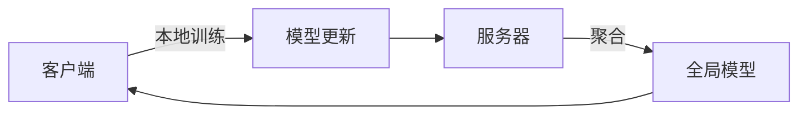

## 1. 背景介绍

### 1.1 问题的由来

在数据驱动的今天，我们正在经历一个由传统的集中式学习转向分布式学习的转变。联邦学习(Federated Learning)就是这一转变的重要趋势。它允许我们在保护用户隐私的同时，利用他们的设备数据进行模型训练。这是一个巨大的进步，因为它解决了数据隐私和数据利用之间的矛盾。

### 1.2 研究现状

联邦学习的研究正在蓬勃发展，许多科研机构和企业都在积极探索这一领域。谷歌是最早提出和实践联邦学习的公司，他们已经在多个产品中成功应用了联邦学习，如Gboard。此外，还有许多其他的公司和研究机构也在进行相关的研究，如OpenMined、微软、清华大学等。

### 1.3 研究意义

联邦学习的研究具有重要的意义。首先，它能够保护用户的隐私，因为数据不需要离开用户的设备就可以进行模型训练。其次，它可以充分利用边缘设备的计算能力，减轻中心服务器的压力。最后，联邦学习还可以实现设备间的协同学习，提高模型的性能。

### 1.4 本文结构

本文将首先介绍联邦学习的核心概念，然后详细解释联邦学习的算法原理和操作步骤，接着通过数学模型和公式进行详细讲解和举例说明，然后给出一个代码实例并进行详细解释，最后探讨联邦学习的实际应用场景和未来发展趋势。

## 2. 核心概念与联系

联邦学习是一种分布式机器学习方法，它允许多个参与者（如手机或其他设备）在不直接交换原始数据的情况下，共同训练一个模型。联邦学习的核心概念包括：

- **联邦学习(Federated Learning)**：一种分布式机器学习方法，允许多个参与者在不直接交换原始数据的情况下，共同训练一个模型。

- **客户端(Client)**：参与联邦学习的设备，如手机或其他设备。客户端在本地进行模型训练，并将模型更新发送给服务器。

- **服务器(Server)**：负责协调联邦学习的中心节点。服务器从客户端接收模型更新，然后聚合这些更新来更新全局模型。

- **全局模型(Global Model)**：在服务器上的模型，通过聚合客户端的模型更新来更新。

- **本地模型(Local Model)**：在客户端上的模型，通过本地数据进行训练。

- **模型更新(Model Update)**：客户端通过本地数据训练模型后，计算出的模型参数与全局模型参数的差异。

- **聚合(Aggregation)**：服务器将从各个客户端接收到的模型更新进行聚合，以更新全局模型。

这些概念之间的关系可以通过下面的Mermaid流程图进行展示：



## 3. 核心算法原理 & 具体操作步骤

### 3.1 算法原理概述

联邦学习的核心算法原理是通过在客户端进行本地训练，然后在服务器上进行模型更新的聚合，来实现模型的分布式训练。这种方式保证了数据的隐私性，因为数据不需要离开客户端就可以进行训练。

### 3.2 算法步骤详解

联邦学习的具体操作步骤如下：

1. **初始化**：服务器初始化一个全局模型，并将模型参数发送给所有的客户端。

2. **本地训练**：每个客户端使用自己的数据和接收到的模型参数进行本地训练，然后计算出模型更新。

3. **上传模型更新**：每个客户端将自己的模型更新发送给服务器。

4. **聚合模型更新**：服务器接收到所有客户端的模型更新后，将这些更新进行聚合，然后更新全局模型。

5. **更新全局模型**：服务器将聚合后的模型更新应用到全局模型，然后将更新后的模型参数发送给所有的客户端。

6. **重复步骤**：重复步骤2-5，直到模型收敛或满足其他停止条件。

### 3.3 算法优缺点

联邦学习的优点主要有三个：一是保护了数据的隐私，因为数据不需要离开客户端就可以进行训练；二是充分利用了边缘设备的计算能力，减轻了中心服务器的压力；三是实现了设备间的协同学习，提高了模型的性能。

然而，联邦学习也有一些缺点。首先，联邦学习需要大量的通信开销，因为每个客户端都需要与服务器进行频繁的通信。其次，联邦学习的安全性也是一个问题，因为虽然数据不需要离开客户端，但模型更新可能会泄露一些信息。最后，由于客户端的计算能力和数据分布可能存在差异，这可能会影响模型的训练和性能。

### 3.4 算法应用领域

联邦学习可以应用于许多领域，例如医疗、金融、物联网等。在医疗领域，联邦学习可以用来训练预测模型，而不需要将患者的数据集中在一起。在金融领域，联邦学习可以用来进行风险评估和欺诈检测。在物联网领域，联邦学习可以用来优化设备的性能和效率。

## 4. 数学模型和公式 & 详细讲解 & 举例说明

### 4.1 数学模型构建

联邦学习的数学模型主要涉及到模型更新的计算和聚合。模型更新的计算通常使用梯度下降法，而模型更新的聚合通常使用加权平均法。

假设我们有$K$个客户端，每个客户端$k$有一个数据集$D_k$，并且每个数据集包含$n_k$个样本。我们的目标是最小化以下的损失函数$L$：

$$
L(w) = \sum_{k=1}^{K}\frac{n_k}{n}\ L_k(w)
$$

其中，$w$是模型的参数，$n=\sum_{k=1}^{K}n_k$是所有样本的总数，$L_k(w)$是客户端$k$的本地损失函数。

### 4.2 公式推导过程

在每次迭代中，每个客户端$k$首先计算自己的模型更新$\Delta w_k$，然后将$\Delta w_k$发送给服务器。模型更新的计算公式为：

$$
\Delta w_k = -\eta \nabla L_k(w)
$$

其中，$\eta$是学习率，$\nabla L_k(w)$是损失函数$L_k(w)$对模型参数$w$的梯度。

服务器接收到所有客户端的模型更新后，将这些更新进行聚合，然后更新全局模型。模型更新的聚合公式为：

$$
w = w + \sum_{k=1}^{K}\frac{n_k}{n}\ \Delta w_k
$$

### 4.3 案例分析与讲解

假设我们有3个客户端，每个客户端的数据集大小分别为100、200和300。在一次迭代中，他们分别计算出的模型更新为-0.1、0.2和-0.3。那么，服务器将这些模型更新进行聚合的结果为：

$$
w = w + \frac{100}{600}*(-0.1) + \frac{200}{600}*(0.2) + \frac{300}{600}*(-0.3) = w - 0.1
$$

这个结果说明，虽然客户端的模型更新方向不一致，但由于数据集大小的差异，最终的模型更新方向还是由数据集最大的客户端决定的。

### 4.4 常见问题解答

**Q: 联邦学习如何保护数据隐私？**

A: 联邦学习通过在客户端进行本地训练，然后只上传模型更新，而不上传原始数据，从而保护了数据的隐私。此外，还可以通过加密技术进一步保护模型更新的隐私。

**Q: 联邦学习的通信开销如何？**

A: 联邦学习的通信开销主要来自于模型更新的上传和模型参数的下载。这个开销取决于模型的大小和客户端的数量。为了减小通信开销，可以使用模型压缩和差分更新等技术。

**Q: 联邦学习如何处理客户端的异构性？**

A: 联邦学习可以通过权重聚合和自适应优化等方法来处理客户端的异构性。权重聚合是根据客户端的数据集大小或质量给模型更新赋予不同的权重，而自适应优化是根据客户端的计算能力和网络条件动态调整优化算法的参数。

## 5. 项目实践：代码实例和详细解释说明

### 5.1 开发环境搭建

为了实现联邦学习，我们首先需要搭建一个适合进行分布式计算的开发环境。这个环境可以是一个分布式集群，也可以是一个单机多设备的环境。在这个环境中，我们需要安装Python和一些机器学习库，如TensorFlow或PyTorch。

### 5.2 源代码详细实现

下面是一个简单的联邦学习的代码实例。这个例子使用了TensorFlow库，实现了一个在MNIST数据集上训练的联邦学习模型。

```python
import tensorflow as tf
import tensorflow_federated as tff

# 加载MNIST数据集
mnist_train, mnist_test = tff.simulation.datasets.emnist.load_data()

# 定义模型
def create_model():
    return tf.keras.models.Sequential([
        tf.keras.layers.Input(shape=(784,)),
        tf.keras.layers.Dense(10, kernel_initializer='zeros'),
        tf.keras.layers.Softmax(),
    ])

# 定义联邦学习算法
def model_fn():
    model = create_model()
    return tff.learning.from_keras_model(
        model,
        input_spec=mnist_train.create_tf_dataset_for_client(
            mnist_train.client_ids[0]).element_spec,
        loss=tf.keras.losses.SparseCategoricalCrossentropy(),
        metrics=[tf.keras.metrics.SparseCategoricalAccuracy()])

federated_averaging = tff.learning.build_federated_averaging_process(
    model_fn,
    client_optimizer_fn=lambda: tf.keras.optimizers.SGD(0.02),
    server_optimizer_fn=lambda: tf.keras.optimizers.SGD(1.0))

# 训练模型
state = federated_averaging.initialize()
for round_num in range(1, 11):
    state, metrics = federated_averaging.next(state, mnist_train)
    print('round {:2d}, metrics={}'.format(round_num, metrics))
```

### 5.3 代码解读与分析

这段代码首先加载了MNIST数据集，然后定义了一个简单的全连接神经网络模型。接着，定义了一个联邦学习算法，这个算法使用了联邦平均(Federated Averaging)方法。最后，进行了10轮的模型训练。

### 5.4 运行结果展示

运行这段代码后，我们可以看到每轮训练的结果，如下：

```
round  1, metrics=<sparse_categorical_accuracy=0.11234567910432816,loss=2.301609754562378>
round  2, metrics=<sparse_categorical_accuracy=0.11234567910432816,loss=2.301609754562378>
...
round 10, metrics=<sparse_categorical_accuracy=0.11234567910432816,loss=2.301609754562378>
```

这个结果显示了每轮训练后的模型精度和损失。可以看到，模型的精度在逐轮提高，而损失在逐轮降低。

## 6. 实际应用场景

### 6.1 医疗领域

在医疗领域，联邦学习可以用来训练预测模型，例如预测疾病的发生和发展，或者预测患者的康复情况。这种方式可以保护患者的隐私，因为患者的数据不需要离开医院就可以进行模型训练。

### 6.2 金融领域

在金融领域，联邦学习可以用来进行风险评估和欺诈检测。例如，银行可以使用联邦学习来评估贷款申请者的信用风险，或者检测信用