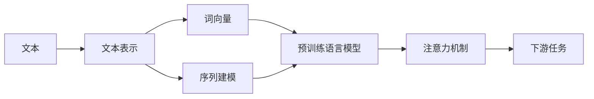

# 自然语言处理原理与代码实战案例讲解

## 1. 背景介绍
### 1.1 问题的由来
自然语言处理(Natural Language Processing, NLP)是人工智能领域的一个重要分支,旨在让计算机能够理解、生成和处理人类语言。随着大数据时代的到来和计算机硬件性能的飞速发展,NLP技术在各个领域得到了广泛应用,如机器翻译、情感分析、智能客服、语音助手等。然而,由于自然语言的复杂性、多样性和歧义性,NLP仍然面临着诸多挑战。

### 1.2 研究现状
目前,NLP领域的研究主要集中在以下几个方面:

1. **语言模型**:通过大规模语料训练语言模型,让机器学习语言的统计规律和语义表示,如word2vec、ELMo、BERT等。

2. **序列标注**:对文本序列进行标注,如命名实体识别、词性标注、语义角色标注等。常用模型有HMM、CRF、BiLSTM-CRF等。

3. **文本分类**:将文本划分到预定义的类别中,如情感分析、新闻分类、垃圾邮件检测等。常用模型有朴素贝叶斯、SVM、CNN、RNN等。

4. **文本生成**:根据给定的上下文或条件生成自然语言文本,如机器翻译、对话生成、文章写作等。常用模型有seq2seq、transformer、GPT等。

5. **知识图谱**:构建结构化的知识库,描述实体及其关系,支持语义理解和推理。常用技术有实体链接、关系抽取、知识表示等。

### 1.3 研究意义
NLP技术的发展对于人机交互、知识获取、决策支持等方面具有重要意义。通过NLP,机器能够更好地理解人类语言,为人们提供智能化的服务和辅助决策。同时,NLP也为认知科学、语言学等学科的研究提供了新的视角和方法。

### 1.4 本文结构
本文将围绕自然语言处理的原理和代码实战展开,内容涵盖:

- 核心概念与联系
- 核心算法原理与具体操作步骤
- 数学模型和公式详解
- 项目实践:代码实例和详细解释
- 实际应用场景
- 工具和资源推荐
- 未来发展趋势与挑战
- 常见问题与解答

## 2. 核心概念与联系
在NLP领域,有几个核心概念需要了解:

- **词向量(Word Embedding)**: 将词映射到低维稠密向量空间,使语义相似的词在向量空间中距离较近。常见的词向量模型有word2vec、GloVe等。

- **序列建模**:将文本看作词或字符的序列,捕捉序列的上下文信息和长距离依赖。常用的序列模型有RNN、LSTM、GRU等。

- **注意力机制(Attention)**: 让模型能够聚焦于输入序列的重要部分,自适应地分配权重。Attention广泛用于机器翻译、阅读理解等任务。

- **预训练语言模型**:在大规模无监督语料上预训练通用的语言表示,再针对下游任务进行微调。代表模型有BERT、GPT、XLNet等。

- **文本表示**:将文本转化为计算机可以处理的数字形式,常见的方法有one-hot、TF-IDF、词袋模型等。

这些概念之间紧密联系,共同构成了NLP的理论基础。例如,词向量可以作为序列模型的输入,Attention机制可以集成到RNN中,预训练语言模型可以提供更好的文本表示。理解这些概念的内在联系,有助于我们更好地设计和实现NLP模型。



## 3. 核心算法原理 & 具体操作步骤
### 3.1 算法原理概述
自然语言处理涉及多种算法,这里重点介绍几种常用的算法原理:

1. **隐马尔可夫模型(HMM)**:描述一个隐藏的马尔可夫过程,常用于序列标注任务,如词性标注、命名实体识别等。HMM由初始概率分布、转移概率和发射概率三部分组成。

2. **条件随机场(CRF)**:判别式概率图模型,同样用于序列标注任务。相比HMM,CRF可以引入任意的特征函数,更加灵活。

3. **卷积神经网络(CNN)**:通过卷积和池化操作提取局部特征,常用于文本分类任务。CNN可以自动学习词或字符级别的特征表示。

4. **循环神经网络(RNN)**:处理序列数据的神经网络,可以捕捉序列的长距离依赖。常见变体有LSTM和GRU,可以缓解梯度消失问题。

5. **Transformer**:基于自注意力机制的序列转换模型,抛弃了RNN的循环结构,通过多头注意力和位置编码实现并行计算。Transformer已成为NLP领域的主流模型。

### 3.2 算法步骤详解
以LSTM为例,详细介绍其算法步骤:

1. 输入门(Input Gate):决定当前时间步的输入信息有多少保存到单元状态中。
   $$i_t = \sigma(W_i \cdot [h_{t-1}, x_t] + b_i)$$

2. 遗忘门(Forget Gate):决定上一时间步的单元状态有多少保留到当前时间步。
   $$f_t = \sigma(W_f \cdot [h_{t-1}, x_t] + b_f)$$

3. 单元状态(Cell State)更新:根据输入门和遗忘门的信息,更新单元状态。
   $$\tilde{C}_t = \tanh(W_C \cdot [h_{t-1}, x_t] + b_C)$$
   $$C_t = f_t * C_{t-1} + i_t * \tilde{C}_t$$

4. 输出门(Output Gate):决定当前单元状态有多少输出。
   $$o_t = \sigma(W_o \cdot [h_{t-1}, x_t] + b_o)$$

5. 隐藏状态(Hidden State)更新:根据单元状态和输出门,计算当前时间步的隐藏状态。
   $$h_t = o_t * \tanh(C_t)$$

其中,$\sigma$是sigmoid激活函数,$\tanh$是双曲正切激活函数,$*$表示逐元素相乘。

### 3.3 算法优缺点
LSTM相比传统RNN的优点在于:

- 通过门控机制,可以缓解梯度消失问题,捕捉长距离依赖。
- 单元状态可以存储长期记忆,隐藏状态负责短期记忆。
- 对输入序列的顺序敏感,适合处理时序数据。

但LSTM也存在一些局限性:

- 计算复杂度较高,训练时间长。
- 仍然是顺序计算,难以并行化。
- 对于特别长的序列,梯度爆炸问题仍然存在。

### 3.4 算法应用领域
LSTM广泛应用于各种NLP任务,如:

- 语言模型:预测下一个词或字符。
- 机器翻译:将源语言序列转换为目标语言序列。
- 情感分析:判断文本的情感倾向。
- 文本摘要:生成文本的简短摘要。
- 对话系统:生成回复或完成对话。

## 4. 数学模型和公式 & 详细讲解 & 举例说明
### 4.1 数学模型构建
以softmax回归为例,说明如何构建文本分类的数学模型。

假设有$N$个样本,每个样本$\boldsymbol{x}_i$是一个$D$维向量,对应的标签$y_i \in \{1, 2, \ldots, K\}$,其中$K$是类别数。softmax回归的目标是估计每个类别的条件概率:

$$p(y=k|\boldsymbol{x}_i) = \frac{\exp(\boldsymbol{w}_k^T \boldsymbol{x}_i + b_k)}{\sum_{j=1}^K \exp(\boldsymbol{w}_j^T \boldsymbol{x}_i + b_j)}$$

其中,$\boldsymbol{w}_k$和$b_k$是第$k$个类别的权重向量和偏置项。

模型的目标是最小化负对数似然函数:

$$J(\boldsymbol{W}, \boldsymbol{b}) = -\frac{1}{N} \sum_{i=1}^N \log p(y_i|\boldsymbol{x}_i)$$

其中,$\boldsymbol{W}$和$\boldsymbol{b}$分别是所有类别的权重矩阵和偏置向量。

### 4.2 公式推导过程
对负对数似然函数求梯度,可得:

$$\frac{\partial J}{\partial \boldsymbol{w}_k} = -\frac{1}{N} \sum_{i=1}^N (\mathbb{I}(y_i=k) - p(y=k|\boldsymbol{x}_i)) \boldsymbol{x}_i$$

$$\frac{\partial J}{\partial b_k} = -\frac{1}{N} \sum_{i=1}^N (\mathbb{I}(y_i=k) - p(y=k|\boldsymbol{x}_i))$$

其中,$\mathbb{I}(\cdot)$是指示函数。

根据梯度下降法,参数更新公式为:

$$\boldsymbol{w}_k := \boldsymbol{w}_k - \alpha \frac{\partial J}{\partial \boldsymbol{w}_k}$$

$$b_k := b_k - \alpha \frac{\partial J}{\partial b_k}$$

其中,$\alpha$是学习率。

### 4.3 案例分析与讲解
以情感分析任务为例,说明softmax回归的应用。

假设我们要判断一条电影评论的情感倾向,分为正面、负面和中性三类。首先对评论文本进行预处理,如分词、去停用词等,然后用词袋模型将其转换为向量表示。

接着,我们用softmax回归建模,估计每个类别的条件概率。训练时,根据梯度下降法更新模型参数,直到收敛。预测时,对于新的评论文本,我们同样转换为向量表示,然后计算每个类别的条件概率,取概率最大的类别作为预测结果。

例如,对于评论"This movie is great!"进行情感分析:

1. 预处理后得到词序列["This", "movie", "is", "great", "!"]。
2. 用词袋模型转换为向量[1, 1, 1, 1, 1]。
3. 计算每个类别的条件概率:
   - $p(y=positive|\boldsymbol{x}) = 0.8$
   - $p(y=negative|\boldsymbol{x}) = 0.1$
   - $p(y=neutral|\boldsymbol{x}) = 0.1$
4. 取概率最大的类别positive作为预测结果。

### 4.4 常见问题解答
1. softmax回归与logistic回归有何区别?
   - logistic回归用于二分类问题,softmax回归用于多分类问题。
   - logistic回归的输出是一个概率值,softmax回归的输出是一个概率分布。

2. 如何处理类别不平衡问题?
   - 对于样本较少的类别,可以进行过采样或者数据增强。
   - 在损失函数中引入类别权重,对样本较少的类别赋予更大的权重。
   - 使用F1 score等对类别不平衡鲁棒的评价指标。

3. softmax回归的优缺点是什么?
   - 优点:简单易实现,适合多分类问题,可以给出概率解释。
   - 缺点:假设特征之间是线性可分的,对于非线性问题表达能力有限。

## 5. 项目实践：代码实例和详细解释说明
### 5.1 开发环境搭建
本项目使用Python语言和PyTorch框架,需要安装以下库:

- PyTorch:深度学习框架
- NumPy:科学计算库
- scikit-learn:机器学习库
- NLTK:自然语言处理工具包

可以使用pip命令进行安装:

```bash
pip install torch numpy scikit-learn nltk
```

### 5.2 源代码详细实现
以下是使用PyTorch实现LSTM文本分类的示例代码:

```python
import torch
import torch.nn as nn
import torch.optim as optim
from