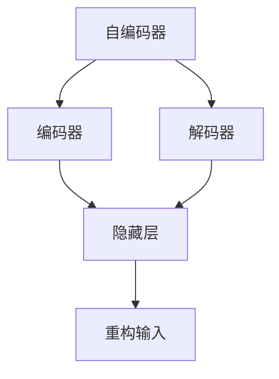

# 自编码器 (Autoencoders) 原理与代码实例讲解

## 1. 背景介绍

### 1.1 问题的由来

在机器学习和深度学习领域中,数据表示和特征提取是一个关键问题。传统的特征工程方法需要大量的人工干预和领域知识,而自动学习数据表示的能力对于解决复杂任务至关重要。自编码器(Autoencoders)作为一种无监督学习技术,可以自动学习数据的紧凑表示,从而为下游任务提供有价值的特征表示。

### 1.2 研究现状

自编码器最初由Hinton等人在2006年提出,旨在学习高维数据的低维表示。近年来,随着深度学习的兴起,自编码器也得到了广泛的研究和应用。研究人员提出了多种自编码器变体,如稀疏自编码器、变分自编码器、去噪自编码器等,用于解决不同的问题。自编码器已经在图像处理、推荐系统、异常检测等领域取得了显著成果。

### 1.3 研究意义

自编码器的研究意义主要体现在以下几个方面:

1. **特征学习**:自编码器可以自动学习数据的紧凑表示,捕捉数据的内在结构和模式,为下游任务提供有价值的特征。
2. **数据压缩**:自编码器可以将高维数据压缩为低维表示,实现有效的数据压缩和降噪。
3. **生成模型**:一些自编码器变体(如变分自编码器)可以用作生成模型,生成新的数据样本。
4. **异常检测**:自编码器可以用于检测异常数据,通过重构误差来识别偏离正常模式的数据点。

### 1.4 本文结构

本文将全面介绍自编码器的原理、变体、数学模型、实现细节和应用场景。文章结构如下:

1. 背景介绍
2. 核心概念与联系
3. 核心算法原理与具体操作步骤
4. 数学模型和公式详细讲解与案例分析  
5. 项目实践:代码实例和详细解释说明
6. 实际应用场景
7. 工具和资源推荐
8. 总结:未来发展趋势与挑战
9. 附录:常见问题与解答

## 2. 核心概念与联系

自编码器(Autoencoders)是一种无监督学习算法,由编码器(Encoder)和解码器(Decoder)两部分组成。

- **编码器(Encoder)**将高维输入数据映射到隐藏层,得到低维的隐藏表示或编码。
- **解码器(Decoder)**将隐藏表示解码,重构出与原始输入数据相似的输出。

在训练过程中,自编码器试图最小化输入数据与重构输出之间的差异,从而学习到能够捕捉输入数据本质特征的隐藏表示。隐藏层的维度通常小于输入数据的维度,因此自编码器也可以用于数据压缩和降噪。

自编码器的核心思想是通过重构输入数据的过程,自动学习数据的紧凑表示。这种无监督学习方式不需要标签数据,可以从原始数据中提取有价值的特征,为下游任务提供良好的数据表示。

## 3. 核心算法原理与具体操作步骤

### 3.1 算法原理概述

自编码器的核心思想是通过最小化输入数据与重构输出之间的差异,学习到能够捕捉输入数据本质特征的隐藏表示。算法原理可概括为以下几个步骤:

1. **输入数据**:将原始高维数据输入到自编码器网络中。
2. **编码**:编码器将高维输入数据映射到低维隐藏层,得到隐藏表示或编码。
3. **解码**:解码器将隐藏表示解码,重构出与原始输入数据相似的输出。
4. **重构误差**:计算输入数据与重构输出之间的差异,即重构误差。
5. **优化**:通过优化算法(如梯度下降)最小化重构误差,调整网络参数。
6. **迭代训练**:重复上述步骤,直到网络收敛或达到停止条件。

通过上述过程,自编码器可以学习到能够有效表示输入数据的隐藏表示,实现无监督特征学习和数据压缩。

### 3.2 算法步骤详解

1. **输入数据**:自编码器接受高维输入数据 $\boldsymbol{x} \in \mathbb{R}^{d}$,其中 $d$ 是输入数据的维度。

2. **编码**:编码器将输入数据 $\boldsymbol{x}$ 映射到隐藏层,得到低维隐藏表示或编码 $\boldsymbol{h}$。编码过程可以表示为:

$$\boldsymbol{h} = f_\theta(\boldsymbol{x}) = \sigma(\boldsymbol{Wx} + \boldsymbol{b})$$

其中 $f_\theta$ 是编码器函数,由权重矩阵 $\boldsymbol{W}$ 和偏置向量 $\boldsymbol{b}$ 参数化。$\sigma$ 是非线性激活函数,如 ReLU 或 Sigmoid。

3. **解码**:解码器将隐藏表示 $\boldsymbol{h}$ 解码,重构出与原始输入数据相似的输出 $\boldsymbol{\hat{x}}$。解码过程可以表示为:

$$\boldsymbol{\hat{x}} = g_\phi(\boldsymbol{h}) = \sigma'(\boldsymbol{W'h} + \boldsymbol{b'})$$

其中 $g_\phi$ 是解码器函数,由权重矩阵 $\boldsymbol{W'}$ 和偏置向量 $\boldsymbol{b'}$ 参数化。$\sigma'$ 是解码器的激活函数,通常与编码器的激活函数不同。

4. **重构误差**:计算输入数据 $\boldsymbol{x}$ 与重构输出 $\boldsymbol{\hat{x}}$ 之间的差异,即重构误差 $L(\boldsymbol{x}, \boldsymbol{\hat{x}})$。常用的重构误差函数包括均方误差(Mean Squared Error, MSE)和交叉熵损失(Cross Entropy Loss)等。

$$L(\boldsymbol{x}, \boldsymbol{\hat{x}}) = \frac{1}{n}\sum_{i=1}^{n}(\boldsymbol{x}_i - \boldsymbol{\hat{x}}_i)^2$$

5. **优化**:通过优化算法(如梯度下降)最小化重构误差,调整网络参数 $\theta$ 和 $\phi$。

$$\theta^*, \phi^* = \arg\min_{\theta, \phi} \sum_{i=1}^{n} L(\boldsymbol{x}_i, g_\phi(f_\theta(\boldsymbol{x}_i)))$$

6. **迭代训练**:重复上述步骤,直到网络收敛或达到停止条件。

通过上述过程,自编码器可以学习到能够有效表示输入数据的隐藏表示,实现无监督特征学习和数据压缩。

### 3.3 算法优缺点

**优点**:

1. **无监督学习**:自编码器可以从未标注的原始数据中自动学习有价值的特征表示,不需要大量的人工标注工作。
2. **特征学习**:自编码器可以学习到能够捕捉输入数据本质特征的紧凑表示,为下游任务提供良好的特征输入。
3. **数据压缩**:自编码器可以将高维数据压缩为低维表示,实现有效的数据压缩和降噪。
4. **灵活性**:自编码器具有很强的灵活性,可以通过改变网络结构和损失函数来解决不同的问题,如稀疏自编码器、变分自编码器等。

**缺点**:

1. **无法直接用于分类或回归任务**:自编码器本身是一种无监督学习算法,无法直接用于分类或回归等有监督任务,需要与其他模型结合使用。
2. **可能学习到无用特征**:自编码器可能会学习到一些无用或冗余的特征,导致隐藏表示的质量下降。
3. **训练困难**:自编码器的训练过程可能会遇到一些困难,如梯度消失、模型崩溃等,需要仔细设计网络结构和超参数。
4. **解释性较差**:自编码器学习到的隐藏表示通常难以直接解释,需要进一步分析和可视化。

### 3.4 算法应用领域

自编码器及其变体已被广泛应用于多个领域,包括但不限于:

1. **图像处理**:自编码器可以用于图像去噪、超分辨率重建、图像压缩等任务。
2. **推荐系统**:自编码器可以学习用户和物品的紧凑表示,用于协同过滤推荐。
3. **异常检测**:利用自编码器的重构误差,可以检测偏离正常模式的异常数据。
4. **语音处理**:自编码器可以用于语音增强、语音编码等任务。
5. **自然语言处理**:自编码器可以学习词嵌入和句子表示,用于文本分类、机器翻译等任务。
6. **生成模型**:变分自编码器等变体可以用作生成模型,生成新的数据样本。

## 4. 数学模型和公式详细讲解与举例说明

### 4.1 数学模型构建

自编码器的数学模型可以表示为:

$$\boldsymbol{\hat{x}} = g_\phi(f_\theta(\boldsymbol{x}))$$

其中:

- $\boldsymbol{x} \in \mathbb{R}^{d}$ 是输入数据,维度为 $d$。
- $f_\theta$ 是编码器函数,由参数 $\theta$ 参数化,将输入数据映射到隐藏表示 $\boldsymbol{h}$。
- $g_\phi$ 是解码器函数,由参数 $\phi$ 参数化,将隐藏表示 $\boldsymbol{h}$ 解码为重构输出 $\boldsymbol{\hat{x}}$。

编码器函数 $f_\theta$ 和解码器函数 $g_\phi$ 通常由神经网络实现,可以是全连接网络、卷积网络或其他类型的网络。

训练目标是最小化输入数据 $\boldsymbol{x}$ 与重构输出 $\boldsymbol{\hat{x}}$ 之间的重构误差 $L(\boldsymbol{x}, \boldsymbol{\hat{x}})$,从而学习到能够捕捉输入数据本质特征的隐藏表示 $\boldsymbol{h}$。

$$\theta^*, \phi^* = \arg\min_{\theta, \phi} \sum_{i=1}^{n} L(\boldsymbol{x}_i, g_\phi(f_\theta(\boldsymbol{x}_i)))$$

常用的重构误差函数包括均方误差(MSE)和交叉熵损失(Cross Entropy Loss)等。

### 4.2 公式推导过程

我们以均方误差(MSE)为例,推导自编码器的损失函数和梯度更新公式。

假设编码器和解码器都是单层全连接网络,激活函数分别为 $\sigma$ 和 $\sigma'$,则编码器和解码器可以表示为:

$$\boldsymbol{h} = f_\theta(\boldsymbol{x}) = \sigma(\boldsymbol{Wx} + \boldsymbol{b})$$
$$\boldsymbol{\hat{x}} = g_\phi(\boldsymbol{h}) = \sigma'(\boldsymbol{W'h} + \boldsymbol{b'})$$

其中 $\boldsymbol{W}$、$\boldsymbol{b}$、$\boldsymbol{W'}$、$\boldsymbol{b'}$ 分别是编码器和解码器的权重和偏置参数。

均方误差损失函数为:

$$L(\boldsymbol{x}, \boldsymbol{\hat{x}}) = \frac{1}{n}\sum_{i=1}^{n}(\boldsymbol{x}_i - \boldsymbol{\hat{x}}_i)^2$$

对于单个样本 $\boldsymbol{x}$,损失函数可以写为:

$$L(\boldsymbol{x}, \boldsymbol{\hat{x}}) = \frac{1}{2}(\boldsymbol{x} - \boldsymbol{\hat{x}})^2 =