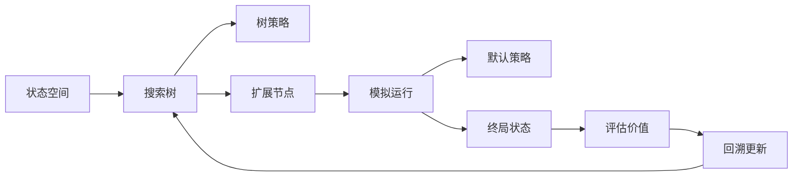
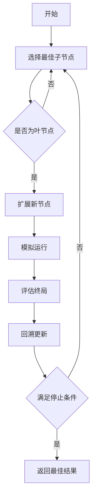

# 蒙特卡洛树搜索 原理与代码实例讲解

## 1. 背景介绍
### 1.1 问题的由来
在人工智能和机器学习领域,如何让计算机高效地在复杂的搜索空间中找到最优解一直是一个核心问题。传统的搜索算法,如深度优先搜索、广度优先搜索等,在面对庞大的状态空间时往往会陷入"维度灾难",导致搜索效率低下。蒙特卡洛树搜索(Monte Carlo Tree Search,MCTS)算法的出现,为这一难题提供了新的解决思路。

### 1.2 研究现状 
蒙特卡洛树搜索算法最初由 Coulom 在2006年提出,并在计算机博弈领域取得了重大突破。2016年,DeepMind 公司开发的 AlphaGo 系统在围棋比赛中击败了世界冠军李世石,其中就大量采用了 MCTS 算法。近年来,MCTS 在机器博弈、自动规划、组合优化等领域得到了广泛应用,并催生出了许多改进版本,如 UCT、PUCT、AlphaZero 等。

### 1.3 研究意义
蒙特卡洛树搜索通过随机采样和启发式评估相结合的方式,在搜索树中选择最有潜力的分支进行扩展,并不断更新节点统计信息来指导后续搜索。这种思想突破了传统搜索算法的局限性,在许多领域展现出了卓越的性能。深入研究 MCTS 的原理和应用,对于推动人工智能的发展具有重要意义。

### 1.4 本文结构
本文将全面介绍蒙特卡洛树搜索的基本原理、核心概念、关键算法、数学模型,并通过代码实例详细讲解其实现过程。同时,本文还将探讨 MCTS 在实际场景中的应用,介绍相关的学习资源和开发工具,展望其未来的发展方向和挑战。

## 2. 核心概念与联系
蒙特卡洛树搜索涉及以下几个核心概念:

- **状态空间**: 问题的所有可能状态构成的集合,通常用树或图来表示。每个节点对应一个状态。
- **状态转移**: 从一个状态到另一个状态的变化过程,对应树中节点之间的边。
- **蒙特卡洛方法**: 通过随机采样来估计目标函数的数值方法。在 MCTS 中用于评估叶节点的价值。
- **树策略**: 决定在搜索树中选择哪个节点进行扩展的策略,常见的有 UCB、UCT 等。
- **默认策略**: 在叶节点处快速模拟运行到终局的策略,通常采用随机策略。
- **回溯更新**: 将模拟结果反向传播到树中,更新沿途节点的统计信息。

这些概念之间紧密联系,共同构建起 MCTS 算法的基本框架。下图展示了其逻辑关系:



## 3. 核心算法原理 & 具体操作步骤
### 3.1 算法原理概述
MCTS 算法通过反复执行选择(Selection)、扩展(Expansion)、模拟(Simulation)、回溯(Backpropagation)四个步骤来不断构建和更新搜索树:

1. 选择:从根节点出发,依据树策略选择最有潜力的子节点,直到到达叶节点。
2. 扩展:在选中的叶节点处扩展出新的子节点。 
3. 模拟:从新节点出发,按照默认策略进行快速模拟直到终局。
4. 回溯:将模拟结果反向传播更新树中各节点的统计信息。

通过多次迭代,搜索树逐渐生长,最终根节点处的最佳子节点即为所求的最优解。

### 3.2 算法步骤详解

1. **选择阶段**:
   - 从根节点出发,递归地选择子节点,直到到达叶节点或未完全扩展的节点。
   - 选择过程通常采用 UCB(Upper Confidence Bound)或其变体如 UCT。
   - UCB 平衡了探索(exploration)和利用(exploitation),公式为:
     $UCB=\frac{w_i}{n_i}+c\sqrt{\frac{\ln N}{n_i}}$
   - 其中 $w_i$ 为第 $i$ 个子节点的累积价值,$n_i$ 为其被访问次数,$N$ 为其父节点的总访问次数,$c$ 为探索常数。

2. **扩展阶段**: 
   - 选择阶段到达叶节点后,考虑可能的后继状态,扩展出新的子节点。
   - 扩展节点的数量可以控制在一定范围内,以平衡时间和空间开销。

3. **模拟阶段**:
   - 从新扩展的节点出发,按照默认策略快速模拟运行到终局状态。
   - 默认策略通常采用随机策略或简单的启发式规则。
   - 模拟过程不必遍历所有可能动作,以节省时间。
   
4. **回溯阶段**:  
   - 将模拟阶段的结果评分反向传播到树中。
   - 更新路径上所有节点的访问次数和价值累积。
   - 更新公式为:
     $N(v)=N(v)+1$
     $W(v)=W(v)+\Delta(v)$
   - 其中 $v$ 为路径上的节点,$N(v)$为其访问次数,$W(v)$为价值累积,$\Delta(v)$为本次模拟的评估值。

以上四个步骤反复迭代,直到满足预设的停止条件,如时间限制、迭代次数等。搜索过程可以总结为下图:



### 3.3 算法优缺点
MCTS 算法的主要优点有:
- 通用性强,适用于状态空间巨大、规则复杂的问题。
- 渐进式搜索,可以在任意时刻输出当前最佳结果。
- 自动平衡探索和利用,不易陷入局部最优。
- 可以与神经网络等结合,实现更强大的智能体。

同时 MCTS 也存在一些局限性:
- 树的存储开销大,对内存要求高。
- 需要合适的默认策略和评估函数,否则搜索效率低。
- 对于一些特殊问题,经典算法可能更有效。

### 3.4 算法应用领域
MCTS 算法在许多领域都有成功应用,典型的有:
- 棋类游戏:围棋、国际象棋、五子棋等
- 桌面游戏:德州扑克、麻将等
- 视频游戏:星际争霸、MOBA 等
- 组合优化:旅行商问题、车间调度等
- 自动规划:机器人路径规划、自动驾驶等

此外,MCTS 还可以与深度学习等技术结合,形成更强大的 AI 系统,如 AlphaGo 就是典型代表。

## 4. 数学模型和公式 & 详细讲解 & 举例说明
### 4.1 数学模型构建
蒙特卡洛树搜索可以用如下数学模型来刻画:

1. 搜索树:定义一个有向树 $\mathcal{T}=(V,E)$,其中节点 $v\in V$ 表示问题状态,边 $(v,v')\in E$ 表示状态转移。
2. 节点统计:每个节点 $v$ 维护访问次数 $N(v)$ 和价值累积 $W(v)$ 两个变量。
3. 树策略:定义函数 $\pi_t:V\to V$,表示在节点 $v$ 处应选择哪个子节点。
4. 默认策略:定义函数 $\pi_d:V\to A$,表示在节点 $v$ 处应选择哪个动作,其中 $A$ 为动作集合。
5. 评估函数:定义函数 $f:V_T\to\mathbb{R}$,表示终局状态 $v_T$ 的价值。

基于以上定义,MCTS 的目标就是找到使得根节点 $v_0$ 的子节点价值最大化的树策略 $\pi_t^*$:

$$\pi_t^*=\arg\max_{\pi_t}\lim_{n\to\infty}\frac{1}{n}\sum_{i=1}^nf(v_{T,i})$$

其中 $v_{T,i}$ 为第 $i$ 次模拟到达的终局节点。

### 4.2 公式推导过程
接下来我们推导 UCT(Upper Confidence Bound applied to Trees)算法的公式,它是 MCTS 的一种常用变体。

UCT 算法的树策略为:

$$\pi_t(v)=\arg\max_{v'\in\text{Children}(v)}\left(Q(v')+c\sqrt{\frac{\ln N(v)}{N(v')}}\right)$$

其中 $Q(v')=\frac{W(v')}{N(v')}$ 为子节点的平均价值,$c$ 为探索常数。

这个公式的直观解释是,选择 $Q(v')$ 值大的节点倾向于利用已有的良好结果,而选择 $N(v')$ 值小的节点倾向于探索未知的可能性,两者通过 $c$ 系数平衡。

下面我们来推导这个公式的理论依据。定义节点 $v$ 的真实价值为 $\mu(v)$,其样本均值为 $\hat{\mu}(v)=Q(v)$。根据 Hoeffding 不等式,对任意 $\epsilon>0$,有:

$$P(|\hat{\mu}(v)-\mu(v)|\ge\epsilon)\le2\exp(-2N(v)\epsilon^2)$$

令 $\delta=2\exp(-2N(v)\epsilon^2)$,则 $\epsilon=\sqrt{\frac{\ln(2/\delta)}{2N(v)}}$。

带入上式得:

$$P\left(|\hat{\mu}(v)-\mu(v)|\ge\sqrt{\frac{\ln(2/\delta)}{2N(v)}}\right)\le\delta$$

这说明以至少 $1-\delta$ 的概率,真实价值 $\mu(v)$ 落在区间 $\left[\hat{\mu}(v)-\sqrt{\frac{\ln(2/\delta)}{2N(v)}},\hat{\mu}(v)+\sqrt{\frac{\ln(2/\delta)}{2N(v)}}\right]$ 内。

取 $\delta=1/N(v)^2$,则 $\ln(2/\delta)=2\ln(N(v))$。忽略常数因子,我们得到节点 $v$ 的上置信区间为:

$$U(v)=\hat{\mu}(v)+\sqrt{\frac{\ln N(v)}{N(v)}}$$

选择置信区间上界最大的节点,即得到 UCT 算法的树策略公式。

### 4.3 案例分析与讲解
下面我们以五子棋为例,讲解 MCTS 算法的应用。五子棋的规则如下:
- 两人轮流在 15x15 的棋盘上下黑白棋子。
- 先在横、竖、斜方向连成 5 子的一方获胜。

定义棋盘状态为一个 15x15 的二维数组,0 表示空位,1 表示黑子,-1 表示白子。则 MCTS 算法可以这样应用:

1. 根节点为初始棋盘状态,每个节点存储盘面、轮到哪方下棋等信息。
2. 树策略使用 UCT 公式,扩展策略是每次随机选择一个合法位置下棋。
3. 默认策略是双方随机下棋直到棋局结束。
4. 评估函数返回 1(本方获胜)或 0(对方获胜或平局)。

假设在某一步,搜索树如下图所示(节点标注为 $Q(v)/N(v)$ 的形式):

```mermaid
graph TD
A[0.6/10] -->