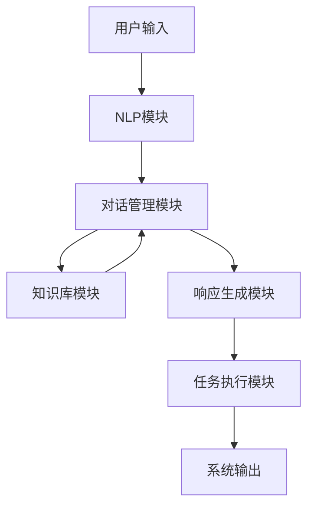

以下是根据您提供的标题和要求撰写的技术博客文章正文内容：

# 虚拟助理：构建AI代理的工作流程

## 1. 背景介绍

### 1.1 问题的由来

在当今快节奏的数字时代,人们越来越渴望获得高效、个性化和无缝的服务体验。传统的客户服务方式已经难以满足不断增长的需求,因此虚拟助理(Virtual Assistant)应运而生。虚拟助理是基于人工智能技术构建的智能代理系统,旨在模拟人类行为,为用户提供自然语言交互和智能服务。

随着人工智能、自然语言处理(NLP)、机器学习等技术的不断发展,虚拟助理的能力也在不断提升。它们不仅可以回答简单的问题,还能执行复杂的任务,如预订航班、管理日程、推荐产品等。因此,构建高质量的虚拟助理系统对于提高用户体验、降低运营成本、提高企业竞争力至关重要。

### 1.2 研究现状

虚拟助理的研究和应用已经取得了长足的进步。一些知名科技公司如苹果(Siri)、亚马逊(Alexa)、谷歌(Google Assistant)和微软(Cortana)都推出了自己的虚拟助理产品。此外,一些初创公司也在探索虚拟助理在特定领域的应用,如医疗保健、金融服务和教育等。

然而,构建一个真正智能、人性化的虚拟助理仍然面临着诸多挑战。例如,理解复杂的自然语言输入、处理上下文信息、生成自然的响应、持续学习新知识等。因此,需要综合运用多种人工智能技术,如自然语言处理、知识图谱、对话管理、机器学习等,才能构建出高质量的虚拟助理系统。

### 1.3 研究意义

构建高质量的虚拟助理系统不仅可以提高用户体验,还可以为企业带来显著的经济效益。一方面,虚拟助理可以自动化处理大量重复性的客户服务工作,从而降低人力成本。另一方面,智能化的个性化服务可以提高客户满意度和忠诚度,促进业务增长。

此外,虚拟助理技术还可以应用于各个领域,如智能家居、智能教育、智能医疗等,为人类生活带来全新的体验。因此,研究虚拟助理的构建流程及相关技术具有重要的理论意义和应用价值。

### 1.4 本文结构  

本文将全面介绍构建虚拟助理系统的工作流程和关键技术。首先阐述虚拟助理的核心概念和系统架构,然后深入探讨自然语言处理、对话管理、知识库构建等核心模块的原理和算法。接下来,将介绍系统的实现细节,包括开发环境搭建、代码实现和运行结果展示。最后,讨论虚拟助理的实际应用场景、未来发展趋势和面临的挑战。

## 2. 核心概念与联系

在深入探讨虚拟助理的构建流程之前,我们先来了解一些核心概念及它们之间的关系。

虚拟助理系统通常由以下几个关键模块组成:

1. **自然语言处理(NLP)模块**: 负责理解用户的自然语言输入,并将其转换为计算机可以理解的形式。
2. **对话管理(Dialog Management)模块**: 根据当前对话状态和上下文信息,决定系统的响应策略。
3. **知识库(Knowledge Base)模块**: 存储系统所需的结构化和非结构化知识,为响应生成提供信息支持。
4. **响应生成(Response Generation)模块**: 根据对话管理模块的策略,生成自然语言响应。
5. **任务执行(Task Execution)模块**: 执行特定的任务,如预订机票、控制智能家居设备等。

这些模块相互协作,构成了一个完整的虚拟助理系统。下面我们使用一个简化的Mermaid流程图来直观地展示它们之间的工作流程:

简单来说,当用户输入一个自然语言查询时,NLP模块首先对其进行处理和理解。然后,对话管理模块根据当前对话状态和上下文信息,查询知识库获取所需信息,并决定系统的响应策略。响应生成模块根据这个策略生成自然语言响应,如果需要执行特定任务,则交由任务执行模块处理。最终,系统将响应呈现给用户。

这只是一个简化的流程,实际系统会更加复杂。接下来,我们将详细介绍每个模块的原理和实现方法。

## 3. 核心算法原理 & 具体操作步骤  

### 3.1 算法原理概述

构建高质量的虚拟助理系统需要综合运用多种人工智能算法,包括自然语言处理、对话管理、知识表示与推理等。下面我们将概述这些核心算法的基本原理。

#### 3.1.1 自然语言处理算法

自然语言处理(NLP)是虚拟助理系统的基础,它使计算机能够理解和生成人类可理解的语言。常用的NLP算法包括:

- **词法分析(Lexical Analysis)**: 将文本分割成词元(token)序列,如单词、数字、标点符号等。
- **句法分析(Syntactic Analysis)**: 根据语法规则分析词元序列的句子结构,构建句法树。
- **语义分析(Semantic Analysis)**: 从句法树中提取语义信息,构建语义表示。
- **实体识别(Named Entity Recognition)**: 识别出文本中的实体,如人名、地名、组织机构名等。
- **关系抽取(Relation Extraction)**: 从文本中抽取实体之间的语义关系。
- **词向量(Word Embedding)**: 将单词映射到连续的向量空间,捕捉语义和语法信息。
- **序列标注(Sequence Labeling)**: 为序列数据(如文本)中的每个元素赋予标签,如命名实体识别、词性标注等。
- **机器翻译(Machine Translation)**: 将一种自然语言翻译成另一种语言。
- **文本生成(Text Generation)**: 根据给定的上下文或主题,生成自然语言文本。

这些算法通常基于统计模型、规则系统或深度学习模型。近年来,基于transformer的大型语言模型(如BERT、GPT等)在NLP任务中表现出色,成为主流方法。

#### 3.1.2 对话管理算法

对话管理模块负责控制对话流程,决定系统的响应策略。常用的对话管理算法包括:

- **有限状态机(Finite State Machine)**: 将对话过程建模为一系列状态和状态转移,根据当前状态和用户输入决定下一步操作。
- **框架填充(Frame Filling)**: 将对话视为一个框架,需要逐步填充所需的槽位(slot),直到获取足够信息执行任务。
- **基于规则的系统(Rule-based System)**: 使用一系列手工设计的规则来控制对话流程。
- **机器学习方法**: 将对话管理建模为一个序列决策过程,使用强化学习、深度学习等方法自动学习最优策略。

对话管理算法需要综合考虑当前对话状态、上下文信息、知识库内容等因素,以生成合理的响应策略。

#### 3.1.3 知识表示与推理算法

为了支持智能响应,虚拟助理系统需要构建知识库,存储结构化和非结构化的知识。常用的知识表示与推理算法包括:

- **知识图谱(Knowledge Graph)**: 使用实体和关系构建知识网络,支持结构化知识的存储和查询。
- **本体论(Ontology)**: 形式化定义概念、属性和关系,用于知识建模和推理。
- **规则推理(Rule-based Reasoning)**: 基于一系列逻辑规则对知识进行推理,推导出新的知识。
- **案例推理(Case-based Reasoning)**: 通过检索和复用先前解决过的类似案例,来解决新的问题。
- **模糊推理(Fuzzy Reasoning)**: 使用模糊逻辑和模糊集合理论处理不确定性和模糊性知识。

这些算法可以有效地组织和利用知识,为虚拟助理系统提供智能决策支持。

### 3.2 算法步骤详解

接下来,我们将详细介绍自然语言处理和对话管理两个核心模块的算法流程。

#### 3.2.1 自然语言处理流程

自然语言处理模块的主要任务是将用户的自然语言输入转换为计算机可以理解的形式,通常包括以下步骤:

1. **词法分析**:将文本分割成词元序列,如单词、数字、标点符号等。这一步通常使用正则表达式或基于规则的tokenizer实现。

2. **句法分析**:根据语法规则分析词元序列的句子结构,构建句法树。常用的句法分析算法包括基于规则的上下文无关文法(Context-Free Grammar)解析器,以及基于统计模型的转移(Transition)或图(Graph)结构预测模型。

3. **词性标注**:为每个词元赋予词性标签,如名词、动词、形容词等。这一步可以使用基于规则的标注器,也可以使用序列标注模型(如HMM、CRF或LSTM等)进行预测。

4. **命名实体识别**:识别出文本中的命名实体,如人名、地名、组织机构名等。常用的方法包括基于规则的系统、序列标注模型(如CRF、LSTM-CRF等)和基于transformer的模型(如BERT等)。

5. **语义分析**:从句法树中提取语义信息,构建语义表示。这一步通常使用语义解析器和语义角色标注(Semantic Role Labeling)模型实现。

6. **关系抽取**:从文本中抽取实体之间的语义关系。主流方法包括基于模式匹配的规则系统、基于特征的统计模型(如SVM、MaxEnt等)和基于神经网络的模型(如CNN、LSTM等)。

7. **意图识别**:确定用户输入的意图,如查询天气、预订机票等。这一步通常使用基于规则的分类器或机器学习分类模型(如SVM、逻辑回归、神经网络等)实现。

8. **槽位填充**:从用户输入中提取所需的槽位信息,如出发地、目的地、日期等。常用的方法包括基于规则的系统、序列标注模型(如CRF、LSTM-CRF等)和基于transformer的模型。

9. **响应生成**:根据意图和槽位信息,生成自然语言响应。这可以使用基于模板的方法,也可以使用基于神经网络的序列生成模型(如Seq2Seq、Transformer等)。

上述步骤并非严格线性执行,某些步骤可能会交替进行或并行执行。此外,在实际系统中还需要考虑上下文信息、多轮对话等因素,使流程更加复杂。

#### 3.2.2 对话管理流程  

对话管理模块的主要任务是根据当前对话状态和上下文信息,决定系统的响应策略。常见的对话管理流程如下:

1. **初始状态**:对话开始时,系统处于初始状态。

2. **获取用户输入**:获取用户的自然语言输入,并由NLP模块进行处理,提取意图和槽位信息。

3. **状态跟踪**:根据当前对话状态、用户意图和槽位信息,更新对话状态。这一步通常使用状态跟踪模型(如基于规则的模型、机器学习模型等)实现。

4. **策略学习**:根据当前对话状态,决定系统的响应策略,如请求补充信息、执行任务或结束对话等。常用的策略学习算法包括基于规则的系统、马尔可夫决策过程(MDP)、部分可观测马尔可夫决策过程(POMDP)、强化学习等。

5. **执行策略**:执行确定的响应策略,可能涉及以下操作