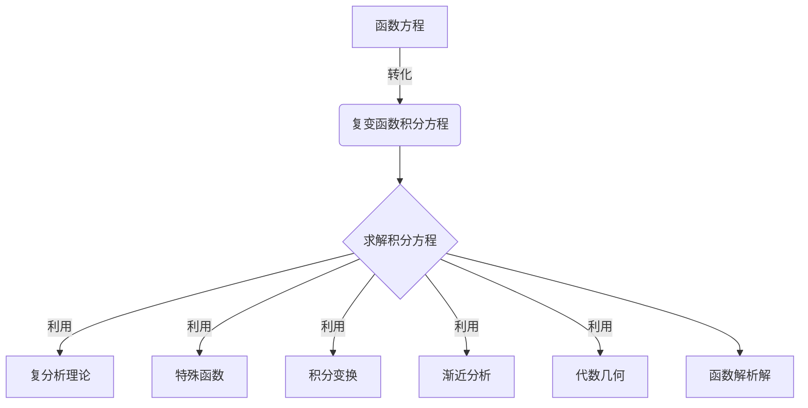

# 解析数论基础：函数方程（二）（复变积分方法）

## 1. 背景介绍

### 1.1 问题的由来

在数论领域中，函数方程是一类重要的非线性函数方程，它们在数论、组合数学、代数几何等领域扮演着重要角色。函数方程的研究可以追溯到18世纪,当时数学家们开始探索这些方程的性质和解法。然而,由于函数方程的非线性特征,求解这类方程通常是一项艰巨的挑战。

### 1.2 研究现状

传统上,解决函数方程的方法主要有两种:

1. **代数方法**: 利用代数变换和恒等式,将函数方程化简为代数方程,然后求解。但这种方法受到严格的条件限制,适用范围有限。

2. **解析方法**: 利用复分析理论和特殊函数,构造函数方程的解析解。这种方法更加通用,但计算过程往往复杂冗长。

近年来,随着计算机科学的发展,数值计算和符号计算等新兴技术为解决函数方程提供了新的思路和工具。

### 1.3 研究意义

函数方程在数学和应用科学中扮演着重要角色。能够有效求解函数方程,对于以下领域具有重要意义:

- **数论**: 函数方程在解决加性问题、指数级数求和等经典数论问题中发挥着关键作用。

- **组合数学**: 许多计数问题和递推关系可以转化为函数方程的形式。

- **代数几何**: 代数曲线和代数曲面的研究与函数方程密切相关。

- **动力系统**: 一些动力系统的迭代过程可以用函数方程来描述。

- **编码理论**: 构造优良的纠错码需要解决一些函数方程。

因此,发展高效、通用的函数方程求解方法,对于推动相关学科的理论发展和应用实践都具有重要意义。

### 1.4 本文结构

本文将介绍一种新兴的函数方程求解方法——复变积分方法。文章首先阐述该方法的核心思想和数学基础,然后详细讨论具体的算法步骤、数学模型和公式推导,并结合实例加以说明。此外,还将介绍该方法在实际应用中的场景,以及相关的工具和学习资源。最后,我们将总结该方法的优缺点,并展望其未来的发展方向和面临的挑战。

## 2. 核心概念与联系

复变积分方法是一种求解函数方程的新兴解析方法,其核心思想是将函数方程转化为复变函数的积分方程,利用复分析理论求解该积分方程,进而获得原函数方程的解析解。

这种方法的数学基础主要来自以下几个方面:

1. **复分析理论**: 包括复变函数、解析函数、留数理论、柯西积分公式等概念和理论。

2. **特殊函数**: 如伽马函数、超几何函数等,它们在求解积分方程中扮演着重要角色。

3. **积分变换**: 如拉普拉斯变换、傅里叶变换等,可用于简化积分方程的形式。

4. **渐近分析**: 用于研究函数解在无穷远处的渐近行为。

5. **代数几何**: 代数曲线和代数曲面的理论为函数方程提供了重要的几何解释。

复变积分方法与其他求解函数方程的方法相比,具有以下优点:

- 适用范围广,可以处理更一般形式的函数方程。
- 计算过程具有一定规范性,便于编写符号计算程序。
- 能够获得函数解的解析表达式,有利于深入研究其性质。

但同时,这种方法也存在一些缺陷和挑战:

- 计算过程往往复杂冗长,需要耗费大量的代数和分析计算。
- 对于某些特殊形式的函数方程,传统代数方法可能更加高效。
- 需要熟练掌握复分析、特殊函数等多门数学理论的知识。

总的来说,复变积分方法为求解函数方程提供了一种新的思路,它将为相关领域的理论研究和应用实践带来新的机遇和挑战。

## 3. 核心算法原理 & 具体操作步骤

### 3.1 算法原理概述

复变积分方法求解函数方程的核心思路是,将原函数方程转化为一个复变函数的积分方程,然后利用复分析理论对该积分方程进行求解,最终获得原函数方程的解析解。

具体来说,算法包括以下几个关键步骤:

1. **函数方程到积分方程的转化**
2. **积分方程的简化**
3. **利用复分析理论求解积分方程**
4. **解析解的后续处理**

在第一步中,我们需要构造一个辅助函数,使得原函数方程可以等价地表示为该辅助函数的一个积分方程。这种转化过程需要一定的技巧和经验。

第二步是对所得到的积分方程进行适当的代数和解析变换,以简化其形式,为后续求解做好准备。这个过程中可能需要应用诸如拉普拉斯变换、傅里叶变换等积分变换技术。

第三步是算法的核心部分。我们需要利用复分析理论中的各种工具,如留数定理、Gamma函数、超几何函数等,对简化后的积分方程进行解析求解。这个过程通常是最为复杂和技术性的。

最后一步则是对所得到的解析解进行必要的后续处理,如化简、渐近分析等,以获得更简洁规范的表达式,并研究解的性质和行为。

总的来说,这种算法的关键在于巧妙地构造辅助函数,灵活地应用各种数学工具,并熟练掌握复分析理论。它为求解一般形式的函数方程提供了一种通用而强大的解析方法。

### 3.2 算法步骤详解

现在,我们对上述算法步骤进行更加详细的说明。

#### 步骤1: 函数方程到积分方程的转化

假设我们要求解的函数方程为:

$$
F(x,f(x))=0
$$

其中 $F$ 是已知的函数,而 $f(x)$ 是我们要求解的未知函数。

我们的目标是构造一个辅助函数 $\phi(z)$,使得原方程可以等价地表示为:

$$
\phi(x)=\int_\gamma \Omega(z,\phi(z))dz \tag{1}
$$

这里 $\gamma$ 是一条适当的积分路径, $\Omega$ 是另一个已知函数。

构造 $\phi(z)$ 的过程需要一定的技巧和经验,通常可以遵循以下几个原则:

1. 对于给定的 $F(x,f(x))$,尝试找到一个 $\phi(z)$,使得 $F(x,\phi(x))=0$。
2. 对 $\phi(z)$ 进行适当的变换,使其满足某种特殊的函数方程,如Abel型、Riccati型等。
3. 利用这些特殊函数方程的性质,将其化为形如(1)式的积分方程。

这个过程有时需要一些创造性的思维,结合具体问题的特点来构造合适的辅助函数。

#### 步骤2: 积分方程的简化

一旦我们获得了形如(1)式的积分方程,下一步就是对其进行适当的代数和解析变换,以简化其形式。这个过程中,我们可能需要应用以下一些技术:

- 有理函数分式分解
- 部分分式展开
- 拉普拉斯变换
- 傅里叶变换
- 代数和三角等价替换
- 特殊函数变换(如Barnes型积分)

目的是将积分方程化为一种更加标准和简单的形式,为后续求解做好准备。

#### 步骤3: 利用复分析理论求解积分方程

这是整个算法的核心部分。我们需要利用复分析理论中的各种工具和方法,对简化后的积分方程进行解析求解。

常用的工具和方法包括:

- 留数定理
- Cauchy积分公式
- Gamma函数及其性质
- 超几何函数及其性质
- Mellin变换
- Parseval等式
- Poisson求和公式
- Riemann映射定理
- ...

这个过程通常是最为复杂和技术性的,需要我们熟练掌握复分析理论的各种概念和技术。有时,我们还需要结合具体问题的特点,发挥创造性思维,发明或应用一些特殊的技巧。

#### 步骤4: 解析解的后续处理

在获得积分方程的解析解之后,我们通常还需要对解进行一些后续处理,以获得更加规范和简洁的表达式,并研究解的性质和行为。

常见的后续处理包括:

- 代数化简
- 渐近分析
- 特殊值讨论
- 奇异性分析
- 数值计算
- 图形可视化
- ...

这个过程有助于我们更好地理解和把握所得到的解析解,为其在理论研究和实际应用中的进一步工作打下基础。

### 3.3 算法优缺点

复变积分方法作为一种求解函数方程的新兴解析方法,它具有以下一些优点:

1. **适用范围广泛**: 它可以处理更一般形式的函数方程,而不受传统代数方法的严格条件限制。

2. **获得解析解**: 这种方法能够给出函数方程解的解析表达式,有利于深入研究解的性质和行为。

3. **具有一定规范性**: 算法步骤相对规范,便于编写符号计算程序来自动化求解过程。

4. **与其他理论相结合**: 这种方法与复分析、特殊函数、代数几何等多门数学理论紧密相关,有助于加深对这些理论的理解和应用。

然而,复变积分方法也存在一些不足之处:

1. **计算过程复杂冗长**: 求解过程中需要耗费大量的代数和解析计算,工作量通常很大。

2. **理论要求较高**: 需要熟练掌握复分析、特殊函数等多门数学理论的知识,门槛较高。

3. **缺乏普适性**: 对于某些特殊形式的函数方程,传统代数方法可能更加高效和直接。

4. **需要人工经验**: 构造辅助函数等步骤需要一定的经验和创造性思维,难以完全自动化。

因此,在实际应用中,我们需要权衡利弊,根据具体问题的特点来选择最合适的求解方法。复变积分方法为我们提供了一种新的思路和工具,但并非万能,它与其他方法相辅相成,共同推进函数方程理论的发展。

### 3.4 算法应用领域

复变积分方法求解函数方程的应用领域是广泛的,包括但不限于:

1. **数论**
   - 解决加性问题、指数级数求和等经典数论问题
   - 研究模函数、L函数等特殊函数的性质
   - 分析算术几何对象(如椭圆曲线、模形式)的行为

2. **组合数学**
   - 求解计数问题、递推关系等组合问题
   - 研究部分和、贝尔数等组合对象的性质
   - 分析随机过程(如随机游走)的概率分布

3. **代数几何**
   - 研究代数曲线、代数曲面等代数几何对象的性质
   - 分析这些对象上的函数的行为
   - 与模函数、调和积分等概念相结合

4. **动力系统**
   - 分析一些迭代过程(如Gamma迭代)的渐近行为
   - 研究混沌系统、分形等现象背后的函数方程
   - 与经典和量子动力系统理论相结合

5. **编码理论**
   - 构