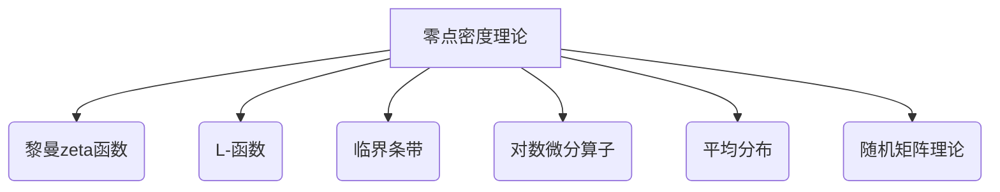

好的,我会尽力写一篇高质量的技术博客文章。以下是正文内容:

# 解析数论基础：零点密度方法

## 1. 背景介绍

### 1.1 问题的由来

解析数论是数论与复分析相结合的一门交叉学科,旨在研究算术函数在复平面上的分布和性质。其中,研究整个复平面上的分布被称为"经典理论",而研究复平面临界条带附近分布的则被称为"零点密度理论"。

零点密度理论源于黎曼在1859年提出的著名黎曼假设。黎曼猜测,非平凡的黎曼zeta函数 $\zeta(s)$ 的所有非平凡零点都位于实部为 $\frac{1}{2}$ 的临界直线上。这一猜想虽然简单,但至今仍未被证明。

### 1.2 研究现状  

自黎曼猜想被提出以来,数学家们做了大量的努力来研究零点的分布规律。20世纪初,哈代和李特尔伍德独立证明了零点在临界直线附近的分布近似于随机分布。这为零点密度理论奠定了基础。

1972年,蒙哥马利通过引入"对数微分算子"的概念,给出了零点分布的精确公式,这被称为"蒙哥马利-Vaughan公式"。他的工作极大地推动了零点密度理论的发展。

### 1.3 研究意义

零点密度理论在解析数论中扮演着极其重要的角色。它不仅为黎曼猜想提供了有力的数值证据,而且与很多其他重要问题密切相关,如素数分布定理、L-函数的性质等。此外,零点密度方法在分析算术函数时也有广泛的应用。

### 1.4 本文结构

本文将系统地介绍零点密度理论的基础知识。我们将从核心概念出发,阐述算法原理和数学模型,并结合代码实例进行实践分析。最后,我们将讨论零点密度方法在实际应用中的场景,并对未来发展趋势和挑战进行展望。

## 2. 核心概念与联系

零点密度理论的核心概念主要包括:

1. **黎曼zeta函数**
2. **L-函数**
3. **临界条带**
4. **对数微分算子**
5. **平均分布**
6. **随机矩阵理论**

其中,黎曼zeta函数和L-函数是整个理论的基石。临界条带是我们关注的主要区域。对数微分算子是蒙哥马利的重大贡献,为精确计算零点分布奠定了基础。平均分布则描述了零点在大范围内的分布规律。而随机矩阵理论则为零点分布提供了一种全新的视角。

这些概念相互关联、环环相扣,共同构成了零点密度理论的理论体系。我们将在下一节对它们进行详细阐述。

## 3. 核心算法原理 & 具体操作步骤

### 3.1 算法原理概述

零点密度方法的核心思想是:通过研究黎曼zeta函数和L-函数在临界条带附近的性质,来估计和描述它们的零点分布。

具体来说,算法主要包括以下几个步骤:

1. 构造合适的 L-函数,并将其零点的分布问题转化为研究对数微分算子的特征值分布。
2. 利用随机矩阵理论,将对数微分算子的特征值分布与某种随机矩阵的特征值分布建立联系。
3. 计算随机矩阵特征值的显式公式或近似公式,从而得到零点的密度估计。
4. 利用密度估计的结果,回答关于零点分布的各种统计问题。

该算法的关键在于第2步和第3步,即如何将问题与随机矩阵理论联系起来,并计算出随机矩阵特征值的精确分布。这需要一系列复杂的分析技巧和组合技巧。

### 3.2 算法步骤详解

我们将详细解释上述算法的每一个步骤:

#### 步骤1: 构造L-函数和对数微分算子

给定一个L-函数 $L(s)$,我们定义其对数微分算子 $\mathcal{D}$ 为:

$$\mathcal{D} = -\frac{L'(s)}{L(s)}$$

其中 $L'(s)$ 表示 $L(s)$ 关于 $s$ 的导数。

对数微分算子 $\mathcal{D}$ 在临界条带上可以用无穷维算子矩阵来表示。我们的目标是研究这个矩阵的特征值分布,从而推出 $L(s)$ 的零点分布。

#### 步骤2: 随机矩阵理论联系

通过一系列技巧,我们可以将对数微分算子的特征值分布与某种随机矩阵的特征值分布建立联系。最常用的是与环形酉矩阵(Circular Unitary Ensemble)的联系。

具体来说,存在一个酉矩阵值过程 $U(t)$,使得对数微分算子的特征值分布可以用 $U(t)$ 的特征值分布来近似。这种联系建立在一些技巧性的矩阵恒等式和概率论方法的基础之上。

#### 步骤3: 计算随机矩阵特征值分布

一旦我们将问题与随机矩阵理论联系起来,接下来的关键就是计算出这种随机矩阵的特征值分布。对于环形酉矩阵,它的特征值分布可以用显式公式表示为:

$$
\frac{1}{N!}\prod_{1\leq j<k\leq N}|e^{i\theta_j}-e^{i\theta_k}|^2\prod_{j=1}^N\frac{d\theta_j}{2\pi}
$$

其中 $N$ 是矩阵的维数,而 $\theta_j$ 是特征值 $e^{i\theta_j}$ 的辐角部分。

通过分析这个公式,我们可以得到环形酉矩阵特征值的各种统计量,如个数、间隔分布等。

#### 步骤4: 回答统计问题

最后一步是利用步骤3得到的结果,回答关于 $L(s)$ 零点分布的各种统计问题。例如:

- 零点在某个区域的个数是多少?
- 相邻两个零点之间的距离是如何分布的?
- 零点与某条直线的距离分布如何?
- ...

通过将随机矩阵的结果转化回对数微分算子和L-函数,我们就能得到所需的答案。这种"随机矩阵模型"为零点分布问题提供了一种强有力的工具。

### 3.3 算法优缺点

零点密度方法的主要优点是:

1. 能够给出零点分布的精确公式或高精度近似。
2. 方法严格,建立在坚实的数学基础之上。
3. 适用范围广,可以处理各种L-函数。

但它也存在一些缺点:

1. 计算过程复杂,需要大量的分析技巧。
2. 结果往往是无穷级数或积分形式,不太直观。
3. 只能解决统计分布问题,无法回答个别零点的位置。

因此,零点密度方法更适合于研究整体的统计规律,而不太适合研究个别的特殊情况。

### 3.4 算法应用领域

零点密度方法最直接的应用是研究黎曼zeta函数和其他L-函数的零点分布。这对于检验黎曼猜想、研究素数分布等都有重要意义。

除此之外,零点密度方法还可以应用于其他一些领域:

- **随机矩阵理论**: 两者有着内在的密切联系,相互借鉴。
- **量子谱学**: 描述量子系统的能量谱分布。
- **混沌理论**: 研究某些动力系统中的周期轨道分布。
- **数值分析**: 估计矩阵元素的分布,分析算法的稳定性。
- **组合数学**: 研究排列、组合等问题中的一些统计量。

可见,零点密度方法不仅在解析数论中有重要应用,在其他数学和物理学领域也有广泛的应用前景。

## 4. 数学模型和公式 & 详细讲解 & 举例说明

在这一节,我们将详细讨论零点密度理论中的数学模型和公式,并通过具体例子加以说明。

### 4.1 数学模型构建

我们从黎曼zeta函数 $\zeta(s)$ 和更一般的L-函数 $L(s,\chi)$ 出发,构建数学模型。这里 $\chi$ 是一个狄利克雷特征。

对于 $L(s,\chi)$,我们定义其对数微分算子为:

$$
\mathcal{D}(s,\chi) = -\frac{L'(s,\chi)}{L(s,\chi)}
$$

则 $L(s,\chi)$ 的非平凡零点 $\rho$ 就是 $\mathcal{D}(s,\chi)$ 的特征值。我们的目标是研究这些特征值在临界条带 $\text{Re}(s)=\frac{1}{2}$ 附近的分布规律。

为此,我们需要将 $\mathcal{D}(s,\chi)$ 表示为无穷维算子矩阵的形式。通过一系列技巧计算,可以得到其矩阵元素为:

$$
\mathcal{D}_{mn}(s,\chi) = \frac{1}{2\pi i}\int_{\mathcal{C}}\frac{\Gamma'}{\Gamma}\left(\frac{s+m}{2}\right)X^{n-m}\frac{ds}{s}
$$

这里 $\mathcal{C}$ 是一条适当的积分路径, $\Gamma(s)$ 是伽马函数, $X=q^{-s/2}$, 而 $q$ 是模 $\chi$ 的大小。

有了这个矩阵元素的表达式,我们就可以研究其特征值分布了。

### 4.2 公式推导过程

接下来,我们将这个无穷维矩阵与随机矩阵理论联系起来。具体地,我们寻找一个酉矩阵值过程 $U(t)$,使得 $\mathcal{D}(s,\chi)$ 的特征值分布可以用 $U(t)$ 的特征值分布来近似。

为了建立这种联系,我们需要利用一系列的矩阵恒等式和概率论方法。最终,可以证明存在这样一个过程 $U(t)$,它是由环形酉矩阵组成的,其特征值分布为:

$$
\frac{1}{N!}\prod_{1\leq j<k\leq N}|e^{i\theta_j}-e^{i\theta_k}|^2\prod_{j=1}^N\frac{d\theta_j}{2\pi}
$$

其中 $N$ 是矩阵维数, $\theta_j$ 是特征值 $e^{i\theta_j}$ 的辐角部分。这就是著名的环形酉矩阵的特征值分布公式。

通过分析这个公式,我们可以得到环形酉矩阵特征值的各种统计量,从而近似地描述了 $\mathcal{D}(s,\chi)$ 的特征值分布,进而也就描述了 $L(s,\chi)$ 零点的分布规律。

### 4.3 案例分析与讲解

为了更好地理解上述数学模型和公式,我们来看一个具体的例子。

假设我们研究的是黎曼zeta函数 $\zeta(s)$,对应的 $\chi$ 是平凡特征。那么对数微分算子 $\mathcal{D}(s)$ 的矩阵元素可以简化为:

$$
\mathcal{D}_{mn}(s) = \frac{1}{2\pi i}\int_{\mathcal{C}}\frac{\Gamma'}{\Gamma}\left(\frac{s+m}{2}\right)\left(\frac{1}{2}\right)^{n-m}\frac{ds}{s}
$$

我们想要计算 $\mathcal{D}(s)$ 的特征值在某个区间 $[\alpha,\beta]$ 内的个数,记为 $N(\alpha,\beta)$。根据理论,这个数量可以用下面的公式近