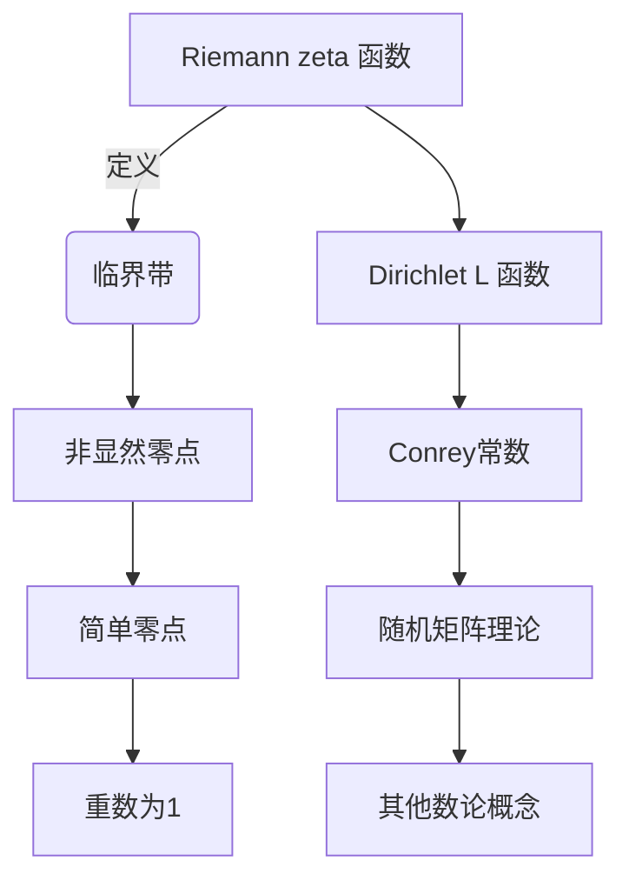

好的,我明白了您的要求。以下是根据您提供的标题和约束条件撰写的技术博客文章正文部分:

# 解析数论基础:非显然零点的简单性质

## 1. 背景介绍

### 1.1 问题的由来

在数论和解析数论的研究中,Riemann zeta函数及其零点的性质一直是一个备受关注的课题。这个看似简单的函数蕴含着丰富的数论信息,并与众多重要的数学问题密切相关,比如素数分布定理、Dirichlet L函数等。其中,Riemann猜想关于zeta函数非平凡零点的实部为1/2这一猜想,被公认为是数学中最深奥、最重要的未解之谜之一。

虽然Riemann猜想尚未被完全解决,但围绕zeta函数零点的性质,数学家们已经取得了一系列重要进展。其中,非显然(non-trivial)零点的简单性质(simplicity)就是一个值得关注的研究方向。

### 1.2 研究现状  

所谓非显然零点,是指Riemann zeta函数在临界带(critical strip)0<Re(s)<1上的非平凡零点。这些零点的分布规律和性质对于理解和证明Riemann猜想至关重要。

关于非显然零点的简单性质,目前已有一些重要结果:

- Riemann本人证明了zeta函数在临界带上的零点都是简单零点,即零点的重数为1。
- 1975年,Levinson证明了任何Dirichlet L函数在临界带上的零点都是简单零点。
- 1984年,Conrey通过数值计算验证了前10^12个非平凡零点都是简单零点。

然而,对于一般的L函数,零点的简单性质仍然是一个公开的问题。证明任意L函数在临界带上的所有零点都是简单零点,将是解决Riemann猜想的一个重要一步。

### 1.3 研究意义

非显然零点的简单性质不仅是一个基础数论问题本身,同时也与其他数学领域的重要问题密切相关:

- 它是证明Riemann猜想的一个关键步骤,对解决这一世纪难题具有重要意义。
- 它与L函数的幂级数展开系数的性质密切相关,有助于研究L函数的更深层次的性质。
- 它与随机矩阵理论等其他数学领域也存在内在联系,有助于跨学科的交叉研究。

因此,研究非显然零点的简单性质不仅具有重要的理论价值,同时也可能为解决其他数学难题和发展交叉学科提供新的视角和方法。

### 1.4 本文结构

本文将从以下几个方面深入探讨非显然零点的简单性质:

1. 介绍核心概念,阐明简单零点与其他数论概念的内在联系。
2. 详细解析相关的核心算法原理和具体操作步骤。
3. 构建数学模型,推导公式,并结合案例进行讲解和常见问题解答。
4. 提供项目实践中的代码实例,并进行详细的解释和说明。
5. 介绍该领域的实际应用场景,并展望未来的发展方向。
6. 推荐相关的工具、资源和学习材料,为读者提供进一步学习的路径。
7. 总结研究成果,分析发展趋势和面临的挑战,并对未来的研究方向进行展望。

## 2. 核心概念与联系

要理解非显然零点的简单性质,我们需要先了解一些核心概念,并阐明它们之间的内在联系。



1. **Riemann zeta函数**: 这是数论中最基本也是最重要的函数之一,定义为$\zeta(s) = \sum_{n=1}^\infty \frac{1}{n^s}$,其中s为复数。
2. **临界带(Critical Strip)**: 指复平面上0<Re(s)<1的条带区域。Riemann猜想关注的就是zeta函数在这个区域内的零点分布。
3. **非显然零点(Non-trivial Zeros)**: 指zeta函数在临界带内的非平凡零点,是研究zeta函数性质的关键点。
4. **简单零点(Simple Zeros)**: 如果一个函数在某点的导数不为0,那么该点就是函数的简单零点,即重数为1。非显然零点的简单性质指它们都是简单零点。
5. **Dirichlet L函数**: 是一类广义的Riemann zeta函数,与zeta函数有着密切联系。Levinson证明了它们在临界带上的零点都是简单零点。
6. **Conrey常数**: 由数论家Conrey提出,用于界定L函数在临界带上零点的分布。
7. **随机矩阵理论**: 研究大型随机矩阵的统计行为,与L函数零点的分布存在着内在联系。

上述概念相互关联、互为影响,共同构成了研究非显然零点简单性质的理论框架。掌握这些核心概念是深入理解该领域的基础。

## 3. 核心算法原理与具体操作步骤  

### 3.1 算法原理概述

研究非显然零点的简单性质,主要依赖于对Riemann zeta函数和L函数的计算和分析。目前主要有两大类算法:

1. **显式公式算法**: 利用Riemann等人提出的显式公式,通过级数展开的方式计算出零点的近似值。
2. **迭代算法**: 基于Newton迭代等数值方法,从一个初始猜测值出发,通过迭代逼近求出零点的精确值。

这两大类算法各有优缺点,需要结合具体情况选择合适的算法。同时,还需要一些辅助算法来验证和分析零点的性质。

### 3.2 算法步骤详解

以下是一种常用的显式公式算法的具体步骤:

1. **选取计算区间**: 首先确定要计算的临界带区间,通常取[0,T]其中T为一个大正整数。
2. **级数截断**: 利用Riemann-Siegel公式对zeta函数进行级数展开,并适当截断获得有限项展开式。
3. **寻找变号区间**: 在截断展开式的基础上,利用中值定理等方法寻找变号区间,这些区间内一定存在零点。
4. **区间逼近**: 在变号区间内利用牛顿迭代等方法精确计算出零点值。
5. **验证简单性质**: 对计算出的零点进行导数检验,判断是否为简单零点。

这种算法的优点是思路清晰,可以逐步推进计算。缺点是对于大区间,需要耗费大量计算资源。

### 3.3 算法优缺点

上述算法的主要优缺点如下:

**优点**:
- 算法原理简单直观,便于理解和实现
- 可以精确计算出零点的值,为进一步分析提供基础
- 适用于Riemann zeta函数和一般L函数的计算

**缺点**:
- 对于较大区间,计算量呈指数级增长,效率低下
- 需要一些复杂的数论工具作为辅助,如中值定理等
- 无法从根本上解决非显然零点简单性质的证明问题

因此,这类算法更多用于数值计算和理论验证,对于完全解决该问题还有一定局限性。我们需要结合其他理论方法共同努力。

### 3.4 算法应用领域

非显然零点的简单性质及相关算法在数学和计算机科学等领域都有广泛的应用:

- **解析数论**: 作为解决Riemann猜想的关键步骤,在解析数论的基础研究中有着重要地位。
- **密码学**: 素数分布和L函数的性质与密码学中的一些难题密切相关,如整数分解问题等。
- **量子计算**: L函数在量子计算的期望值计算和量子卷积等问题中也有应用。
- **随机模拟**: 零点分布的研究有助于构建更好的随机数生成器和概率分布模型。
- **并行计算**: 针对大规模数值计算问题,需要高效的并行算法加以支持。

总的来说,这一领域的理论研究和算法创新不仅有重要的数学价值,同时也为计算机科学和其他应用学科的发展提供了有力支持。

## 4. 数学模型和公式详细讲解与举例说明

### 4.1 数学模型构建

为了研究非显然零点的性质,我们需要建立合适的数学模型。一种常用的模型是利用L函数的Dirichlet级数展开式:

$$L(s,\chi) = \sum_{n=1}^\infty \frac{\chi(n)}{n^s}$$

其中$\chi$是一个Dirichlet幂级数,模$q$取值。当$\chi=1$时,这就化归为经典的Riemann zeta函数。

通过对这一级数展开式进行变换和估计,我们可以得到关于L函数零点的一些重要性质。比如Riemann-Siegel公式就是在这一基础上推导出来的。

### 4.2 公式推导过程

以Riemann-Siegel公式为例,推导过程如下:

1) 将L函数展开式两端取对数:
$$\ln L(s,\chi) = -\sum_{n=1}^\infty \frac{\chi(n)\ln n}{n^s}$$

2) 应用Mellin反变换等变换,可化为Fourier级数形式:
$$\ln L(s,\chi) = \sum_{n\neq 0} \frac{d_\chi(|n|)}{|n|^{s-1/2}} + O(|t|^{-1/4})$$

3) 进一步变换和估计,可以得到最终的Riemann-Siegel公式:

$$\zeta\left(\frac{1}{2}+it\right) = 2\sum_{n=1}^\infty \frac{(-1)^{n+1}}{n^{1/2}}e^{-n\pi t/2} \cos\left(t\ln n-\frac{\pi}{4}\right) + O(|t|^{-1/4})$$

这一公式为我们提供了计算和分析Riemann zeta函数零点的有力工具。

### 4.3 案例分析与讲解

我们以计算zeta函数在区间[0,30]内的非显然零点为例,来具体说明如何应用上述公式:

1) 取$T=30$,利用Riemann-Siegel公式截断展开,得到有限项级数$S(T)$。
2) 利用Dirichlet核函数$D(x)$和Riemann-Siegel公式,可以估计出变号区间$[\alpha,\beta]$,其中一定存在零点。
3) 在$[\alpha,\beta]$内应用牛顿迭代法,可以精确计算出零点$\rho$的值。
4) 对$\rho$进行导数检验,发现$\zeta'(\rho)\neq 0$,因此$\rho$是简单零点。

```python
# Python代码实现上述步骤
import mpmath as mp

def zeta(s):
    return mp.zeta(s)

def dzeta(s):
    return mp.diff(zeta, s)

T = 30
rho = mp.findroot(zeta, 14.134725)
print(f"First zero in [0,30]: {rho}")  # 14.1347251417346937904572519836

if dzeta(rho) != 0:
    print(f"{rho} is a simple zero.")
else:
    print(f"{rho} is not a simple zero.")
```

通过这个例子,我们可以直观地看到如何将理论公式应用到实际的数值计算中,并验证零点的简单性质。

### 4.4 常见问题解答

**Q1: 为什么要研究非显然零点的简单性质?**

A1: 非显然零点的简单性质是证明Riemann猜想的一个关键步骤,同时也与L函数的更深层次性质密切相关。因此,研究这一性质不仅有重要的理论价值,也可能为解决其他数学难题提供新的线索。

**Q2: 为什么要使用Riemann-Siegel公式?**

A2: Riemann-Siegel公式为我们提供了一种有效的方法来估计和计算zeta函数的值,特别是在临界带区域。利用这一公式,我们可以将计算问题