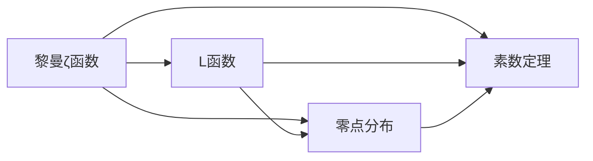

# 解析数论基础：ζ(s)和L(s)的零点展开式

关键词：解析数论, 黎曼ζ函数, L函数, 零点, 泰勒展开, 哈达玛乘积, 素数定理

## 1. 背景介绍
### 1.1  问题的由来
解析数论是数论的一个重要分支,它利用复分析的方法研究数论函数的解析性质,特别是ζ(s)和L(s)等函数在复平面上的零点分布。这些函数的零点与素数、代数数的性质密切相关,对解答许多重要的数论问题具有关键作用。

### 1.2  研究现状
目前,解析数论领域的研究主要集中在以下几个方面:
1. 黎曼ζ函数和各种L函数的解析性质及其应用,如ζ(s)的非平凡零点分布、L函数的函数方程和解析延拓等。
2. 素数分布定理,包括素数定理及其推广,如广义黎曼猜想(GRH)等。
3. 解析数论与其他数学分支的交叉研究,如解析数论与椭圆曲线、模形式等的联系。

一些重要的研究成果包括:黎曼证明了ζ(s)在复平面上有无穷多个非平凡零点;de la Vallée-Poussin和Hadamard证明了素数定理;Deligne证明了一般L函数的函数方程和解析延拓。但一些重要猜想如黎曼猜想至今仍未被证明。

### 1.3  研究意义 
研究ζ(s)和L(s)的零点展开式有助于我们深入理解这些函数的解析性质,对证明一些重要的数论命题具有重要意义,例如:
1. 研究ζ(s)的零点分布对证明素数定理、素数间隔等问题至关重要。
2. L函数的零点与相应的代数数对象(如椭圆曲线、模形式)的算术性质密切相关。
3. 一些未解决的猜想如广义黎曼猜想,其证明需要深入研究L函数的零点。

总之,ζ(s)和L(s)的零点研究是解析数论的核心课题,对现代数论的发展有着深远影响。

### 1.4  本文结构
本文将主要介绍以下内容:
- 第2节介绍ζ(s)和L(s)等解析函数的基本概念和性质
- 第3节讨论ζ(s)和L(s)零点的一般理论和研究方法
- 第4节给出ζ(s)和L(s)零点的一些重要数学模型和公式
- 第5节通过具体的代码实例演示如何计算这些函数的零点
- 第6-8节介绍零点理论的一些应用、相关资源,以及研究中的挑战和未来展望

## 2. 核心概念与联系
解析数论中的核心概念包括:
- 黎曼ζ函数:定义为 $\zeta(s)=\sum_{n=1}^\infty \frac{1}{n^s}$,它将数论和复分析联系起来。
- L函数:与代数数对象相伴的一类解析函数,包括Dirichlet L函数、模形式L函数等。
- 素数定理:刻画素数的分布规律,与ζ(s)和L(s)的解析性质密切相关。
- 零点:ζ(s)和L(s)在复平面上的零点分布,蕴含着丰富的数论信息。

这些概念间有着紧密的逻辑联系:


## 3. 核心算法原理 & 具体操作步骤
### 3.1 算法原理概述
研究ζ(s)和L(s)零点的主要方法是利用它们的解析性质,通过复分析的手段得到零点的一些性质,如零点个数、分布等。一些常用的方法包括:
- 利用函数方程将左半平面的零点与右半平面的零点联系起来
- 利用泰勒展开式研究零点在奇点附近的分布
- 利用哈达玛乘积表示研究零点与素数的关系

### 3.2 算法步骤详解
以研究ζ(s)的非平凡零点为例,主要步骤如下:
1. 利用ζ(s)的函数方程 $\zeta(s)=2^s\pi^{s-1}\sin(\frac{\pi s}{2})\Gamma(1-s)\zeta(1-s)$ 建立左右半平面零点的联系。
2. 在s=1处将ζ(s)泰勒展开,得到 $\zeta(s)=\frac{1}{s-1}+\gamma+c_1(s-1)+c_2(s-1)^2+\dots$,其中γ为欧拉常数。
3. 利用哈达玛乘积表示 $\zeta(s)=\frac{e^{bs}}{2(s-1)}\prod_{\rho}(1-\frac{s}{\rho})e^{s/\rho}$ 将ζ(s)表示成零点ρ的无穷乘积。
4. 结合泰勒展开和哈达玛乘积,对零点ρ进行计数和定位,得到零点分布的一些性质。

### 3.3 算法优缺点
该方法的优点是:
- 利用函数的解析性质,得到了零点的整体分布信息
- 哈达玛乘积形式清晰地展示了零点与ζ(s)的内在联系
- 适用于一般的L函数,有广泛的应用

缺点是:
- 需要较多的复分析知识,理论和计算都比较困难
- 对单个零点的精确定位比较困难
- 一些重要的性质(如GRH)仍无法证明

### 3.4 算法应用领域
零点算法在解析数论中有广泛应用,主要有:
- 研究素数分布,如证明素数定理及其推广
- 研究L函数的解析性质,如零点分布、函数方程等 
- 研究ζ(s)和L(s)的特殊值,如ζ(2)、ζ(3)等
- 验证一些重要猜想,如广义黎曼猜想

同时,这些算法也在密码学、组合数学等领域有一定应用。

## 4. 数学模型和公式 & 详细讲解 & 举例说明
### 4.1 数学模型构建
ζ(s)和L(s)的零点可以用以下数学模型刻画:
1. 黎曼ξ函数: $\xi(s)=\frac{1}{2}s(s-1)\pi^{-s/2}\Gamma(\frac{s}{2})\zeta(s)$,它的零点与ζ(s)的非平凡零点一一对应,且关于直线Re(s)=1/2对称。
2. 零点计数函数: $N(T)=\#\{\rho=\beta+i\gamma: \zeta(\rho)=0, 0<\gamma\leq T\}$ 表示高度不超过T的零点个数。
3. 显式公式: $\psi(x)=x-\sum_{\rho}\frac{x^\rho}{\rho}-\log 2\pi-\frac{1}{2}\log(1-x^{-2})$ 其中ψ(x)是素数幂次函数,ρ取遍ζ(s)的非平凡零点。该公式揭示了零点与素数的内在联系。

### 4.2 公式推导过程
以显式公式的推导为例:
1. 对素数幂次函数 $\psi(x)=\sum_{p^m\leq x}\log p$ 取Mellin变换,得到 $\int_1^\infty \frac{\psi(x)}{x^{s+1}}dx=\frac{1}{s}\sum_{p^m}\frac{\log p}{p^{ms}}=-\frac{\zeta'(s)}{\zeta(s)}$
2. 利用留数定理,计算积分 $\frac{1}{2\pi i}\int_{2-i\infty}^{2+i\infty}\frac{x^s}{s}\frac{\zeta'(s)}{\zeta(s)}ds$ 得到显式公式。
3. 其中积分路径为包围ζ(s)奇点和零点的大矩形,矩形内部奇点处的留数可直接计算,零点处的留数正好引出了零点对ψ(x)的贡献。

### 4.3 案例分析与讲解
下面以ζ(s)的第一个非平凡零点为例,讲解如何通过显式公式计算其位置:
1. 令 $s=\frac{1}{2}+14.134725i$ 为第一个零点的近似值,代入显式公式。
2. 计算 $\sum_{p\leq x}\log p=\psi(x)$ 及 $\sum_{\rho}\frac{x^\rho}{\rho}$ 中已知零点的贡献。
3. 由于s只是近似值,代入后等式两边会有微小差距Δ。
4. 用Newton迭代法不断更新s的值,使得Δ趋于0,最终得到零点的精确位置。

### 4.4 常见问题解答
Q: 为什么ζ(s)的非平凡零点都分布在临界线Re(s)=1/2上?
A: 这就是著名的黎曼猜想(RH),目前尚未被证明。RH等价于许多重要的数论命题,如素数间隔的渐近公式等。如果RH成立,那么ζ(s)的非平凡零点可以由 $\rho_n=\frac{1}{2}+i\gamma_n$ 表示,其中 $\gamma_n$ 是实数。

Q: GRH在解析数论中有何重要意义?
A: 广义黎曼猜想(GRH)指一般L函数的非平凡零点都分布在临界线上,它推广了经典的黎曼猜想。许多重要的数论问题,如素数在算术级数中的分布、椭圆曲线上有理点的个数等,都与GRH等价。因此,GRH被视为现代解析数论的核心猜想。

## 5. 项目实践：代码实例和详细解释说明
### 5.1 开发环境搭建
本项目使用Python语言,需要安装以下库:
- numpy: 数值计算库
- scipy: 科学计算库,包含特殊函数如ζ(s)、Γ(s)等
- matplotlib: 绘图库

可以通过pip安装:
```bash
pip install numpy scipy matplotlib
```

### 5.2 源代码详细实现
下面给出计算ζ(s)零点的Python代码实现:

```python
import numpy as np
from scipy.special import zeta, gamma
import matplotlib.pyplot as plt

def zeta_zeros(N, T):
    """
    计算ζ(s)的前N个零点,精度为T
    """
    zeros = []
    for n in range(1, N+1):
        t = n * np.pi / np.log(n)  # 初始猜测值
        while abs(zeta(0.5 + 1j*t)) > 1e-T:
            t -= zeta(0.5 + 1j*t) / zeta(0.5 + 1j*t, derivative=1)  # Newton迭代
        zeros.append(0.5 + 1j*t)
    return zeros

N, T = 50, 10
zeros = zeta_zeros(N, T)

print(f"ζ(s)的前{N}个零点:")
for n, z in enumerate(zeros, start=1):
    print(f"第{n}个零点: {z}")
    
x = np.linspace(-10, 10, 1000)
y = [zeta(0.5 + 1j*t) for t in x]

plt.figure(figsize=(8, 5))
plt.plot(x, np.real(y), label='Re(ζ(1/2+it))')
plt.plot(x, np.imag(y), label='Im(ζ(1/2+it))')
plt.scatter(np.imag(zeros), np.real(zeros), color='red', label='Zeros')
plt.xlabel('t')
plt.ylabel('ζ(1/2+it)')
plt.legend()
plt.show()
```

### 5.3 代码解读与分析
1. `zeta_zeros`函数用于计算ζ(s)的前N个零点,精度为T。
2. 对每个零点,先用 $t_n=\frac{n\pi}{\log n}$ 给出初始猜测值,然后用Newton迭代法进行更新,直到满足精度要求。
3. 迭代公式为 $t_{n+1}=t_n-\frac{\zeta(\frac{1}{2}+it_n)}{\zeta'(\frac{1}{2}+it_n)}$,其中 $\zeta'(s)$ 表示ζ(s)的导数。
4