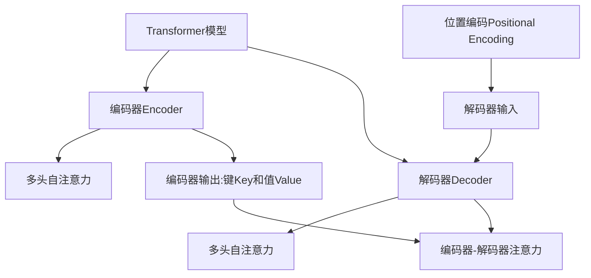

# 解码器的输入和位置编码

## 1. 背景介绍

### 1.1 问题的由来

在自然语言处理和序列建模任务中,例如机器翻译、语音识别和文本生成等,需要处理可变长度的输入序列。传统的神经网络模型,如前馈神经网络和卷积神经网络,通常只能处理固定长度的输入。为了解决这个问题,Seq2Seq(Sequence to Sequence)模型应运而生。

Seq2Seq模型由两部分组成:编码器(Encoder)和解码器(Decoder)。编码器将可变长度的输入序列编码为固定长度的向量表示,解码器则根据该向量表示生成目标序列。然而,这种编码方式存在一个主要缺陷:编码向量的长度是固定的,无法完全捕获输入序列中的所有信息,尤其是对于较长序列而言。

为了解决这个问题,研究人员提出了注意力机制(Attention Mechanism),使得解码器在生成每个目标词时,不仅依赖于编码向量的表示,还可以选择性地关注输入序列中的不同部分。这种机制大大提高了Seq2Seq模型的性能,但仍然存在一些局限性。

### 1.2 研究现状

近年来,Transformer模型凭借其卓越的性能成为NLP领域的主流模型。Transformer完全基于注意力机制,摒弃了RNN(Recurrent Neural Network)和CNN(Convolutional Neural Network)等传统结构,从而避免了梯度消失和爆炸等问题。

Transformer的编码器和解码器都采用了自注意力(Self-Attention)机制,可以直接捕获输入序列中任意两个位置之间的依赖关系。然而,自注意力机制本身无法区分序列中词元的相对位置和绝对位置,这可能会导致模型无法有效地学习序列的结构信息。

为了解决这个问题,Transformer引入了位置编码(Positional Encoding),将序列中每个词元的位置信息编码为向量,并将其与词嵌入相加,从而赋予模型位置感知能力。最初提出的位置编码是基于三角函数的,但它存在一些局限性,如无法很好地捕捉长期依赖关系、对于长序列表现不佳等。

### 1.3 研究意义

改进位置编码机制对于提高Transformer模型的性能至关重要。一种高效且有效的位置编码方式,不仅能够增强模型对序列结构的理解能力,还可以提高模型在长序列任务上的表现。此外,探索更加灵活和通用的位置编码方法,有助于模型在更广泛的任务和领域中发挥作用。

因此,本文将深入探讨Transformer中解码器的输入和位置编码机制,包括传统的位置编码方法及其局限性,以及一些新颖的改进方法。我们将详细介绍这些方法的原理、实现细节和性能表现,并对它们进行比较和分析。最后,我们还将讨论未来可能的研究方向和挑战。

### 1.4 本文结构

本文的结构安排如下:

- 第2部分介绍Transformer解码器的输入和位置编码的核心概念,以及它们与整个模型的关系。
- 第3部分详细阐述传统位置编码方法的原理、实现步骤,并分析其优缺点和适用场景。
- 第4部分构建数学模型,推导公式,并结合具体案例进行讲解和常见问题解答。
- 第5部分提供代码实例,包括开发环境搭建、源代码实现细节、代码解读和运行结果展示。
- 第6部分探讨位置编码在实际应用中的场景,并展望未来的发展方向。
- 第7部分推荐相关的学习资源、开发工具、论文和其他资源,以供读者进一步学习和研究。
- 第8部分总结本文的研究成果,讨论未来的发展趋势和面临的挑战,并对未来的研究方向进行展望。
- 第9部分是附录,回答一些常见的问题。

## 2. 核心概念与联系

在深入探讨Transformer解码器的输入和位置编码之前,我们先介绍一些核心概念,以及它们之间的联系。

**Transformer模型**是一种全新的基于注意力机制的序列到序列(Seq2Seq)模型,它完全摒弃了RNN和CNN等传统结构,避免了梯度消失和爆炸等问题。Transformer由编码器(Encoder)和解码器(Decoder)两个主要部分组成。

**编码器(Encoder)**的主要作用是将可变长度的输入序列编码为一系列向量表示,称为键(Key)和值(Value)。编码器采用多头自注意力(Multi-Head Self-Attention)机制,可以直接捕获输入序列中任意两个位置之间的依赖关系。

**解码器(Decoder)**的任务是根据编码器输出的向量表示,生成目标序列。解码器也采用了多头自注意力机制,不仅可以关注输入序列中的信息,还可以关注已生成的输出序列。此外,解码器还引入了编码器-解码器注意力(Encoder-Decoder Attention)机制,用于关注输入序列中与当前生成词元相关的部分。

**位置编码(Positional Encoding)**是Transformer模型中一个关键组件,它的作用是将序列中每个词元的位置信息编码为向量,并将其与词嵌入相加,从而赋予模型位置感知能力。传统的位置编码方法是基于三角函数的,但它存在一些局限性,因此研究人员提出了多种改进方法。

**解码器的输入**包括两个部分:第一部分是编码器输出的键(Key)和值(Value),用于编码器-解码器注意力机制;第二部分是上一个时间步生成的词元的嵌入,以及相应的位置编码。解码器的输入直接影响了模型的预测性能,因此对其进行优化和改进是提高模型性能的关键。

上述概念之间的关系可以用下图来表示:

总的来说,Transformer模型通过编码器捕获输入序列的信息,解码器则根据编码器的输出和自身的注意力机制生成目标序列。位置编码为模型提供了位置感知能力,而解码器的输入则直接影响了模型的预测性能。这些核心概念相互关联、相互作用,共同构建了Transformer的整体架构。

## 3. 核心算法原理 & 具体操作步骤

在这一部分,我们将详细介绍Transformer解码器的输入和位置编码的核心算法原理,以及具体的操作步骤。

### 3.1 算法原理概述

Transformer解码器的输入和位置编码算法可以概括为以下几个主要步骤:

1. **生成位置编码向量**:对于序列中的每个位置,生成一个对应的位置编码向量,用于表示该位置的信息。
2. **计算解码器自注意力**:将上一时间步生成的词元嵌入与相应的位置编码向量相加,作为解码器自注意力的查询(Query)输入。
3. **计算编码器-解码器注意力**:使用编码器输出的键(Key)和值(Value),以及解码器自注意力的输出,计算编码器-解码器注意力。
4. **生成输出词元**:将解码器自注意力和编码器-解码器注意力的输出进行融合,经过前馈神经网络层后,生成下一个输出词元。

这个算法的核心思想是:通过位置编码为序列中的每个位置赋予唯一的向量表示,使得模型能够学习到序列的结构信息;同时,利用自注意力和编码器-解码器注意力机制,模型可以选择性地关注输入序列和输出序列中的不同部分,从而生成更准确的目标序列。

### 3.2 算法步骤详解

下面我们将详细介绍上述算法的具体操作步骤。

#### 步骤1:生成位置编码向量

传统的位置编码方法是基于三角函数的,具体来说,对于序列中的第i个位置,其位置编码向量PE(pos, 2i)和PE(pos, 2i+1)分别由以下公式计算:

$$
\begin{aligned}
PE(pos, 2i) &= \sin\left(pos / 10000^{2i / d_{model}}\right) \\
PE(pos, 2i+1) &= \cos\left(pos / 10000^{2i / d_{model}}\right)
\end{aligned}
$$

其中,pos是位置索引,d_model是模型的维度。这种基于三角函数的位置编码方式可以让模型更容易学习到相对位置信息,因为对于任意偏移量k,PE(pos+k)可以被PE(pos)的线性函数表示。

但是,这种方法也存在一些局限性,例如对于较长的序列,位置编码的表示能力会受到限制;另外,它只能表示序列的相对位置,而无法很好地捕捉绝对位置信息。

为了解决这些问题,研究人员提出了多种改进的位置编码方法,例如学习的位置编码、相对位置编码等,我们将在后续章节中详细介绍。

#### 步骤2:计算解码器自注意力

在计算解码器自注意力之前,我们需要准备以下输入:

- 上一时间步生成的词元嵌入:记为$x_t$
- 相应的位置编码向量:记为$PE(t)$

将词嵌入$x_t$与位置编码$PE(t)$相加,得到查询向量$q_t$:

$$q_t = x_t + PE(t)$$

然后,我们将查询向量$q_t$输入到多头自注意力层中,计算自注意力输出$z_t$:

$$z_t = \text{MultiHeadAttention}(q_t, K, V)$$

其中,K和V分别是编码器输出的键(Key)和值(Value)。

在计算自注意力时,我们需要对查询向量进行掩码(Masking),以确保在生成第t个词元时,模型只能关注位置小于t的输出词元。这是因为在实际生成序列的过程中,模型无法看到未来的信息。

#### 步骤3:计算编码器-解码器注意力

接下来,我们将计算编码器-解码器注意力,其输入包括:

- 解码器自注意力输出:$z_t$
- 编码器输出的键(Key):$K$
- 编码器输出的值(Value):$V$

编码器-解码器注意力的计算公式如下:

$$a_t = \text{MultiHeadAttention}(z_t, K, V)$$

通过注意力机制,解码器可以选择性地关注输入序列中与当前生成词元相关的部分,从而获取更多有用的信息。

#### 步骤4:生成输出词元

最后一步是将解码器自注意力输出$z_t$和编码器-解码器注意力输出$a_t$进行融合,并通过前馈神经网络层生成下一个输出词元$y_{t+1}$:

$$y_{t+1} = \text{FeedForward}(z_t, a_t)$$

前馈神经网络层通常包括两个全连接层,中间使用ReLU激活函数。输出词元$y_{t+1}$可以直接用于预测,也可以作为下一个时间步的输入,重复上述过程直到生成完整的目标序列。

### 3.3 算法优缺点

Transformer解码器的输入和位置编码算法具有以下优点:

1. **长距离依赖建模能力强**:通过自注意力和编码器-解码器注意力机制,模型可以直接捕获输入序列和输出序列中任意两个位置之间的依赖关系,从而更好地建模长距离依赖。

2. **位置感知能力**:引入位置编码后,模型能够学习到序列的结构信息,对序列建模更加准确。

3. **并行计算**:与RNN不同,Transformer模型中的计算可以高度并行化,从而提高训练和推理的效率。

4. **灵活性强**:该算法可以应用于各种序列到序列