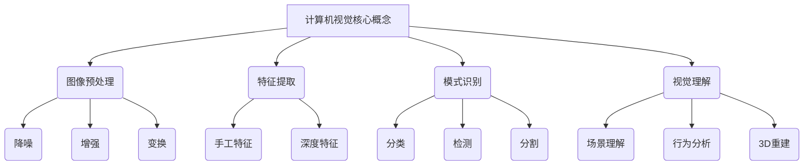
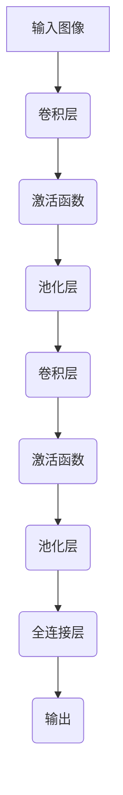

# 计算机视觉 原理与代码实例讲解

## 1. 背景介绍

### 1.1 问题的由来

在当今的数字时代,图像和视频数据的产生量呈指数级增长。借助计算机视觉技术,我们能够从这些海量视觉数据中提取有价值的信息,并将其应用于各个领域,从而极大地提高了工作效率和决策质量。计算机视觉技术的兴起,源于人类对视觉信息处理的渴望以及对机器赋予"视觉"能力的需求。

随着深度学习技术的不断发展,计算机视觉领域取得了长足的进步。卷积神经网络(CNN)、递归神经网络(RNN)等模型在图像分类、目标检测、语义分割等任务中展现出了强大的能力。然而,这些模型的内部机理往往是一个"黑箱",难以解释其决策过程,这在一定程度上限制了计算机视觉技术在安全敏感领域的应用。

### 1.2 研究现状

目前,计算机视觉研究主要集中在以下几个方向:

1. **模型优化**: 通过改进网络结构、损失函数和优化算法等,提高模型的精度和鲁棒性。
2. **弱监督学习**: 减少对大量标注数据的依赖,利用少量或无标注数据进行训练。
3. **可解释性**: 探索模型内部决策机理,提高模型的透明度和可信度。
4. **迁移学习**: 利用在大型数据集上预训练的模型,快速迁移到新的视觉任务。
5. **多模态融合**: 将视觉信息与其他模态(如文本、语音等)相结合,提高理解能力。

### 1.3 研究意义

计算机视觉技术在诸多领域都有广泛的应用前景,如自动驾驶、医疗影像分析、智能监控等。提高计算机视觉模型的精度、鲁棒性和可解释性,对于确保这些应用的安全性和可靠性至关重要。此外,可解释的计算机视觉模型也有助于我们深入理解视觉认知过程,为发展更智能的人工视觉系统奠定基础。

### 1.4 本文结构

本文将全面介绍计算机视觉的核心原理和代码实现细节。首先阐述计算机视觉的基本概念和常见任务,然后深入探讨主流模型的工作原理和数学基础。接下来,我们将通过实例代码讲解模型的具体实现,并分析其在实际应用中的表现。最后,我们将总结计算机视觉技术的发展趋势和面临的挑战,为读者提供进一步学习和研究的方向。

## 2. 核心概念与联系

在深入探讨计算机视觉的核心算法之前,我们先介绍一些基本概念和常见任务,为后续内容做铺垫。

计算机视觉主要包括以下几个核心环节:

1. **图像预处理**: 对原始图像数据进行降噪、增强和变换等操作,以提高后续处理的效果。
2. **特征提取**: 从图像中提取有意义的特征,可分为传统的手工特征(如SIFT、HOG等)和基于深度学习的特征。
3. **模式识别**: 根据提取的特征,对图像中的目标进行分类、检测和分割等任务。
4. **视觉理解**: 更高层次的视觉任务,包括场景理解、行为分析和3D重建等。

这些环节相互关联、相互作用,共同构建了计算机视觉系统的整体框架。下面我们将详细介绍其中的核心算法原理和实现细节。

## 3. 核心算法原理 & 具体操作步骤

### 3.1 算法原理概述

计算机视觉领域的核心算法主要包括以下几类:

1. **卷积神经网络(CNN)**: 在图像分类、目标检测和语义分割等任务中表现出色。CNN通过卷积、池化等操作自动学习图像特征,并基于这些特征进行决策。
2. **递归神经网络(RNN)**: 常用于视频序列分析和视觉问答等任务。RNN能够捕捉时序信息,对动态视觉数据进行建模和推理。
3. **生成对抗网络(GAN)**: 在图像生成、风格迁移和超分辨率重建等任务中发挥重要作用。GAN通过生成器和判别器的对抗训练,学习数据的真实分布。
4. **注意力机制**: 赋予模型选择性关注图像不同区域的能力,提高了模型的性能和可解释性。
5. **图神经网络(GNN)**: 适用于处理非欧几何数据,如3D点云和图像关系推理等任务。

这些算法各有特点,在不同的视觉任务中发挥着重要作用。下面我们将以CNN为例,详细介绍其工作原理和实现细节。

### 3.2 算法步骤详解

卷积神经网络(CNN)是计算机视觉领域最成功的深度学习模型之一。CNN由多个卷积层、池化层和全连接层组成,能够自动从图像中学习出层次化的特征表示。下面我们将详细解释CNN的工作原理和实现步骤。

1. **卷积层**:
   - 卷积操作是CNN的核心,它通过在输入特征图上滑动卷积核(权重核)来提取局部特征。
   - 卷积核的权重在训练过程中不断更新,以捕捉输入图像中的重要模式。
   - 卷积层保留了输入数据的空间结构信息,对于处理图像数据非常有效。

2. **激活函数**:
   - 激活函数引入非线性,增强了网络的表达能力。
   - 常用的激活函数包括ReLU、Sigmoid和Tanh等。

3. **池化层**:
   - 池化层通过下采样操作减小特征图的空间维度,从而降低计算复杂度和参数量。
   - 常用的池化操作包括最大池化和平均池化。
   - 池化层还能提高模型的平移不变性和空间不变性。

4. **全连接层**:
   - 全连接层将前面卷积层和池化层提取的高级特征进行整合,并输出最终的分类或回归结果。
   - 全连接层的参数也需要在训练过程中不断更新。

在实际应用中,CNN通常由多个卷积层、池化层和全连接层堆叠而成,形成深度网络结构。通过反向传播算法对网络参数进行优化,CNN就能够学习到有效的特征表示,从而完成图像分类、目标检测等任务。

### 3.3 算法优缺点

CNN具有以下优点:

1. **自动特征提取**: CNN能够自动从原始图像数据中学习出有意义的特征表示,无需人工设计特征。
2. **端到端训练**: CNN可以直接从原始图像输入到最终输出进行端到端的训练,简化了传统机器学习流程。
3. **空间信息保留**: 卷积操作能够很好地保留输入数据的空间结构信息,对于处理图像数据非常有效。
4. **并行计算**: CNN的卷积操作和池化操作都可以在GPU上进行高效的并行计算。

CNN的主要缺点包括:

1. **需要大量标注数据**: CNN通常需要大量的标注训练数据才能发挥最佳性能,而获取高质量的标注数据往往代价高昂。
2. **黑箱性质**: CNN内部的决策过程往往难以解释,缺乏可解释性。
3. **对抗样本敏感**: CNN容易受到对抗样本的攻击,对抗样本的存在会导致CNN做出错误的预测。
4. **泛化能力有限**: CNN在训练数据分布发生变化时,泛化能力往往会下降。

### 3.4 算法应用领域

CNN在计算机视觉领域有着广泛的应用,包括但不限于:

1. **图像分类**: 将图像归类到预定义的类别中,如识别图像中的物体、场景等。
2. **目标检测**: 在图像中定位并识别出感兴趣的目标物体。
3. **语义分割**: 对图像中的每个像素进行分类,将图像分割成不同的语义区域。
4. **实例分割**: 在语义分割的基础上,进一步区分出同一类别的不同实例。
5. **人脸识别**: 通过检测和识别人脸,应用于安全监控、人证合一等场景。
6. **医疗影像分析**: 辅助医生诊断疾病,如肺部CT图像分析、病理切片分析等。
7. **自动驾驶**: 实时检测和识别道路标志、行人、障碍物等,为自动驾驶决策提供支持。

随着CNN模型的不断优化和硬件计算能力的提升,CNN在计算机视觉领域的应用范围将越来越广泛。

## 4. 数学模型和公式 & 详细讲解 & 举例说明

### 4.1 数学模型构建

卷积神经网络(CNN)的数学模型主要由卷积层和池化层构成。下面我们将详细介绍它们的数学表达式及含义。

**卷积层**

卷积层的输出特征图$\mathbf{Y}$可以表示为:

$$\mathbf{Y} = f(\mathbf{W} * \mathbf{X} + \mathbf{b})$$

其中:

- $\mathbf{X}$是输入特征图
- $\mathbf{W}$是卷积核权重
- $\mathbf{b}$是偏置项
- $f$是激活函数,如ReLU: $f(x) = \max(0, x)$
- $*$表示卷积操作

卷积操作的数学定义为:

$$(\mathbf{W} * \mathbf{X})_{x, y} = \sum_{i, j} \mathbf{W}_{i, j} \cdot \mathbf{X}_{x + i, y + j}$$

即在输入特征图$\mathbf{X}$上滑动卷积核$\mathbf{W}$,对相应位置的元素进行加权求和,得到输出特征图$\mathbf{Y}$的每个元素值。

**池化层**

池化层通过下采样操作减小特征图的空间维度,常用的池化操作包括最大池化和平均池化。

最大池化的数学表达式为:

$$\mathbf{Y}_{x, y} = \max_{(i, j) \in \mathcal{R}} \mathbf{X}_{x \cdot s + i, y \cdot s + j}$$

其中$\mathcal{R}$表示池化窗口区域,$s$表示池化步长。

平均池化的数学表达式为:

$$\mathbf{Y}_{x, y} = \frac{1}{n} \sum_{(i, j) \in \mathcal{R}} \mathbf{X}_{x \cdot s + i, y \cdot s + j}$$

其中$n$是池化窗口内元素的个数。

通过堆叠多个卷积层和池化层,CNN能够自动从原始图像数据中学习出有意义的特征表示,并基于这些特征进行决策。

### 4.2 公式推导过程

接下来,我们将详细推导卷积层和池化层的前向传播和反向传播公式,以深入理解CNN的内部工作机制。

**卷积层前向传播**

假设输入特征图$\mathbf{X}$的形状为$(C_\text{in}, H_\text{in}, W_\text{in})$,卷积核$\mathbf{W}$的形状为$(C_\text{out}, C_\text{in}, K_H, K_W)$,其中$C$表示通