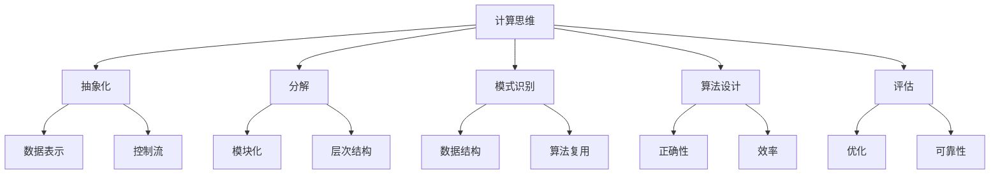

# 计算：第一部分 计算的诞生 第 2 章 计算之术 面向机器的计算思维

## 1. 背景介绍

### 1.1 问题的由来

在人类文明的发展历程中,计算一直扮演着至关重要的角色。从最早的计数系统到现代计算机的诞生,人类不断探索更高效、更精确的计算方式,以满足日益复杂的需求。然而,随着问题规模的不断扩大和复杂度的持续增加,传统的人工计算方式已经无法满足现代社会对计算能力的渴求。

因此,人类开始探索如何将计算过程转移到机器上,以提高计算效率和准确性。这种"面向机器的计算思维"的兴起,标志着计算理论和实践的一个重大转折点。

### 1.2 研究现状

在过去几十年里,计算机科学家们致力于研究和开发各种算法、数据结构和编程范式,以更好地利用机器的计算能力。从简单的算术运算到复杂的人工智能模型,计算机已经能够高效地执行各种任务。

然而,随着计算机硬件的不断发展和应用领域的扩展,面向机器的计算思维也面临着新的挑战。例如,如何有效地利用并行计算资源?如何处理海量数据?如何设计高效且可靠的分布式系统?这些问题都需要计算机科学家们不断探索和创新。

### 1.3 研究意义

面向机器的计算思维对于现代社会的发展具有重大意义。它不仅能够提高计算效率和准确性,还能够帮助我们解决许多看似难以解决的复杂问题。例如,在科学计算、金融分析、天气预报等领域,高性能计算已经成为不可或缺的工具。

此外,面向机器的计算思维也为新兴技术的发展奠定了基础。人工智能、大数据、物联网等前沿领域都依赖于高效的计算能力。只有不断探索和创新面向机器的计算思维,我们才能够充分释放技术的潜力,推动社会的进步。

### 1.4 本文结构

本文将从多个角度探讨面向机器的计算思维。首先,我们将介绍一些核心概念和原理,帮助读者建立计算思维的基础。接下来,我们将深入探讨一些核心算法的原理和实现细节,并通过数学模型和公式进行更深入的分析。

此外,我们还将提供一些实际的代码示例,帮助读者更好地理解和掌握面向机器的计算思维。最后,我们将探讨一些实际应用场景,分享相关的工具和资源,并对未来的发展趋势和挑战进行展望。

## 2. 核心概念与联系

在探讨面向机器的计算思维之前,我们需要先了解一些核心概念和它们之间的联系。这些概念构成了计算思维的基础,对于理解后续内容至关重要。



1. **抽象化(Abstraction)**: 抽象化是将复杂问题简化为核心概念和关键特征的过程。在计算机科学中,抽象化是一种强大的工具,可以帮助我们管理复杂性并专注于问题的本质。

2. **分解(Decomposition)**: 分解是将一个复杂问题分解为多个较小的子问题的过程。通过分解,我们可以更容易地理解和解决问题,同时也为并行计算和模块化设计奠定了基础。

3. **模式识别(Pattern Recognition)**: 模式识别是发现问题中的相似性和规律的过程。通过识别模式,我们可以利用已有的解决方案和算法,从而提高效率和可重用性。

4. **算法设计(Algorithm Design)**: 算法设计是根据问题的特征和约束条件,设计出一系列明确的步骤来解决问题的过程。良好的算法设计需要考虑正确性、效率、可读性和可维护性等因素。

5. **评估(Evaluation)**: 评估是对算法或解决方案的性能和质量进行衡量和分析的过程。通过评估,我们可以发现问题并进行优化,从而提高算法的效率和可靠性。

这些核心概念相互关联,共同构成了面向机器的计算思维。例如,抽象化和分解可以帮助我们简化和分解问题,而模式识别和算法设计则提供了解决问题的方法。最后,我们需要对解决方案进行评估,以确保其正确性和效率。

## 3. 核心算法原理 & 具体操作步骤

在面向机器的计算思维中,算法扮演着至关重要的角色。算法是一系列明确的步骤,用于解决特定的问题。良好的算法设计需要考虑正确性、效率、可读性和可维护性等因素。在这一部分,我们将探讨一些核心算法的原理和具体操作步骤。

### 3.1 算法原理概述

算法的设计通常基于一些基本原理和策略,例如:

1. **分治策略(Divide and Conquer)**: 将一个大问题分解为多个相似但更小的子问题,递归地解决这些子问题,最后合并子问题的解来构建原问题的解。

2. **贪心策略(Greedy)**: 在每一步选择当前看起来最好的选择,不断做出贪心选择,最终得到近似解。

3. **动态规划(Dynamic Programming)**: 将一个大问题分解为多个相互重叠的子问题,通过存储和重用子问题的解来避免重复计算。

4. **回溯法(Backtracking)**: 通过探索所有可能的组合来解决约束满足问题,在探索到某一步发现不能满足约束时,就回溯到上一步,修改选择,继续探索。

5. **分支限界法(Branch and Bound)**: 在探索解空间树时,利用限界函数对每一个节点进行估计和剪枝,避免探索不需要的分支,从而提高效率。

这些基本原理和策略为算法设计提供了指导和框架,同时也为特定问题的算法实现奠定了基础。

### 3.2 算法步骤详解

接下来,我们将以排序算法为例,详细探讨算法的具体操作步骤。排序是计算机科学中一个基础且广泛应用的问题,因此掌握排序算法的原理和实现对于计算思维至关重要。

#### 3.2.1 冒泡排序

冒泡排序是一种简单的排序算法,其基本思想是通过相邻元素的比较和交换,将较大的元素逐步"冒泡"到数组的后面。具体步骤如下:

1. 比较相邻的两个元素,如果前一个元素大于后一个元素,就交换它们的位置。
2. 对每一对相邻元素重复步骤 1,从开始第一对到结尾的最后一对。这样，在本次遍历中,最大的元素就会被交换到数组的最后面。
3. 对剩余的元素重复步骤 1 和 2,直到全部排序完成。

下面是冒泡排序的 Python 实现:

```python
def bubble_sort(arr):
    n = len(arr)
    for i in range(n):
        for j in range(0, n-i-1):
            if arr[j] > arr[j+1]:
                arr[j], arr[j+1] = arr[j+1], arr[j]
    return arr
```

#### 3.2.2 快速排序

快速排序是一种高效的排序算法,它基于分治策略,通过将数组划分为较小的子数组,递归地对子数组进行排序。具体步骤如下:

1. 从数组中选择一个元素作为基准(pivot)。
2. 将数组划分为两个子数组,使得左子数组中的元素都小于基准,右子数组中的元素都大于基准。
3. 递归地对左子数组和右子数组进行步骤 1 和 2,直到子数组的大小为 1 或 0。

下面是快速排序的 Python 实现:

```python
def partition(arr, low, high):
    pivot = arr[high]
    i = low - 1
    for j in range(low, high):
        if arr[j] <= pivot:
            i += 1
            arr[i], arr[j] = arr[j], arr[i]
    arr[i+1], arr[high] = arr[high], arr[i+1]
    return i+1

def quick_sort(arr, low, high):
    if low < high:
        pi = partition(arr, low, high)
        quick_sort(arr, low, pi-1)
        quick_sort(arr, pi+1, high)
    return arr
```

### 3.3 算法优缺点

每种算法都有其优缺点,选择合适的算法需要根据具体问题的特征和约束条件进行权衡。

#### 3.3.1 冒泡排序

优点:

- 算法原理简单,易于理解和实现。
- 对于已经基本有序的数组,效率较高。
- 内存占用小,只需要常量级的临时存储空间。

缺点:

- 时间复杂度较高,平均情况下为 O(n^2),最坏情况下也为 O(n^2)。
- 不适合对大规模数据进行排序,效率较低。

#### 3.3.2 快速排序

优点:

- 时间复杂度较低,平均情况下为 O(n log n),是最快的排序算法之一。
- 原地排序,不需要额外的存储空间。
- 适合大规模数据排序。

缺点:

- 对于特殊情况(如已排序或逆序数组),时间复杂度会退化为 O(n^2)。
- 不稳定排序,相等元素的相对位置可能会改变。
- 递归实现可能会导致栈溢出问题。

### 3.4 算法应用领域

排序算法在计算机科学中有着广泛的应用,包括但不限于:

- 数据库中的索引和查询优化。
- 计算机图形学中的几何处理。
- 机器学习中的特征选择和模型训练。
- 操作系统中的任务调度和资源管理。
- 密码学中的密钥生成和加密算法。
- 网络路由和数据包处理。

除了排序算法,其他核心算法也在各个领域发挥着重要作用,如图算法在网络分析和社交网络中的应用、字符串算法在生物信息学和文本处理中的应用等。掌握这些核心算法的原理和实现,对于解决实际问题和推动技术发展至关重要。

## 4. 数学模型和公式 & 详细讲解 & 举例说明

在面向机器的计算思维中,数学模型和公式扮演着重要的角色。它们不仅能够帮助我们更好地理解和分析算法的性能,还能够为算法设计和优化提供理论基础。在这一部分,我们将探讨一些常见的数学模型和公式,并通过详细的讲解和案例分析来加深理解。

### 4.1 数学模型构建

在构建数学模型时,我们需要首先确定问题的本质,识别出影响问题的关键因素和约束条件。然后,我们可以使用适当的数学工具和方法来建立模型,如集合论、图论、概率论等。

以排序算法为例,我们可以使用以下数学模型来描述和分析它们的性能:

1. **时间复杂度模型**: 用于衡量算法的执行时间与输入规模之间的关系。常见的时间复杂度包括 O(1)、O(log n)、O(n)、O(n log n)、O(n^2) 等。

2. **空间复杂度模型**: 用于衡量算法所需的额外存储空间与输入规模之间的关系。常见的空间复杂度包括 O(1)、O(log n)、O(n) 等。

3. **概率模型**: 用于分析算法在特定输入分布下的平均情况性能,如快速排序在随机输入下的平均时间复杂度为 O(n log n)。

4. **渐进模型**: 用于