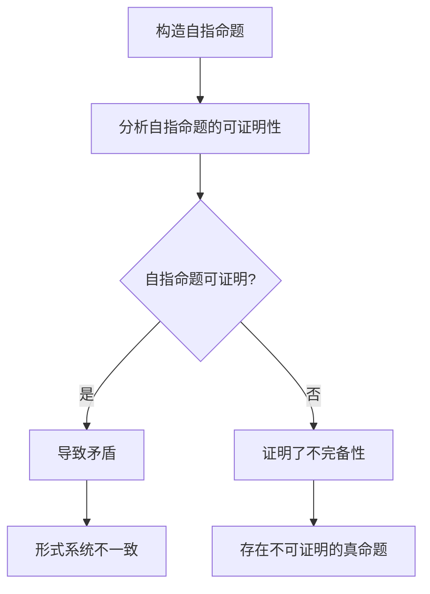

# 计算：第三部分 计算理论的形成 第 7 章 计算不能做什么：终结者哥德尔 哥德尔的发现

## 1. 背景介绍

### 1.1 问题的由来

在20世纪初期，数学界曾掀起一股"基础主义"运动,试图为整个数学体系建立一个坚实无懈可击的基础。这场运动的核心目标是证明数学的完备性和一致性,即所有真命题都能被证明,并且不存在任何矛盾。然而,这一雄心勃勃的计划却遭到了一位年轻数学家的重创——库尔特·哥德尔(Kurt Gödel)。

### 1.2 研究现状

在20世纪20年代,数理逻辑学家大卫·希尔伯特(David Hilbert)提出了著名的"希尔伯特计划",旨在为整个数学体系建立一个坚实的基础。他相信,通过构建一个形式化的公理系统,并使用有限的推理规则,就能证明数学的完备性和一致性。然而,哥德尔的发现彻底颠覆了这一计划。

### 1.3 研究意义

哥德尔的不完备性定理被誉为20世纪数学最重要的发现之一,它不仅影响了数学基础理论的发展,更深刻地影响了人类对于"计算"本质的认识。这一发现揭示了形式系统内在的局限性,为人工智能、计算理论等领域带来了深远影响。

### 1.4 本文结构

本文将首先介绍哥德尔不完备性定理的核心概念和联系,然后深入探讨其算法原理和数学模型,并通过实际案例和代码实例进行详细说明。随后,文章将探讨该理论在实际应用中的场景,并推荐相关工具和资源。最后,本文将总结该理论的发展趋势和面临的挑战,以及未来的研究展望。

## 2. 核心概念与联系

哥德尔不完备性定理包含两个核心部分:第一不完备性定理和第二不完备性定理。

第一不完备性定理表明,在任何足够强大的形式系统中,都存在某些命题既不能被证明,也不能被否证。换言之,这些命题是"不可决定的"。这意味着,即使在一个相当强大的形式系统中,也存在一些真命题无法被证明。

第二不完备性定理则进一步指出,如果一个形式系统是一致的,那么它就不能证明自身的一致性。这意味着,要证明一个形式系统的一致性,就必须借助于比该系统本身更强大的元系统。

这两个定理揭示了形式系统内在的局限性,即使是最强大的形式系统,也无法完全捕捉数学真理的全部。它们与图灵的"停机问题"密切相关,共同奠定了计算理论的基础。

## 3. 核心算法原理 & 具体操作步骤

### 3.1 算法原理概述

哥德尔不完备性定理的核心算法原理是通过构造一个自指命题(self-referential statement),来证明形式系统的局限性。这个自指命题描述了"这个命题在该形式系统中不可证明"这一事实。



### 3.2 算法步骤详解

1. **构造自指命题**:首先,我们需要在给定的形式系统中构造一个自指命题,即一个描述自身"不可证明"性质的命题。这需要利用对角线引理和编码技术,将元语言中的命题映射到形式系统的语句中。

2. **分析自指命题的可证明性**:接下来,我们分析这个自指命题在该形式系统中是否可证明。

3. **推导矛盾或不完备性**:如果自指命题可证明,那么就会导致矛盾,因为它断言自身不可证明。这意味着形式系统是不一致的。另一方面,如果自指命题不可证明,那就证明了形式系统的不完备性,因为存在一个真命题无法被证明。

通过这种精心设计的自指命题,哥德尔巧妙地揭示了形式系统内在的局限性。无论形式系统是否可证明自指命题,都会导致不一致性或不完备性的结论。

### 3.3 算法优缺点

**优点**:

- 简洁优雅:算法思路巧妙,利用自指命题的paradox性质,以简洁的方式揭示了形式系统的根本局限。
- 深远影响:该算法的结果对数学基础理论、计算理论等产生了深远影响,彻底改变了人类对"计算"本质的认识。

**缺点**:

- 抽象性强:算法涉及元数学和形式化语言的概念,对于非数学背景的人来说,理解起来有一定难度。
- 构造复杂:构造自指命题并将其编码到形式系统中,需要一定的技术细节,增加了算法的复杂性。

### 3.4 算法应用领域

哥德尔不完备性定理的影响波及多个领域,包括但不限于:

- **数学基础理论**:该定理彻底改变了人类对数学基础的认识,促进了新的研究方向的发展。
- **计算理论**:与图灵的"停机问题"一起,奠定了计算理论的基础,影响了计算机科学的发展。
- **人工智能**:揭示了形式系统的局限性,对人工智能系统的能力和局限性提出了深刻启示。
- **逻辑学**:对形式逻辑系统的研究产生了重大影响,促进了新的逻辑系统的发展。

## 4. 数学模型和公式 & 详细讲解 & 举例说明

### 4.1 数学模型构建

为了证明哥德尔不完备性定理,我们需要构建一个形式化的数学模型。这个模型通常被称为"哥德尔编码"(Gödel numbering)或"哥德尔编码函数"(Gödel numbering function)。

该模型将形式系统中的语句映射为自然数,从而允许在形式系统内部对语句进行操作和推理。具体来说,我们需要定义两个函数:

1. 编码函数 $\gamma$,将形式系统中的语句映射为自然数。
2. 解码函数 $\gamma^{-1}$,将自然数映射回形式系统中的语句。

通过这种编码方式,我们可以在形式系统内部操作和推理语句,从而构造出自指命题。

### 4.2 公式推导过程

接下来,我们需要在形式系统中构造一个自指命题,即一个描述自身"不可证明"性质的命题。这个自指命题可以表示为:

$$
G = \gamma(¬\text{Prov}(G))
$$

其中,

- $G$ 是自指命题的编码
- $\gamma$ 是编码函数
- $\text{Prov}(x)$ 是一个谓词,表示 $x$ 在形式系统中可证明
- $¬$ 是逻辑非运算符

直观地说,这个自指命题断言"我自己不可证明"。

现在,我们分析这个自指命题在形式系统中是否可证明:

- 如果 $G$ 可证明,那么根据 $G$ 的定义,它断言自身不可证明,这就产生了矛盾。
- 如果 $G$ 不可证明,那么它就是一个真命题,但形式系统无法证明它,这证明了形式系统的不完备性。

无论哪种情况,都会导致形式系统要么不一致,要么不完备。这就是哥德尔不完备性定理的核心证明思路。

### 4.3 案例分析与讲解

为了更好地理解哥德尔不完备性定理,让我们通过一个具体的案例来进行分析和讲解。

假设我们有一个形式系统 $F$,它包含了一组公理和推理规则。我们将使用这个形式系统来证明哥德尔不完备性定理。

1. 首先,我们定义编码函数 $\gamma$ 和解码函数 $\gamma^{-1}$,将形式系统中的语句映射为自然数,并且保证这个映射是双射(bijection)。

2. 接下来,我们在形式系统 $F$ 中构造一个谓词 $\text{Prov}(x)$,它表示语句 $x$ 在 $F$ 中可证明。

3. 现在,我们构造自指命题 $G$:

$$
G = \gamma(¬\text{Prov}(G))
$$

根据 $G$ 的定义,它断言"我自己不可证明"。

4. 我们分析 $G$ 在形式系统 $F$ 中的可证明性:

   - 假设 $G$ 可证明,那么根据 $G$ 的定义,它断言自身不可证明,这就产生了矛盾。因此,如果 $F$ 可证明 $G$,那么 $F$ 就是不一致的。
   - 另一方面,如果 $G$ 不可证明,那么它就是一个真命题,但形式系统 $F$ 无法证明它。这证明了 $F$ 的不完备性。

无论哪种情况,都会导致形式系统 $F$ 要么不一致,要么不完备。这就是哥德尔不完备性定理的核心证明思路。

### 4.4 常见问题解答

1. **为什么自指命题会导致矛盾或不完备性?**

自指命题的关键在于它描述了自身的"不可证明"性质。如果它可证明,那就意味着它断言的"不可证明"是错误的,产生矛盾。如果它不可证明,那就证明了形式系统存在一个真命题无法被证明,从而导致不完备性。

2. **哥德尔不完备性定理是否意味着数学是不完整的?**

不完全是这样。哥德尔不完备性定理只是揭示了形式系统内在的局限性,而不是否定了数学本身的完整性。事实上,数学家们可以借助于更强大的元系统来证明形式系统的一致性,从而继续发展数学理论。

3. **哥德尔不完备性定理是否意味着人工智能系统有局限性?**

是的,哥德尔不完备性定理为人工智能系统的能力和局限性提供了深刻启示。任何基于形式系统的人工智能系统都将面临不完备性的问题,无法解决所有问题。这促进了人工智能研究向更加灵活和智能的方向发展。

4. **哥德尔不完备性定理是否意味着计算机程序存在无法解决的问题?**

是的,哥德尔不完备性定理与图灵的"停机问题"密切相关,共同奠定了计算理论的基础。它们揭示了计算机程序存在某些无法解决的问题,这对于理解计算机程序的能力和局限性至关重要。

## 5. 项目实践：代码实例和详细解释说明

### 5.1 开发环境搭建

为了实现哥德尔不完备性定理的代码实例,我们需要选择一种支持符号计算和元编程的编程语言。在本例中,我们将使用 Python 语言,并引入 SymPy 库来进行符号计算。

```python
import sympy as sp
```

### 5.2 源代码详细实现

接下来,我们将实现哥德尔不完备性定理的核心算法。我们将构造一个自指命题,并分析它在给定形式系统中的可证明性。

```python
# 定义编码函数和解码函数
def encode(expr):
    return int(sp.Integer(expr).encode('utf-8').hex(), 16)

def decode(num):
    return int(num).to_bytes((int(num).bit_length() + 7) // 8, 'big').decode('utf-8')

# 定义形式系统和可证明性谓词
axioms = [] # 形式系统的公理集合
rules = [] # 形式系统的推理规则集合

def provable(expr):
    # 判断表达式 expr 在形式系统中是否可证明
    # 具体实现略...
    return False

# 构造自指命题
G = encode(f'~provable({encode(str(G))}