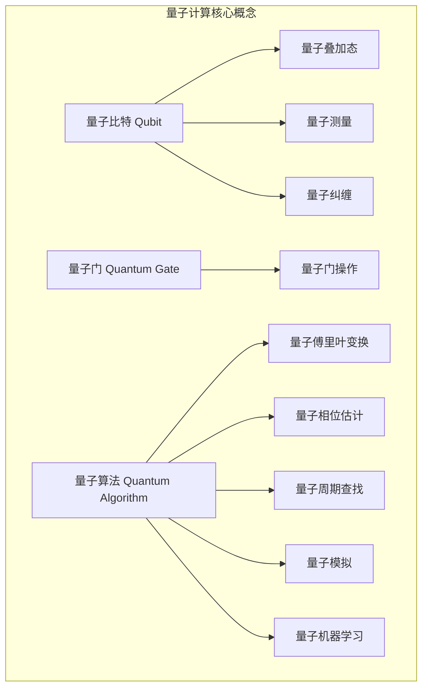

# 计算：第四部分 计算的极限 第 10 章 量子计算 从经典比特到量子比特

## 1. 背景介绍

### 1.1 问题的由来

在过去的几十年里，计算机的发展一直遵循着摩尔定律，处理器的性能和集成电路的密度不断提高。然而，随着传统半导体技术的物理极限逐渐接近，计算能力的增长也将面临瓶颈。为了突破这一局限，科学家们开始探索全新的计算范式——量子计算。

量子计算利用量子力学的奇特性质,如量子叠加、量子纠缠等,来执行计算操作。与经典计算机基于二进制比特不同,量子计算机则使用量子比特(qubit)作为基本信息单元。量子比特可以同时存在0和1的叠加态,从而在同一时间内进行大规模并行计算,理论上具有无与伦比的计算能力。

### 1.2 研究现状

量子计算的概念最早可追溯到上世纪80年代,当时理查德·费曼(Richard Feynman)提出,模拟量子系统需要一种新型计算机。1994年,彼得·肖尔(Peter Shor)设计出著名的"肖尔算法",能够在量子计算机上高效地分解大整数,从而破解现有的加密系统。这一突破性发现推动了量子计算研究的热潮。

目前,谷歌、IBM、英特尔等科技巨头都在量子计算领域投入巨资。2019年,谷歌宣称实现了"量子优越性",其72量子比特的系统在特定任务上比最快的经典计算机快数十万亿倍。2022年,IBM推出了127量子比特的"鹰"系统,标志着量子计算机开始进入实用化阶段。

### 1.3 研究意义

量子计算的发展将为人类带来巨大的科技突破。在密码学领域,量子计算机可以轻松破解现有的加密算法,迫使我们重新设计量子密码学;在化学和材料科学领域,量子计算能够精确模拟分子结构,加速新药和新材料的研发;在人工智能领域,量子计算可以显著提升机器学习算法的性能,推动智能系统的飞跃发展。

然而,量子计算也面临着诸多技术挑战,如如何保持量子态、如何纠错、如何扩展量子比特数量等,这些都需要科学家们继续努力探索。总的来说,量子计算代表了一个全新的计算范式,其发展将深刻影响未来科技的进程。

### 1.4 本文结构

本文将全面介绍量子计算的核心概念、算法原理、数学模型、实际应用等内容。首先阐述量子计算的基本原理和关键技术,包括量子比特、量子门、量子算法等;然后详细解析量子计算的数学模型和公式推导;接着通过实例讲解量子算法的具体实现;最后探讨量子计算的应用前景,并分析其面临的挑战和发展趋势。

## 2. 核心概念与联系

量子计算的核心概念包括量子比特、量子门和量子算法。

**量子比特(Qubit)**是量子计算的基本信息单元,可以表示0和1的叠加态,即$|q\rangle = \alpha|0\rangle + \beta|1\rangle$,其中$\alpha$和$\beta$是复数,且$|\alpha|^2 + |\beta|^2 = 1$。这种叠加态使得量子比特能够同时存储大量信息,是实现量子并行计算的关键。

与经典比特不同,量子比特还具有**量子测量**和**量子纠缠**等独特性质。量子测量会使量子比特从叠加态坍缩到0或1状态,而量子纠缠则描述了多个量子比特之间的相关性,是实现量子计算的重要资源。

**量子门(Quantum Gate)**是对量子比特进行操作的基本逻辑单元,类似于经典计算中的逻辑门。常见的量子门包括Hadamard门、CNOT门、相位移门等,通过对量子比特施加这些门操作,可以构建出各种量子线路和算法。

**量子算法(Quantum Algorithm)**是在量子计算机上运行的算法,利用量子力学原理来解决一些经典计算机难以高效解决的问题。著名的量子算法有**量子傅里叶变换**、**量子相位估计**、**量子周期查找**等,它们在因数分解、搜索、模拟等领域展现出了量子加速的优势。

此外,量子计算还衍生出了**量子机器学习**等新兴研究方向,试图将量子原理应用于人工智能算法,以提高机器学习的性能和效率。

## 3. 核心算法原理 & 具体操作步骤

### 3.1 算法原理概述

量子计算的核心算法主要基于两个重要原理:**量子叠加**和**量子傅里叶变换**。

**量子叠加**利用量子比特的叠加性质,可以在一次操作中同时对多个输入进行计算。例如,对于一个量子比特$|q\rangle = \frac{1}{\sqrt{2}}(|0\rangle + |1\rangle)$,施加Hadamard门后可得到$\frac{1}{2}(|0\rangle + |1\rangle)(|0\rangle + |1\rangle) = \frac{1}{2}(|00\rangle + |01\rangle + |10\rangle + |11\rangle)$,即对四种可能的输入进行了并行计算。

**量子傅里叶变换(QFT)**是量子计算中的一种重要变换,可以将量子态从一种表示变换到另一种表示,类似于经典信号处理中的傅里叶变换。QFT广泛应用于量子相位估计、量子周期查找等算法中,是实现量子加速的关键步骤。

基于这两个核心原理,科学家们设计出了一系列量子算法,用于解决各种难题。下面将详细介绍其中两种最具代表性的算法:肖尔算法和量子相位估计算法。

### 3.2 算法步骤详解

#### 3.2.1 肖尔算法

肖尔算法是一种用于在量子计算机上高效分解大整数的算法,从而可以破解目前广泛使用的RSA加密系统。它的核心思想是利用量子计算的周期查找能力来找出两个大素数的乘积$N$的周期$r$,进而高效地计算出$N$的因子。算法步骤如下:

1) **初始化**: 准备两个量子寄存器,其中一个存储$x$,另一个存储$f(x) = a^x \bmod N$。

2) **量子傅里叶变换**: 对$x$寄存器进行量子傅里叶变换,得到$\sum_{x}|x\rangle|0\rangle \rightarrow \sum_{x}\sum_{k}\omega^{xk}|x\rangle|k\rangle$。

3) **量子相位估计**: 通过测量第二个寄存器,可以估计出$f(x)$的周期$r$。

4) **周期查找**: 由$a^r \equiv 1 \pmod N$可得,如果$r$是奇数,则$a^{r/2} \not\equiv -1 \pmod N$,从而可以高效计算出$N$的因子。

5) **结果读出**: 读出第二个寄存器的测量结果,即可得到$N$的因子。

肖尔算法的运行时间只与输入的位数成正比,而经典算法则需要指数级时间,从而展现出了量子计算的巨大优势。

#### 3.2.2 量子相位估计算法

量子相位估计算法是量子计算中的一种通用技术,可用于估计一个量子操作的特征值,是实现量子傅里叶变换和量子周期查找的关键步骤。算法步骤如下:

1) **初始化**: 准备两个量子寄存器,其中一个存储$|0\rangle$,另一个存储某个特定的量子态$|u\rangle$。

2) **量子傅里叶变换**: 对第一个寄存器施加量子傅里叶变换,得到$|0\rangle \rightarrow \frac{1}{\sqrt{2^n}}\sum_{x=0}^{2^n-1}|x\rangle$。

3) **控制操作**: 对第二个寄存器施加$2^n$次控制操作$U^{2^n}$,得到$\frac{1}{\sqrt{2^n}}\sum_{x=0}^{2^n-1}e^{2\pi i\phi x}|x\rangle|u\rangle$。

4) **反向量子傅里叶变换**: 对第一个寄存器进行反向量子傅里叶变换,得到$\sum_{k=0}^{2^n-1}\frac{1}{2^n}\sum_{x=0}^{2^n-1}e^{2\pi i(\phi x-kx/2^n)}|k\rangle|u\rangle$。

5) **测量**: 测量第一个寄存器,可以以很高的概率获得$\phi$的一个很好的近似值。

量子相位估计算法可以高效地估计出一个量子操作的特征值,是实现量子加速的重要工具。它还可以推广到更一般的情况,如量子周期查找、量子模拟等。

### 3.3 算法优缺点

量子算法相对于经典算法具有以下优点:

- **并行性**: 利用量子态的叠加性质,可以同时对多个输入进行并行计算,大大提高了计算效率。
- **指数加速**: 对于一些难题,如整数分解、无结构搜索等,量子算法可以获得指数级的加速,远远超过经典算法。
- **新功能**: 量子算法可以高效模拟量子系统,为研究量子化学、量子生物等领域提供了新的计算工具。

然而,量子算法也存在一些固有的缺陷和挑战:

- **噪声敏感**: 量子态容易受到环境噪声的影响而发生退相位,需要通过量子纠错来保护。
- **规模有限**: 目前的量子硬件只能操作有限数量的量子比特,扩展量子比特数量是一大挑战。
- **编程复杂**: 量子算法的编程模型与经典算法存在较大差异,需要特殊的量子编程语言和工具链。

总的来说,量子算法为我们提供了一种全新的计算范式,但要充分发挥其优势,还需要持续的理论和工程上的突破。

### 3.4 算法应用领域

量子算法的应用前景十分广阔,涉及密码学、化学模拟、机器学习、优化等多个领域:

- **密码学**: 肖尔算法可以高效分解大整数,从而破解目前广泛使用的RSA加密系统,迫使我们重新设计量子密码学。
- **化学模拟**: 量子算法可以精确模拟分子结构和化学反应,为新药设计和新材料研发提供了强大的计算工具。
- **机器学习**: 结合量子原理,可以设计出新的量子机器学习算法,提高机器学习的性能和效率。
- **组合优化**: 量子棱镜算法可以用于解决一些NP难的组合优化问题,如旅行商问题、图着色问题等。
- **线性代数**: 量子线性代数算法可以高效求解大规模线性方程组,在大数据处理和科学计算中有广泛应用。

虽然目前量子计算机的规模和性能仍有限,但随着硬件的不断进步,量子算法的应用前景将越来越广阔。

## 4. 数学模型和公式 & 详细讲解 & 举例说明

### 4.1 数学模型构建

量子计算的数学模型基于量子力学的基本原理,主要包括量子态、量子测量、量子门操作等概念。

**量子态**用复数向量$|\psi\r