# 计算：第四部分 计算的极限 第 11 章 复杂性计算 进化计算

## 1. 背景介绍

### 1.1 问题的由来

在当今快节奏的数字时代，我们面临着越来越多的复杂计算问题。随着数据量的激增和计算需求的不断扩大，传统的计算方法往往难以满足实时性、准确性和效率等多重要求。这就催生了对新型计算范式的渴望,其中复杂性计算和进化计算作为两种前沿计算理论和方法,备受关注。

复杂性计算(Complexity Computation)旨在研究和解决复杂系统中的计算问题,包括非线性动力学系统、混沌系统、分形结构等。这些系统通常具有高度的不确定性、动态性和无序性,传统的计算模型难以有效处理。

而进化计算(Evolutionary Computation)则借鉴了生物进化过程中的自然选择、基因遗传和变异等机制,通过模拟进化过程来求解优化问题。它具有全局寻优、鲁棒性强、易于并行等优点,在解决复杂的组合优化、机器学习等问题中表现出色。

### 1.2 研究现状  

近年来,复杂性计算和进化计算的研究日益活跃,取得了一系列重要进展。

在复杂性计算领域,细胞自动机、布尔网络、耗散结构等模型为描述和模拟复杂系统提供了有力工具。量子计算、DNA计算等新型计算范式也为解决复杂问题带来了新的可能性。

进化计算方面,遗传算法、进化策略、蚁群优化、粒子群优化等算法不断完善和发展,在组合优化、机器学习、控制系统等领域获得广泛应用。同时,进化计算也与其他技术相结合,如进化神经网络、进化多智能体系统等,拓展了应用领域。

### 1.3 研究意义

复杂性计算和进化计算的研究对于解决实际复杂问题、推动计算理论发展、促进跨学科融合等方面具有重要意义:

1. **解决复杂实际问题**:复杂性计算为描述和模拟复杂系统提供了理论基础和计算工具,有助于更好地理解和预测复杂现象。进化计算则为解决实际的组合优化、机器学习等复杂问题提供了有效算法。

2. **拓展计算理论发展**:复杂性计算和进化计算为传统计算理论注入了新的活力,有助于建立描述复杂系统行为的新范式,推动计算理论向更高层次发展。

3. **促进跨学科交叉融合**:复杂性计算和进化计算理论源于多个学科,如数学、物理学、生物学等,其发展也必将促进不同学科之间的交流与融合,产生新的研究方向和应用领域。

### 1.4 本文结构

本文将全面介绍复杂性计算和进化计算的核心概念、算法原理、数学模型、实际应用等内容,并对未来发展趋势和挑战进行展望和分析。具体结构安排如下:

```mermaid
graph TD
    A[计算:第四部分 计算的极限 第11章 复杂性计算 进化计算] --> B[背景介绍]
    B --> C1[问题的由来]
    B --> C2[研究现状]  
    B --> C3[研究意义]
    B --> C4[本文结构]
    A --> D[核心概念与联系]
    A --> E[核心算法原理&具体操作步骤]
    E --> E1[算法原理概述]
    E --> E2[算法步骤详解]
    E --> E3[算法优缺点]
    E --> E4[算法应用领域]
    A --> F[数学模型和公式&详细讲解&举例说明]  
    F --> F1[数学模型构建]
    F --> F2[公式推导过程]
    F --> F3[案例分析与讲解]
    F --> F4[常见问题解答]
    A --> G[项目实践:代码实例和详细解释说明]
    G --> G1[开发环境搭建]
    G --> G2[源代码详细实现]
    G --> G3[代码解读与分析] 
    G --> G4[运行结果展示]
    A --> H[实际应用场景]
    H --> H1[未来应用展望]
    A --> I[工具和资源推荐]
    I --> I1[学习资源推荐]
    I --> I2[开发工具推荐]
    I --> I3[相关论文推荐]
    I --> I4[其他资源推荐]
    A --> J[总结:未来发展趋势与挑战]
    J --> J1[研究成果总结]
    J --> J2[未来发展趋势]
    J --> J3[面临的挑战]
    J --> J4[研究展望]
    A --> K[附录:常见问题与解答]
```

## 2. 核心概念与联系

复杂性计算和进化计算虽然源于不同的理论基础,但在描述和求解复杂系统问题方面存在内在联系。

复杂性计算关注复杂系统本身的行为特征,如非线性、混沌、分形等,旨在建立描述和模拟这些系统的理论模型和计算方法。而进化计算则借鉴生物进化规律,通过模拟进化过程来求解复杂的优化和搜索问题。

两者可以相互促进、相辅相成:

- 复杂性计算为进化计算提供了描述复杂适应环境的理论基础,有助于设计更高效的进化算法。
- 进化计算可以作为复杂性计算的有力工具,用于求解复杂系统优化、模式识别等实际问题。
- 复杂性计算和进化计算的交叉融合,可能产生新的计算模型和算法范式,为解决更广泛的复杂问题提供新的思路。

因此,深入理解复杂性计算和进化计算的核心概念及其内在联系,对于发展新一代的智能计算理论和技术具有重要意义。

## 3. 核心算法原理 & 具体操作步骤  

### 3.1 算法原理概述

#### 复杂性计算算法

复杂性计算算法主要包括细胞自动机、布尔网络、耗散结构等模型,旨在模拟和描述复杂系统的行为特征。

1. **细胞自动机(Cellular Automata)**

   细胞自动机是一种离散的计算模型,由规则、初始状态和网格组成。每个细胞根据规则,通过与相邻细胞的状态进行局部交互,更新自身状态。尽管局部规则很简单,但整个系统可表现出复杂的整体行为,如混沌、自组织等现象。

2. **布尔网络(Boolean Networks)** 

   布尔网络是一种动态的离散模型,由节点和边组成的有向图。每个节点代表一个二值逻辑变量,边表示节点之间的相互影响关系。通过更新规则,网络动态演化,可用于模拟基因调控网络、神经网络等复杂系统。

3. **耗散结构(Dissipative Structures)**

   耗散结构理论源于非平衡热力学,描述了开放系统在远离平衡态时,如何自发形成有序的时空结构。这种结构虽然短暂,但在能量或物质持续输入时可长期维持。耗散结构模型可应用于研究自组织现象、模式形成等复杂行为。

#### 进化计算算法  

进化计算算法模拟生物进化过程,通过选择、交叉和变异等操作,在问题的解空间中不断进化,最终获得优化解。主要算法有:

1. **遗传算法(Genetic Algorithms)**

   遗传算法将问题的候选解编码为类似于生物体的染色体,并在一组可能解(种群)中进行选择、交叉和变异操作,逐代进化出较优解。

2. **进化策略(Evolution Strategies)** 

   进化策略算法通过对种群中个体的变异操作,产生新的后代解,并根据适应度函数选择优良个体,形成新一代种群,不断进化直至收敛。

3. **差分进化(Differential Evolution)**

   差分进化算法是一种基于群体智能的启发式优化算法。它通过突变、重组和选择等操作,在解空间中不断寻找更优解。

4. **蚁群优化(Ant Colony Optimization)**

   蚁群优化算法模拟蚂蚁觅食行为,通过释放和感知信息素,在问题解空间中形成自组织的优化搜索过程。

5. **粒子群优化(Particle Swarm Optimization)** 

   粒子群优化算法模拟鸟群捕食行为,将候选解看作"粒子",通过粒子在解空间中的运动和相互学习,不断更新位置,最终收敛到最优解。

### 3.2 算法步骤详解

以下将分别详细介绍细胞自动机和遗传算法的具体实现步骤。

#### 细胞自动机算法步骤

1. **确定网格结构**

   定义细胞自动机的网格结构,如一维或二维网格,以及边界条件(如周期性边界)。

2. **设置初始状态**

   为每个细胞指定一个初始状态,可以是随机或特定的初始模式。

3. **制定状态转移规则**

   设计细胞状态更新规则,规定每个细胞在时间 t+1 时刻的状态,由其在时间 t 时刻及其邻居细胞的状态共同决定。

4. **迭代更新**

   按照规则,对整个网格中的所有细胞并行执行状态更新,直到达到终止条件(如最大迭代次数或出现期望模式)。

5. **观察和分析**

   观察细胞自动机网格的动态演化过程,分析其中出现的有趣模式、结构或现象,如混沌、自组织等复杂行为。

#### 遗传算法步骤

1. **问题编码**

   将优化问题的候选解编码为类似生物染色体的数据结构,通常使用二进制串或实数向量表示。

2. **初始化种群**

   根据问题规模,随机生成一定数量的个体(候选解)作为初始种群。

3. **计算适应度**

   设计适应度函数,评估每个个体的优劣程度,作为后续选择操作的依据。

4. **选择操作**

   根据个体的适应度值,采用某种选择策略(如轮盘赌法、锦标赛选择等),从当前种群中选择父代个体,用于交叉和变异操作。

5. **交叉操作**

   对选定的父代个体进行交叉操作,模拟生物遗传过程,产生新的子代个体。

6. **变异操作** 

   以一定的变异概率,对子代个体的部分基因进行突变,增加种群的多样性。

7. **种群更新**

   根据适应度值,从父代和子代中选择优良个体,组成新一代种群。

8. **终止判断**

   判断是否满足终止条件(如达到期望适应度、最大进化代数等),如果不满足则返回步骤3,重复进化过程;否则输出当前最优解。

### 3.3 算法优缺点

#### 复杂性计算算法

**优点:**

- 能够有效描述和模拟复杂系统的动态行为,如混沌、分形、自组织等现象。
- 具有并行性,适合在并行计算架构上实现。
- 局部规则简单,但可产生复杂的全局行为,具有一定的鲁棒性。

**缺点:**

- 缺乏统一的理论框架,不同模型之间难以融合。
- 复杂系统行为的可解释性较差,难以从模型中直接获得深入见解。
- 对于高维复杂系统,计算代价可能很高。

#### 进化计算算法

**优点:**

- 具有全局寻优能力,不易陷入局部极小值。
- 无需事先了解优化问题的具体数学特性。
- 可并行实现,适合解决大规模组合优化问题。
- 具有一定的鲁棒性,能够处理噪声和不确定因素。

**缺点:**

- 缺乏收敛性理论保证,无法确定能否收敛到全局最优解。
- 求解过程缓慢,特别是在高维搜索空间中。
- 算法性能受多个参数影响,参数调