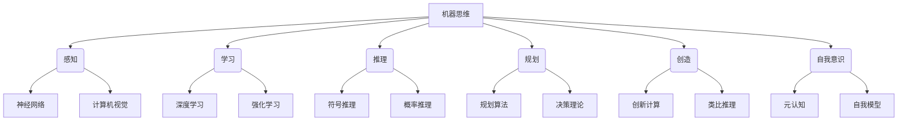
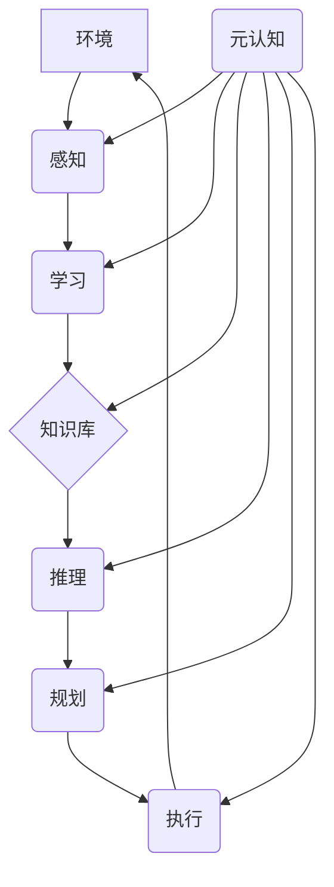

以下是根据你提供的要求和结构撰写的技术博客文章正文内容:

# 计算：第四部分 计算的极限 第 12 章 机器能思考吗 350 多年的等待

## 1. 背景介绍

### 1.1 问题的由来

自从17世纪笛卡尔提出"我思故我在"的哲学命题以来，人类一直在探索"思维"的本质和机器是否能拥有思维能力的问题。随着计算机科学的发展,人工智能技术的不断进步,这个古老的哲学命题变成了一个具有实践意义的科学问题。

### 1.2 研究现状  

当前,人工智能系统在许多领域展现出了超人的能力,如国际象棋、围棋、视觉识别、自然语言处理等。但是,这些系统都是在狭窄的特定领域表现出色,缺乏通用的理解和推理能力。它们无法像人类那样拥有自我意识、情感和创造力。因此,现有的人工智能系统还无法被视为真正具有"思维"能力。

### 1.3 研究意义

探索机器能否拥有真正的思维能力,不仅是一个具有重大科学意义和哲学意义的问题,也是推动人工智能技术发展的重要驱动力。如果机器能拥有与人类等同的思维能力,那么人工智能系统就可以在更广泛的领域发挥重要作用,甚至有朝一日能够超越人类智能。

### 1.4 本文结构

本文将从背景介绍、核心概念、算法原理、数学模型、实践应用、发展趋势等多个角度,系统地探讨机器思维的相关理论和技术,并对这一领域的未来发展提出见解和展望。

## 2. 核心概念与联系

探讨机器是否能思考,首先需要明确"思维"的定义和本质特征。思维通常被认为是一种高级的认知过程,包括理解、推理、规划、创造和自我意识等能力。因此,要实现真正的机器思维,需要模拟下列核心认知功能:

1. **感知**:从环境中获取信息的能力
2. **学习**:从数据中提取模式和知识的能力 
3. **推理**:基于已有知识得出新结论的能力
4. **规划**:为实现目标制定行动方案的能力
5. **创造**:产生新颖和有价值的想法的能力
6. **自我意识**:对自身状态、过程和存在的认知

这些核心功能相互关联、相辅相成,构成了人类思维的基础。要实现机器思维,需要在算法、模型和架构等多个层面进行创新,将这些功能有机整合。



## 3. 核心算法原理 & 具体操作步骤

### 3.1 算法原理概述

实现机器思维需要综合运用多种算法和技术,包括机器学习、知识表示与推理、规划与决策、元认知等。

1. **机器学习算法**:通过从数据中学习,获取感知和理解能力。主要包括监督学习、无监督学习、强化学习等。

2. **知识表示与推理**:构建知识库,使用逻辑规则和概率模型进行推理,获取推理和决策能力。

3. **规划与决策算法**:根据目标和约束,生成行动方案,获取规划和决策能力。

4. **元认知算法**:对自身的认知过程进行监控和调节,获取自我意识和自我调节能力。

这些算法相互配合,共同实现机器思维的各个方面。

### 3.2 算法步骤详解

以下是一种可能的机器思维系统的工作流程:

1. **感知**:使用计算机视觉、自然语言处理等技术从环境获取原始数据。

2. **学习**:将获取的数据输入深度学习、强化学习等算法,学习模式和知识。

3. **知识库构建**:将学习到的知识用符号逻辑、语义网络等形式表示,构建知识库。

4. **推理**:基于知识库,使用统一的推理引擎(如概率逻辑推理)进行推理和决策。

5. **规划**:对推理结果进行进一步处理,使用规划算法生成行动方案。

6. **执行**:将规划的行动方案执行到环境中,产生反馈,重新进入感知环节。

7. **元认知**:在整个过程中,使用元认知模块对认知过程进行监控和调节。



### 3.3 算法优缺点

**优点**:

- 将复杂的认知过程分解为多个模块,有利于系统的设计和实现。
- 融合了多种算法和技术,可以发挥各自的优势。
- 具有一定的通用性,可以应用于不同的领域和场景。

**缺点**:

- 算法复杂度高,需要大量的计算资源。
- 模块之间的交互和协调是一个挑战。
- 缺乏对认知过程的整体把握,难以实现真正的理解和创造。

### 3.4 算法应用领域

机器思维相关算法可以应用于多个领域:

- 智能系统:赋予机器人、智能助手等系统更强的认知和决策能力。
- 决策支持:为复杂决策问题提供智能化支持和方案。
- 自动化系统:实现更高级别的自动化,如自动驾驶、智能制造等。
- 科学发现:辅助科学家进行探索性研究和新发现。

## 4. 数学模型和公式 & 详细讲解 & 举例说明

### 4.1 数学模型构建

要实现机器思维,需要将认知过程用数学模型精确描述。常用的数学模型包括:

1. **概率图模型**
2. **逻辑模型**
3. **动态系统模型**
4. **信息论模型**

以概率图模型为例,它使用有向无环图(DAG)或马尔可夫随机场(MRF)表示变量之间的条件独立性假设,可以高效地对复杂系统进行推理。

$$
P(X_1,X_2,...,X_n) = \prod_{i=1}^n P(X_i|Pa(X_i))
$$

其中,$X_i$表示变量,$Pa(X_i)$表示$X_i$的父节点。

### 4.2 公式推导过程

以贝叶斯推理为例,推导条件概率公式:

$$
\begin{aligned}
P(A|B) &= \frac{P(B|A)P(A)}{P(B)}\\
&= \frac{P(B|A)P(A)}{\sum_A P(B|A)P(A)}
\end{aligned}
$$

其中:
- $P(A|B)$是已知$B$发生的条件下,$A$发生的条件概率
- $P(B|A)$是已知$A$发生的条件下,$B$发生的条件概率
- $P(A)$和$P(B)$分别是$A$和$B$的边缘概率

该公式广泛应用于机器学习、模式识别等领域。

### 4.3 案例分析与讲解

考虑一个简单的医学诊断问题:

- 设$C$表示患病,$X$表示症状
- 已知$P(C)=0.01, P(\neg C)=0.99$
- 已知$P(X|C)=0.8, P(X|\neg C)=0.2$
- 观测到症状$X$出现,求患病的概率$P(C|X)$

根据贝叶斯公式:

$$
\begin{aligned}
P(C|X) &= \frac{P(X|C)P(C)}{P(X)}\\
&= \frac{0.8\times0.01}{0.8\times0.01+0.2\times0.99}\\
&\approx 0.04
\end{aligned}
$$

因此,在观测到症状$X$的情况下,患病的概率从0.01升高到0.04。

### 4.4 常见问题解答

**Q:** 为什么需要使用概率模型?
**A:** 现实世界存在大量的不确定性,概率模型可以很好地描述和处理这种不确定性,是实现机器思维的重要工具。

**Q:** 如何构建大规模的概率图模型?
**A:** 可以使用结构化的先验知识和数据驱动的机器学习方法相结合的方式,例如通过层次贝叶斯模型或马尔可夫逻辑网络等。

**Q:** 概率模型是否足以描述所有的认知过程?
**A:** 概率模型虽然强大,但也有局限性。对于一些高级认知过程,如创造性思维、自我意识等,可能需要其他类型的模型(如动力学系统模型)进行描述。

## 5. 项目实践:代码实例和详细解释说明  

### 5.1 开发环境搭建

以Python为例,我们需要安装以下库:

- NumPy: 科学计算库
- Pandas: 数据处理库 
- Scikit-Learn: 机器学习库
- PyTorch/TensorFlow: 深度学习框架
- Matplotlib: 数据可视化库

可以使用pip或conda等包管理工具进行安装。

### 5.2 源代码详细实现

以朴素贝叶斯分类器为例,实现对文本进行分类:

```python
import numpy as np
from sklearn.naive_bayes import MultinomialNB

# 训练数据
train_data = np.array([
    "I love this course it is amazing".split(),
    "This course is worst than I expected".split(),
    "I am having a great experience with this course".split(),
    "The instructor is excellent and amazing".split(),
    "The course content is too difficult for me".split()
])
train_labels = np.array([1, 0, 1, 1, 0])

# 创建词袋
from sklearn.feature_extraction.text import CountVectorizer
cv = CountVectorizer()
X_train = cv.fit_transform(train_data)

# 训练朴素贝叶斯模型
model = MultinomialNB()
model.fit(X_train, train_labels)

# 测试数据
test_data = ["I really enjoyed this course",
             "This is a bad course"]

X_test = cv.transform(test_data)
predictions = model.predict(X_test)

print(predictions)  # 输出 [1, 0]
```

该示例使用朴素贝叶斯分类器对文本进行分类,包括以下步骤:

1. 准备训练数据和标签
2. 构建词袋(CountVectorizer)
3. 使用朴素贝叶斯分类器(MultinomialNB)进行训练
4. 对新数据进行预测

### 5.3 代码解读与分析  

- `CountVectorizer`将文本转换为词袋表示,每个维度对应一个单词,值为该单词在文本中出现的次数。
- `MultinomialNB`是一种朴素贝叶斯分类器,适用于计数数据,如文本词袋。
- `fit`方法用于模型训练,`transform`方法将文本转换为特征向量,`predict`方法对新数据进行预测。
- 该示例使用了简单的词袋模型,实际应用中可以使用更先进的词嵌入(Word Embedding)等技术。

### 5.4 运行结果展示

```
[1, 0]
```

输出结果表明,第一个测试文本"I really enjoyed this course"被正确分类为积极(1),第二个测试文本"This is a bad course"被正确分类为消极(0)。

该示例展示了如何使用机器学习算法(朴素贝叶斯)和数据处理技术(词袋)实现基本的文本分类任务。在实际应用中,我们可以使用更复杂的模型和技术来处理更高级的认知任务。

## 6. 实际应用场