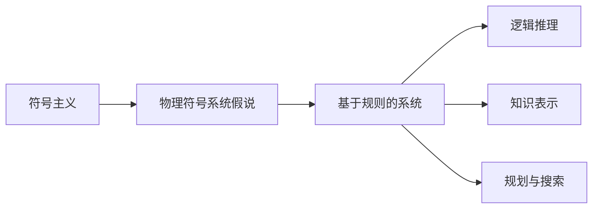
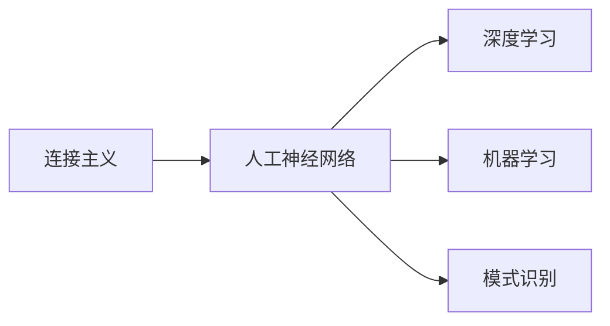
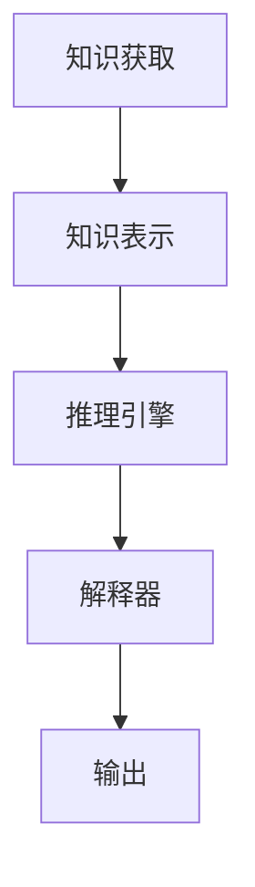
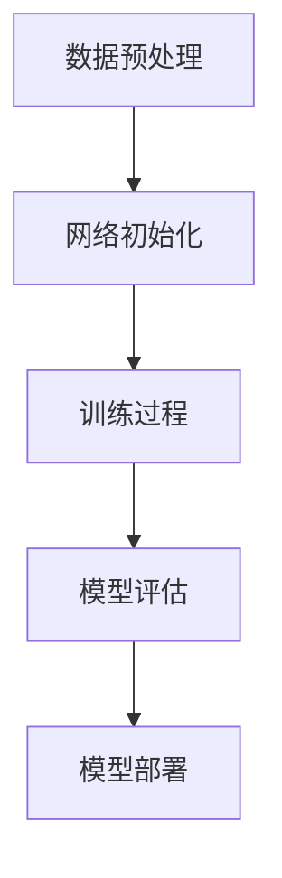

以下是根据您提供的标题和要求撰写的技术博客文章正文内容:

# 计算：第四部分 计算的极限 第12章 机器能思考吗 符号主义与连接主义

作者：禅与计算机程序设计艺术 / Zen and the Art of Computer Programming

## 1. 背景介绍

### 1.1 问题的由来

自从图灵在1950年提出著名的"图灵测试"以来，"机器是否能思考"这一问题就一直困扰着人工智能领域。图灵测试的核心思想是，如果一台机器能够以一种无法与人类区分的方式进行对话，那么我们就可以说这台机器具有智能。这个测试为人工智能研究确立了一个实用的目标,但同时也引发了哲学上的争论。

### 1.2 研究现状

在过去的几十年里,人工智能领域取得了长足的进步,尤其是在机器学习和神经网络方面。然而,即使是最先进的人工智能系统,也只能在特定领域表现出"智能"行为,而无法通过图灵测试,展现出真正的"通用智能"。这引发了人们对人工智能的本质和极限的反思。

### 1.3 研究意义

探讨"机器是否能思考"的问题,不仅关乎人工智能技术本身的发展,更关乎我们对智能、意识和思维的理解。它将推动我们重新审视人类智能的本质,并可能最终导致对心智和意识的新理论。

### 1.4 本文结构

本文将首先介绍两种主要的人工智能理论范式:符号主义和连接主义。然后深入探讨它们各自的核心概念、算法原理、数学模型,并通过实例分析它们的优缺点和应用场景。最后,本文将总结这两种范式的发展趋势和面临的挑战,并对"机器是否能思考"的问题进行展望。

## 2. 核心概念与联系

符号主义(Symbolism)和连接主义(Connectionism)是当前人工智能领域两种主要的理论范式。

符号主义认为,智能可以用一系列符号规则和操作来表示和模拟。这种观点源于计算机科学的起源——图灵机,后来发展为经典的"物理符号系统假说"(Physical Symbol System Hypothesis)。

与之相对的是连接主义,它将智能视为大规模并行分布处理系统中的一种出现现象。这种观点受到了大脑神经元网络的启发,后来发展为人工神经网络和机器学习等技术。

这两种范式在理论基础、建模方法和应用领域上存在明显差异,但它们也存在一些联系。例如,现代的混合智能系统往往结合了符号处理和连接主义的优点。

## 3. 核心算法原理 & 具体操作步骤

### 3.1 算法原理概述

#### 符号主义算法原理

符号主义算法的核心是基于规则的推理系统。它将知识表示为一系列符号和规则,然后通过逻辑推理和搜索算法得出结论。典型的符号主义算法包括:

- 逻辑推理算法(如前向推理和反向推理)
- 搜索算法(如A*算法、最小冲突算法等)
- 规划算法(如部分订序规划算法)

#### 连接主义算法原理

连接主义算法的核心是人工神经网络,它模拟了大脑神经元网络的工作原理。神经网络通过训练调整连接权重,从而学习模式并对新数据进行预测或决策。典型的连接主义算法包括:

- 前馈神经网络(如多层感知器)
- 反向传播算法(用于训练神经网络)
- 卷积神经网络(用于图像识别等)
- 循环神经网络(用于序列数据处理)

### 3.2 算法步骤详解

#### 符号主义算法步骤

以基于规则的专家系统为例,符号主义算法的主要步骤包括:

1. **知识获取**:从人类专家或其他知识源获取领域知识,并将其表示为规则和事实。
2. **知识表示**:使用逻辑表示语言(如谓词逻辑)将获取的知识形式化。
3. **推理引擎**:设计推理算法(如前向链接或反向链接),根据规则和事实进行逻辑推理。
4. **解释器**:将推理结果转换为可理解的输出,如诊断或决策建议。

#### 连接主义算法步骤

以训练一个前馈神经网络为例,连接主义算法的主要步骤包括:

1. **数据预处理**:从原始数据中提取特征,并将其转换为神经网络可接受的格式。
2. **网络初始化**:根据问题的复杂性设计网络结构(层数、神经元数等),并初始化连接权重。
3. **训练过程**:使用反向传播算法,通过多次迭代调整连接权重,使网络能够学习训练数据中的模式。
4. **模型评估**:在测试数据集上评估训练好的模型的性能。
5. **模型部署**:将训练好的模型集成到实际应用系统中。

### 3.3 算法优缺点

#### 符号主义算法

优点:

- 具有较强的解释能力,推理过程可解释
- 能够处理复杂的逻辑和规则
- 在特定领域可获得人类专家级别的性能

缺点:

- 知识获取和表示过程耗时耗力
- 推理效率较低,难以处理大规模数据
- 缺乏学习和自适应能力

#### 连接主义算法

优点:

- 具有强大的模式识别和学习能力
- 能够高效处理大规模数据
- 在许多领域表现出超人类的性能(如图像识别、自然语言处理等)

缺点:

- 缺乏解释能力,难以解释内部工作机理
- 需要大量标注数据进行训练
- 可能存在偏差和鲁棒性问题

### 3.4 算法应用领域

符号主义算法常用于需要复杂逻辑推理的领域,如:

- 专家系统(医疗诊断、金融决策等)
- 自动规划与调度
- 自然语言理解与问答系统

连接主义算法常用于需要模式识别和预测的领域,如:

- 计算机视觉(图像识别、目标检测等)
- 自然语言处理(机器翻译、情感分析等)
- 推荐系统
- 游戏AI(如AlphaGo等)

## 4. 数学模型和公式 & 详细讲解 & 举例说明

### 4.1 数学模型构建

#### 符号主义数学模型

符号主义常使用逻辑和集合论等数学工具进行建模。以一阶逻辑为例,我们可以将知识库表示为一组逻辑公理和规则:

$$
KB = \{Axioms, Rules\}
$$

其中Axioms是一组关于领域知识的逻辑陈述(如"所有人都会死亡")，Rules是一组推理规则(如"如果X是人,那么X会死亡")。

给定一个查询q,我们可以使用推理算法在知识库KB中推导出q是否为真:

$$
KB \vdash q
$$

#### 连接主义数学模型

连接主义常使用概率论和优化理论进行建模。以前馈神经网络为例,我们可以将其视为一个参数化的函数:

$$
y = f(x; \theta)
$$

其中x是输入,y是输出,θ是网络的可训练参数(权重和偏置)。训练的目标是找到最优参数θ*,使得在训练数据D上的损失函数L(θ)最小化:

$$
\theta^* = \arg\min_\theta L(\theta) = \arg\min_\theta \sum_{(x,y) \in D} \ell(f(x;\theta), y)
$$

这通常通过梯度下降等优化算法来实现。

### 4.2 公式推导过程

#### 符号主义公式推导

以一阶逻辑为例,我们可以使用归结原理(Resolution Principle)进行推理。假设有两个子句(析取范式):

$$
C_1 = A_1 \vee A_2 \vee \cdots \vee A_m \\
C_2 = \neg B_1 \vee \neg B_2 \vee \cdots \vee \neg B_n
$$

如果存在一个文字A∈C1和它的补B∈C2,那么我们可以将C1和C2归结为一个新子句C:

$$
C = (A_1 \vee \cdots \vee A_m \vee \neg B_2 \vee \cdots \vee \neg B_n) \vee (\neg B_1 \vee A_2 \vee \cdots \vee A_m)
$$

通过重复应用归结原理,我们可以从初始子句集合推导出所需的结论。

#### 连接主义公式推导

以反向传播算法为例,我们需要计算损失函数L相对于网络参数θ的梯度∇θL,并沿着该梯度的方向更新参数:

$$
\theta_{t+1} = \theta_t - \eta \nabla_\theta L(\theta_t)
$$

其中η是学习率。

对于单层神经网络,我们可以直接计算梯度:

$$
\frac{\partial L}{\partial w_{jk}} = \frac{\partial L}{\partial y_j}\frac{\partial y_j}{\partial w_{jk}} = \delta_j x_k
$$

其中δj是第j个输出单元的误差信号。

对于多层网络,我们需要使用链式法则反向传播误差,计算每一层的梯度。以两层网络为例:

$$
\frac{\partial L}{\partial w^{(2)}_{jk}} = \delta^{(2)}_j h_k \\
\frac{\partial L}{\partial w^{(1)}_{ij}} = \delta^{(1)}_i x_j
$$

其中δ(2)是输出层误差,δ(1)是隐藏层误差,h是隐藏层输出。

### 4.3 案例分析与讲解

#### 符号主义案例:简单专家系统

假设我们要构建一个简单的医疗诊断专家系统,知识库包含以下规则:

1) 如果一个人有发烧和咳嗽,那么他可能患感冒。
2) 如果一个人有肌肉酸痛和乏力,那么他可能患流感。
3) 如果一个人患感冒或流感,那么他应该服用药物A。

我们可以将这些规则用一阶逻辑表示如下:

$$
\begin{aligned}
&\text{fever}(X) \wedge \text{cough}(X) \Rightarrow \text{flu}(X)\\
&\text{muscleAche}(X) \wedge \text{fatigue}(X) \Rightarrow \text{influenza}(X)\\
&\text{flu}(X) \vee \text{influenza}(X) \Rightarrow \text{takeA}(X)
\end{aligned}
$$

现在,如果我们观察到一个人有发烧、咳嗽和乏力的症状,我们可以使用前向链接推理:

$$
\begin{aligned}
&\text{fever(John)} \\
&\text{cough(John)} \\
&\therefore \text{flu(John)} &&\text{(由规则1)}\\
&\text{fatigue(John)}\\
&\therefore \text{influenza(John)} &&\text{(由规则2)}\\
&\therefore \text{takeA(John)} &&\text{(由规则3)}
\end{aligned}
$$

因此,我们可以推导出该人应该服用药物A。

#### 连接主义案例:手写数字识别

假设我们要构建一个手写数字识别系统。我们可以使用卷积神经网络(CNN)来从图像数据中自动提取特征和模式。

CNN由多