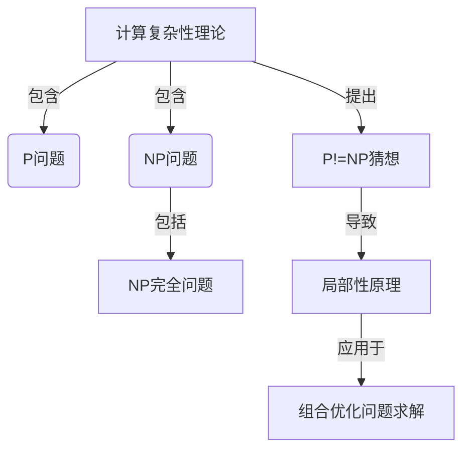

# 计算：第四部分 计算的极限 第9章 计算复杂性 计算的局部性原理

## 1. 背景介绍

### 1.1 问题的由来

在现代计算机系统中,计算复杂性是一个无法回避的问题。随着问题规模的增长,计算量也会呈指数级增长,导致计算时间和资源消耗激增。这种"爆炸性"增长被称为"组合爆炸"(Combinatorial Explosion),是计算复杂性理论研究的核心驱动力。

组合爆炸问题源于计算问题的"非结构化"本质。对于结构化的序列问题,算法的时间复杂度通常为线性或多项式级别,是可控的。但对于非结构化的组合优化、决策、搜索等问题,由于解空间的指数级增长,传统算法往往无法在可接受的时间内求解。

### 1.2 研究现状

为解决组合爆炸问题,学术界和工业界做了大量研究工作。一方面,通过设计更高效的近似算法、启发式算法等,尽可能减小计算量;另一方面,利用并行计算、量子计算等新型计算模型,提高计算能力。但总的来说,对于大规模的组合优化问题,我们目前还缺乏通用的高效解决方案。

### 1.3 研究意义 

计算复杂性理论研究对于推动计算机科学发展具有重要意义:

1. 理论指导:明确问题的计算复杂性边界,指导算法设计方向。
2. 性能评估:为算法性能提供理论依据,避免"过度设计"。
3. 新范式启发:激发新型计算模型和计算范式的产生。

### 1.4 本文结构

本文将围绕"计算的局部性原理"这一核心思想,深入探讨计算复杂性理论的最新进展。文章首先介绍相关核心概念,然后系统阐述局部性原理的理论基础、算法实现和应用案例,最后对未来发展趋势进行展望。

## 2. 核心概念与联系

计算复杂性理论中有几个核心概念需要先解释清楚:

1. **P问题与NP问题**

P问题指在确定性图灵机上可以在多项式时间内解决的问题,是"可有效解决"的问题。NP问题是"非确定性多项式时间可判定"的问题,包含两类:一类是P问题,另一类是目前没有已知的多项式时间算法,但如果给出一个解答就可以在多项式时间验证正确性,称为NP完全问题。

2. **NP完全问题**

NP完全问题是NP问题中最困难的一类,如果能解决任一NP完全问题,就等价于解决了所有NP问题。著名的NP完全问题有旅行商问题、图着色问题、整数规划问题等。

3. **P != NP 猜想**  

这是计算理论中最重要也最著名的公开性未解决问题。直观上,NP完全问题似乎比P问题更加困难,因此推测P != NP。但目前还无法证明或推翻这一猜想。

4. **计算的局部性原理**

这是解决NP完全问题的一种新颖思路。其核心观点是:对于大规模的组合优化问题,不追求全局最优解,而是在可接受的时间内寻找一个"足够好"的近似解,同时利用问题的局部结构特征来减小搜索空间。

5. **Mermaid流程图**



上图展示了这些核心概念之间的关系。计算复杂性理论包含P问题和NP问题,NP问题又分为P问题和NP完全问题。P!=NP猜想的提出导致了局部性原理的产生,后者被应用于组合优化问题的求解。

## 3. 核心算法原理 & 具体操作步骤  

### 3.1 算法原理概述

基于局部性原理,我们可以设计一类新型启发式算法来求解NP完全问题的近似解。这类算法不追求全局最优,而是通过有限次迭代,在可接受的时间内获得一个"足够好"的近似解。其核心思路是:

1. 将整体问题分解为多个局部子问题。
2. 对每个局部子问题求解,得到局部最优解。 
3. 将局部最优解合并,构建整体近似解。

这样做的关键在于,如何合理划分局部子问题,并在子问题求解和合并过程中,有效利用问题的局部结构特征,减小搜索空间。

### 3.2 算法步骤详解

我们以著名的旅行商问题(TSP)为例,说明基于局部性原理的算法具体执行步骤:

1. **问题输入**:给定一组城市及其相互距离,求解访问每个城市一次并回到起点的最短回路。

2. **初始解构造**:首先构造一个初始回路解,可以是随机的或借助某种启发式规则。

3. **子问题划分**:将整个回路划分为多个局部子路径,子路径的节点数目遵循2-opt原则。

4. **子问题求解**:对每个子路径,通过2-opt算法获得其局部最优解。

5. **局部优化**:将所有子路径局部最优解合并,获得整个回路的一个近似解。

6. **迭代优化**:以上一步的近似解为初始解,重复执行步骤3-5,直至满足停止条件(如最大迭代次数)。

7. **输出最优解**:输出所有迭代中获得的最优近似解作为最终结果。

其中,2-opt算法是子问题求解的核心步骤,下面将对它进行详细介绍。

### 3.3 算法优缺点

**优点:**
1. 有效降低了求解复杂度,使大规模NP完全问题在可接受时间内求得近似解成为可能。
2. 算法逻辑简单,容易实现和并行化。
3. 可以通过调整子问题规模、迭代策略等参数,平衡求解精度和时间开销。

**缺点:**
1. 无法保证获得全局最优解,只能得到一个近似解。
2. 算法性能很大程度上依赖于子问题划分策略,需要针对不同问题设计合理的策略。
3. 对于某些"病态"实例,局部搜索可能会陷入局部最优，难以逃脱。

### 3.4 算法应用领域

基于局部性原理的算法主要应用于以下领域的组合优化问题:

- 运筹与供应链:如车辆路径规划、工厂作业调度等。
- 电子设计自动化:如集成电路布线、逻辑门布局等。 
- 计算生物学:如基因序列比对、蛋白质结构预测等。
- 人工智能:如行动规划、推理与决策等。

总的来说,对于具有良好局部性结构的NP完全问题,该类算法可以获得较好的近似性能。

## 4. 数学模型和公式 & 详细讲解 & 举例说明

### 4.1 数学模型构建

我们以旅行商问题(TSP)为例,构建其数学模型。

设有n个城市,城市间距离记为$d_{ij}(1 \leq i,j \leq n)$。令决策变量$x_{ij}$表示是否需要经过城市i到j的路径:
$$
x_{ij}=
\begin{cases}
1, & \text{需要经过} \\
0, & \text{不需要经过}
\end{cases}
$$

TSP的数学模型可以描述为:

$$
\begin{aligned}
\min \quad & \sum_{i=1}^{n}\sum_{j=1}^{n}d_{ij}x_{ij} \\
\text{s.t.}\quad
& \sum_{i=1}^{n}x_{ij}=1, \quad \forall j \\
& \sum_{j=1}^{n}x_{ij}=1, \quad \forall i\\
& \sum_{i \in S}\sum_{j \in S}x_{ij} \leq |S|-1, \quad \forall S \subset \{1,2,...,n\}, 2 \leq |S| \leq n-1
\end{aligned}
$$

目标函数是minimizing总路径距离。约束条件一、二保证每个城市只被访问一次;三保证无子环路。

这是一个整数线性规划模型,属于NP完全问题,求解复杂度随城市数n呈指数级增长。

### 4.2 公式推导过程

我们来推导一下2-opt算法的数学原理。

设有一条路径$\pi=(1,2,...,r,r+1,...,r+s,...,n,1)$,其中$r$到$r+s$的子路径并不是最优的。我们希望通过调整,使其变为更优的路径$\pi^*$。

令$d(\pi)$表示路径$\pi$的总长度,则有:

$$
\begin{aligned}
d(\pi)&=d(1,2,...,r)+d(r,r+1)+...+d(r+s-1,r+s)+d(r+s,r+s+1,...,n,1)\\
      &=d(1,2,...,r,r+s,r+s-1,...,r+1)+d(r+s,r+s+1,...,n,1)
\end{aligned}
$$

现在我们将子路径$r$到$r+s$进行反转,得到一条新路径$\pi^*$:

$$
\pi^*=(1,2,...,r,r+s,r+s-1,...,r+1,r+s+1,...,n,1)
$$

同理可得$\pi^*$的长度为:

$$
\begin{aligned}
d(\pi^*)&=d(1,2,...,r)+d(r,r+s)+d(r+s,r+s-1)+...+d(r+1,r+s+1)+d(r+s+1,...,n,1)\\
        &=d(1,2,...,r,r+s,r+s-1,...,r+1)+d(r+s,r+s+1,...,n,1)
\end{aligned}
$$

将两式相减,可得:

$$
\begin{aligned}
d(\pi^*)-d(\pi)&=d(r,r+s)+d(r+s,r+s-1)+...+d(r+1,r+s+1)\\
                &-[d(r,r+1)+d(r+1,r+2)+...+d(r+s-1,r+s)]\\
                &=d(r,r+s)+d(r+s,r+1)-d(r,r+1)-d(r+s-1,r+s)
\end{aligned}
$$

当$d(r,r+s)+d(r+s,r+1)<d(r,r+1)+d(r+s-1,r+s)$时,即$d(\pi^*)<d(\pi)$,我们就可以通过反转子路径,获得一条更优的路径$\pi^*$。这就是2-opt算法的数学基础。

### 4.3 案例分析与讲解

我们以一个具体的TSP案例,演示2-opt算法的执行过程。

假设有6个城市,城市间距离如下:

```
     1   2   3   4   5   6
     ----------------------
1 | 0   2   6   5   9   7
2 | 2   0   4   3   7   5  
3 | 6   4   0   1   3   1
4 | 5   3   1   0   2   2
5 | 9   7   3   2   0   4
6 | 7   5   1   2   4   0
```

取初始回路$(1,2,3,4,5,6,1)$,其总长度为23。

1) 首先将回路划分为3条子路径:$(1,2)$、$(3,4)$、$(5,6,1)$。

2) 对每条子路径应用2-opt算法,获得其局部最优解:
    - $(1,2)$不变
    - $(3,4)$不变 
    - $(5,6,1)$反转为$(1,6,5)$

3) 合并3条子路径,得到新的回路$(1,2,3,4,1,6,5)$,总长度为17。

4) 以新回路为初始解,重复执行步骤1-3,直至无法继续优化为止。

通过多次迭代,最终可获得全局最优解$(3,4,5,1,6,2)$,总长度为12。

该算例说明,2-opt算法通过局部优化和迭代,可以有效地从较差的初始解出发,不断逼近全局最优解。

### 4.