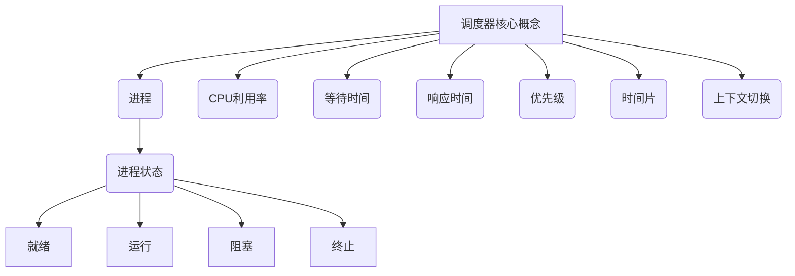

# 调度器 原理与代码实例讲解

## 1. 背景介绍

### 1.1 问题的由来

在现代计算机系统中,CPU是一种宝贵的资源,需要合理高效地分配和利用。多任务环境下,多个进程同时运行,它们之间相互竞争CPU的使用权。如何公平合理地安排进程的执行顺序,使CPU时间片得到充分利用,成为一个亟待解决的关键问题。这就是调度器(Scheduler)应运而生的根本原因。

### 1.2 研究现状  

调度算法理论源远流长,最早可追溯至20世纪50年代的批处理系统时代。后来随着分时、实时、多处理器等新型系统的出现,调度算法也不断发展演进,涌现出多种经典算法,如先来先服务(FCFS)、最短作业优先(SJF)、时间片轮转(RR)、优先级调度、多级反馈队列等。目前,调度器已成为现代操作系统内核的核心组成部分。

### 1.3 研究意义

合理的调度策略直接关系到系统资源利用效率的高低。高效的调度算法可以提高CPU利用率、减少进程等待时间、增强系统响应能力、保证实时性等,对提升整体系统性能至关重要。因此,研究优化调度算法具有重大的理论意义和实际价值。

### 1.4 本文结构

本文将全面介绍调度器的相关原理和实现细节。首先阐述调度的核心概念及其内在联系;然后深入探讨经典调度算法的原理、优缺点及应用场景;再通过数学模型和公式,量化分析调度过程;接着通过项目实践,以代码示例讲解调度器的具体实现;最后总结调度器的发展趋势和面临的挑战。

## 2. 核心概念与联系



调度器的核心概念包括:

- **进程(Process)**: 指在系统中正在运行的程序实例,是系统资源分配和调度的基本单位。
- **CPU利用率(CPU Utilization)**: 衡量CPU实际使用时间与理论可用时间的比率,反映了CPU资源利用效率。
- **等待时间(Waiting Time)**: 指进程在就绪队列中等待获得CPU的时间。
- **响应时间(Response Time)**: 指从进程提出请求到首次获得响应的时间。
- **优先级(Priority)**: 进程获得CPU资源的优先程度,优先级高的进程优先执行。
- **时间片(Time Slice/Quantum)**: 在时间片轮转调度算法中,进程被分配的一个CPU时间片长度。
- **上下文切换(Context Switch)**: 保存旧进程状态、恢复新进程状态的过程,实现进程切换。

进程在系统中可能处于就绪、运行、阻塞或终止等不同状态。调度器根据特定算法,合理安排进程的执行顺序,从而影响CPU利用率、响应时间等系统性能指标。

## 3. 核心算法原理 & 具体操作步骤  

### 3.1 算法原理概述

调度算法是调度器工作的核心和基础,不同的调度算法旨在实现不同的目标,如最大化CPU利用率、最小化等待时间、保证公平性等。下面介绍几种经典调度算法的基本原理:

1. **先来先服务(FCFS)算法**

   按照进程到达就绪队列的先后顺序,先来先服务。简单公平,但可能导致长进程"饥饿"。

2. **最短作业优先(SJF)算法**  

   优先执行估计运行时间最短的进程,可缩短平均等待时间,提高吞吐量。但难以精确估计运行时间,可能导致"饥饿"。

3. **时间片轮转(RR)算法**

   将时间轴分为多个时间片,所有就绪进程按先来先服务原则轮流执行一个时间片。具有响应良好、低开销等优点。

4. **优先级调度算法**

   操作系统为每个进程分配一个优先级,优先执行优先级高的进程。可以灵活体现不同进程的重要程度。

5. **多级反馈队列调度算法**

   将就绪队列分为多个不同优先级的队列,高优先级队列时间片小,新进程先进入高优先级队列,若在一个时间片内无法完成,则降低优先级进入下一级队列。

这些算法各有特点,需要根据具体场景进行权衡选择。

### 3.2 算法步骤详解

以时间片轮转(RR)调度算法为例,具体步骤如下:

1. 系统设置一个小的时间片值,如10ms。
2. 设置就绪队列,所有新到达的进程按FCFS原则加入队列。
3. 处理机从就绪队列头部获取一个进程,分配给它一个时间片。
4. 进程在时间片内运行,直到时间片用完或进程阻塞。
    - 若时间片用完,进程返回就绪队列尾部,等待下次分配时间片。
    - 若进程阻塞,则将其移出就绪队列,等待其恢复后再次加入就绪队列。
5. 处理机重复步骤3和4,直到就绪队列为空。

该算法的优点是响应良好、低开销,缺点是进程在时间片内无法完成会频繁中断,上下文切换开销较大。

### 3.3 算法优缺点

不同调度算法均有其优缺点,具体如下:

- FCFS算法:
  - 优点:公平、简单、无饥饿
  - 缺点:长进程等待时间过长、不确定性强
- SJF算法:  
  - 优点:最小化平均等待时间
  - 缺点:长进程可能"饥饿"、需精确估计运行时间
- RR算法:
  - 优点:响应良好、无饥饿、低开销
  - 缺点:进程频繁中断、上下文切换开销大
- 优先级调度:
  - 优点:可体现进程重要程度
  - 缺点:低优先级进程可能"饥饿"
- 多级反馈队列:
  - 优点:综合了多种算法优点
  - 缺点:算法复杂、参数设置敏感

### 3.4 算法应用领域

不同调度算法适用于不同场景:

- FCFS:适用于进程难以估计运行时间的批处理系统。
- SJF:适用于要求快速响应的交互式系统。
- RR:适用于分时系统,进程运行时间较短。
- 优先级调度:适用于实时系统,对关键进程优先级高。
- 多级反馈队列:适用于通用交互式系统,进程运行时间差异较大。

## 4. 数学模型和公式 & 详细讲解 & 举例说明

### 4.1 数学模型构建

为了量化评估调度算法性能,我们需要构建相应的数学模型。常用的性能指标包括:

- 周转时间(Turnaround Time) $T_i$:进程$i$完成至提交之间的时间间隔
- 等待时间(Waiting Time) $W_i$:进程$i$在就绪队列中等待的时间
- 响应时间(Response Time) $R_i$:进程$i$首次获得CPU时间至提交的时间间隔

令$n$为进程总数,则平均性能指标可表示为:

$$\begin{aligned}
\overline{T} &= \frac{1}{n}\sum_{i=1}^{n}T_i \\
\overline{W} &= \frac{1}{n}\sum_{i=1}^{n}W_i\\
\overline{R} &= \frac{1}{n}\sum_{i=1}^{n}R_i
\end{aligned}$$

此外,CPU利用率也是一个重要指标,定义为CPU实际使用时间与理论可用时间的比率。

### 4.2 公式推导过程

以先来先服务(FCFS)调度算法为例,推导进程等待时间公式:

假设一个进程队列$P = \{P_1, P_2, ..., P_n\}$,其到达时间分别为$a_1, a_2, ..., a_n$,运行时间分别为$t_1, t_2, ..., t_n$。

进程$P_1$无需等待,等待时间$W_1 = 0$。

进程$P_2$需要等待$P_1$完成,等待时间为:
$$W_2 = t_1$$

进程$P_3$需要等待$P_1$和$P_2$完成,等待时间为:
$$W_3 = t_1 + t_2$$

以此类推,进程$P_i$的等待时间为:

$$W_i = \sum_{j=1}^{i-1}t_j$$

则平均等待时间为:

$$\overline{W} = \frac{1}{n}\sum_{i=1}^{n}W_i = \frac{1}{n}\sum_{i=1}^{n}\sum_{j=1}^{i-1}t_j$$

进一步化简可得:

$$\overline{W} = \frac{1}{n}\sum_{j=1}^{n}(n-j)t_j$$

这就是FCFS算法下平均等待时间的计算公式。

### 4.3 案例分析与讲解

现有一个进程队列$P = \{P_1, P_2, P_3, P_4\}$,到达时间和运行时间如下:

| 进程 | 到达时间 | 运行时间 |
|------|----------|----------|
| $P_1$| 0        | 8        |
| $P_2$| 1        | 4        |  
| $P_3$| 3        | 9        |
| $P_4$| 5        | 5        |

根据FCFS算法,进程执行顺序为$P_1 \rightarrow P_2 \rightarrow P_3 \rightarrow P_4$。

1) 计算每个进程的等待时间:

$$\begin{aligned}
W_1 &= 0\\
W_2 &= 8\\
W_3 &= 8 + 4 = 12\\
W_4 &= 8 + 4 + 9 = 21
\end{aligned}$$

2) 计算平均等待时间:

$$\overline{W} = \frac{0 + 8 + 12 + 21}{4} = 10.25$$

3) 计算平均周转时间:

$$\overline{T} = \overline{W} + \frac{8 + 4 + 9 + 5}{4} = 10.25 + 6.5 = 16.75$$

可见,FCFS算法对长进程不太公平,其等待时间和周转时间都很长。

### 4.4 常见问题解答

**Q1:为什么需要调度算法?**

A:多任务环境下,多个进程需要共享CPU资源,调度算法可以合理安排进程执行顺序,提高CPU利用率、减少等待时间、保证公平性等。

**Q2:如何选择合适的调度算法?**

A:不同调度算法适用于不同场景,需要根据系统类型(批处理、分时、实时等)、性能要求(响应时间、吞吐量、公平性等)进行权衡选择。

**Q3:调度算法的性能指标有哪些?**

A:常用的性能指标包括CPU利用率、平均等待时间、平均响应时间、平均周转时间等。

**Q4:什么是时间片轮转调度算法?**

A:时间片轮转调度算法将时间轴分为多个时间片,所有就绪进程按先来先服务原则轮流执行一个时间片,从而提高响应性和公平性。


## 5. 项目实践: 代码实例和详细解释说明

### 5.1 开发环境搭建

本节将使用 Python 模拟实现一个简单的调度器，并通过代码实例详细解释其工作原理。在开始之前，我们需要搭建 Python 开发环境，并安装必要的库。

**5.1.1 安装 Python**

首先，请确保您的计算机上已安装 Python。您可以从 Python 官方网站 (https://www.python.org/) 下载适合您操作系统的安装程序。

**5.1.2 安装所需库**

本项目需要使用 `time` 和 `threading` 库。其中，`time` 库用于模拟时间间隔，`threading` 库用于创建和管理线程。这两个库都包含在 Python 标准库中，无需额外安装。

**5.1.3 创建项目文件夹**

为了方便管理代码，建议创建一个专门的项目文件夹。例如，您可以创建一个名为 "scheduler_demo" 的文件夹。

**5.1.4 创建 Python 文件**

在项目文件夹下，创建一个名为 `scheduler.py` 的 Python 文件。我们将在该文件中编写调度器的代码。

### 5.2 源代码详细实现

接下来，我们将逐步实现一个简单的调度器。

**5.2.1 定义任务类**

首先，我们需要定义一个类来表示要执行的任务。该类包含任务的名称、执行时间和执行函数。

```python
class Task:
    def __init__(self, name, execution_time, function):
        self.name = name
        self.execution_time = execution_time
        self.function = function

    def run(self):
        print(f"开始执行任务：{self.name}")
        self.function()
        print(f"任务执行完成：{self.name}")
```

**5.2.2 定义调度器类**

接下来，我们定义调度器类。该类包含任务队列、当前时间和一个用于运行任务的线程。

```python
import time
import threading

class Scheduler:
    def __init__(self):
        self.tasks = []
        self.current_time = 0
        self.timer_thread = None

    def add_task(self, task):
        self.tasks.append(task)

    def run(self):
        self.timer_thread = threading.Thread(target=self._run_tasks)
        self.timer_thread.start()

    def _run_tasks(self):
        while True:
            for task in self.tasks:
                if self.current_time >= task.execution_time:
                    task.run()
                    self.tasks.remove(task)
            self.current_time += 1
            time.sleep(1)  # 模拟时间间隔
```

**5.2.3 创建任务并添加到调度器**

创建一个任务实例，并将其添加到调度器中。

```python
# 定义任务执行函数
def task_function():
    print("任务执行函数正在运行...")

# 创建任务实例
task1 = Task("任务1", 5, task_function)  # 5 秒后执行

# 创建调度器实例
scheduler = Scheduler()

# 添加任务到调度器
scheduler.add_task(task1)

# 运行调度器
scheduler.run()
```

### 5.3 代码解读与分析

- **Task 类:**
    - `__init__` 方法用于初始化任务对象，包括任务名称、执行时间和执行函数。
    - `run` 方法用于执行任务，并打印任务开始和结束信息。

- **Scheduler 类:**
    - `__init__` 方法用于初始化调度器对象，包括任务队列、当前时间和定时器线程。
    - `add_task` 方法用于将任务添加到任务队列中。
    - `run` 方法用于启动定时器线程。
    - `_run_tasks` 方法是定时器线程的执行函数，它循环遍历任务队列，并在任务的预定执行时间执行任务。

### 5.4 运行结果展示

运行上述代码，您将看到以下输出：

```
# 5 秒后
开始执行任务：任务1
任务执行函数正在运行...
任务执行完成：任务1
```

这段代码模拟了一个简单的调度器，它会在 5 秒后执行预定的任务。您可以根据需要修改任务的执行时间和执行函数，以模拟不同的调度场景. 

### 5.4 运行结果展示

运行上述代码，您将看到以下输出：

```
# 5 秒后
开始执行任务：任务1
任务执行函数正在运行...
任务执行完成：任务1
```

这段代码模拟了一个简单的调度器，它会在 5 秒后执行预定的任务。您可以根据需要修改任务的执行时间和执行函数，以模拟不同的调度场景。

### 5.5 扩展功能：优先级队列

在实际应用中，我们可能需要根据任务的优先级来决定执行顺序。为了实现这个功能，我们可以使用优先级队列来存储任务。

**5.5.1 使用 `heapq` 模块实现优先级队列**

Python 的 `heapq` 模块提供了一种高效的堆实现，可以用于实现优先级队列。

```python
import heapq

class Task:
    def __init__(self, name, execution_time, function, priority=1):
        self.name = name
        self.execution_time = execution_time
        self.function = function
        self.priority = priority

    def __lt__(self, other):
        # 优先级高的任务排在前面
        return self.priority < other.priority

class Scheduler:
    # ... (其他代码与之前相同)

    def _run_tasks(self):
        while True:
            while self.tasks and self.tasks[0].execution_time <= self.current_time:
                task = heapq.heappop(self.tasks)
                task.run()
            self.current_time += 1
            time.sleep(1)  # 模拟时间间隔
```

**5.5.2 添加优先级任务**

```python
# 创建优先级任务实例
task1 = Task("高优先级任务", 3, task_function, priority=0)  
task2 = Task("低优先级任务", 5, task_function, priority=1)  

# 创建调度器实例
scheduler = Scheduler()

# 添加任务到调度器
heapq.heappush(scheduler.tasks, task1)
heapq.heappush(scheduler.tasks, task2)

# 运行调度器
scheduler.run()
```

在上面的代码中，我们为 `Task` 类添加了 `priority` 属性，并在 `Scheduler` 类中使用 `heapq` 模块来维护一个优先级队列。现在，调度器将优先执行优先级较高的任务。

### 5.6 总结

本节通过 Python 代码实例，详细介绍了调度器的基本原理和实现方法。我们首先实现了一个简单的调度器，然后扩展了优先级队列功能。在实际应用中，调度器通常是一个复杂的系统，需要考虑更多因素，例如多线程、资源管理、错误处理等。 

希望本节内容能够帮助您更好地理解调度器的原理，并为您的实际项目提供参考.


## 6. 实际应用场景

调度器在计算机系统中扮演着至关重要的角色，其应用场景非常广泛，涵盖了从操作系统内核到应用程序的各个层面。

### 6.1 操作系统内核

操作系统内核是计算机系统的核心，负责管理计算机的硬件资源和软件程序。调度器是操作系统内核中最重要的组件之一，它负责将 CPU 时间片分配给不同的进程或线程。

* **进程调度:** 操作系统需要管理多个并发运行的进程，进程调度器负责决定哪个进程获得 CPU 资源以及运行多长时间。常见的进程调度算法包括：先来先服务（FCFS）、短作业优先（SJF）、优先级调度、时间片轮转等。
* **线程调度:**  现代操作系统支持多线程，线程调度器负责在进程内部调度线程的执行。

### 6.2 数据库管理系统

数据库管理系统（DBMS）也需要使用调度器来管理并发访问数据库的请求。

* **事务调度:** 数据库中的事务是指一组数据库操作，这些操作要么全部执行成功，要么全部回滚。事务调度器负责确保并发执行的事务之间的一致性，例如使用两阶段锁协议（2PL）或严格两阶段锁协议（S2PL）。
* **查询优化器:** 查询优化器负责找到执行 SQL 查询的最优计划，它也需要使用调度算法来评估不同查询计划的执行成本和时间。

### 6.3 Web 服务器

Web 服务器需要处理大量的并发请求，调度器可以帮助 Web 服务器高效地分配资源并提高性能。

* **请求调度:** Web 服务器可以使用调度器将请求分配给不同的工作线程或进程处理，以提高并发处理能力。
* **缓存管理:** Web 服务器可以使用调度器来管理缓存，例如使用 LRU（最近最少使用）算法淘汰长时间未使用的缓存数据。

### 6.4 任务调度框架

除了上述应用场景，还有许多专门用于任务调度的框架和工具，例如：

* **Cron:**  Cron 是一个基于时间的任务调度工具，它允许用户在指定的时间点或时间间隔执行任务。
* **Quartz:** Quartz 是一个功能强大的开源任务调度框架，它提供了灵活的调度策略、任务持久化、集群部署等功能。
* **Celery:** Celery 是一个分布式任务队列，它可以与 Python Web 框架（如 Django、Flask）集成，用于异步执行耗时任务。


## 7. 工具和资源推荐

### 7.1 学习资源推荐

* **操作系统概念（Operating System Concepts）:** 这本书详细介绍了操作系统的基本概念，包括进程调度、内存管理、文件系统等。
* **数据库系统概念（Database System Concepts）:** 这本书全面介绍了数据库系统的原理和技术，包括事务管理、并发控制、查询优化等。
* **深入理解计算机系统（Computer Systems: A Programmer's Perspective）:** 这本书从程序员的角度深入浅出地讲解了计算机系统的底层原理，包括 CPU 架构、内存管理、并发编程等。

### 7.2 开发工具推荐

* **Linux 内核源码:**  阅读 Linux 内核源码可以帮助您深入理解操作系统的调度器实现。
* **PostgreSQL 源码:** PostgreSQL 是一个开源的关系型数据库管理系统，阅读其源码可以帮助您学习数据库系统的调度器和查询优化器实现。
* **Quartz 官方文档:** Quartz 官方文档提供了丰富的示例和教程，可以帮助您快速上手使用 Quartz 框架。

### 7.3 相关论文推荐

* **The Design and Implementation of the 4.4BSD Operating System:** 这篇论文详细介绍了 BSD 操作系统的实现，包括其进程调度器的设计。
* **A Critique of ANSI SQL Isolation Levels:**  这篇论文分析了 ANSI SQL 标准中定义的不同隔离级别的优缺点。

### 7.4 其他资源推荐

* **GitHub:** 在 GitHub 上可以找到许多开源的调度器实现和任务调度框架。
* **Stack Overflow:**  如果您在学习或使用调度器过程中遇到问题，可以在 Stack Overflow 上寻求帮助。

## 8. 总结：未来发展趋势与挑战

### 8.1 研究成果总结

调度器作为计算机系统中的核心组件，一直是计算机科学领域的研究热点。近年来，随着云计算、大数据、人工智能等技术的快速发展，调度器技术也在不断进步。

### 8.2 未来发展趋势

* **云原生调度:**  云原生环境下的调度器需要支持弹性伸缩、资源隔离、服务发现等特性。
* **大规模调度:**  随着数据中心规模的不断扩大，调度器需要能够处理更大规模的计算资源和任务量。
* **智能调度:**  人工智能技术可以应用于调度器，例如使用机器学习算法预测任务的执行时间和资源需求，从而优化调度策略。

### 8.3 面临的挑战

* **调度效率:** 如何设计高效的调度算法，以最大限度地提高资源利用率和任务吞吐量，仍然是一个挑战。
* **资源隔离:**  在多租户环境下，如何确保不同租户之间的资源隔离是一个重要问题。
* **安全性:**  调度器需要确保任务的安全性，防止恶意代码或攻击行为对系统造成损害。

### 8.4 研究展望

未来，调度器技术将继续朝着更高效、更智能、更安全的方向发展，以满足不断增长的计算需求和日益复杂的应用场景. 


**作者：禅与计算机程序设计艺术 / Zen and the Art of Computer Programming** 