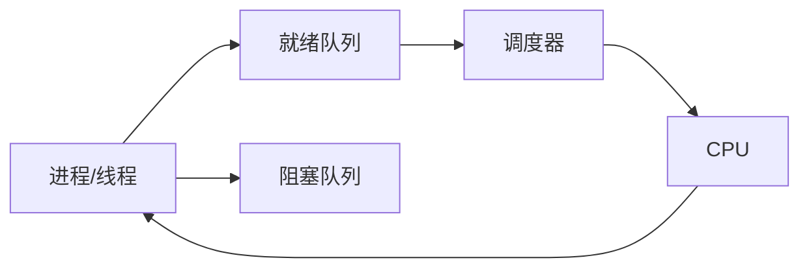

# 调度器 原理与代码实例讲解

## 1. 背景介绍 

### 1.1 问题的由来
在现代操作系统和分布式系统中,调度器扮演着至关重要的角色。它负责决定如何将有限的计算资源(如CPU时间、内存等)分配给众多的任务或进程,以实现系统的高效运行。调度器的设计和实现直接影响着系统的性能、公平性和实时性等关键指标。因此,深入理解调度器的工作原理,并能够根据实际需求实现高效的调度算法,是每一位系统软件工程师必须掌握的基本功。

### 1.2 研究现状
目前,学术界和工业界已经提出了多种不同的调度算法,如先来先服务(FCFS)、短作业优先(SJF)、时间片轮转(RR)、多级反馈队列(MLFQ)等经典算法,以及针对特定场景的调度策略如优先级调度、实时调度、公平调度、抢占式调度等。这些算法在不同的应用场景下各有优劣,需要根据系统的实际需求进行权衡和选择。

此外,随着多核处理器和分布式系统的普及,传统的单机调度算法已经不能满足日益复杂的应用需求。如何在多处理器环境下实现高效的任务调度和负载均衡,如何在分布式环境中协调多个节点的调度决策,成为了当前调度器研究的热点问题。

### 1.3 研究意义
深入研究调度器的原理和实现,对于提高系统的性能和资源利用率具有重要意义。通过设计高效的调度算法,可以最大限度地发挥计算资源的处理能力,减少任务的响应时间,提升用户体验。同时,调度器的研究也为操作系统、虚拟化、云计算等领域提供了重要的理论基础和实践指导。

### 1.4 本文结构
本文将从以下几个方面对调度器进行深入讲解：
- 第2部分介绍调度器的核心概念和相关术语。 
- 第3部分重点讲解几种经典调度算法的原理和实现步骤。
- 第4部分给出调度器的数学模型,并详细推导相关公式。
- 第5部分通过代码实例演示如何用Python实现一个简单的调度器。
- 第6部分讨论调度器在实际系统中的应用场景和案例。
- 第7部分推荐一些学习调度器的资源和工具。
- 第8部分总结全文,并展望调度器未来的发展方向和挑战。

## 2. 核心概念与联系

在讨论调度器的原理和实现之前,我们首先需要了解一些核心概念：

- 进程/线程：进程是资源分配的基本单位,而线程是CPU调度的基本单位。每个进程都有自己独立的地址空间,而一个进程中的多个线程共享进程的资源。
- 就绪队列：存放当前就绪(ready)的所有进程/线程,这些进程/线程都在等待被分配CPU资源。
- 阻塞队列：存放当前被阻塞(blocked)的进程/线程,这些进程/线程在等待某个事件发生(如I/O完成)后才能转为就绪态。
- 调度策略：确定就绪队列中的进程/线程以何种顺序获得CPU资源的规则,常见的有FCFS、SJF、优先级调度等。
- 上下文切换：把CPU从一个进程/线程切换到另一个进程/线程,需要保存当前进程/线程的运行状态,并恢复目标进程/线程的状态,从而继续执行。上下文切换会带来一定的时间开销。

下图展示了这些概念之间的关系：

调度器的主要职责就是从就绪队列中选择合适的进程/线程,将其分配到CPU上执行,当进程/线程执行完毕或时间片用完时,再将CPU分配给其他进程/线程。调度器的设计目标是让系统中的所有进程/线程都能够公平地共享CPU资源,并尽可能提高CPU的利用率和系统的吞吐量。

## 3. 核心算法原理 & 具体操作步骤

### 3.1 算法原理概述

调度算法是调度器的核心,它决定了就绪队列中的进程/线程以何种顺序获得CPU资源。常见的调度算法有：

- 先来先服务(FCFS)：按照进程/线程到达就绪队列的顺序依次执行,先来的进程/线程先获得CPU。
- 短作业优先(SJF)：优先调度估计运行时间最短的进程/线程,可以最小化平均等待时间。
- 时间片轮转(RR)：为每个进程/线程分配一个固定的时间片,时间片用完后就切换到下一个进程/线程,实现公平调度。
- 优先级调度：为每个进程/线程赋予一个优先级,优先级高的进程/线程优先获得CPU。
- 多级反馈队列(MLFQ)：设置多个就绪队列,每个队列对应不同的优先级和时间片,进程/线程在不同队列之间移动,实现区分交互式和批处理任务。

下面我们重点讲解FCFS、SJF和RR这三种经典算法的原理和实现。

### 3.2 算法步骤详解

#### 3.2.1 FCFS算法

FCFS(First-Come, First-Served)算法的基本思想是"先来先服务",即按照进程/线程到达就绪队列的先后顺序依次调度。

具体步骤如下：
1. 把新到达的进程/线程按照到达时间的先后顺序插入就绪队列的末尾。
2. 每当CPU空闲时,从就绪队列的头部取出第一个进程/线程,分配CPU给它执行。
3. 当一个进程/线程执行完毕或被阻塞时,释放CPU,回到步骤2。

FCFS算法的优点是简单易实现,但缺点是无法区分任务的紧急程度,可能导致重要任务等待时间过长。

#### 3.2.2 SJF算法

SJF(Shortest-Job-First)算法的基本思想是"短作业优先",即优先调度估计运行时间最短的进程/线程。

具体步骤如下：
1. 每当有新进程/线程到达时,根据其估计运行时间将其插入就绪队列,使得就绪队列按照估计运行时间从小到大排序。
2. 每当CPU空闲时,从就绪队列中选择估计运行时间最短的进程/线程,分配CPU给它执行。
3. 当一个进程/线程执行完毕或被阻塞时,释放CPU,回到步骤2。

SJF算法可以最小化平均等待时间,但需要预知每个进程/线程的运行时间,而这在实际系统中往往是难以预测的。

#### 3.2.3 RR算法

RR(Round-Robin)算法的基本思想是"时间片轮转",即为每个进程/线程分配一个固定的时间片,时间片用完后就切换到下一个进程/线程,从而实现公平调度。

具体步骤如下：
1. 将所有就绪进程/线程按先后次序排成一个循环队列。 
2. 设置一个固定的时间片长度,用一个计时器记录当前进程/线程的执行时间。
3. 每当一个时间片用完,就保存当前进程/线程的状态,并将其移到队列的末尾,然后从队首取出下一个进程/线程执行。
4. 如果一个进程/线程在一个时间片内执行完毕,则直接释放CPU,从队首取出下一个进程/线程执行。
5. 不断重复步骤3~4,直到队列为空。

RR算法通过时间片轮转机制实现了公平调度,但频繁的上下文切换可能会带来一定的开销。

### 3.3 算法优缺点

- FCFS
  - 优点：简单易实现,无需记录进程信息。
  - 缺点：平均等待时间可能较长,无法区分任务紧急程度。

- SJF 
  - 优点：可以最小化平均等待时间,对短作业友好。
  - 缺点：需要预知作业的运行时间,可能导致长作业饥饿。

- RR
  - 优点：公平性好,响应速度快,适合分时系统。
  - 缺点：平均等待时间较长,上下文切换开销大。

### 3.4 算法应用领域

- FCFS：适用于CPU繁忙型作业,用户可接受较长等待时间的批处理系统。

- SJF：适用于作业运行时间差异较大,并且可以预测运行时间的场景,如作业调度、打印机调度等。

- RR：适用于分时系统,要求快速响应用户交互的场景,如桌面操作系统、Web服务器等。

在实际系统中,往往需要综合考虑任务的特点、系统的需求,采用多种调度策略的组合,或设计更复杂的调度算法如多级反馈队列,以平衡不同性能指标。

## 4. 数学模型和公式 & 详细讲解 & 举例说明

为了定量分析调度算法的性能,我们需要建立调度过程的数学模型。下面我们以FCFS算法为例,推导平均周转时间和平均等待时间的计算公式。

### 4.1 数学模型构建

假设有n个进程/线程,它们的到达时间分别为a1,a2,...,an,服务时间分别为s1,s2,...,sn。我们定义以下变量：

- ft[i]：第i个进程/线程的完成时间
- tt[i]：第i个进程/线程的周转时间
- wt[i]：第i个进程/线程的等待时间

根据FCFS算法,我们可以得到以下关系：

- ft[1] = a1 + s1
- ft[i] = max(ft[i-1], a[i]) + s[i], i>1
- tt[i] = ft[i] - a[i]
- wt[i] = tt[i] - s[i]

### 4.2 公式推导过程

根据上述关系,我们可以推导出平均周转时间(ATT)和平均等待时间(AWT)的计算公式。

平均周转时间：

$$
\begin{aligned}
ATT &= \frac{1}{n}\sum_{i=1}^{n}tt[i] \\
&= \frac{1}{n}\sum_{i=1}^{n}(ft[i]-a[i]) \\
&= \frac{1}{n}\sum_{i=1}^{n}ft[i] - \frac{1}{n}\sum_{i=1}^{n}a[i]
\end{aligned}
$$

平均等待时间：

$$
\begin{aligned}
AWT &= \frac{1}{n}\sum_{i=1}^{n}wt[i] \\  
&= \frac{1}{n}\sum_{i=1}^{n}(tt[i]-s[i]) \\
&= ATT - \frac{1}{n}\sum_{i=1}^{n}s[i]
\end{aligned}
$$

### 4.3 案例分析与讲解

下面我们通过一个具体例子来说明如何用上述公式计算平均周转时间和平均等待时间。

假设有3个进程/线程,它们的到达时间和服务时间如下：

| 进程/线程 | 到达时间 | 服务时间 |
|---------|---------|---------|
| P1      | 0       | 10      |
| P2      | 1       | 4       | 
| P3      | 3       | 2       |

根据FCFS算法,我们可以得到每个进程/线程的完成时间、周转时间和等待时间：

| 进程/线程 | 完成时间 | 周转时间 | 等待时间 |
|---------|---------|---------|---------|
| P1      | 10      | 10      | 0       |
| P2      | 14      | 13      | 9       |
| P3      | 16      | 13      | 11      |

代入公式计算平均周转时间：

$$
\begin{aligned}
ATT &= \frac{1}{3}(10+13+13) \\
&= 12
\end{aligned}
$$

代入公式计算平均等待时间：

$$
\begin{aligned}
AWT &= 12 - \frac{1}{3}(10+4+2) \\
&= \frac{20}{3} \\
&\