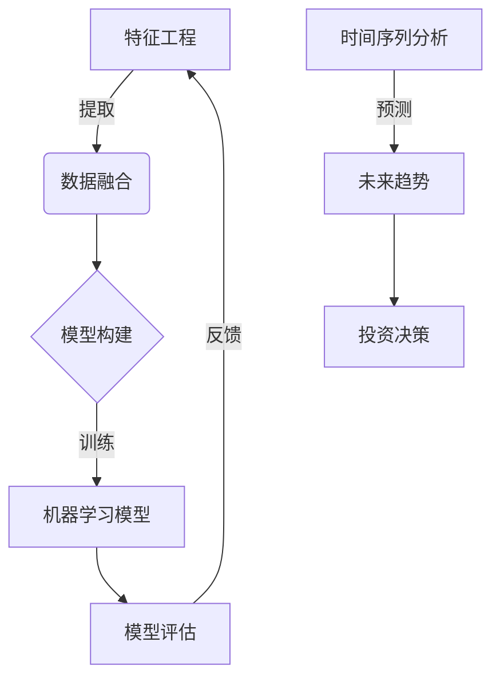

# 酒行业在股市中的大数据分析

## 1. 背景介绍

### 1.1 问题的由来

在当今快节奏的商业环境中，企业需要及时获取准确的市场信息和洞察力来保持竞争优势。酒类行业作为一个传统行业,其市场表现与整体经济状况、消费者偏好、季节性因素等诸多因素密切相关。因此,对酒类公司的股票表现进行深入分析和预测具有重要意义。

传统的分析方法通常依赖于人工收集和处理数据,效率低下且容易受到主观因素的影响。随着大数据技术的发展,我们可以利用海量的历史数据和先进的数据挖掘算法,从中发现隐藏的模式和趋势,为酒类公司的投资决策提供有价值的支持。

### 1.2 研究现状

大数据分析在金融领域的应用已经取得了一些进展。研究人员提出了各种基于机器学习的股票预测模型,如支持向量机、神经网络等。然而,这些模型大多针对于单一公司或整体市场,缺乏对特定行业的深入研究。

对于酒类行业,一些学者尝试利用消费者评论数据预测酒类销售额,但这种方法忽视了其他重要因素,如原材料价格、政策变化等。另一些研究则关注于特定品牌的营销策略对股价的影响,但缺乏整体行业视角。

### 1.3 研究意义

本文旨在构建一个综合的大数据分析框架,专门针对酒类行业上市公司的股票表现进行分析和预测。该框架将融合多源异构数据,包括历史股价数据、财务数据、新闻事件、社交媒体等,并应用先进的数据挖掘技术挖掘隐藏的模式和规律。

通过对酒类行业的深入研究,我们可以更好地理解影响该行业股价波动的关键因素,为投资者提供有价值的决策依据。同时,该研究也将促进大数据技术在特定行业的应用,为其他传统行业的数字化转型提供借鉴。

### 1.4 本文结构  

本文首先介绍酒类行业股票数据分析的背景和研究现状,阐明研究的意义和目标。接下来详细阐述该领域的核心概念,如特征工程、数据融合等。

然后重点讨论了几种核心算法的原理和具体实现步骤,包括协同滤波、主题模型等。数学模型部分将对常用的时间序列分析模型及其公式推导进行详细讲解。

在项目实践部分,我们将通过真实的代码示例展示如何搭建开发环境、数据预处理、模型训练和评估等全流程。

此外,文中还列举了该领域的热门应用场景,推荐了相关的学习资源和开发工具。最后,我们总结了研究成果,并对未来的发展趋势和挑战进行了展望。

## 2. 核心概念与联系

在酒类行业股票数据分析中,涉及了多个核心概念,它们相互关联,共同构建了完整的分析框架。

1. **特征工程**:从原始数据中提取有价值的特征是数据分析的基础。对于酒类公司股票数据,我们需要从股价历史数据、财务报表、新闻等多个渠道提取特征,如收益率、市盈率、情感倾向等。

2. **数据融合**:由于数据来源的多样性,我们需要将异构数据进行融合,构建统一的特征空间。常用的融合方法包括实体链接、知识图谱融合等。

3. **模型构建**:基于融合后的特征数据,我们可以构建各种机器学习模型,如协同滤波、主题模型等,用于发现隐藏的模式和规律。

4. **模型评估**:通过划分训练集和测试集,使用适当的评估指标(如均方根误差)来评估模型的性能,并根据评估结果对模型进行优化和改进。

5. **时间序列分析**:由于股票数据具有明显的时间序列特征,我们需要应用时间序列分析技术(如ARIMA模型)来捕捉数据的趋势和周期性,从而对未来走势进行预测。

6. **投资决策**:将模型的预测结果与其他定性分析相结合,为投资者提供酒类公司股票的买入/卖出建议,辅助投资决策。

上述各个概念环环相扣,相互依赖,共同构建了一个完整的大数据分析框架。通过有机结合这些概念和技术,我们能够更好地挖掘酒类行业股票数据中的隐藏信息,为投资者提供有价值的洞察。

## 3. 核心算法原理及具体操作步骤

在酒类行业股票数据分析中,有几种核心算法发挥着重要作用,包括协同滤波算法和主题模型算法。

### 3.1 算法原理概述

#### 3.1.1 协同滤波算法

协同滤波算法是一种常用的推荐系统算法,它通过分析用户之间的相似性或者项目之间的相似性,为用户推荐感兴趣的项目。在股票数据分析中,我们可以将投资者视为用户,股票视为项目,基于投资者之间的相似性为他们推荐潜在的投资标的。

常见的协同滤波算法包括基于用户的协同滤波和基于项目的协同滤波。前者是通过计算用户之间的相似度,为目标用户推荐与其相似的其他用户喜欢的项目;后者则是计算项目之间的相似度,为用户推荐与其历史喜好项目相似的新项目。

#### 3.1.2 主题模型算法

主题模型是一种无监督学习算法,它通过分析文本语料库,自动发现隐藏在文本背后的主题或模式。在股票数据分析中,我们可以将新闻报道、社交媒体等文本数据作为输入,利用主题模型算法发现影响股价波动的潜在主题。

常见的主题模型算法包括潜在狄利克雷分布(LDA)和层次狄利克雷过程(HDP)。LDA假设文档由固定数量的主题组成,而HDP则能自动学习主题的数量。这些算法通过概率模型捕捉词与主题、主题与文档之间的关系,从而实现主题发现。

### 3.2 算法步骤详解

#### 3.2.1 协同滤波算法步骤

以基于用户的协同滤波算法为例,其主要步骤如下:

1. **数据预处理**:构建用户-项目评分矩阵,处理缺失值。
2. **计算相似度**:选择合适的相似度度量方法(如皮尔逊相关系数、余弦相似度等),计算任意两个用户之间的相似度。
3. **构建邻居集**:对每个用户,选取与其最相似的 K 个用户作为邻居。
4. **预测评分**:对于目标用户没有评分的项目,基于其邻居对该项目的评分,结合邻居的相似度,通过加权平均等方法预测目标用户对该项目的评分。
5. **推荐排序**:根据预测评分从高到低对项目进行排序,将评分最高的项目推荐给目标用户。

#### 3.2.2 主题模型算法步骤  

以 LDA 算法为例,其主要步骤如下:

1. **语料库预处理**:对文本语料进行分词、去停用词等预处理。
2. **确定主题数量**:根据经验或启发式方法确定主题的数量 K。
3. **初始化模型参数**:随机初始化文档-主题和词-主题分布的先验参数。
4. **模型训练**:使用吉布斯采样或变分推理等方法,迭代更新文档-主题和词-主题分布的后验参数,直至收敛。
5. **主题解释**:根据每个主题中概率最高的词,为主题命名并解释其语义含义。
6. **文档主题分布**:计算每个文档在不同主题上的概率分布,用于分析文档的主题倾向。

### 3.3 算法优缺点

#### 3.3.1 协同滤波算法

**优点**:

- 简单有效,能够很好地捕捉用户或项目之间的相似性模式。
- 无需深入理解项目本身的内容,只需要评分数据即可工作。
- 可解释性较好,推荐结果基于相似用户或相似项目的偏好。

**缺点**:

- 对于新用户或新项目,由于缺乏历史数据,无法进行有效推荐(冷启动问题)。
- 只考虑用户或项目之间的相似性,忽略了其他重要的上下文信息。
- 对于数据矩阵较为稀疏的情况,推荐效果可能不佳。

#### 3.3.2 主题模型算法

**优点**:

- 能够自动发现文本中隐含的语义主题,无需人工标注。
- 可解释性较好,主题由概率分布最高的词语组成,易于理解。
- 适用于大规模的非结构化文本数据,如新闻报道、社交媒体等。

**缺点**:

- 需要预先设定主题数量,选择不当可能影响主题质量。
- 无法很好地处理词义多义性和同义词问题。
- 训练过程计算开销较大,对于海量语料可能需要分布式实现。

### 3.4 算法应用领域

协同滤波算法和主题模型算法在酒类行业股票数据分析中发挥着重要作用,但它们的应用领域远不止于此。

协同滤波算法广泛应用于推荐系统领域,如电影、音乐、电商等,为用户推荐感兴趣的项目。它还可以用于社交网络分析、链接预测等场景。

主题模型算法则常用于自然语言处理、文本挖掘等领域,如情感分析、文本聚类、文档自动摘要等。它还可以应用于生物信息学、计算机视觉等其他领域,用于发现隐含的模式和结构。

综上所述,这两种算法不仅在酒类行业股票数据分析中有重要应用,而且在更广泛的领域也发挥着关键作用,是数据挖掘和机器学习领域的核心算法之一。

## 4. 数学模型和公式及详细讲解与举例说明

在酒类行业股票数据分析中,时间序列分析模型是一种重要的数学模型,用于捕捉数据的趋势和周期性,对未来走势进行预测。

### 4.1 数学模型构建

时间序列分析的一个核心思想是,未来的值不仅取决于当前的值,还取决于过去的值。因此,我们需要构建一个数学模型来描述这种依赖关系。

常用的时间序列分析模型包括自回归移动平均模型(ARMA)、自回归综合移动平均模型(ARIMA)、季节自回归综合移动平均模型(SARIMA)等。

以 ARIMA 模型为例,它由三个部分组成:自回归(AR)部分、移动平均(MA)部分和差分(I)部分。其数学表达式如下:

$$
y_t = c + \phi_1 y_{t-1} + \phi_2 y_{t-2} + ... + \phi_p y_{t-p} + \theta_1 \epsilon_{t-1} + \theta_2 \epsilon_{t-2} + ... + \theta_q \epsilon_{t-q} + \epsilon_t
$$

其中:

- $y_t$ 表示时间 t 时刻的观测值
- $c$ 表示常数项
- $\phi_1, \phi_2, ..., \phi_p$ 表示自回归系数
- $\theta_1, \theta_2, ..., \theta_q$ 表示移动平均系数
- $\epsilon_t$ 表示时间 t 时刻的残差项,服从均值为 0 的白噪声过程

该模型通过自回归部分捕捉数据的自相