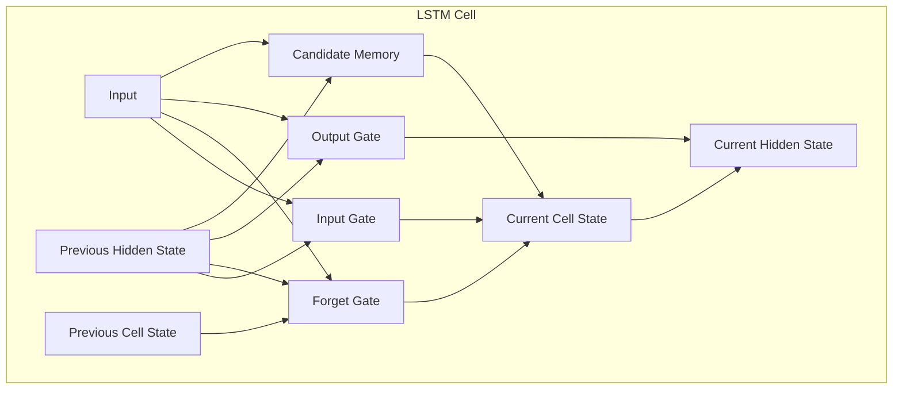

# 长短时记忆网络LSTM原理与代码实例讲解

关键词：长短时记忆网络、LSTM、循环神经网络、RNN、门控机制、梯度消失与爆炸

## 1. 背景介绍

### 1.1 问题的由来
在自然语言处理、语音识别、时间序列预测等领域,我们经常需要处理序列数据。传统的前馈神经网络难以有效地捕捉序列数据中的长距离依赖关系。为了解决这一问题,研究者们提出了循环神经网络(Recurrent Neural Network, RNN)。然而,标准RNN在处理长序列时,会遇到梯度消失或梯度爆炸的问题,导致难以学习到长期依赖关系。

### 1.2 研究现状
1997年,Hochreiter和Schmidhuber提出了长短时记忆网络(Long Short-Term Memory, LSTM)[1],通过引入门控机制,有效地缓解了RNN面临的长期依赖问题。此后,LSTM及其变体被广泛应用于各种序列建模任务中,取得了显著的性能提升。近年来,随着注意力机制和Transformer模型的兴起,一些研究者开始探索将LSTM与注意力机制相结合,以进一步提升模型性能[2]。

### 1.3 研究意义
深入理解LSTM的原理和实现,对于我们设计和应用更加高效的序列建模算法具有重要意义。通过剖析LSTM内部的门控运作机制,我们可以洞察其捕捉长短期依赖的奥秘。同时,LSTM也为我们进一步改进循环神经网络提供了宝贵的思路。

### 1.4 本文结构
本文将首先介绍LSTM的核心概念与基本结构,然后详细讲解其内部的计算原理和前向传播过程。在此基础上,我们将推导LSTM的反向传播公式,并总结其优缺点。接着,通过一个具体的代码实例,展示如何使用PyTorch实现LSTM模型。最后,我们总结LSTM的研究现状,并展望其未来的发展方向与挑战。

## 2. 核心概念与联系

在标准RNN中,隐藏状态在每个时间步都会被完全更新,导致难以捕捉长期依赖。而LSTM引入了细胞状态(Cell State)的概念,允许信息在多个时间步中传递,从而实现了长短期记忆能力。

LSTM的核心是由三个门控单元组成的:输入门(Input Gate)、遗忘门(Forget Gate)和输出门(Output Gate)。这三个门控单元共同决定了细胞状态的更新方式:

- 输入门控制新的信息流入细胞状态的程度
- 遗忘门控制细胞状态遗忘过去信息的程度  
- 输出门控制细胞状态输出到隐藏状态的程度

通过门控机制的协同工作,LSTM能够自适应地决定保留和遗忘哪些信息,从而有效地缓解了梯度消失和梯度爆炸问题。

下图展示了LSTM单元的基本结构:



## 3. 核心算法原理 & 具体操作步骤

### 3.1 算法原理概述
LSTM的前向传播过程可以分为以下几个步骤:
1. 计算输入门、遗忘门和输出门的激活值
2. 计算候选记忆单元的激活值
3. 更新细胞状态
4. 计算隐藏状态

### 3.2 算法步骤详解
我们使用以下符号:
- $x_t$:当前时间步的输入向量
- $h_{t-1}$:上一时间步的隐藏状态
- $c_{t-1}$:上一时间步的细胞状态
- $i_t$:输入门的激活值
- $f_t$:遗忘门的激活值  
- $o_t$:输出门的激活值
- $\tilde{c}_t$:候选记忆单元的激活值
- $c_t$:当前时间步的细胞状态
- $h_t$:当前时间步的隐藏状态
- $W_i,W_f,W_o,W_c$:对应门控单元和候选记忆单元的权重矩阵
- $b_i,b_f,b_o,b_c$:对应门控单元和候选记忆单元的偏置项
- $\sigma$:sigmoid激活函数
- $\tanh$:双曲正切激活函数
- $\odot$:Hadamard乘积(逐元素相乘)

具体计算步骤如下:

$$
\begin{aligned}
i_t &= \sigma(W_i \cdot [h_{t-1}, x_t] + b_i) \\
f_t &= \sigma(W_f \cdot [h_{t-1}, x_t] + b_f) \\ 
o_t &= \sigma(W_o \cdot [h_{t-1}, x_t] + b_o) \\
\tilde{c}_t &= \tanh(W_c \cdot [h_{t-1}, x_t] + b_c) \\
c_t &= f_t \odot c_{t-1} + i_t \odot \tilde{c}_t \\
h_t &= o_t \odot \tanh(c_t)
\end{aligned}
$$

### 3.3 算法优缺点
优点:
- 有效缓解了梯度消失和梯度爆炸问题,能够学习长期依赖
- 门控机制使得模型能够自适应地决定记忆和遗忘的内容
- 广泛适用于各种序列建模任务

缺点:  
- 计算复杂度较高,训练时间较长
- 相比Transformer等新模型,并行能力有限
- 仍然难以捕捉极长序列中的超长期依赖

### 3.4 算法应用领域
- 自然语言处理:语言模型、机器翻译、命名实体识别等
- 语音识别:声学模型、语言模型等  
- 时间序列预测:股票价格预测、销量预测等
- 图像描述生成
- 视频动作识别

## 4. 数学模型和公式 & 详细讲解 & 举例说明

### 4.1 数学模型构建
LSTM的数学模型可以看作是一个动态系统,其状态由细胞状态 $c_t$ 和隐藏状态 $h_t$ 组成。系统在每个时间步接收输入 $x_t$,并根据当前状态和输入计算下一个状态。门控单元充当了调节信息流的"阀门"。

### 4.2 公式推导过程
以输入门 $i_t$ 的计算为例,我们将当前输入 $x_t$ 与前一时间步的隐藏状态 $h_{t-1}$ 拼接,然后与权重矩阵 $W_i$ 相乘,加上偏置项 $b_i$,最后通过sigmoid函数得到输入门的激活值:

$$
i_t = \sigma(W_i \cdot [h_{t-1}, x_t] + b_i)
$$

sigmoid函数将输入映射到(0, 1)区间,起到了"门"的作用。当 $i_t$ 接近0时,输入门关闭;当 $i_t$ 接近1时,输入门打开。

类似地,我们可以推导出遗忘门 $f_t$、输出门 $o_t$ 和候选记忆单元 $\tilde{c}_t$ 的计算公式。

最后,细胞状态 $c_t$ 通过遗忘门 $f_t$ 控制上一时间步的细胞状态 $c_{t-1}$ 的保留程度,并通过输入门 $i_t$ 控制新的候选记忆 $\tilde{c}_t$ 的加入程度:

$$
c_t = f_t \odot c_{t-1} + i_t \odot \tilde{c}_t
$$

隐藏状态 $h_t$ 则由输出门 $o_t$ 控制细胞状态 $c_t$ 的输出程度:

$$
h_t = o_t \odot \tanh(c_t)
$$

### 4.3 案例分析与讲解
考虑一个情感分析的任务,我们要判断一段文本的情感倾向是正面还是负面。输入是单词组成的序列,输出是二分类的结果。

假设输入序列为:"The movie is fantastic! I really enjoyed it."

LSTM在处理这个序列时,会逐个单词地更新其状态:

1. 读入"The",更新隐藏状态和细胞状态
2. 读入"movie",根据前面的上下文信息,更新状态
3. 读入"is",继续更新状态,细胞状态中可能已经有了一些关于主题(电影)的信息
4. 读入"fantastic",输入门可能会打开,让这个表示正面情感的词对细胞状态产生影响  
5. 读入"I","really","enjoyed","it",细胞状态中的正面情感会被进一步强化

最终,细胞状态捕捉到了整个序列的情感倾向,隐藏状态输出的特征可以用于情感的分类。

### 4.4 常见问题解答
Q:LSTM能否处理非常长的序列,比如上百万个时间步?
A:虽然理论上LSTM能够处理任意长度的序列,但在实际应用中,受限于计算资源和训练时间,处理超长序列仍然是一个挑战。针对这种情况,我们可以考虑使用分层LSTM、注意力机制等技术,或者将序列切分为多个子序列分别处理。

Q:LSTM能否并行化训练和推理?  
A:标准的LSTM是顺序处理序列的,并行能力有限。但是通过一些改进,如将循环计算展开为前馈计算,或者使用批量矩阵乘法,可以在一定程度上实现LSTM的并行化。此外,ConvLSTM等变体通过将循环连接替换为卷积,也可以提高并行效率。

## 5. 项目实践:代码实例和详细解释说明

### 5.1 开发环境搭建
本项目使用PyTorch实现LSTM模型。首先,确保已经安装了PyTorch、NumPy等必要的库:

```bash
pip install torch numpy  
```

### 5.2 源代码详细实现
下面是一个简单的LSTM模型的PyTorch实现:

```python
import torch
import torch.nn as nn

class LSTMModel(nn.Module):
    def __init__(self, input_size, hidden_size, num_layers, output_size):
        super(LSTMModel, self).__init__()
        self.hidden_size = hidden_size
        self.num_layers = num_layers
        self.lstm = nn.LSTM(input_size, hidden_size, num_layers, batch_first=True)
        self.fc = nn.Linear(hidden_size, output_size)

    def forward(self, x):
        h0 = torch.zeros(self.num_layers, x.size(0), self.hidden_size).to(x.device)
        c0 = torch.zeros(self.num_layers, x.size(0), self.hidden_size).to(x.device)
        
        out, _ = self.lstm(x, (h0, c0))
        out = self.fc(out[:, -1, :])
        return out
```

### 5.3 代码解读与分析
- 模型继承了`nn.Module`,是一个标准的PyTorch模型类
- `__init__`方法定义了模型的结构,包括LSTM层和全连接层。`input_size`是输入特征的维度,`hidden_size`是隐藏状态的维度,`num_layers`是LSTM的层数,`output_size`是输出的维度
- `forward`方法定义了前向传播的过程。首先初始化隐藏状态和细胞状态,然后将输入数据传入LSTM层,最后用全连接层将最后一个时间步的隐藏状态映射到输出  
- `batch_first=True`表示输入数据的形状是(batch_size, seq_length, input_size)
- 初始化隐藏状态和细胞状态时,要将其移动到与输入数据相同的设备上(CPU或GPU)

### 5.4 运行结果展示
假设我们要训练一个二分类模型,可以这样使用上面定义的LSTM模型:

```python
input_size = 10
hidden_size = 20  
num_layers = 2
output_size = 2
batch_size