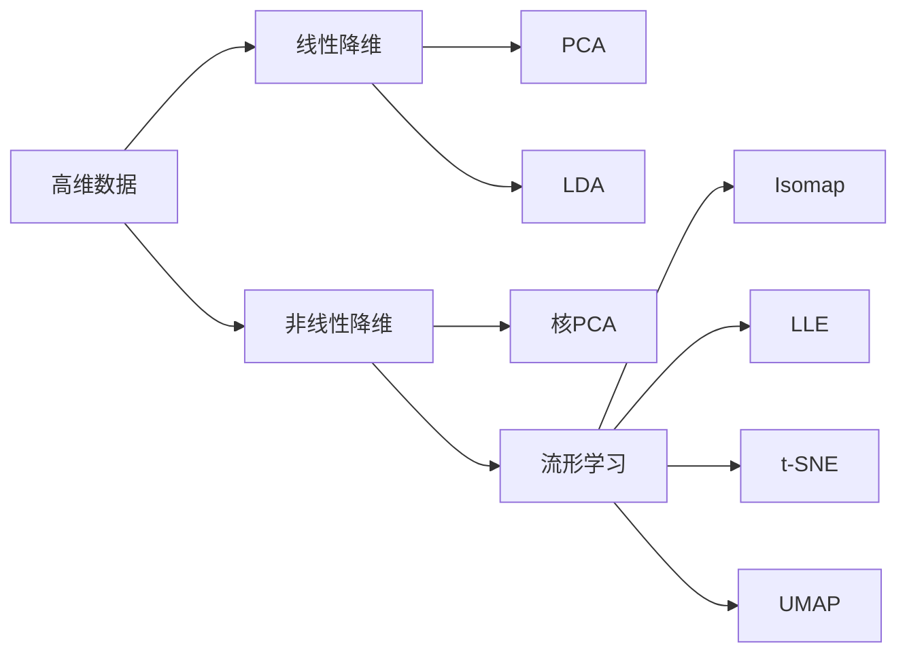

# 降维 (Dimensionality Reduction) 原理与代码实例讲解

关键词：降维, PCA, LDA, t-SNE, UMAP, 流形学习, 特征选择, 自编码器 

## 1. 背景介绍
### 1.1  问题的由来
在现实世界中,我们经常会遇到高维数据,如图像、文本、基因表达数据等。高维数据不仅给存储和计算带来巨大挑战,还会引入"维度诅咒"问题,即随着维度增加,数据变得越来越稀疏,传统的机器学习算法性能会急剧下降。因此,如何有效地降低数据维度,成为机器学习和数据挖掘领域的一个重要课题。

### 1.2  研究现状
降维方法主要可分为线性降维和非线性降维两大类。经典的线性降维方法包括主成分分析(PCA)和线性判别分析(LDA),它们通过线性投影将高维数据映射到低维空间。针对线性降维难以处理复杂数据流形的局限性,非线性降维方法如核PCA、流形学习等被提出。近年来,t-SNE和UMAP等基于流形学习的降维算法在可视化高维数据方面表现突出,受到广泛关注。

### 1.3  研究意义
降维不仅是机器学习的重要预处理步骤,也是数据可视化的有力工具。通过降维,我们能够减少数据噪声,去除数据冗余,提取数据的本质特征。这不仅能提高后续学习任务的性能,还能揭示数据内在的结构和规律。因此,深入理解和掌握降维技术,对于数据挖掘工作者来说至关重要。

### 1.4  本文结构
本文将系统介绍几种主流的降维算法,包括它们的基本原理、数学模型、代码实现和应用实例。第2部分介绍降维的基本概念和分类;第3部分重点讲解PCA、LDA、t-SNE等降维算法的原理和实现步骤;第4部分给出这些算法的数学模型和公式推导;第5部分通过Python代码实战演示降维算法的使用方法;第6部分讨论降维在图像压缩、可视化等领域的应用;第7部分推荐降维相关的学习资源、开发工具和文献;第8部分总结全文,并展望降维技术的发展趋势和挑战。

## 2. 核心概念与联系
降维的核心思想是在保留数据固有结构的前提下,将高维数据映射到低维空间。根据映射方式的不同,降维方法可分为线性降维和非线性降维:
- 线性降维假设数据分布在低维线性子空间,通过线性变换(如矩阵乘法)实现降维。代表算法有PCA和LDA。
- 非线性降维通过非线性映射来处理复杂数据流形,能够揭示数据的内在结构。代表算法有核PCA、Isomap、LLE、t-SNE、UMAP等。

此外,降维与特征选择、稀疏表示等概念紧密相关。特征选择通过选取信息量大的特征子集来实现降维;稀疏表示通过学习稀疏系数来表征数据。降维、特征选择和字典学习常常结合使用,以达到更好的降维效果。



## 3. 核心算法原理 & 具体操作步骤
### 3.1  算法原理概述
#### PCA原理
PCA通过线性变换将数据投影到方差最大的几个正交方向上,从而实现降维。其核心是通过特征值分解求解数据的主成分。具体步骤如下:
1. 对原始数据进行中心化
2. 计算数据的协方差矩阵
3. 对协方差矩阵进行特征值分解
4. 取最大的k个特征值对应的特征向量,构成降维矩阵
5. 用降维矩阵左乘中心化后的数据,得到降维后的k维数据

#### LDA原理
LDA通过最大化类间散度和最小化类内散度,寻找最优的投影方向以实现降维。其目标是在投影后的低维空间中,使得同类样本尽可能聚集,异类样本尽可能分离。LDA的求解过程如下:
1. 计算类内散度矩阵和类间散度矩阵
2. 构造优化目标,即最大化类间散度与类内散度的广义瑞利商
3. 通过广义特征值问题求解最优投影矩阵
4. 用投影矩阵左乘原始数据,得到降维后的数据

#### t-SNE原理
t-SNE通过非线性变换,将高维数据映射为低维空间中的点,同时保持数据点之间的相似性。其基本思想是最小化高维和低维数据的条件概率分布之间的KL散度。t-SNE分为两个阶段:
1. 构建高维空间的概率分布。对每个数据点,计算其与其他点的成对条件概率,用高斯核衡量相似性。
2. 构建低维空间的概率分布。对每个映射后的低维点,计算其与其他点的成对条件概率,用t分布度量相似性。
3. 最小化两个概率分布的KL散度,用梯度下降优化低维点的坐标。

### 3.2  算法步骤详解
以下以PCA为例,详细讲解其算法步骤。假设原始数据矩阵为$X=(x_1,\cdots,x_n)\in \mathbb{R}^{d\times n}$,其中$d$为数据维度,$n$为样本数。目标是将$d$维数据降到$k$维。

**Step 1: 数据中心化**
$$\bar{X} = X - \frac{1}{n}\sum_{i=1}^n x_i$$
即将每个数据点减去数据均值。

**Step 2: 计算协方差矩阵**
$$C = \frac{1}{n}\bar{X}\bar{X}^T$$

**Step 3: 特征值分解**
对协方差矩阵$C$进行特征值分解:
$$C = U\Lambda U^T$$
其中$\Lambda=\text{diag}(\lambda_1,\cdots,\lambda_d)$为特征值构成的对角阵,$\lambda_1\geq\cdots\geq\lambda_d$,$ U=(u_1,\cdots,u_d)$为特征向量构成的正交矩阵。

**Step 4: 构造降维矩阵**  
取最大的$k$个特征值对应的特征向量,构成降维矩阵:
$$W=(u_1,\cdots,u_k)\in \mathbb{R}^{d\times k}$$

**Step 5: 降维映射**
将中心化后的数据映射到$k$维空间:
$$Z = W^T\bar{X} \in \mathbb{R}^{k\times n}$$

至此,PCA降维完成。LDA和t-SNE的详细步骤限于篇幅不再赘述,可参考相关文献。

### 3.3  算法优缺点
- PCA的优点是计算简单,易于实现;缺点是难以发现非线性结构,且降维性能受数据预处理影响较大。  
- LDA的优点是能够利用类别信息指导降维过程;缺点是当类别数大于数据维度时,易出现奇异问题。
- t-SNE的优点是能够揭示数据的内在结构,可视化效果好;缺点是计算复杂度高,且保真性较差。

### 3.4  算法应用领域  
- PCA广泛用于数据压缩、噪声去除和特征提取,如人脸识别、基因分析等。
- LDA主要用于监督降维场景,在模式识别、机器学习等领域有重要应用。
- t-SNE常用于高维数据可视化,如文本聚类、单细胞RNA测序数据分析等。

## 4. 数学模型和公式 & 详细讲解 & 举例说明
### 4.1  数学模型构建
以PCA为例,其优化目标可形式化表示为:
$$\max_{W} \text{tr}(W^T\bar{X}\bar{X}^TW) \quad \text{s.t.} \quad W^TW=I_k$$
即最大化降维后数据的方差,同时要求降维矩阵$W$为正交矩阵。

LDA的数学模型为:
$$\max_{W} \frac{\text{tr}(W^TS_bW)}{\text{tr}(W^TS_wW)}$$
其中$S_b$和$S_w$分别为类间散度矩阵和类内散度矩阵。该模型即最大化类间散度和类内散度的广义瑞利商。

t-SNE的数学模型为:
$$\min_{y_1,\cdots,y_n} \sum_{i\neq j} p_{ij}\log \frac{p_{ij}}{q_{ij}}$$
其中$p_{ij}$为高维空间的成对条件概率,$q_{ij}$为低维空间的成对条件概率。该模型即最小化两个概率分布的KL散度。

### 4.2  公式推导过程
以PCA的公式推导为例。由于优化目标的约束条件为$W^TW=I_k$,因此可构造拉格朗日函数:
$$L(W,\Lambda) = \text{tr}(W^T\bar{X}\bar{X}^TW) - \text{tr}(\Lambda(W^TW-I_k))$$
对$W$求导并令导数为0:
$$\frac{\partial L}{\partial W} = 2\bar{X}\bar{X}^TW - 2W\Lambda = 0$$
整理得:
$$\bar{X}\bar{X}^TW = W\Lambda$$
可见,$W$的列向量即为协方差矩阵$\bar{X}\bar{X}^T$的特征向量,$\Lambda$为对应的特征值构成的对角阵。取最大的$k$个特征值对应的特征向量,即得到降维矩阵$W$。

LDA和t-SNE的公式推导相对复杂,需用到拉格朗日对偶、梯度下降等优化方法,在此不再详述。

### 4.3  案例分析与讲解
下面以MNIST手写数字数据集为例,直观展示PCA降维的效果。首先加载数据并进行中心化:

```python
from sklearn.datasets import fetch_openml
from sklearn.decomposition import PCA
from sklearn.preprocessing import StandardScaler

X, y = fetch_openml('mnist_784', version=1, return_X_y=True)
X = X / 255.0  # 归一化
X_scaled = StandardScaler().fit_transform(X)
```

然后进行PCA降维,并可视化前两个主成分:

```python
pca = PCA(n_components=2)
X_pca = pca.fit_transform(X_scaled)

plt.figure(figsize=(8, 8))
plt.scatter(X_pca[:, 0], X_pca[:, 1], c=y, cmap='tab10')
plt.xlabel('PC1')
plt.ylabel('PC2')
plt.colorbar()
plt.show()
```

可以看到,PCA降维后,不同类别的手写数字在低维空间中呈现出一定的分离性,但重叠现象严重。这表明线性降维难以完全揭示该数据的内在结构。

接下来尝试用t-SNE进行降维:

```python
from sklearn.manifold import TSNE

X_tsne = TSNE(n_components=2, perplexity=30).fit_transform(X_scaled)

plt.figure(figsize=(8, 8))
plt.scatter(X_tsne[:, 0], X_tsne[:, 1], c=y, cmap='tab10')
plt.colorbar()
plt.show()
```

可以看到,t-SNE降维的可视化效果明显优于PCA,不同类别的数字在低维空间中得到了很好的分离。这体现了t-SNE捕捉数据流形结构的强大能力。

### 4.4  常见问题解答
**Q:** 降维可能带来哪些信息损失?如何权衡降维率和信息损失? 
**A:** 降维通常会损失一部分原始数据的信息,尤其是舍弃次要成分时。PCA的信息损失可通过重构误差来衡量,即用降维后的数据重构原始数据,计算原始数据与重构数据的均方误差。LDA和t-SNE的信息损失可通过降维前后的分类性能来评估。一般来说,降维率越高,信息损失越大。需要根据具体任务在降维率和信息保存率间进行权衡。

**