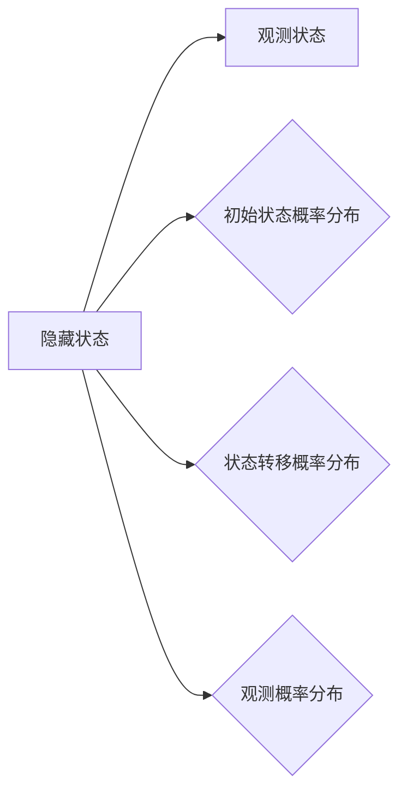

# 隐马尔可夫模型(HMM)原理与代码实战案例讲解

关键词：隐马尔可夫模型, HMM, 概率图模型, 动态贝叶斯网络, 序列标注, 机器学习, 自然语言处理, 语音识别, 生物信息学

## 1. 背景介绍

### 1.1  问题的由来

在许多领域中,我们经常需要处理序列数据,如自然语言处理中的词性标注、命名实体识别,语音识别中的声学建模,生物信息学中的基因序列分析等。这些问题都涉及到对序列中的每个元素进行分类或标注。隐马尔可夫模型(Hidden Markov Model, HMM)作为一种重要的统计学习模型,在解决这些序列标注问题上有着广泛而成功的应用。

### 1.2  研究现状

自20世纪60年代以来,隐马尔可夫模型在语音识别领域得到了深入研究和广泛应用。1980年,Rabiner发表了著名的HMM教程,系统阐述了HMM的基本原理和三个基本问题的解决算法,为后来HMM的发展奠定了基础。此后,HMM被引入到自然语言处理、生物信息学等领域,并取得了显著成果。近年来,随着深度学习的兴起,一些神经网络模型如RNN、LSTM等在序列标注任务上展现出了强大的性能,但HMM凭借其简单高效、可解释性强的优点,仍然具有重要的理论和实用价值。

### 1.3  研究意义

深入理解隐马尔可夫模型的原理,掌握其建模、学习与预测等关键技术,对于从事机器学习、自然语言处理、语音识别、生物信息学等领域的研究者和practitioner具有重要意义。通过本文的学习,读者可以系统地了解HMM的数学原理与应用,并能够运用HMM解决实际的序列标注问题,为进一步学习其他序列模型打下良好基础。

### 1.4  本文结构

本文将全面系统地讲解隐马尔可夫模型的原理与应用。第2部分介绍HMM的核心概念与联系；第3部分讲解HMM的三个基本问题及其解决算法；第4部分给出HMM的数学定义及重要公式,并举例说明；第5部分通过一个实际的词性标注任务,演示HMM的代码实现；第6部分讨论HMM的一些经典应用场景；第7部分推荐HMM相关的学习资源；第8部分总结全文,讨论HMM的未来发展趋势与挑战；第9部分附录了一些常见问题与解答。

## 2. 核心概念与联系

隐马尔可夫模型是一种重要的概率图模型和动态贝叶斯网络。它用于描述一个隐藏的马尔可夫过程,其中模型的状态是隐藏的,不可直接观测,但可以通过另一组可观测的状态序列来推测。HMM主要由以下五个部分组成:

- 状态集合 $Q$: 所有可能的隐藏状态的集合。
- 观测集合 $V$: 所有可能的观测状态的集合。
- 初始状态概率分布 $\pi$: 隐藏状态的初始概率分布。
- 状态转移概率分布 $A$: 描述隐藏状态之间转换的概率。
- 观测概率分布 $B$: 描述每个隐藏状态到观测状态的发射概率。

下图展示了隐马尔可夫模型的图模型结构和主要组成部分之间的关系:

隐马尔可夫模型的三个基本问题是:

1. 概率计算问题(Probability Evaluation): 给定模型参数和观测序列,计算观测序列出现的概率。
2. 学习问题(Parameter Learning): 给定观测序列,估计模型参数,使得该观测序列出现的概率最大。
3. 预测问题(Decoding): 给定模型参数和观测序列,找到最有可能产生该观测序列的隐藏状态序列。

理解隐马尔可夫模型的核心概念与基本问题,是掌握HMM原理与应用的基础。

## 3. 核心算法原理 & 具体操作步骤

### 3.1  算法原理概述

针对隐马尔可夫模型的三个基本问题,有三大经典算法:

1. 前向-后向算法(Forward-Backward Algorithm): 用于概率计算问题,通过前向概率和后向概率的递推计算观测序列概率。
2. Baum-Welch算法: 用于学习问题,通过EM算法迭代估计模型参数。
3. 维特比算法(Viterbi Algorithm): 用于预测问题,采用动态规划解码最优隐藏状态序列。

### 3.2  算法步骤详解

#### 3.2.1 前向-后向算法

- 输入:隐马尔可夫模型 $\lambda=(A,B,\pi)$ 和观测序列 $O=(o_1,o_2,\dots,o_T)$。
- 输出:观测序列 $O$ 的概率 $P(O|\lambda)$。

算法步骤:

1. 初始化前向概率 $\alpha_1(i)=\pi_i b_i(o_1), i=1,2,\dots,N$。
2. 递推计算前向概率 $\alpha_{t+1}(j)=\left[\sum_{i=1}^N \alpha_t(i) a_{ij}\right] b_j(o_{t+1}), j=1,2,\dots,N; t=1,2,\dots,T-1$。
3. 终止,计算观测序列概率 $P(O|\lambda)=\sum_{i=1}^N \alpha_T(i)$。

后向概率 $\beta$ 的计算与前向概率类似,只是从后往前递推。

#### 3.2.2 Baum-Welch算法

- 输入:观测序列 $O=(o_1,o_2,\dots,o_T)$。
- 输出:隐马尔可夫模型参数 $\lambda=(A,B,\pi)$。

算法步骤:

1. 初始化模型参数 $\lambda=(A,B,\pi)$。
2. 计算前向概率 $\alpha$ 和后向概率 $\beta$。
3. 计算$\gamma_t(i)$和$\xi_t(i,j)$:
$$
\gamma_t(i)=\frac{\alpha_t(i)\beta_t(i)}{\sum_{j=1}^N \alpha_t(j)\beta_t(j)}, \quad  
\xi_t(i,j)=\frac{\alpha_t(i)a_{ij}b_j(o_{t+1})\beta_{t+1}(j)}{\sum_{i=1}^N\sum_{j=1}^N \alpha_t(i)a_{ij}b_j(o_{t+1})\beta_{t+1}(j)}
$$
4. 更新模型参数:
$$
\overline{\pi}_i=\gamma_1(i), \quad
\overline{a}_{ij}=\frac{\sum_{t=1}^{T-1}\xi_t(i,j)}{\sum_{t=1}^{T-1}\gamma_t(i)}, \quad
\overline{b}_j(k)=\frac{\sum_{t=1,o_t=v_k}^T \gamma_t(j)}{\sum_{t=1}^T \gamma_t(j)}
$$
5. 重复步骤2-4,直到参数收敛。

#### 3.2.3 维特比算法

- 输入:隐马尔可夫模型 $\lambda=(A,B,\pi)$ 和观测序列 $O=(o_1,o_2,\dots,o_T)$。
- 输出:最优隐藏状态序列 $I^*=(i_1^*,i_2^*,\dots,i_T^*)$。

算法步骤:

1. 初始化:
$$
\delta_1(i)=\pi_i b_i(o_1), \quad
\psi_1(i)=0, \quad i=1,2,\dots,N
$$
2. 递推:对$t=2,3,\dots,T$:
$$
\delta_t(j)=\max_{1\leq i\leq N} [\delta_{t-1}(i)a_{ij}]b_j(o_t), \quad
\psi_t(j)=\arg\max_{1\leq i\leq N} [\delta_{t-1}(i)a_{ij}], \quad j=1,2,\dots,N
$$
3. 终止:
$$
P^*=\max_{1\leq i\leq N} \delta_T(i), \quad
i_T^*=\arg\max_{1\leq i\leq N} \delta_T(i)
$$
4. 最优路径回溯:对$t=T-1,T-2,\dots,1$:
$$
i_t^*=\psi_{t+1}(i_{t+1}^*)
$$

最终得到最优隐藏状态序列 $I^*=(i_1^*,i_2^*,\dots,i_T^*)$。

### 3.3  算法优缺点

前向-后向算法和Baum-Welch算法的时间复杂度都是$O(N^2T)$,其中$N$是隐藏状态数,$T$是观测序列长度。维特比算法的时间复杂度是$O(N^2T)$,空间复杂度是$O(NT)$。这三个算法的优点是思路清晰,可解释性强,易于实现。但在隐藏状态数较多或观测序列较长时,计算开销会比较大。此外,Baum-Welch算法可能收敛到局部最优解。

### 3.4  算法应用领域

隐马尔可夫模型及其相关算法在以下领域有广泛应用:

- 自然语言处理:词性标注、命名实体识别、中文分词等。
- 语音识别:声学模型建模。
- 生物信息学:基因序列分析、蛋白质结构预测等。
- 模式识别:手写识别、行为识别等。
- 时间序列分析:异常检测、趋势预测等。

## 4. 数学模型和公式 & 详细讲解 & 举例说明

### 4.1  数学模型构建

隐马尔可夫模型可以用一个五元组 $\lambda=(Q,V,A,B,\pi)$ 来表示,其中:

- $Q=\{q_1,q_2,\dots,q_N\}$ 是所有可能的 $N$ 个隐藏状态的集合。
- $V=\{v_1,v_2,\dots,v_M\}$ 是所有可能的 $M$ 个观测状态的集合。
- $A=\{a_{ij}\}_{N\times N}$ 是状态转移概率矩阵,其中 $a_{ij}=P(i_t=q_j|i_{t-1}=q_i)$ 表示在时刻 $t-1$ 处于状态 $q_i$ 的条件下在时刻 $t$ 转移到状态 $q_j$ 的概率。
- $B=\{b_j(k)\}_{N\times M}$ 是观测概率矩阵,其中 $b_j(k)=P(o_t=v_k|i_t=q_j)$ 表示在时刻 $t$ 处于状态 $q_j$ 的条件下生成观测 $v_k$ 的概率。
- $\pi=\{\pi_i\}$ 是初始状态概率向量,其中 $\pi_i=P(i_1=q_i)$ 表示在时刻 $t=1$ 处于状态 $q_i$ 的概率。

隐马尔可夫模型做了两个基本假设:

1. 齐次马尔可夫性假设,即隐藏状态的转移只依赖于前一时刻的状态,与其他时刻无关:
$$
P(i_t|i_{t-1},o_{t-1},\dots,i_1,o_1) = P(i_t|i_{t-1})
$$
2. 观测独立性假设,即观测只依赖于当前时刻的隐藏状态,与其他状态和观测无关:
$$
P(o_t|i_T,o_T,i_{T-1},o_{T-1},\dots,i_t,\dots,i_1,o_1)=P(o_t|i_t)
$$

### 4.2  公式推导过程

下面以前向算法为例,推导一下其关键公式。定义前向概率 $\alpha_t(i)$ 为:
$$
\alpha_t(i)=P(o_1,o_2,\dots,o_t,i_t=q_i|\lambda)
$$
即在给定模型 $\lambda