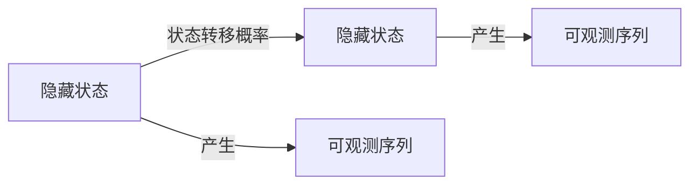

# 隐马尔可夫模型(Hidden Markov Models) - 原理与代码实例讲解

## 1. 背景介绍

### 1.1 问题的由来

在现实世界中,我们经常会遇到一些看似随机的过程,但这些过程实际上是由一些隐藏的因素所驱动的。例如,天气的变化、股票市场的波动、语音识别等,这些过程都存在着一些不可观测的隐藏状态,而我们只能观察到这些状态产生的可观测输出序列。隐马尔可夫模型(Hidden Markov Model,HMM)就是一种用于描述这种含有隐藏未知状态的随机过程的统计模型。

### 1.2 研究现状

隐马尔可夫模型最早由苏联数学家安德列·马尔可夫于1913年提出,最初被应用于研究文字中字母出现的概率问题。20世纪60年代,隐马尔可夫模型被引入语音识别领域,用于建模语音信号中的隐藏状态。随后,该模型在生物信息学、自然语言处理、金融分析等多个领域得到了广泛应用。

### 1.3 研究意义

隐马尔可夫模型能够有效地对包含隐藏状态的随机过程进行建模,并根据可观测序列推断出隐藏状态的概率分布。这使得它在语音识别、手写识别、基因序列分析、机器人控制等领域有着广泛的应用前景。同时,隐马尔可夫模型也为其他机器学习算法提供了理论基础,如隐马尔可夫随机场(Hidden Markov Random Field)等。

### 1.4 本文结构

本文将从以下几个方面对隐马尔可夫模型进行全面介绍:

1. 核心概念与联系
2. 核心算法原理及具体操作步骤
3. 数学模型和公式详细讲解及案例分析
4. 项目实践:代码实例和详细解释说明
5. 实际应用场景
6. 工具和资源推荐
7. 总结:未来发展趋势与挑战
8. 附录:常见问题与解答

## 2. 核心概念与联系

隐马尔可夫模型由以下三个基本概念组成:

1. **隐藏状态(Hidden States)**: 指系统的内部状态,是不可观测的。例如,在语音识别中,隐藏状态可以表示发音时口腔的位置。

2. **可观测序列(Observation Sequence)**: 指由隐藏状态产生的一系列可观测输出。例如,在语音识别中,可观测序列就是语音信号。

3. **状态转移概率(State Transition Probabilities)**: 描述了系统从一个隐藏状态转移到另一个隐藏状态的概率。

隐马尔可夫模型的核心思想是利用可观测序列来推断出隐藏状态的概率分布,从而对包含隐藏状态的随机过程进行建模。这种模型广泛应用于语音识别、手写识别、基因序列分析等领域。

上图展示了隐马尔可夫模型的基本结构,其中隐藏状态之间通过状态转移概率进行转移,每个隐藏状态会产生对应的可观测序列。我们的目标是根据可观测序列推断出隐藏状态的概率分布。

## 3. 核心算法原理 & 具体操作步骤

### 3.1 算法原理概述

隐马尔可夫模型的核心算法包括三个部分:

1. **前向算法(Forward Algorithm)**: 计算观测序列的概率,即给定模型参数,计算观测序列的似然概率。

2. **维特比算法(Viterbi Algorithm)**: 寻找最可能的隐藏状态序列,即给定观测序列和模型参数,找到最有可能产生该观测序列的隐藏状态序列。

3. **后向算法(Backward Algorithm)**: 与前向算法类似,但是从观测序列的末尾开始计算。结合前向算法,可以用于学习隐马尔可夫模型的参数。

这三个算法共同构成了隐马尔可夫模型的核心,可以解决以下三个基本问题:

1. 评估问题: 给定模型和观测序列,计算观测序列的概率。
2. 学习问题: 给定观测序列,估计模型参数。
3. 解码问题: 给定模型和观测序列,找到最可能的隐藏状态序列。

### 3.2 算法步骤详解

#### 3.2.1 前向算法

前向算法用于计算观测序列的概率,即给定模型参数,计算观测序列的似然概率。算法步骤如下:

1. 初始化前向概率矩阵 $\alpha$,其中 $\alpha_1(i) = \pi_i b_i(o_1)$,表示在时刻 1 处于状态 $i$ 的概率乘以在状态 $i$ 观测到 $o_1$ 的概率。

2. 递推计算 $\alpha_t(j)$:

$$\alpha_t(j) = \left[ \sum_{i=1}^N \alpha_{t-1}(i)a_{ij} \right]b_j(o_t)$$

其中 $a_{ij}$ 表示从状态 $i$ 转移到状态 $j$ 的概率, $b_j(o_t)$ 表示在状态 $j$ 观测到 $o_t$ 的概率。

3. 观测序列的概率为:

$$P(O|\lambda) = \sum_{i=1}^N \alpha_T(i)$$

其中 $\lambda$ 表示隐马尔可夫模型的参数, $N$ 为状态数, $T$ 为观测序列长度。

#### 3.2.2 维特比算法

维特比算法用于寻找最可能的隐藏状态序列,即给定观测序列和模型参数,找到最有可能产生该观测序列的隐藏状态序列。算法步骤如下:

1. 初始化维特比矩阵 $\delta$ 和路径矩阵 $\psi$:

$$\delta_1(i) = \pi_i b_i(o_1), \psi_1(i) = 0$$

2. 递推计算 $\delta_t(j)$ 和 $\psi_t(j)$:

$$\delta_t(j) = \max_{1 \leq i \leq N} \left[ \delta_{t-1}(i)a_{ij} \right]b_j(o_t)$$
$$\psi_t(j) = \arg \max_{1 \leq i \leq N} \left[ \delta_{t-1}(i)a_{ij} \right]$$

3. 终止:

$$P^* = \max_{1 \leq i \leq N} \left[ \delta_T(i) \right]$$
$$q_T^* = \arg \max_{1 \leq i \leq N} \left[ \delta_T(i) \right]$$

4. 反向解码最优路径:

$$q_t^* = \psi_{t+1}(q_{t+1}^*), t = T-1, T-2, \ldots, 1$$

最终得到最优路径 $Q^* = \{q_1^*, q_2^*, \ldots, q_T^*\}$。

#### 3.2.3 后向算法

后向算法与前向算法类似,但是从观测序列的末尾开始计算。结合前向算法,可以用于学习隐马尔可夫模型的参数。算法步骤如下:

1. 初始化后向概率矩阵 $\beta$,其中 $\beta_T(i) = 1$。

2. 递推计算 $\beta_t(i)$:

$$\beta_t(i) = \sum_{j=1}^N a_{ij}b_j(o_{t+1})\beta_{t+1}(j)$$

3. 使用 $\alpha$、$\beta$ 和观测序列,可以计算期望值,从而重新估计模型参数:

$$\hat{\pi}_i = \gamma_1(i)$$
$$\hat{a}_{ij} = \frac{\sum_{t=1}^{T-1} \xi_t(i,j)}{\sum_{t=1}^{T-1} \gamma_t(i)}$$
$$\hat{b}_j(k) = \frac{\sum_{t=1, o_t=v_k}^T \gamma_t(j)}{\sum_{t=1}^T \gamma_t(j)}$$

其中 $\gamma_t(i) = \frac{\alpha_t(i)\beta_t(i)}{P(O|\lambda)}$ 表示在时刻 $t$ 处于状态 $i$ 的概率, $\xi_t(i,j) = \frac{\alpha_t(i)a_{ij}b_j(o_{t+1})\beta_{t+1}(j)}{P(O|\lambda)}$ 表示在时刻 $t$ 处于状态 $i$,在时刻 $t+1$ 处于状态 $j$ 的概率。

通过不断迭代上述步骤,可以得到隐马尔可夫模型参数的最大似然估计。

### 3.3 算法优缺点

**优点:**

1. 能够有效地对包含隐藏状态的随机过程进行建模。
2. 算法简单,计算效率较高。
3. 具有较强的鲁棒性,能够处理噪声数据。
4. 广泛应用于语音识别、手写识别、基因序列分析等领域。

**缺点:**

1. 隐马尔可夫模型假设观测序列之间是条件独立的,这在某些情况下可能不成立。
2. 模型参数的估计存在局部最优解的问题。
3. 对于长序列,计算复杂度会急剧增加。
4. 难以捕捉长程依赖关系。

### 3.4 算法应用领域

隐马尔可夫模型广泛应用于以下领域:

1. **语音识别**: 将语音信号建模为隐藏状态序列,用于自动语音识别。
2. **手写识别**: 将手写字符建模为隐藏状态序列,用于手写字符识别。
3. **生物信息学**: 用于基因序列分析、蛋白质结构预测等。
4. **自然语言处理**: 用于词性标注、命名实体识别等任务。
5. **机器人控制**: 用于机器人运动规划和控制。
6. **金融分析**: 用于股票市场趋势预测和风险管理。
7. **信号处理**: 用于信号降噪、特征提取等。

## 4. 数学模型和公式 & 详细讲解 & 举例说明

### 4.1 数学模型构建

隐马尔可夫模型可以用一个五元组 $\lambda = (N, M, \pi, A, B)$ 来表示,其中:

- $N$: 表示隐藏状态的个数
- $M$: 表示可观测序列的种类数
- $\pi = \{\pi_i\}$: 表示初始状态概率分布,其中 $\pi_i = P(q_1 = i)$
- $A = \{a_{ij}\}$: 表示状态转移概率矩阵,其中 $a_{ij} = P(q_{t+1} = j | q_t = i)$
- $B = \{b_j(k)\}$: 表示观测概率矩阵,其中 $b_j(k) = P(o_t = v_k | q_t = j)$

上述参数需要通过训练数据进行估计。我们的目标是根据给定的观测序列 $O = \{o_1, o_2, \ldots, o_T\}$ 和模型参数 $\lambda$,计算以下三个问题:

1. 评估问题: $P(O|\lambda)$,即观测序列的概率。
2. 学习问题: 给定观测序列,估计模型参数 $\lambda = (N, M, \pi, A, B)$。
3. 解码问题: 找到最可能的隐藏状态序列 $Q^* = \{q_1^*, q_2^*, \ldots, q_T^*\}$,使得 $P(Q^*|O, \lambda) = \max_Q P(Q|O, \lambda)$。

### 4.2 公式推导过程

#### 4.2.1 前向算法公式推导

我们定义前向概率 $\alpha_t(i)$ 为给定模型 $\lambda$ 和部分观测序列 $o_1, o_2, \ldots, o_t$,在时刻 $t$ 处于状态 $i$ 的概率:

$$\alpha_t(i) = P(o_1, o_2, \ldots, o_t, q_t = i | \lambda)$$

根据概率的链式法则,我们可以得到 $\alpha_t(i)$ 的递推公